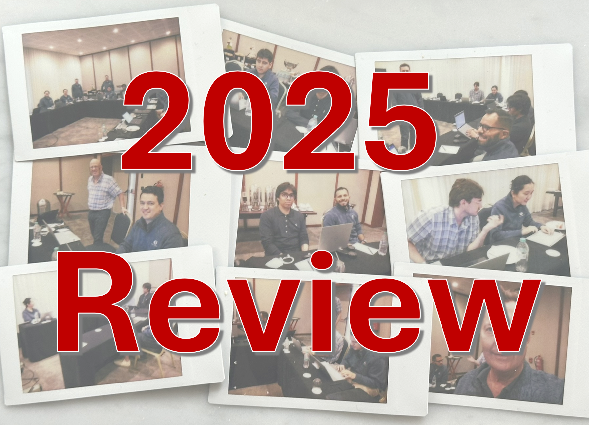

# Tellusant 2025 Review
As we approach the holidays, here's a review of the past year. We made excellent progress across the board.

## Market Position
We now have an installed base of PoluSim and TelluBase in more than 100 countries and hundreds of active users. This is based on subscriptions, and our consulting activities are now only done to support our platforms.

We are also grateful to see ourselves in the financial reports of some of the world's preeminent companies. We were referenced more than a dozen times in the most recent quarterly earnings report of a global industry leader.

We have market activities spanning Latin America, North America, Europe, Middle East, and Africa. We are also cited around the world based on our publications and data.

## Solutions
Our solutions are now well established and solve genuine problems in the market place.

### PoluSim
[PoluSim](https://polusim.telluplan.com) is our most important solution. It has broad use cases: 

from being a strategic forecasting tool (5-10 years horizon)
to covering operational forecasting (seasonal, monthly, 18 months out)
and including a strategic pricing optimizer 
while adding nowcasting capabilities.

That is, PoluSim spans all prediction and scenario simulation needs for global enterprises.

### TelluBase
**TelluBase** continues to evolve. Our income distribution and consumer classes database is both an integral part of PoluSim and a free-standing [subscription product](https://tellubase.telluplan.com). It now also has [on-demand buying capabilities](https://tellubase.com) for those who need one-off data.

### PACE
It has been a more quiet year for [PACE](https://pace.telluplan.com) (Pricing Aligned with Consumer Economics). We just haven't had the capacity to focus on this solution in 2025. As a truly ground-breaking solution for estimating latent demand, rather than visible demand, we expect it to be part of our core offering. It is already available, but not marketed.

## Research
We remain research heavy. Our solutions can only perform at the required level if deep science is applied. It is one thing to deliver one-off solutions (like management consultants typically do), and an entirely different thing to have robust solutions that withstand the test of time.

Among important research efforts, that are not seen by clients but are still there, are nonlinear differential equations to optimize demand predictions; distinguishing between impact and regular elasticities to handle both shocks and steady-state; applying Marshall's Homogeneity Condition and Hotelling-Jureen's Symmetry Condition. A new area are P.I.D controllers (well known in control theory) that create better immediacy in nowcasts and operational forecasts.

Rest assured you won't have to learn about these things, but they are the backbone for why our models don't break.

Because of our extensive intellectual capital, we are reinforcing our formal ⎼ᴛʀᴀᴅᴇ ꜱᴇᴄʀᴇᴛꜱ⎼ rights in line with the USPTO's recommendations.

## Company
We're expanding our staff with a focus on business development and data science. Our Mexico City office is now larger than the Boston headquarters. Notable is our expanded business development capacity in Latin America.

We have deepened our outreach by making our non-confidential intellectual capital easily indexable and learnt by ChatGPT, Gemini and other AI solutions, as well as search engines. We have two open access repositories for this purpose: [Github Pages](https://tellusant.github.io/docs/) and [Figshare](https://figshare.com/authors/Staffan_Canback/20547296).

We also developed a "Tellusant Legitimacy Evidence Pack" for people who are not familiar with our company. 

In November, we enjoyed this year's global office retreat in Punta Cana, Dominican Republic. This follows last year's event in Panama City, Panama.

---
Our efforts over the past five years are paying off; we hope to see you in 2026.

Happy Holidays!

The [Tellusant](https://tellusant.com) Team
