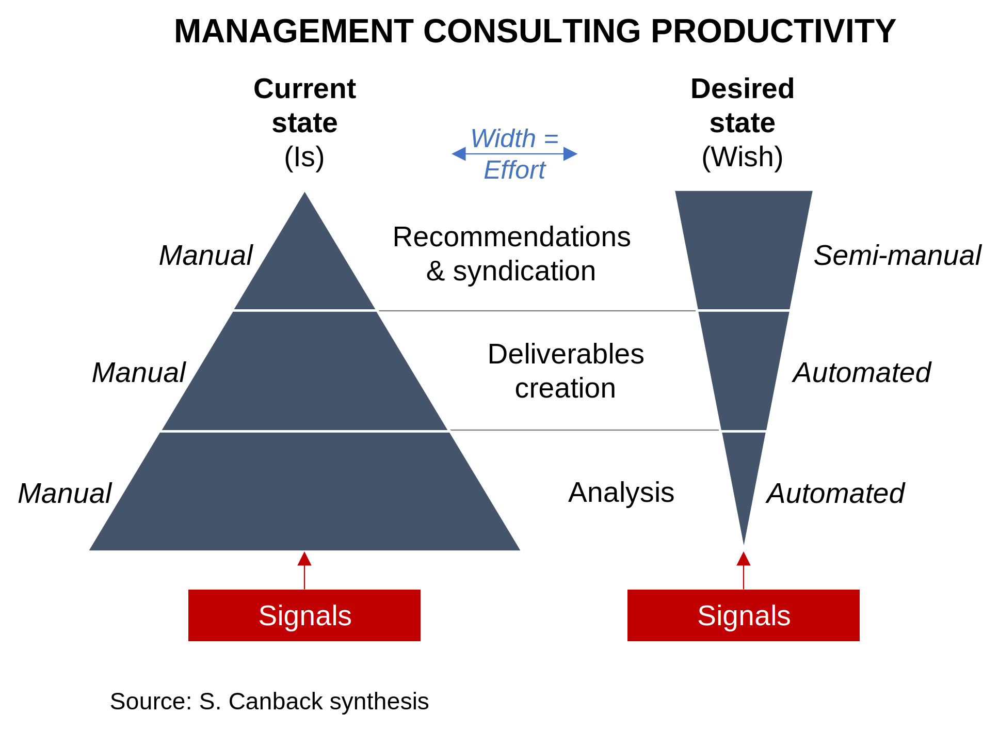

# The Low Productivity of MBB
*Dr. Staffan Canback*  

> *I wrote this piece in March 2022. At the time it was met with some interest. In November AI burst onto the scene with large language models. Since then, it seems like everybody believes they have found the weakness in MBB.*

> *It is easy to be prescient with hindsight. I am proud that I identified the issue before ChatGPT arrived. Then again, if anyone could see this, it should be me given my background.*

There is a sad state of affairs at the large management consulting firms —
 MBB.¹  Not the quality of deliverables. The lack of productivity is the issue.
 
I was a partner at McKinsey & Company and I worked in parallel with all three over the past decade. I am not impressed by how they create their deliverables. Methods are largely stuck in the 20th century. Most work is manual with Excel-PowerPoint-email. The level of automation is low. When I am exposed to their internal processes, they look dysfunctional.
 
This is borne out by the numbers. All three have declining revenue per employee² over the past decade. (I also checked against total consulting in the US which also has a productivity decline.)
 
The graph illustrates my point.  

The current state is highly manual and there are vast (junior and mid-level) resources dedicated to analyses and to creating deliverables. This is the actual **is-value**.³
 
What should have happened is extensive automation of the analyses and deliverable creation layers. This is the desired **wish-value**.³
 
That the recommendations and syndication step is manual is understandable. This is where the dialogue with senior client executives take place, and it is a highly human endeavor. But perhaps some automation here as well?
 
Why are things like this? Inertia and governance model. You do not become a partner by being good at automation. I would posit that senior partners do not even grasp what the automation opportunities are.

Also, the partnership model is against automation. It works when you have high leverage (the ratio of partners to non-partners) and low fixed cost. But the automated approach requires investment in fixed cost and public stock companies are much better at handling this than partnerships.
 
How can this be changed? I do not think it could or should. Instead, startups will automate aspects of what MBB does and slowly replace them. It is easier to create change afresh than to modify existing behaviors. Creative destruction.
 
Given this, there are some good news for MBB. First, they clearly add tremendous value. The substance of what they deliver is excellent as evidenced by their growth. Second, they can probably source the automation from experts and maintain the high-value recommendation and synthesis activities. Third, the decline will be slow since clients are not putting pressure on them to change.
 
Note: *Signals* are in this case information and data.

---
¹ McKinsey, BCG, Bain  
² Per consultant is not a relevant metric when one of the firms is majority non-consultant.  
³ **is-value** and **wish-value** are from control theory. The terms are my translation of the Swedish terms *är-värde* and *bör-värde*, which have a nice ring to them. Properly called actual value and reference (or setpoint) value in English. See, e.g., [Stefan Simrock: Control Theory](https://cds.cern.ch/record/1100534/files/p73.pdf).  

[2022-03-12]

