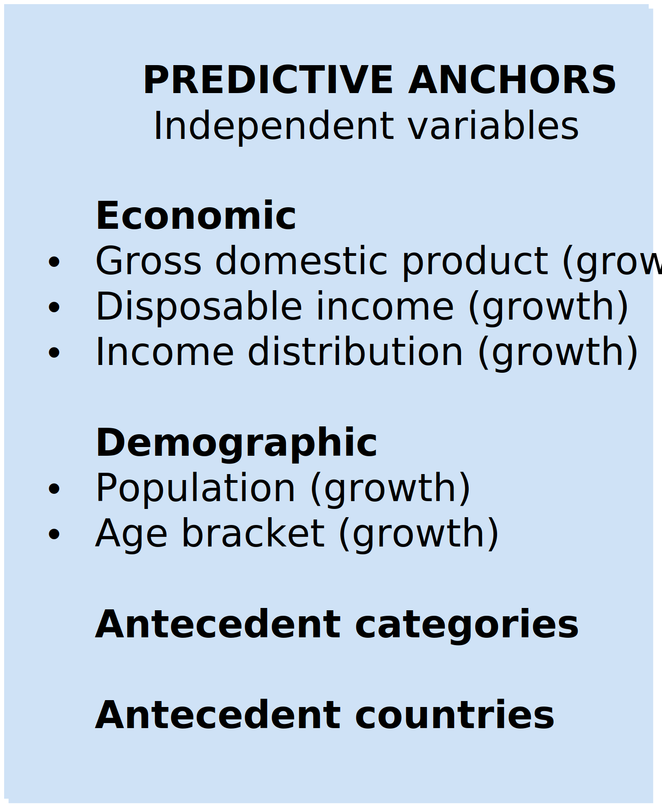
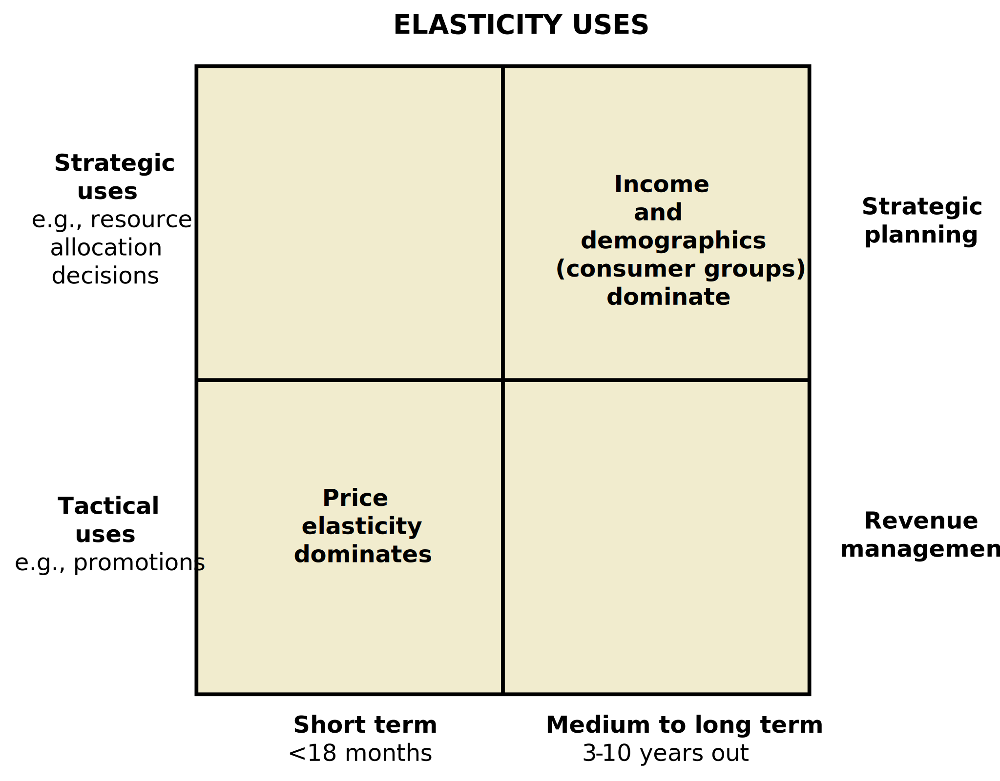
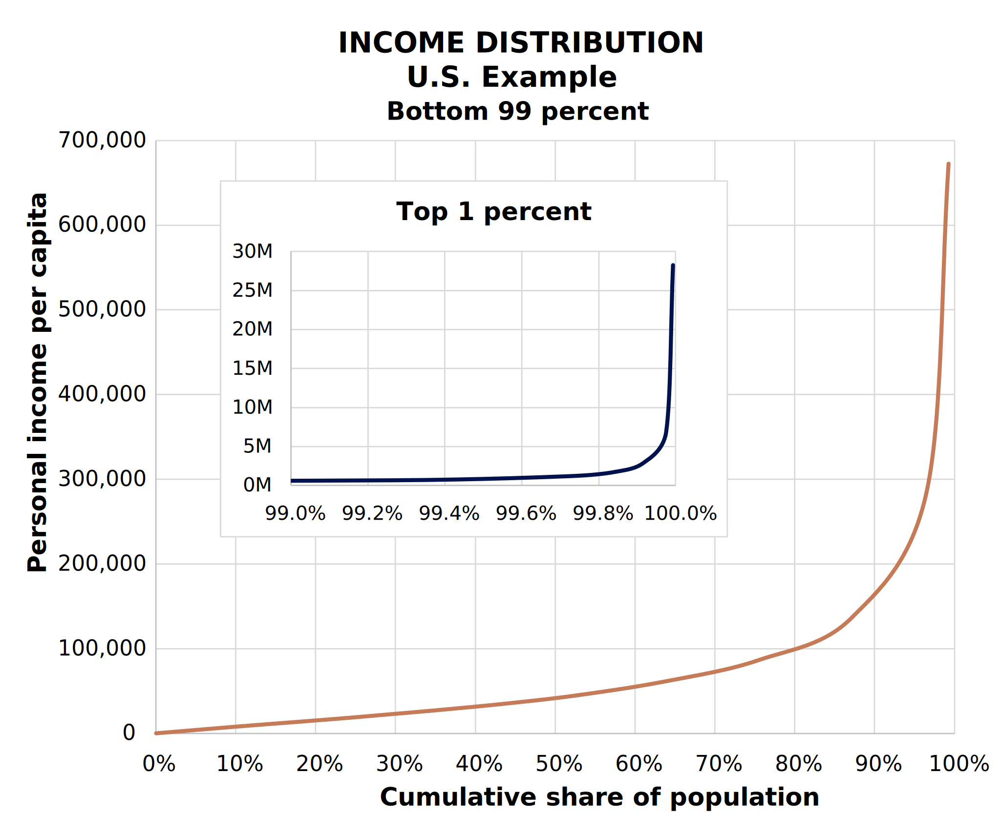
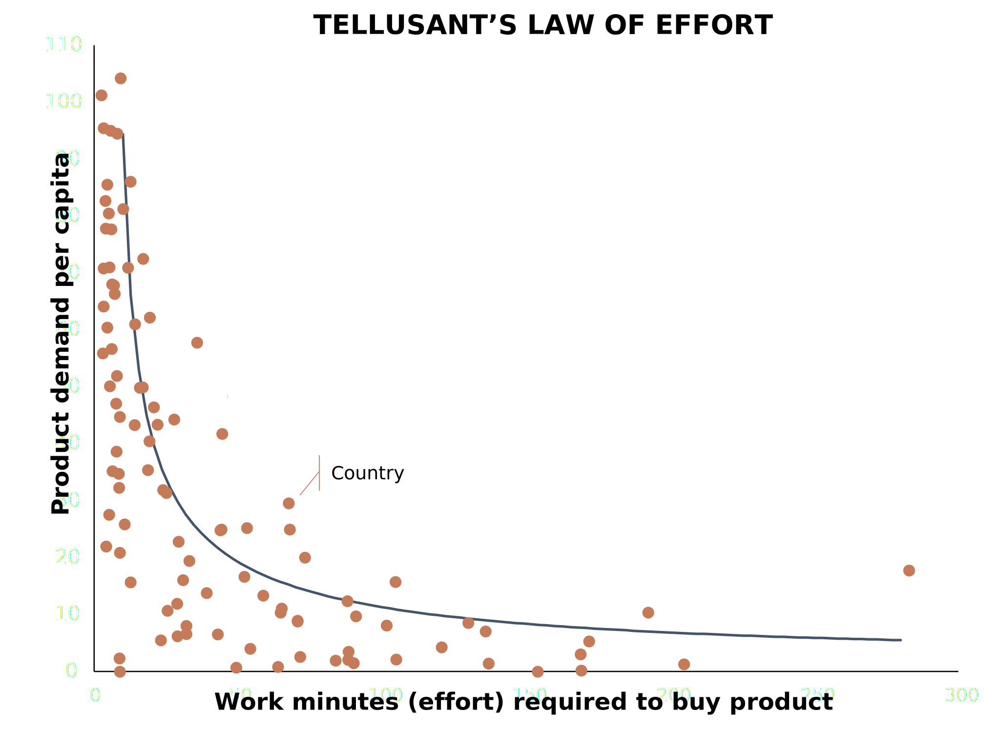
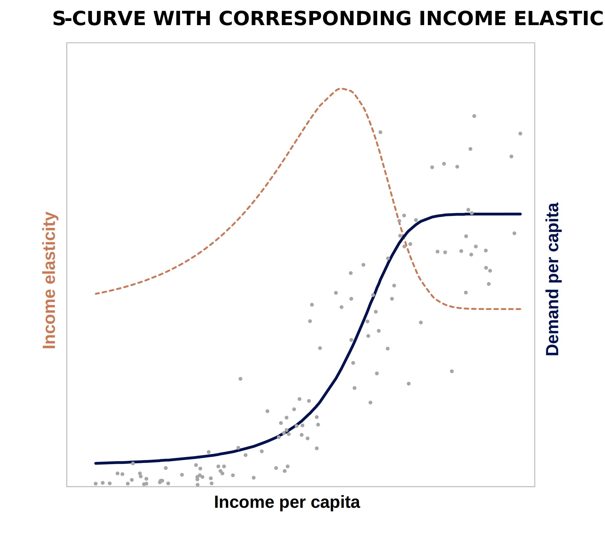
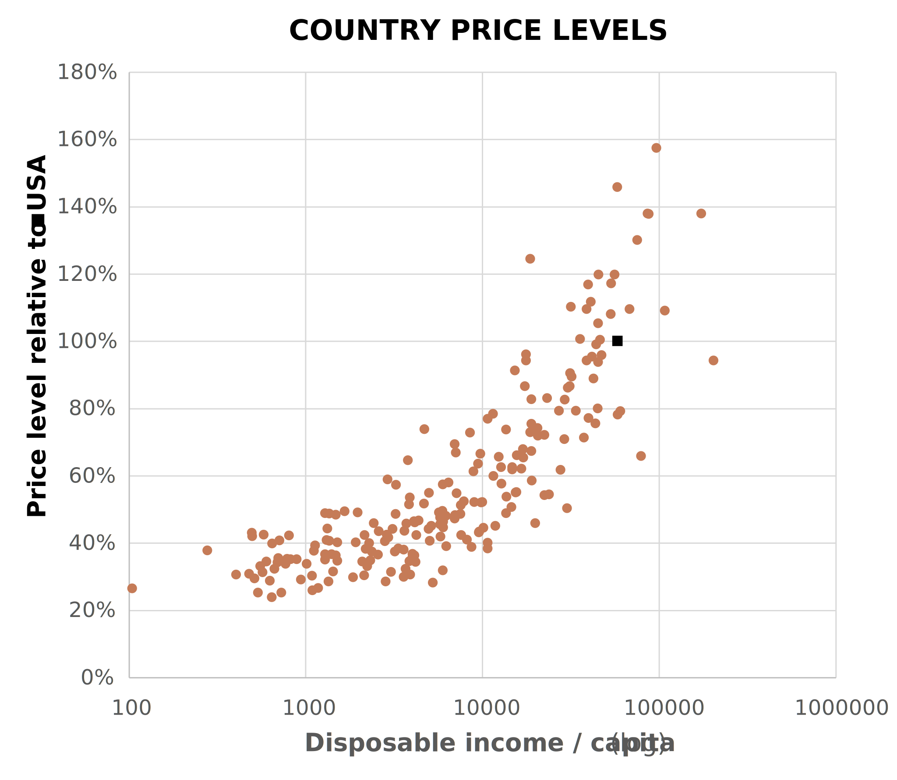

# Creating Robust Long-Term Forecasts: The Tellusant 7-Step Method

***Dr. Staffan Canback, Tellusant***  

---
This short document describes how sophisticated and careful our long-term predictive models are and allows readers to glean under the hood.  

Each step may look easy, but in combination we are unique in the world to make long-term models like these. How we do it in practice is proprietary to us. What you see here are some of the building blocks, at a high level. 

We do not build models for customers, per se. We use them to support our strategic planning products into which we integrate predictive models. Our focus is on helping improve decision making, not delivering models.  

Having said this, our predictive models are as good or better than anything else in the world. The latest example is PACE (Pricing Aligned with Consumer Economics), which builds on what we describe here, and more.  

---
## One
Having said this, our predictive models are as good or better than anything else in the world. The latest example is PACE (Pricing Aligned with Consumer Economics), which builds on what we describe here, and more.    

Long-term predictions (3–10 years out) need to be anchored in a view of the future. There are only a few such data series available.  

  

To predict only using historical data is a fool’s errand. We know more about the future than such an approach suggests.

---
## Two
The tools for long-term predictions are different than those for short-term predictions. Income elasticity is of fundamental importance. Price elasticity less so.  

Often, analysts extend existing short-term models when senior management requests a long-term perspective. This is often a bad idea.  

---
## Three
Income distribution says much more about the future than using averages. This is called distributional economics and enhances accuracy significantly.  

Too often, analysts use antiquated concepts like averages in their models, thereby reducing believability and precision.  

---
## Four
The work effort required to buy a product is of fundamental importance in long-term models. This effort is usually measured in work minutes.  

Most demand models do not take the work effort into account, statically or dynamically. It helps explain why some markets suddenly take off.  

---
## Five
Nonlinear models are more powerful than standard linear regressions. S-curves typically depict demand well and are mathematically related to elasticities.  

Income elasticity usually declines over the predicted horizon. Using lnear models therefore leads to exaggerated views of future demand.  

---
## Six
Purchasing power parity-adjusted prices are a better predictor than standard exchange rate-based prices. This is especially true in less affluent countries.  

Many companies underestimate market opportunities in emerging countries based on a flawed exchange rate assumption in demand models.  

---
## Seven
Pooling of data between countries is a powerful technique. It also applies to logical thinking. Use as many countries as possible in the analyses.  

Often, analysts in their home country model only their home country. Not good. Much insight applicable to the home country comes from comparison countries.  
