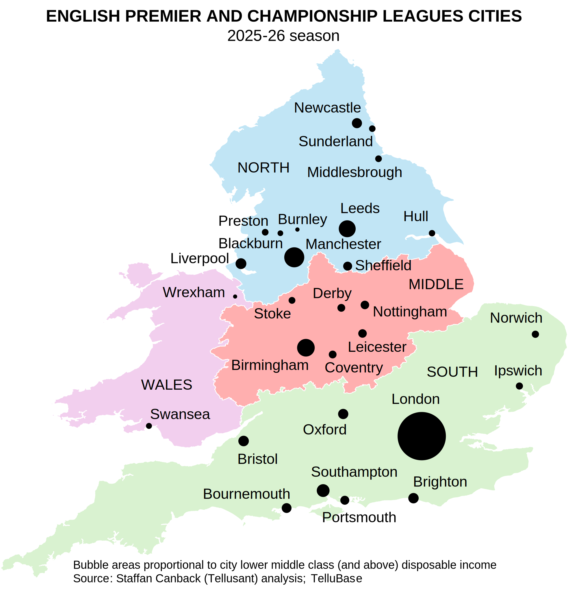

# How Much Can English Cities Afford Football? A New Measure Based on Local Consumer Income Distribution  
Football club payroll spending is well known. But how large is that spending relative to the middle class consumer income base of the cities that support the clubs? I doubt anyone knows — until now.

To start, the map shows the 28 cities hosting the 44 clubs in the 2025-26 season. Bubble areas are proportional to lower middle class (and above) disposable income in the city.  

  

Payroll data for the 2025–26 season from [Capology](https://www.capology.com/uk/premier-league/salaries/) was then aggregated by club to their corresponding cities (using the UN urban definition) and compared with the disposable income of the lower middle class and above, using [income bracket data from TelluBase](https://tellubase.com).  

The result gives a fascinating perspective on English football economics. Relative football spending varies enormously between cities.  

  

A striking pattern emerges. Northern cities spend substantially more on football than southern cities. Aggregated by region, northern England spends 2.3 times more relative to income, while middle England falls slightly below the north.  

  

Why do these differences exist?  

One crucial factor is historical path dependence: football began as a distinctly northern sport. The graph below shows first division participants in 1900, 12 years after the football league was founded. Note that there was *not a single southern team during the first 12 years*.  

  

Football was — and still is — deeply embedded in the social fabric of northern England, where populations have long shown a willingness to devote significant economic resources to sustaining their clubs. Liverpool is the clearest example.  

English football is not simply a sports industry. In many northern cities, it remains a disproportionately large economic and cultural commitment relative to local consumer resources.  

---
[A PDF version is found here.](assets/pdf/s.canback-english-football-spending-by-city.pdf)  

[2026-05-15]  
