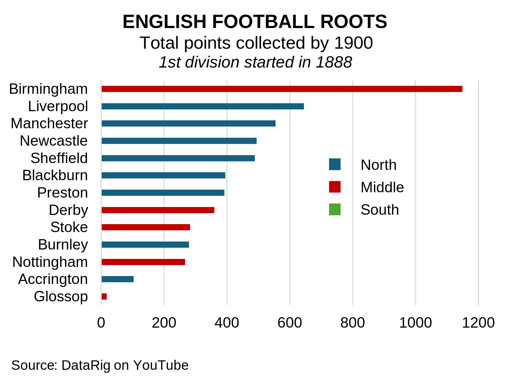

# How Much Do English Cities Spend on Football?  
Football club payroll spending is well known. But how large is that spending relative to the economic size of the cities that support the clubs? Surprisingly, little has been written about this.  

I took 2025–26 payroll data from [Capology](https://www.capology.com/uk/premier-league/salaries/), aggregated clubs to their corresponding cities (using the UN urban definition), and compared this with disposable income of the lower middle class and above.  

I did not use GDP. Many components of GDP have little to do with consumer spending power or the economic base that sustains football clubs.  

The result gives a fascinating perspective on English football economics. Relative football spending varies enormously across cities.  

  

A striking pattern emerges: northern cities spend substantially more on football than southern cities. Aggregated by region, northern England spends roughly 2.3 times more relative to consumer income, while middle England falls slightly below the north.  

  

Why do these differences exist?

One important factor is historical path dependence: football began as a distinctly northern sport. The figure below shows First Division participants in 1900, 12 years after the Football League was founded. Note that there was *not a single southern team during the first 12 years*.

Football was — and arguably still is — deeply embedded in the social fabric of northern England, where populations have long shown a willingness to devote significant economic resources to sustaining their clubs. Liverpool is the clearest example.  

  

English football is not simply a sports industry. In many northern cities, it remains a disproportionately large economic and cultural commitment relative to local consumer resources.

Much more could be said from an economic and business perspective, but I will stop here.

---
[2026-05-15]
