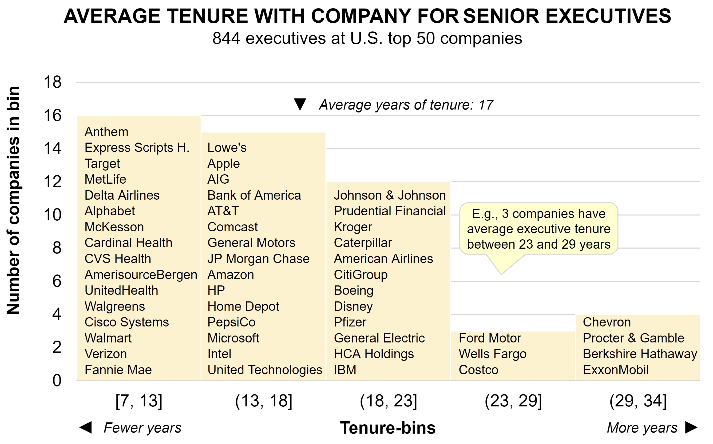
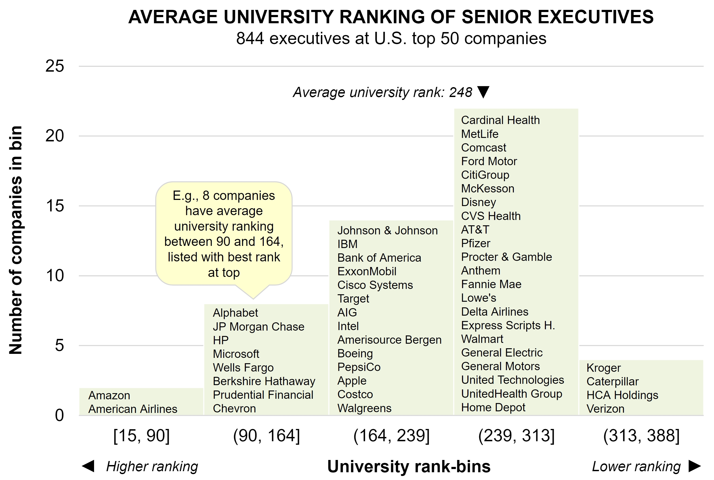
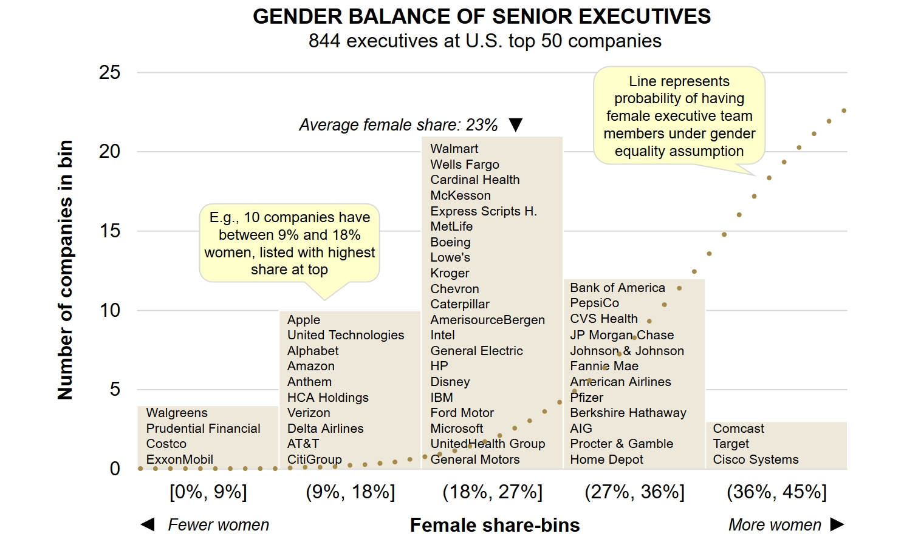

# The Fabric of Executive Teams: A Quantification

What is the composition of executive teams in the United States? A few years ago I took a look at 844 senior executives of the 50 largest companies in the United States. I doubt there has been major collective change since, but individual companies have moved. 

The analysis covers:

- Tenure with company
- Educational background
- Gender mix

These three dimensions have an impact on company profitability and growth.

## Tenure
Bureaucratic insularity among executives is one of the four contributors to diseconomies of scale in management. Insularity means that executives are inward looking and do not have a full appreciation of customer and competitive dynamics.

In my [doctoral dissertation](https://bura.brunel.ac.uk/bitstream/2438/9030/1/FullTextThesis.pdf), I found that how long executives have been with a company is a strong indicator of this insularity. It affects both growth and profitability negatively beyond a certain tenure average executive team tenure.¹

Below is a histogram with the average tenure of executive teams.

Among the 50 companies, the vast majority have reasonable average tenure. But the boards of, e.g., Procter & Gamble and ExxonMobil should ask themselves if they are remiss in monitoring the tenure dimension.

## Education

Not surprisingly, having a well educated work force pays off. This should also hold for the educational background of senior executives.

While just about all senior executives hold at least a bachelor's degree, they have attended universities that differ widely in global rankings as seen in the graph below. We tagged matched each executive's university against the renowned Top 500 University ranking of [ARWU Shanghai Ranking](https://www.shanghairanking.com/rankings/arwu/2025).²

Is there a plan behind having executives from higher or lower ranked universities? Most likely not, but there should be. Many companies talk about winning based on intellectual capital, and this presumably requires having executives from higher ranked universities. Otherwise, it will be hard to recruit talented people from top universities.

Note that maximizing educational attainment is not the goal. The goal is to optimize it.³

## Gender
There is more and more evidence suggesting that equal gender balance in executive teams improve corporate performance. The quality of decision-making improves as different perspectives are brought to bear on issues.

Below is a histogram with the percent of women at the 50 companies. Overall, the share of women remains low. Presumably, if there are companies with no women at the top, there should also exist companies with all women at the top. What we have is a maximum of 45% women.

At around 1/3 of the companies women are severely underrepresented at senior levels. The dotted curve shows what the female representation should be under equality (peaking at 50% to the right of the graph). It is sad, but not surprising. It to see a photo on one company website with 5 people, a tall man in the middle flanked by two women on each side. This company is among the lower bins above.

— — —

The [resource-based view of the firm](https://en.wikipedia.org/wiki/Resource-based_view) is becoming more and more dominant in strategic thinking. One aspect of RBV is how to optimize senior executive resources. This article puts metrics against this.

The composition of executive teams is a strategic issue spanning the entire company, and should not only be seen as a functional human resource issue.

---
¹ While high tenure impacts results negatively, low tenure may or may not be good.

² For universities not in the Top 500, I assigned the rank 501.

³ People should work where their skills and education add the most value. For graduates from top-ranked schools, this usually does not mean joining companies in mature industries.
¹²³

[2018-02-20]  
[Find more articles and posts](index.md)
