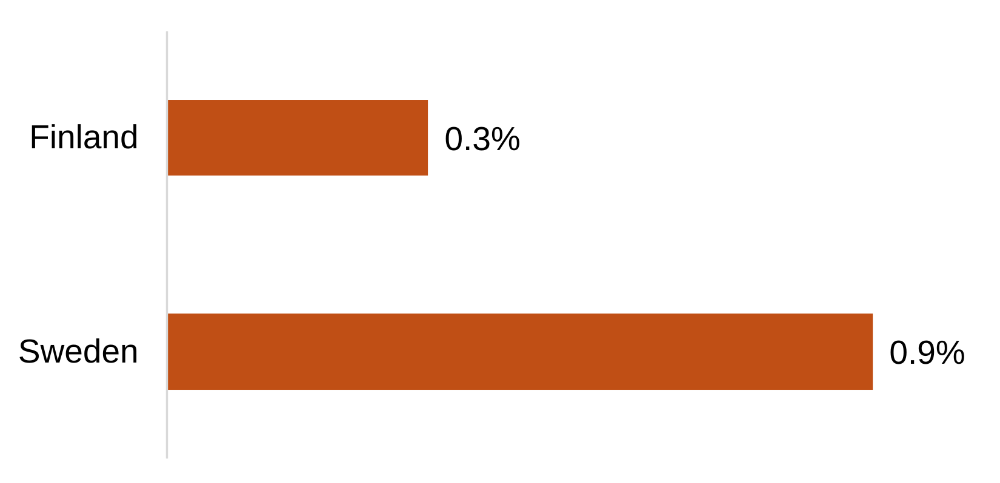
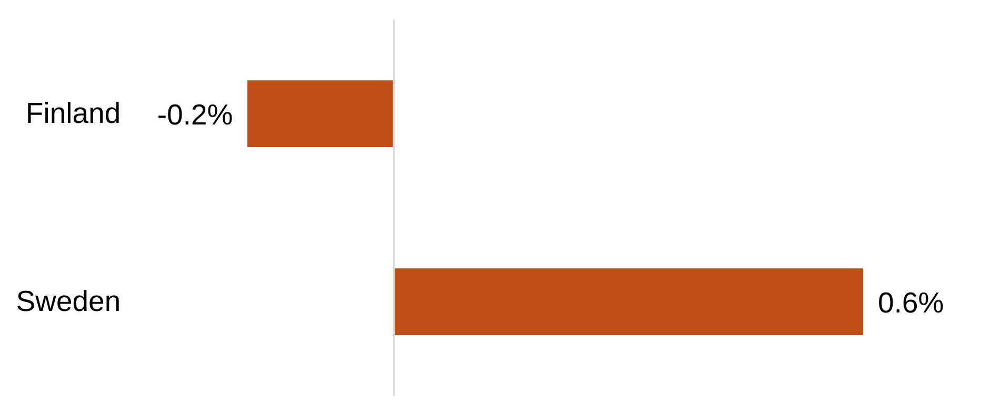
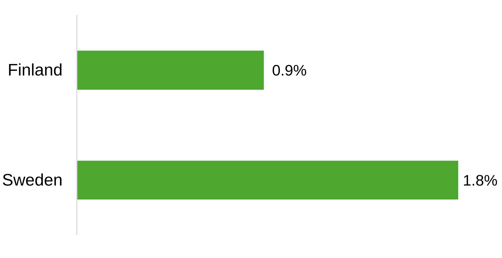
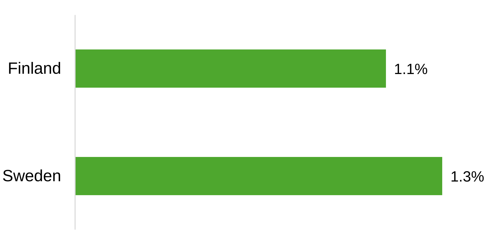
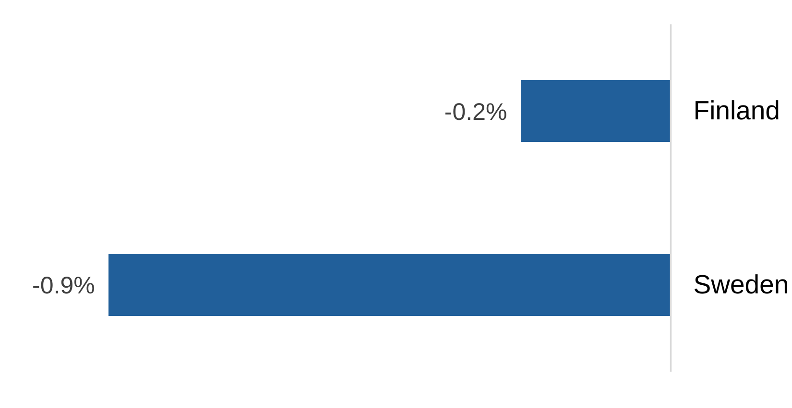
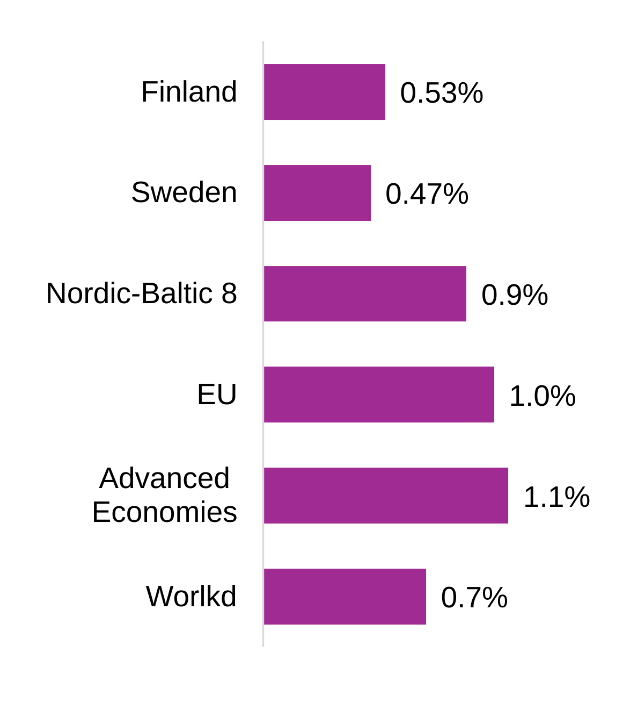

# Should Finland Emulate Sweden's Capital Tax Approach?
Sweden's capital taxes are much more advantageous to capitalists than Finland's. Should Finland change. Yes, but it is complicated.

1. Done: Economic Comparison  
2. TBD:  Does Type of Taxation Matter? No and Yes
3. TBD: Thoughts on tax policy for Finland (and Sweden)  

---
## Finland-Sweden Economic Comparison
### Demography
Before looking at GDP, it is important to understand the demographic differences. Sweden has had much higher population growth than Finland (figure 1)

<figure>

<figcaption><b>Figure 1. Annual Total Population Growth, 2010-2025</b></figcaption>
</figure>

More importantly, economic growth is in mainly a function of the growth in working-age population, not total population. Here, Finland lags even more (figure 2).

<figure>
  
  <figcaption><b>Figure 2. Annual Working-Age Population Growth, 2010-2025</b></figcaption>
</figure>

 

### Gross Domestic Product and Labor  

We turn to GDP growth in total (Figure 3). Sweden has had a substantially higher growth rate.

<figure>
  
  <figcaption><b>Figure 3. Annual GDP Growth, 2010-2025</b></figcaption>
</figure>

However, this combines economic and demographic contributions. A better metric is growth in GDP per working-age population. With this, the gap narrows considerable (figure 4).

<figure>
  
  <figcaption><b>Figure 4. Annual GDP / Working-Age Pop. Growth, 2010-2025</b></figcaption>
</figure>

 

### GDP and Capital Formation
Labor contributes around 60% of GDP in both Finland and Sweden. The rest is contributed by capital (fixed assets such as factories, robots, buildings, R&D) and more.

Capital has grown 1.1% p.a. in Finland and 2.7% p.a. in Sweden. Has the capital been put to good use? Not at all in Sweden, and weakly in Finland (figure 5). Capital destruction is massive in Sweden.

<figure>
  
  <figcaption><b>Figure 5. Annual GDP / Capital Growth, 2010-2025</b></figcaption>
</figure>

>Technical note: The interaction effect between labor and capital (often called deepening) have been eliminated so these are "pure" labor and capital productivities.
 

### Total Factor Productivity--The Thing That Really Matters

So how has each country performed in total? Have they become "better" or "worse" over the 15 year period. This is measured **Total Factor Productivity** (TFP). Without going into how this is calculated (it is a direct outcome of the graphs above, and surprisingly easy to calculate: plus, minus, multiplication), Finland has a slightly better performance than Sweden (a decimal has to be added to show the small difference).

A few regions have been added. In comparison to these, neither Finland are doing well (figure 6). (The U.S. is infinitesimally below the EU.)

<figure>
  
  <figcaption><b>Figure 6. Annual TFP Growth, 2010-2025</b></figcaption>
</figure>

Source for all figures: **Paragonal** Productivity System by Tellusant

---
## Does Type of Taxation Matter? No and Yes
> I use the term capitalist for individuals or firms that own and manage capital. No value judgment is intended.

The question is not simply whether a tax corrects something, but whether the resulting institutional arrangement improves outcomes once transaction, administrative, and behavioral costs are included.

[The Problem of Social Cost - Summary](assets/pdf/coase_problem_of_social_cost_summary.md)

Coase's *The Problem of Social Cost* applied to taxation. Main (surprising) point: only the cost of managing the tax system--the transaction cost--is relevant (as long as tax levels ae reasonable); the types of taxes do not matter. I could be wrong, so I have to work through this, but I've thought about it for 20 years and have so far found no flaw in the logic.

## Thoughts on tax policy for Finland (and Sweden)
