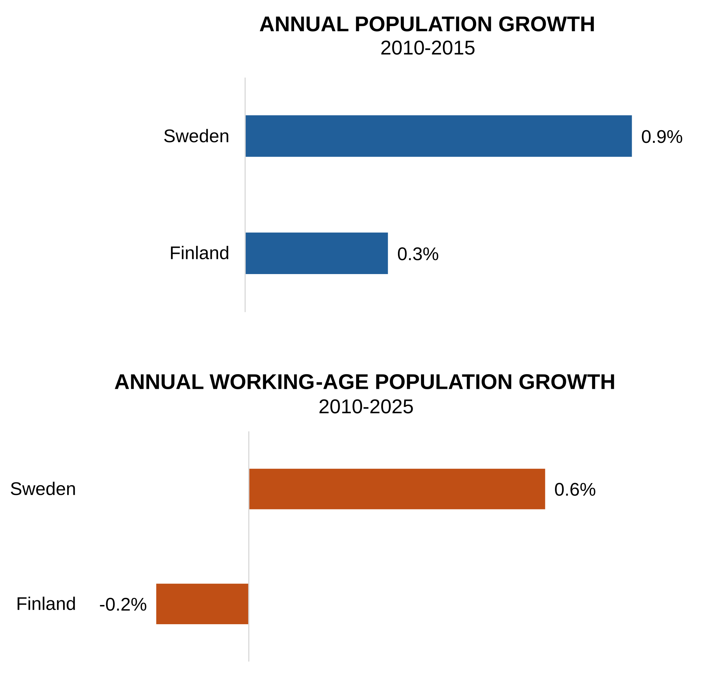

# Should Finland Emulate Sweden's Wealth Tax Approach?
Few European countries have wealth taxes...

## Finland-Sweden Demographic and Economic  Comparison

## Does Type of Taxation Matter? Not Really
Coase's *The Problem of Social Cost* applied to taxation. Main (surprising) point: only the cost of managing the tax system--the transaction cost--is relevant (as long as tax levels ae reasonable). I could be wrong, so Ihave to work through this, but I've thought about it for 20 years and have so far found no flaw in the logic.

## Thoughts on tax policy for Finland (and Sweden)
