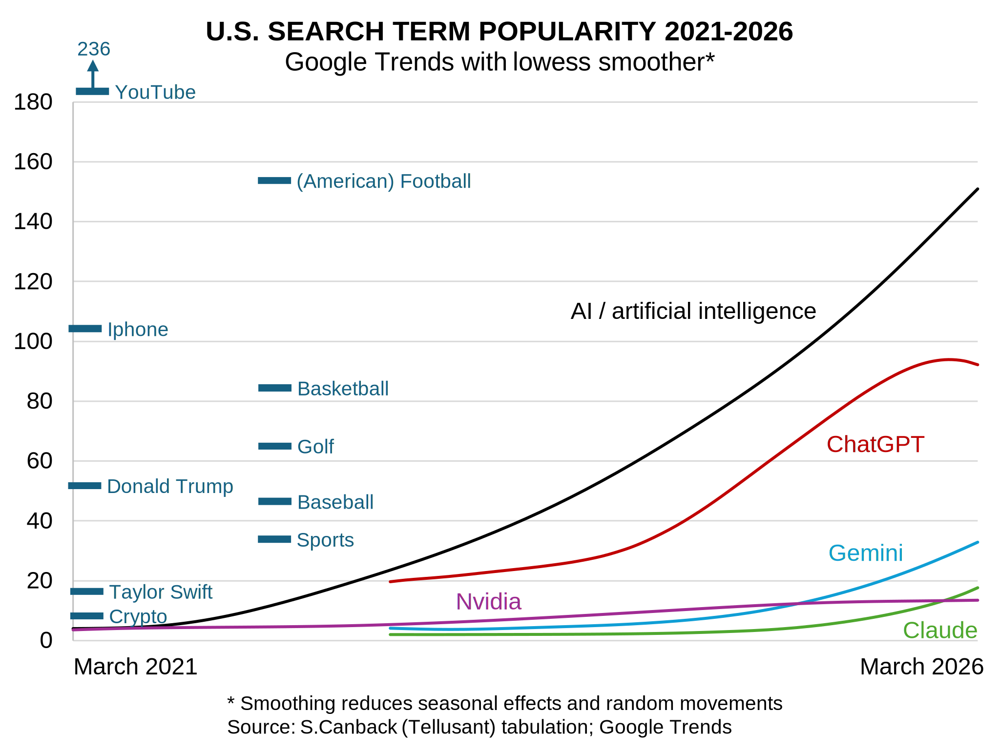

# Google Trends Analysis of AI, Sports, and More in the United States
In less than five years, AI and its key players have catapulted to the top of Google search rankings.
How large the surge has been becomes clear when looking at Google Trends data for the United States. In my analysis, only YouTube and (American) football surpass AI.

The graph shows trends for the most popular AI search terms. Copilot, Perplexity, and Grok are not included because they hardly register.

I also added bars for other search terms to give a sense of scale. I included sports because, like AI, interest skews male.

I also added some other common search terms: Taylor Swift (pop culture), Donald Trump (politics), YouTube (the most-searched site) Iphone (previous leader in search rankings), and crypto (an entertainment phenomenon).

AI has clearly captured the nation’s attention. In my own work the effect has been striking: I use ChatGPT two to three hours a day and gain enormous efficiencies—either by completing tasks faster or by pursuing analyses I would not otherwise attempt.

> Note: The scale is an index with no meaning except to show the relative positions. It is a consequence of Google Trends' way of presenting data.

---
[Find more articles and posts](index.md)
