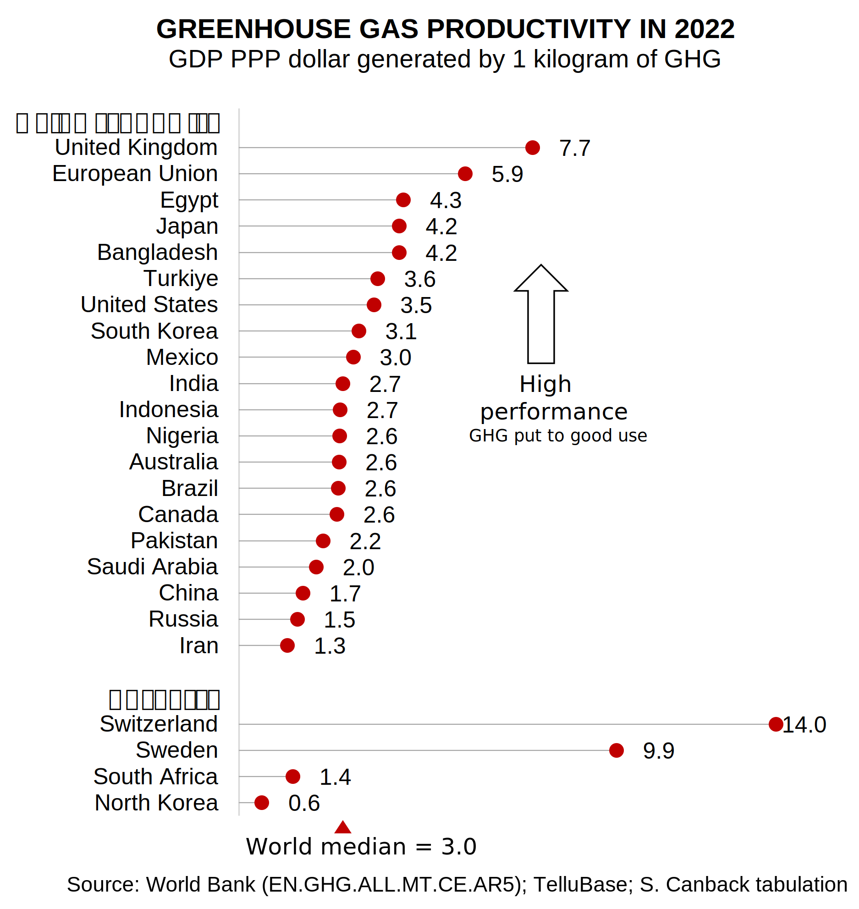
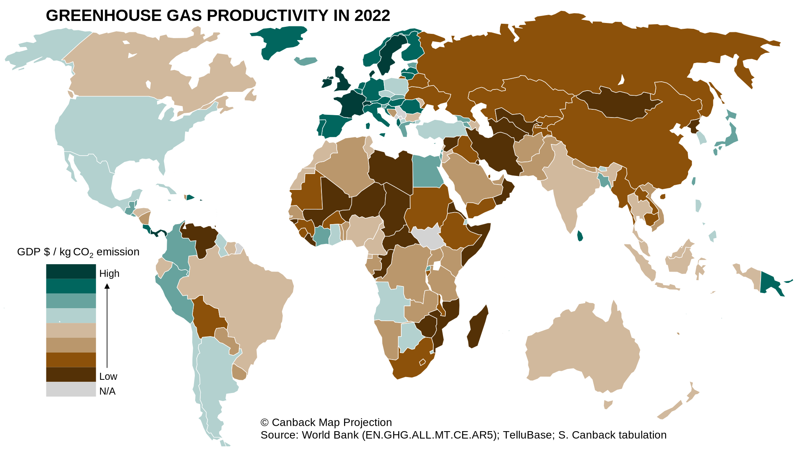

# Greenhouse Gas Productivity
*Dr. Staffan Canback, Tellusant*

Climate change is the problem of the century. How do countries differ in their ability to manage the greenhouse gases (GHG) that cause it?  

We emit GHG to stimulate economic activity. Not the other way around (we have economic activity to emit GHG). This view allows us to think about GHG productivity: How much economic activity, GDP, does a unit of emitted GHG create? We want this metric to be high, ideally infinite (no GHG emissions).

This is a parallel to GDP per capita: How much economic activity does a unit of labor create? Or capital stock productivity: how much GDP do our fixed assets create?  

  

With this as background, the graph above shows the large spread in GHG productivity. Among large nations, the UK is the shining star with the EU also doing well. A focused effort on reducing GHG emissions pays off. Among all countries, Switzerland and Sweden lead the way.

The hall of shame includes China, Iran, Pakistan, Saudi Arabia, and Russia. North Korea, among smaller nations, has a pathetic record.

The US is slightly above the world median, but still has an embarrassing performance. For all the talk, not much is happening.

The map below shows most countries' greenhouse gas productivity by octile. It uses the same data as the graph, but expresses it as a map.

  

The underlying thought in this post is that climate change and greenhouse gas emissions can be seen through a managerial lens. High productivity is always what we strive for. By measuring and acting on the productivity shown here, much can be gained by countries and companies, for the benefit of humanity.

---
As of Dec. 2025, the World Bank has updated its data till 2023. The graphs will be updated, but changes will be small, if any.

---

[© Canback Map Projection](https://publicrecords.copyright.gov/detailed-record/voyager_31865619)

[2024-12-02]
