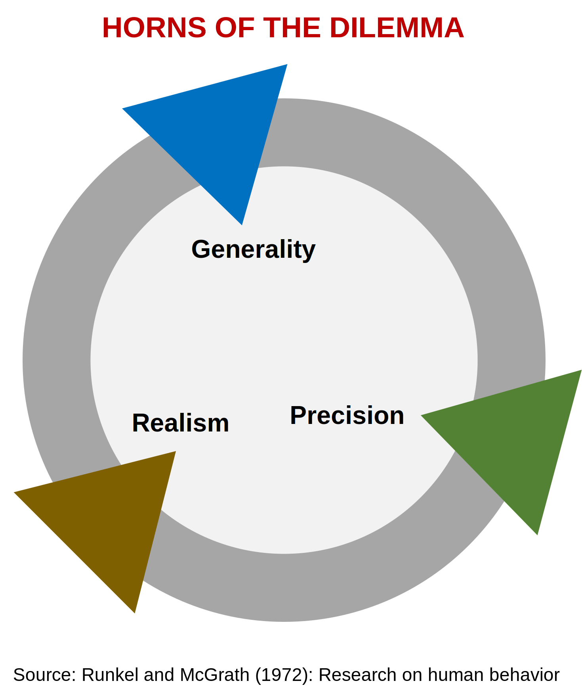

# The Horns of the Dilemma #1
## Trade-offs between generality, precision, and realism in strategy development
*Dr. Staffan Canback, Tellusant*  

In strategic planning efforts, the team responsible has to decide upfront what it wants to achieve. It cannot get general results, precise, results, and realistic results simultaneously. This is called the ***Horns of the Dilemma*** in sociology (of which management science is a part).

The framework is known to countless students of sociology, marketing, and similar fields. It was put forth by PJ Runkel and JE McGrath in the book ***Research on Human Behavior: A Systematic Guide to Method*** (1972) and has become a mainstain in research methodology.

  

A strategic plan can prioritize general results (e.g., a global opportunity assessment), precise results (e.g., a market entry strategy plan for one country), or realistic results (e.g., ethnographic perspective of customer behavior).  

The issue is that it is impossible to cover all three at the same time no matter how much effort is expended. The resources required, and the mental bandwidth needed, to cover the three is prohibitive.

Senior executives tend to prefer generality. Junior employees often think in terms of precision or realism. But many people have no structured way to think about the dilemma and want it all.

[2021-09-04]
