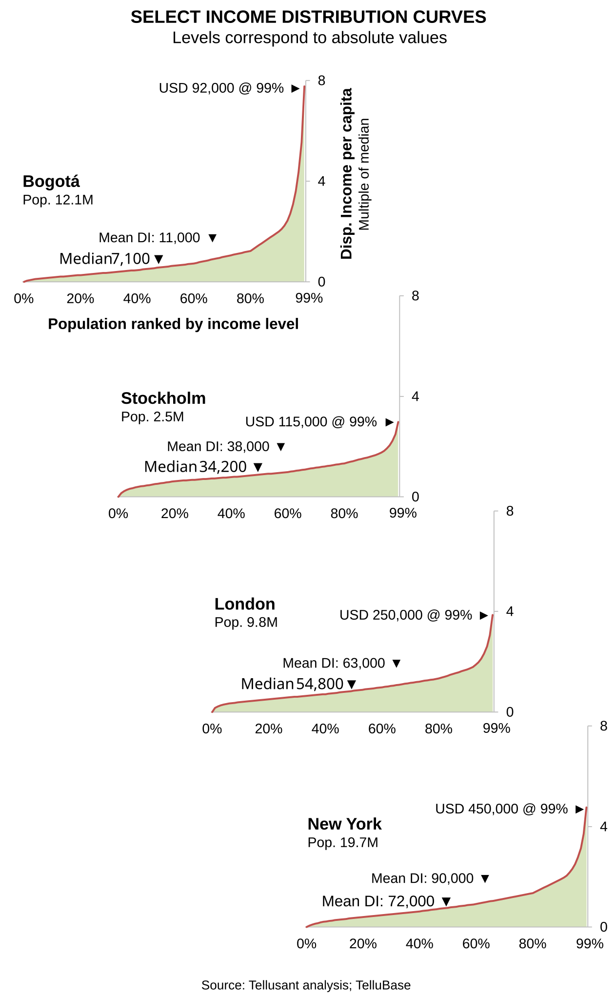

# What Do Income Distribution Curves Look Like? A Few Examples
 <a href="{{ site.company.url }}" target="_blank" style="color: black; text-decoration: none;"><i>By {{ site.company.name }}</i></a>  | *2026-09-28*

Most executives have heard of income distribution, but usually do not know what the actual curves look like.

This is not surprising because there are not all that many such curves easily available. Instead, the focus is on the 1 percent, the Gini coefficient, and other shorthands for income distribution.

Here we show four income distribution curves, with income expressed relative to each city's median income. We cap the maximum at the 99th percentile since the curves go to infinity.

We chose the cities for the following reasons.

- Bogotá as an example of a city with high income inequality. It is interesting to note that the top 1% of people make about the same amount of money as Stockholm, even though average income levels are much lower.
- Stockholm has a compressed income distribution: at the 99th percentile, income reaches only about 3 times the median, compared with about 8 times in Bogotá.
- London is one of the cities in Europe with the largest upper and middle classes.
- New York can be seen as a global benchmark for income distribution. Note how high the mean and median incomes are compared to the three other cities.

What to note in the graphs:
1. The horizontal axis shows the percent of population ordered from lowest to highest income
2. The vertical axis show the *disposable income* level as a multiple of the median income in the respective city. Multiply this number by the indicated median income and you get the absolute income per capita in PPP$.
3. Mean and median incomes per capita are indicated, as are the income levels at the 99% of the population cutoff.
There are other ways to present the vertical axes, but we chose this way because it shows the differences in the curves.

Why are these curves important?

***First***, they show that the size of, e.g., the middle class varies tremendously by country or city even if average income were the same.

***Second***, the income brackets and socioeconomic levels grow at wildly varying rates because the curves are not linear. For example, the explosive growth of China's car market in the 2010s can largely be explained by the fact that the middle and upper classes grew much faster than average income. Knowing this, income elasticity was not 2-3, but in the range of 1-1.5.

***Third***, premiumization opportunities are easily explained by these income curves. A regression analusis between price segment and the relevant income bracket shows where the sweet spot is.

***Fourth***, the income curves also explain the impact of recessions on category or product demand. People tend to trade down or abandon the category, but it is not a universal phenomenon.

— — —

Understanding income distribution is critical for consumer goods companies, be it at the country or subnational levels. Yet we know of no company that has taken this to heart. It is intellectually straining, but at the same time the payoff is large. Yet income distribution is still surprisingly underused in corporate demand analysis. Understanding its mechanics can materially improve market sizing, forecasting, and resource allocation.
