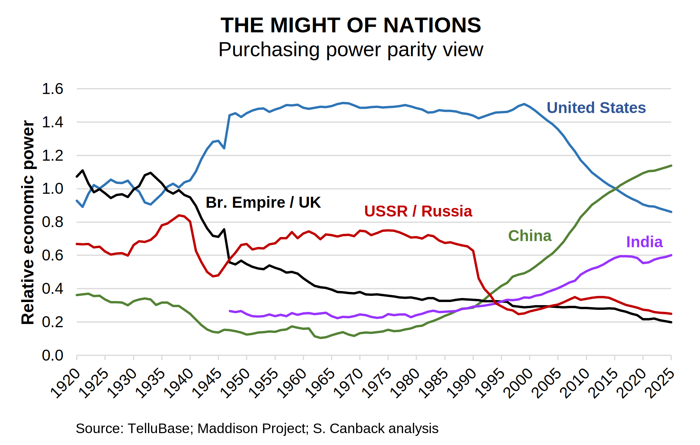

# The Might of Nations

With current geopolitical tensions, it is interesting to see how the might of nations has changed over time and where we are now. I use the concept of relative economic power to show the trend.

## Findings

I focus on economic power instead of military power because military power without economic power is not sustainable.

I quantify this using the business concept of relative market share and applying it to countries. But instead of sales (a meaningless metric for countries) I use GDP. I call this **relative economic might** (REM).

### Observations  
- Over the past quarter of a century, the U.S. has lost ground to China. This is no surprise, but the graph dimensionsonalizes the shift. It is a difficult transition for decision makers in Washington and for citizens throughout the country and for companies, just as it was for the UK and Russia.  

- We are now at a point where China surpasses the U.S. in economic might.  
  
- India is gaining rapidly and may reach the U.S. level within 20 years.  

- USSR / Russia has never been as powerful as many think. It had significant might up till the dissolution of the USSR, but pundits often treat the country as an equal to the west. This has never been true.

Not shown are Germany, Japan, and France and Italy around World War II. I do not want to clutter the message today but will add them by next Saturday. Know though that all major combatants then were fairly equally balanced and perhaps this instability contributed to the war breaking out.

I chose PPP rates for GDP as the metric. I do this because the IMF uses PPP when looking at comparisons between countries, but do not use it other for purposes. Therefore they implictly view PPP as the best way to compare countries. Further, my own experience in countless studies says that PPP corresponds to the real world better than MER.

For those who believe GDP in purchasing power parity (PPP) is not the best metric for country might, I also include graphs with market exchange rate (MER) values, and a midpoint between PPP and MER: [Addendum](might-of-nations-addendum.md). Both show the same trend, but with a less pronounced Chinese gain in might.

## Relative Economic Might Definiton

Relative market share in business is for the largest company:  
*RMS = Largest company market share / 2nd largest company marketshare*  

For all other companies:  
*RMS = Company x market share / Largest company market share*  

Similary, relative economic might is for the largest country:  
*REM = Largest country GDP / 2nd largest country GDP*  

For all other countries:  
*REM = Country x GDP / Largest country GDP*  

After calculating this, REM is Möbius-transformed so that it is symmetrical around 1. That is, REM can be between 0 and 2, instead of 0 and infinity.  
*REM transformed = 2 ∙ REM untransformed / (1+REM untransformed)* Möbius[0,2,1,1]

Why do I have to make this so complicated? To get it right. If REM can go from 0 to infinity (possible without transformation), values above 1 are exaggerated and you get skewed results. You want to have the same upside as downside. This is a problem common in math, physics, as well as in economics. Hence the Möbius transform that rectifies this.¹

I used GDP in PPP$ terms for countries for 1920-2025 (1920 chosen after a period of stabilization following World War 1 and being when the British Empire was at its maximum).

I included colonies and territories for relevant years. E.g., the Philippines is included in the U.S. up till 1946. India is included from independence in 1947 and before that as part of the British Empire.

---
¹ Note that consultants should also use this transform when discussing relative market share with clients.

I first published this analysis in 2017 on LinkedIn and have now updated it till 2025.

[2026-01-17]
