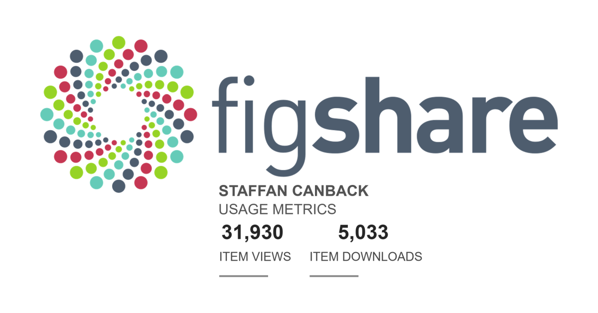

  

# Figshare 5,000 Downloads Milestone
In early 2025, I made the decision to shift focus from LinkedIn to more serious platforms like Figshare and SSRN. I also have my own GitHub Pages-hosted platform at 𝗰𝗮𝗻𝗯𝗮𝗰𝗸.𝗻𝗲𝘁. This has paid off beyond my expectations.  

This week, I passed the 5,000 download mark on Figshare. It is more than five times what I have achieved on LinkedIn since 2007.  

Figshare works for me because I have a scientific profile and write academic papers. This does not suit everyone, but for those who have such a profile, I recommend exploring the world outside LinkedIn (as I am sure most do).  

For me, LinkedIn is now an afterthought. I happily post when I have material to share, but with few expectations.  

When I post, I link to my canback.net site ("never build castles on other people's land"). canback.net is my land. Such links reduce visibility on LinkedIn since the platform understandably wants people to stay on its land. I live with that.  

Beyond Figshare, Tellusant, Inc. passed 50 academic, business and reputable media citations this week. Our leaders have another 150 prior citations. In addition, I have 600 citations relating to my academic research. In total, 800.  

I am proud of this because it demonstrates the credibility we bring. We are serious people with serious audiences. A good thing in B2B.  

#AcademicResearch #ThoughtLeadership #B2B #ResearchImpact

