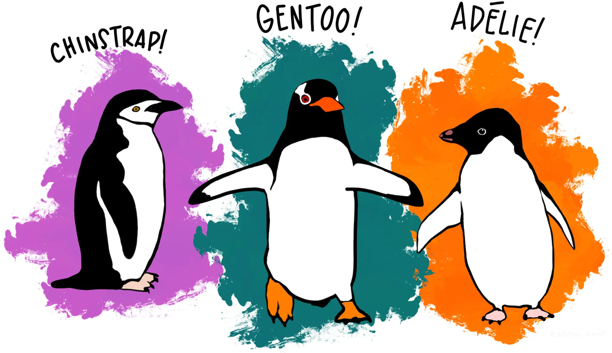
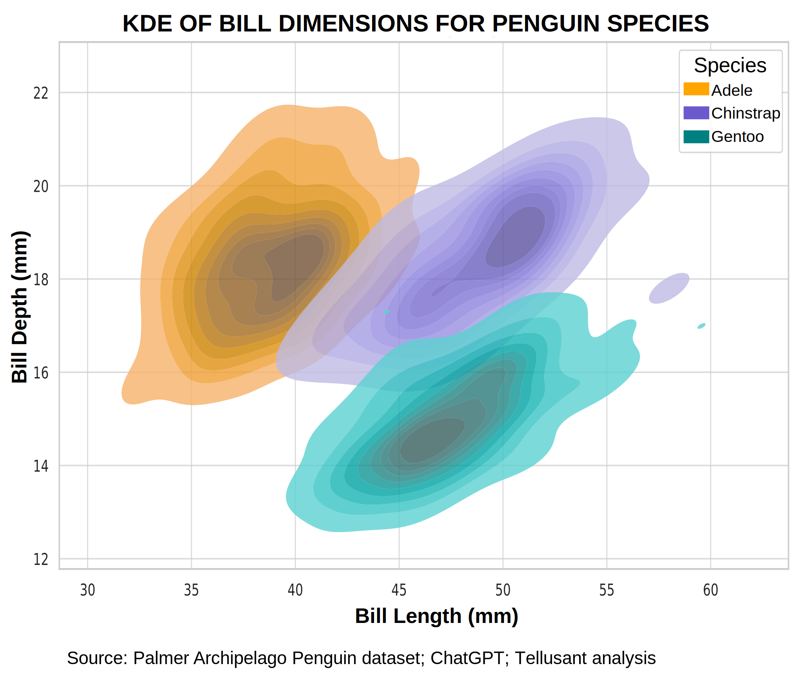
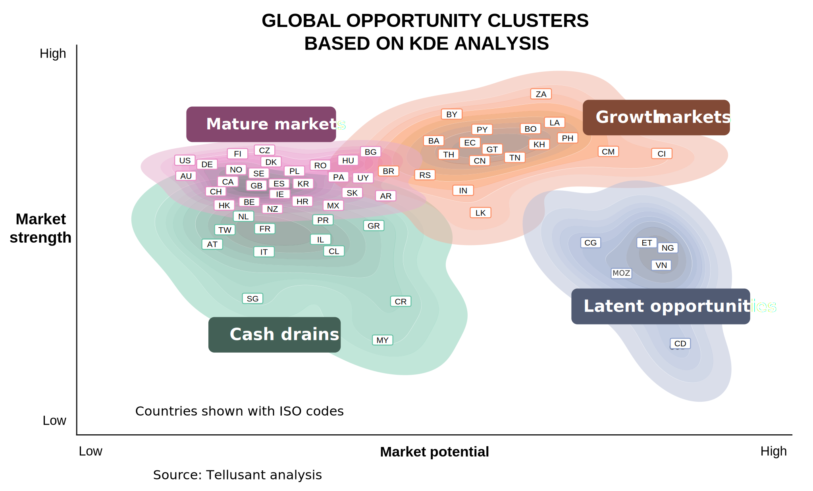

# The Palmer Penguins and their Role in Business  
*Dr. Staffan Canback, Tellusant*  

---

  Artwork by @allison_horst

> *What an incredible journey you take us on. Penguins to AI strategy showcases how diverse data applications can be.*  
Marc Sartele
   
Penguins are an unlikely influence on management science, but the Palmer Penguins Dataset has had a profound impact on machine learning and artificial intelligence, and by extension on emerging business practices.

## Background
In the early 2000s, a research team based at the Palmer Research Station in Antarctica collected data to better understand "ecological sexual dimorphism and environmental variability within a community of Antarctic penguins."

The work had nothing to do with machine learning or artificial intelligence. However, the data collected turned out to be truly usful for AI scientists to create learning models, as well as for countless high school and college students who were learning the basic concepts of AI.

## The Dataset and Its Uses
The Palmer dataset consists of observations of 344 penguins of 3 species. Several measurement variables were collected. From an AI training perspective, the bill length and height turned out to be especially interesting. 

Can a penguin's species be predicted based on these two measures? If so, with what confidence? Can a neural network be put to the task of figuring this out?

The graph below shows that it could be done. It may look easy when you see the results, but behind the effort are some truly ground-breaking machine learning concepts and mathematics starting in 1946.

This particular graph was created using kernel density estimation (KDE). For those interested, you can also create it in Excel using its new Python function together with a suitable library.

## How Tellusant Uses These Methods

Interesting, but how does it affect companies beyond new tools like ChatGPT? The approach is easily used to categorize, e.g., countries or consumers into segments. The graph below shows how Tellusant used this machine learning approach to classify country markets for a global company.¹

This analysis first used principal component analysis (PCA) to find relevant dimensions, then kernel density estimation to create the clusters. Easy to do in ChatGPT.

The difficult part is not in the calculations. It is in having the vision that this can be done and that the outcome is useful for companies. Most people do not even try because they lack the vision and the credibility to be believed.

## The Road Ahead

I am convinced that the power of these methods will win the day. It starts with experiments, and then gradually management teams are won over. How long will it take? 

ChatGPT estimates 3-5 years untill routine automation of these kinds of methods. Here is what it says, based on its undesrstanding of Tellusant:

> ***Already happening (2025)***
> - *automated dashboards*
> - *descriptive summaries*
> - *PCA + basic clustering*
> - *univariate/bivariate plots*
> - *marketing segmentation skeletons*
> 
> ***Next 1–3 years***
> - *multi-country segmentation*
> - *consumer micro-segmentation*
> - *elasticity estimation across SKUs and markets*
> - *scenario-driven strategy insights*
> - *automated deck generation*
> 
> ***Next 3–5 years***
> - *fully autonomous strategy workflows*
> - *agents running simulations overnight*
> - *country + consumer knowledge graphs updating continuously*
> - *hybrid modeling (agent + econometric + ML)*
> - *direct integration with forecasting systems*

As a human, I will add that the real bottleneck is an organizations ability to absorb these kinds of groundbreaking approaches. So while ChatGPT says 3-5 years, I say 5-10 years based on human limitations. I confronted ChatGPT with this and it modified its perspective:

> *AI will be ready long before organizations are.*
>  
> *Agents will be technically capable of doing Tellusant-like global segmentation tomorrow.
But Fortune 500 companies will still be learning how to integrate that into job roles, accountability structures, and decision-making in a way that feels safe, familiar, and normatively acceptable.*  
>  
> *Broad-based adoption requires humans to change:*
> - *identity (“what does my job mean now?”)*
> - *workflow (“how do I integrate the agent?”)*
> - *accountability norms (“can I defend AI-generated work?”)*
> - *political dynamics (“is this reducing my power?”)*
> - *trust calibration (“when can I rely on it?”)*
> 
> *These are slow-moving psychological transitions, even in high-talent organizations.
Human limits don’t slow the start, they slow the finish.*

---

¹ Graph axes and country locations are altered, and the category not given, to maintain confidentiality.  

Find the original data: **[The Palmer Penguin Dataset and Art](https://allisonhorst.github.io/palmerpenguins/)**

Source: Horst AM, Hill AP, Gorman KB (2020). palmerpenguins: Palmer Archipelago (Antarctica) penguin data.  R package version 0.1.0.

---
[2025-11-21]

