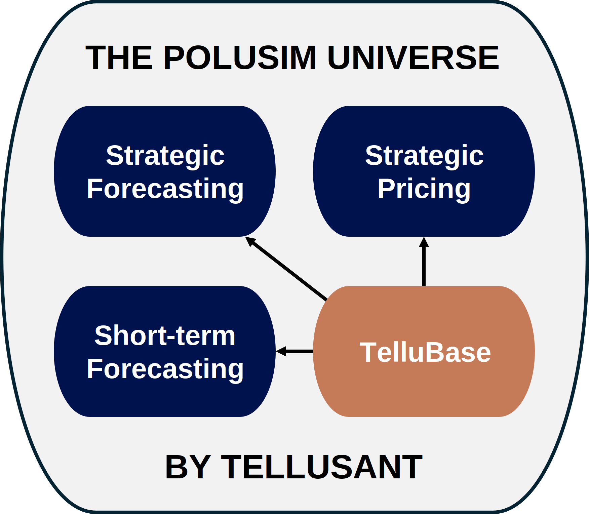

# The PoluSim Universe
Our **PoluSim** solution has expanded majorly since the launch in 2022. It now has three distinct modules plus **TelluBase** to help companies create a strategic view of the future and to predict demand.  

We have subscribers in more than 100 countries and are featured in clients' quarterly and annual reports, as documented by the SEC.  

  

- **Strategic forecasting**. This is where we started. Forecasting with a strategic 3-, 5-, or 10-year horizon is a) difficult, and b) done with unrigorous methods at all companies (as far as we know). We therefore built our cloud-based app on strictly scientific foundations.  

- **Strategic pricing**. Companies usually have solid price/promo pricing tools. But what should pricing decisions be aiming for strategically? Surely it is not the compounding of price/promo decisions. Our web-based solution helps answer this.  
  
- **Operational forecasting**. This application helps senior management understand what awaits categories and their company over the next 18 months. It uses a monthly timeseries model combined with independent demand drivers. It is harmonized with our long-term forecasts.  

- **TelluBase** is our global database with consumer economics and income distribution data for 218 countries, 2600 cities, and 2500 subdivisions for 2000-2050. It feeds automatically into each PoluSim module. It is also available as a standalone product.  

These solutions are enterprise level tools. This means we meet the strongest security standards and we run on Azure. Connections with corporate data are safeguarded in a jointly approved manner. We do not allow AI for the time being.

***Most importantly***, success with our solutions requires full training and help desk support. For a global company, it will take 1 to 3 years for Tellusant's solution to be fully adopted. During this period there is intense learning for executives and operators.

Implementing **PoluSim** is a fundamental step forward for companies. It gives a competitive advantage, but also requires learning new skills. We look forward to helping you in this journey.

[2025-11-06]
