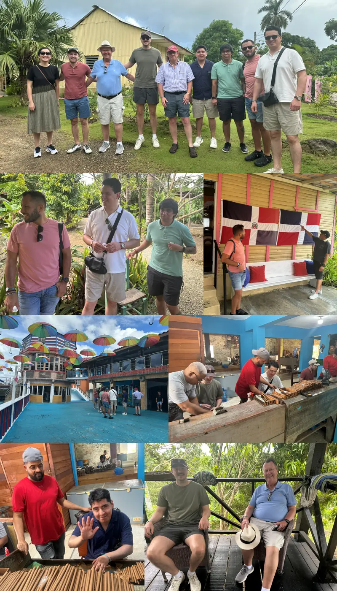
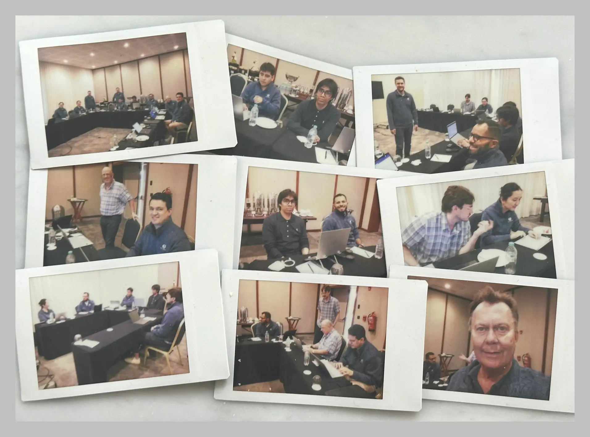
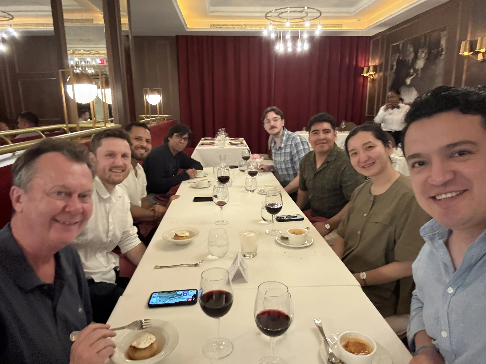
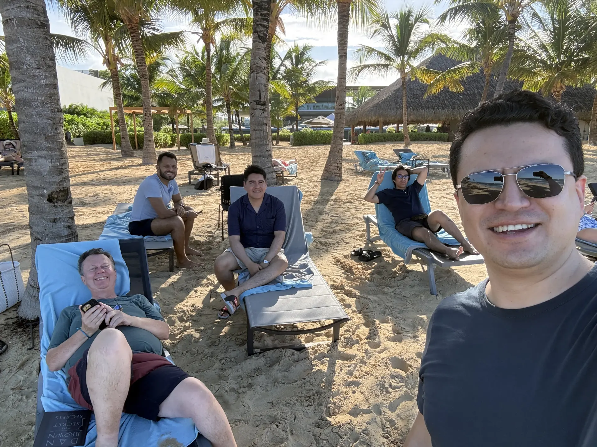

# Global Retreat in Punta Cana 2025
The Tellusant Global Retreat is held in Punta Cana, Dominican Republic, this year. We have four days of work and relaxation at the ultra-luxury Live Aqua resort, a Grupo Posadas property. This follows the 2024 retreat in Panama City, Panama.  

We picked Punta Cana because it is served by direct flights from Boston, Mexico and Bogota. And having perfect weather and a turquoise ocean also helped!

Philip Burginyoung, our CEO, expertly organized the entire event. We aee all most grateful and send a big thank you!

## First Day: Welcome
The first night, we held our welcome dinner at the property's hibachi restaurant. Great for team building as we joined the chef in singing and also prepared our own food.  

<video controls width="600" style="max-width: 100%; height: auto;" poster="assets/images/tellusant-punta-cana-splash.webp">
  <source src="https://tellusant.com/repo/video/tellusant-global-retreat-punta-cana-2025-welcome-dinner.mp4" type="video/mp4">
  Your browser does not support the video tag.
</video>

After dinner, some people continued their activities till the wee hours.

## Second Day: Team Building

We continue the Tellusant Global Retreat in Punta Cana. The second day was dedicated to team building at a plantation and a cigar factory.

1. Arriving at the plantation
2. Intensely viewing an animal
3. Making sure we are in the Dominican Republic
4. Entering the cigar factory
5. Making cigars under close supervision
6. More cigar making
7. Taking a break from cigar making

Later, we went for a swim in the ocean and had a team dinner in the Italian restaurant on the resort.

## Third Day: Workshop
The third day of the Tellusant Global Retreat in Punta Cana is dedicated to work sessions. The collage shows us in gloriously old tech 𝗙𝘂𝗷𝗶𝗳𝗶𝗹𝗺 𝗜𝗻𝘀𝘁𝗮𝘅 photos.  

Sessions were designed around training and internal planning.

- An overview session of our company and the way ahead  
- A session on how to use our TelluBase data for strategic insights  
- Brainstorming a business development plan based on lessons learned  
- Several sessions on product development and data management  

In the evening we had a team dinner at a spectacular French restaurant.  

## Fourth Day: Farewell

The fourth day of the Tellusant Global Retreat in Punta Cana saw us relaxing and bidding fond farewells.

What an experience! The perfect mix of work and play. An extraordinary resort with impeccable service and excellent food and wine beyond the typical hotel fare.

Now back to converting our learnings into action.

Next year in???

