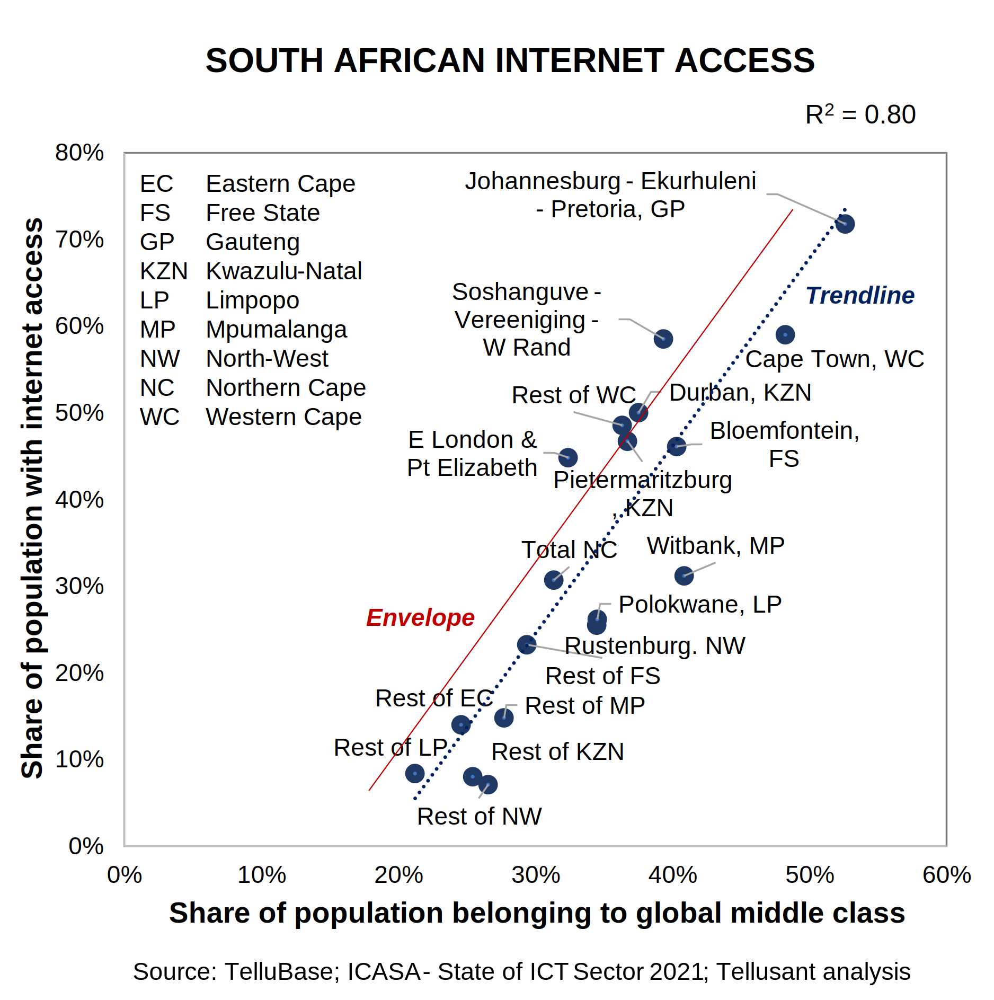
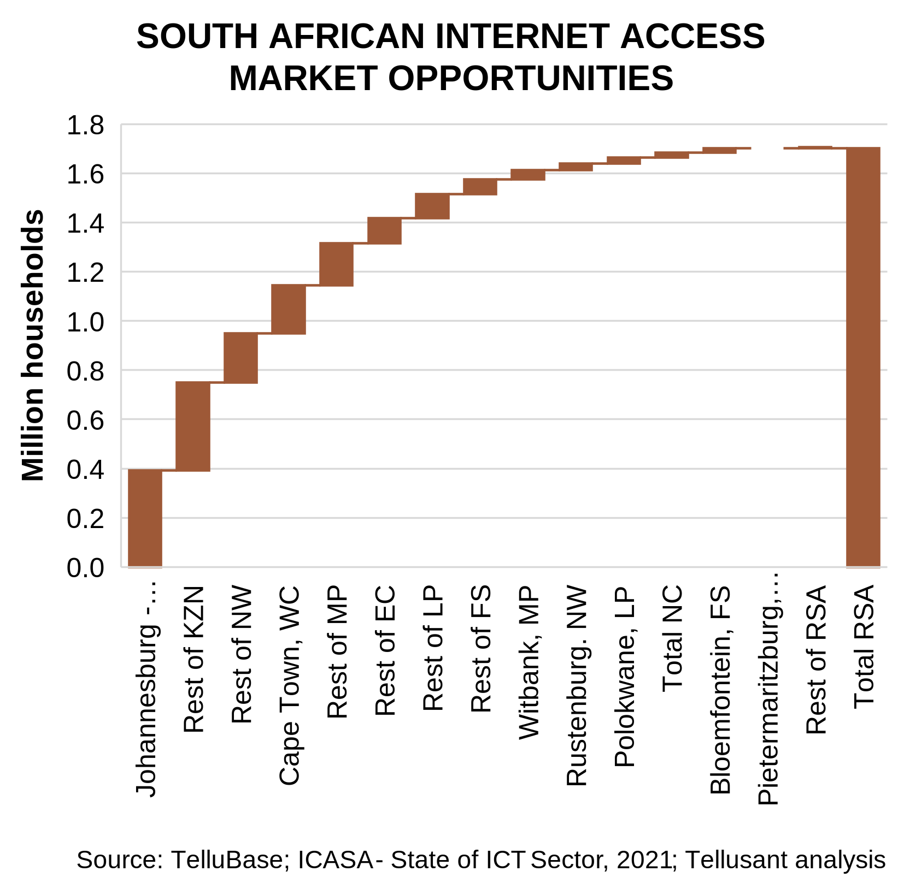

# Subnational ICT Opportunities in South Africa  
## Case Example for How to Use TelluBase Income Distribution Data  

> *Your methodology really tackles the blind spots that broader forecasting often misses. the way you've layered socioeconomic factors shows thoughtful analysis that actually translates into something useful.*  
Mahvash Khan  

There is a strong trend among global companies toward understanding markets at subnational levels. They always face local players who have a keen sense for subnational opportunities.  

**TelluBase** is immensely useful for understanding subnational markets. It contains macro and consumer data for 218 countries, 2600 cities, and 2500 subdivisions (states, provinces, regions, etc.)  

The power of TelluBase is when its statistically data are combined with industry and category. The data on their own can be illuminating: "The middle class and above in Lima is growing at 8% per year".  

Yet, the combination with other data is what leads to true insights and action: "We see an untapped market opportunity for our toothpaste in India secondary cities of 200 million people in 2035, up from 80 million today".  

To illustrate with numbers, we turn to South Africa.   
  
### FIND THE RELATIONSHIPS
It is rare to find subnational industry or category data in the public domain. We always source this from our clients with requisite permissions.  

We did however find a public report in South Africa when working with an investment bank on local ICT opportunities.

The ICASA report [*The State of the ICT Sector*](assets/support/State-of-ICT-Sector-Report-March-2022.pdf) among other things showed the number of internet users for major cities and all states. How is this converted into something analytically useful?  

We set as our objective to identify the internet over- and under-penetration for each of these geographic entities and then derive the latent market opportunity. The process was to:

1. Develop the internet penetration metric. ICASA did not have this in a clean fashion. We therefore used AND and OR statements to combine ICASA data into a singular metric.  

2. Match the entities in the ICASA report to TelluBase. This was easy because the cities in ICASA were covered in **TelluBase**.  

3. Establish which part of the population uses the internet. We knew from prior experience that this correpnded to the middle class and above.  
   - We tested various **TelluBase**'s income brackets to find the highest goodness-of-fit (R²). It turned out that our existing global middle class definition worked best. This was a nice confirmation of what we already knew.  
   - We ran a regression with internet penetration as a function of middle class share of total population. It is typically better to run on absloute values (i.e. total number of households with internet vs total number of middle class households) but in this case results were similar.  
   - R² was 0.8 and there was no heteroscedasticity.  

4. Find the ***envelope***. The ***trendline*** does not show what is possible, it just shows the fitted curve. The envelope on the other hand establishes what is possible. It typically is drawn at one standard deviation from the trendline.  

The graph below shows the finished analysis. The vertical distance between the envelope and the entities plot point is the opportunity.  

Note that Johannesburg and Cape Town, while most affluent among South African cities, still represent opportunities.  

  

The graph above shows percentages. More important is the absolute opportunities in number of households.  
  
### QUANTIFY THE OPPORTUNITY

The graph below applies the percentages to the number of households (a simple multiplication).  

1. The largest opportunity by far is still in the greater Johannesburg area. However, non-city areas in KwaZulu-Natal (capital: Durban) and Western Cape (capital: Cape Town).  

2. 89% of the opportunity comes from half of the entities. This is below the often used (but incorrect) 80/20 rule.  

3. The potential of 1.7 million households represent 10% of all households. This means that South Africa is highly penetrated and close to the top of the s-curve.  

Compare this to what meets the eye. Median and average internet penetration is 34%. A **superficial analysis** based on this indicates a large upside. But the **comprehensive analysis** above proves that the upside is moderate to low.

Only strong economic development over coming years, with a rapidly growing middle class, can change this conclusion. But this is not in sight. 

  

---
We have deployed variants of these analyses in hundreds, if not thousands, of cases in multiple industries, especially consumer goods. The case shown is static (one year) but typically we build dynamic models and forecasts based on the same logic and with more explanatory variables.

As far as we know, **no other company in the world has Tellusant's capability**.

---
This effort built on Tellusant's long and deep telecom knowledge (see [Staffan Canback](https://www.linkedin.com/in/scanback/) and [Kennet Rådne](https://www.linkedin.com/in/kennetradne/)).  
