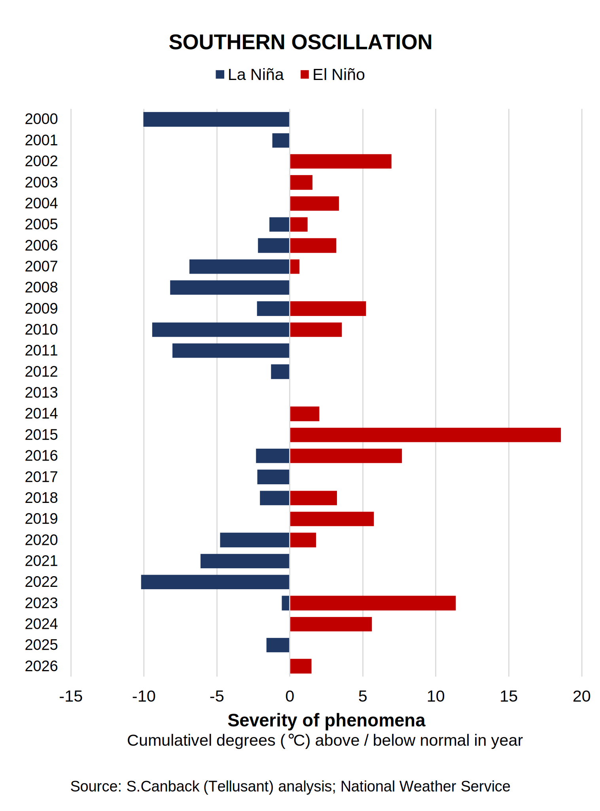

# Are We Facing a Strong El Niño? The Southern Oscillation Conundrum
El Niño and La Niña are notoriously unpredictable, almost chaotic. But a serious new report predicts a strong El Niño starting this summer. What do I see?

The Southern Oscillation is the shifting currents in the Pacific Ocean near South America. Depending on how it shifts you get a warm weather phenomenon called  El Niño or a cold weather phenomenon called La Niña. It affects not only South America, but also North America and Africa, and sometimes beyond.

Agricultural yields and commodity prices are heavily influenced by the Southern Oscillation for many crops. In 2024, cocoa prices spiked because of a strong El Niño impacting production in west Africa.

The recent report by [The World Meteorological Organization (UN)](https://wmo.int/resources/publication-series/el-ninola-nina-updates/el-ninola-nina-update-february-2026) suggests a high probability of a new EL Nino this northern summer / southern winter.

I track the Southern Oscillation systematically because some of our clients have an intense interest in how it evolves. The graph below shows the trend since 1950. I do not yet see evidence of an EL Nino when I study the detailed data behind the graph, but I aam an amateur compared to the WMO.  

What I do know is that once there are measurable signs of an El Niño (not only modelled data) it is easy to predict commodity prices.

Formally, with ENSO beingEl Nino Southern Oscillation:

$\Delta P_{t+h} = \mathbb{P}(\text{ENSO} \mid E_t) \cdot \delta_{\text{strong}} + \mathbb{P}(\text{ENSO} \mid E_t)^c \cdot \delta_{\text{weak}}$

This is surely known by commodities futures traders like John W. Henry & Company, just as I know it.

Having the price insight tradeable for a gain in a futures contract is a different thing. Traders have a second secret (S) insight that they combine with the ENSO insight.

Formally, this takes the form: 

$$\Delta P_{t+h} = \mathbb{P}(\text{ENSO} \cap S \mid E_t) \cdot \delta_{\text{strong}} + \mathbb{P}(\text{ENSO} \cap S \mid E_t)^c \cdot \delta_{\text{weak}}$$  

or

$$\Delta P_{t+h} = \underbrace{\left[ \mathbb{P}(S \mid \text{ENSO}) \cdot \mathbb{P}(\text{ENSO} \mid E_t) \right]}_{\text{Joint contingency}} \cdot \delta_{\text{strong}} + \left[ \mathbb{P}(S \cap \text{ENSO} \mid E_t) \right]^c \cdot \delta_{\text{weak}}$$  

This is what futures traders like John W. Henry & Company trade on in some secret form. Such firms would be fools to divulge their models. Neither do I.

Broadly, you can be sure that if you get a stock tip, commodity tip, or currency tip from someone, it is of no value. Anyone who has a true insight will keep it to themselves and get rich. Never act on recommendations of this kind. If they work it is random. 

The key exception is if you get a tip from a friendly insider, but to act on this is illegal (not that this has stopped Trump and his sycophants).

