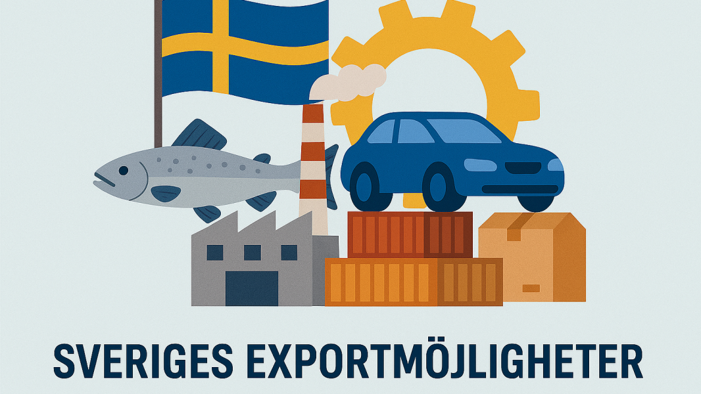
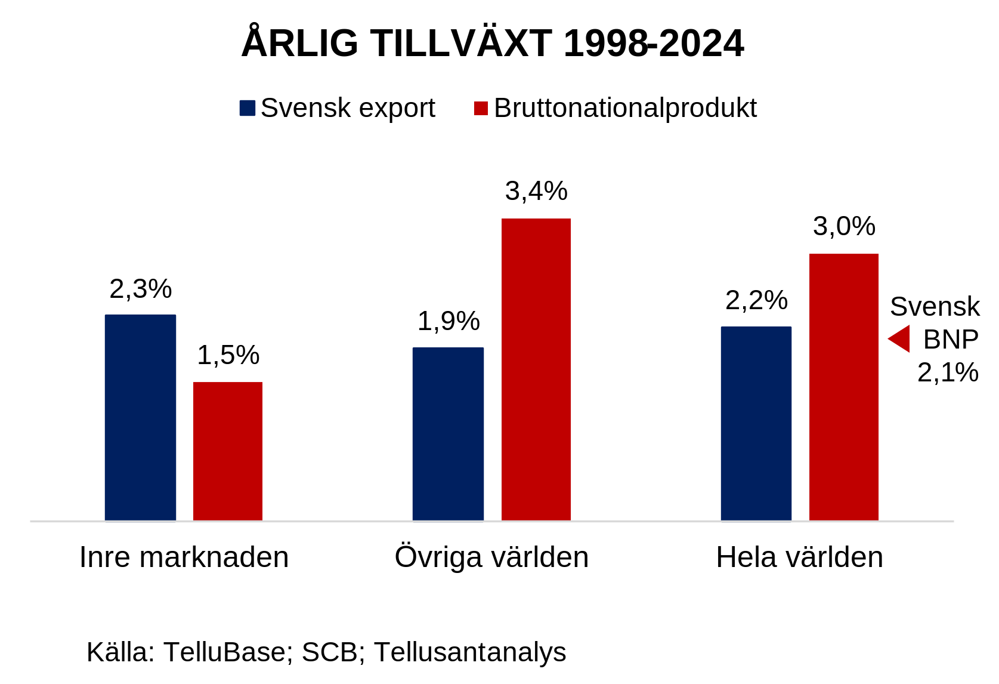
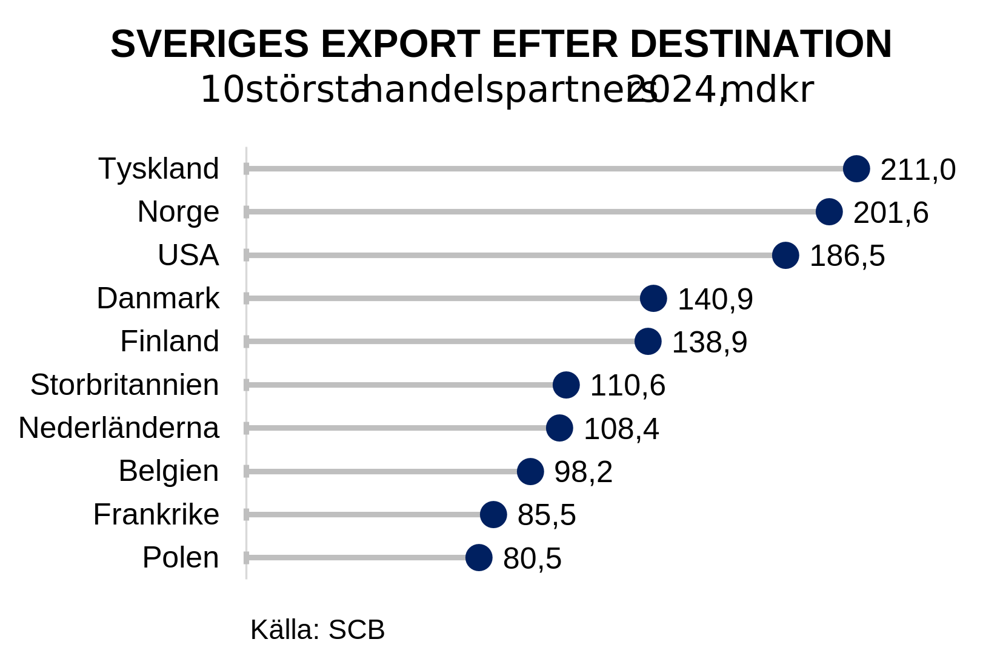
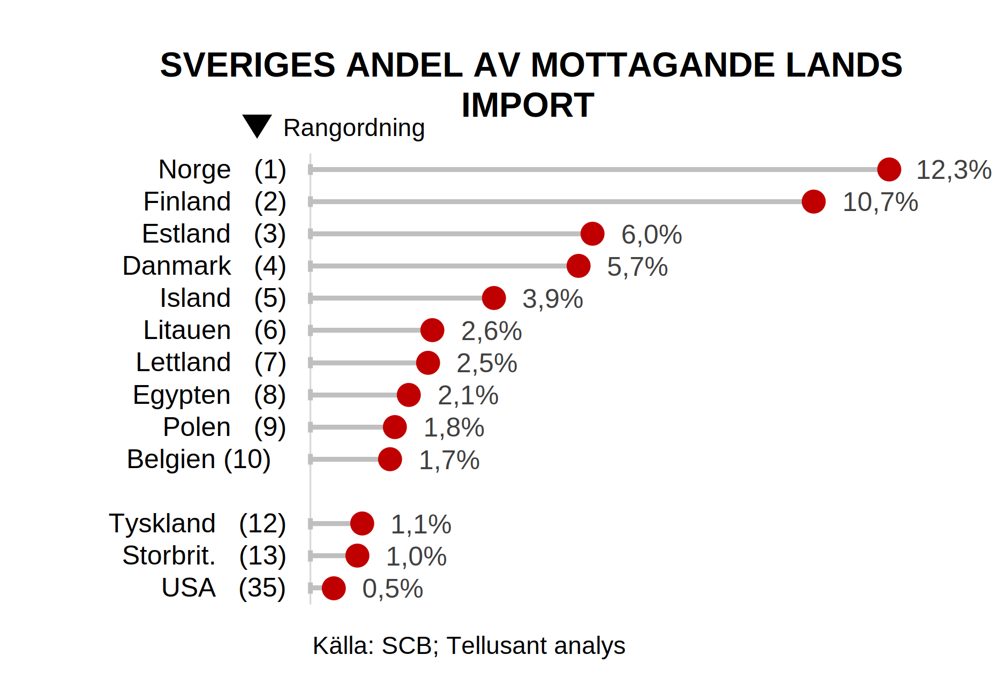
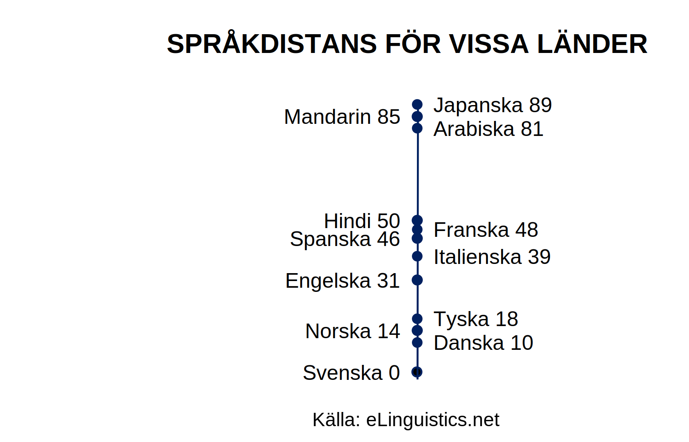
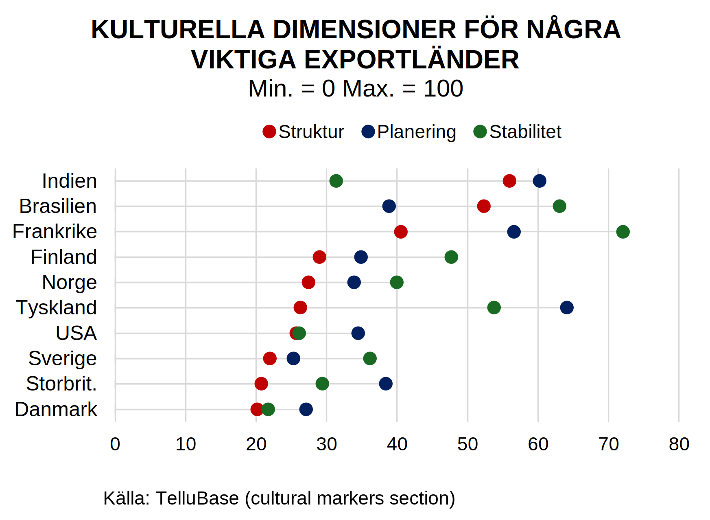
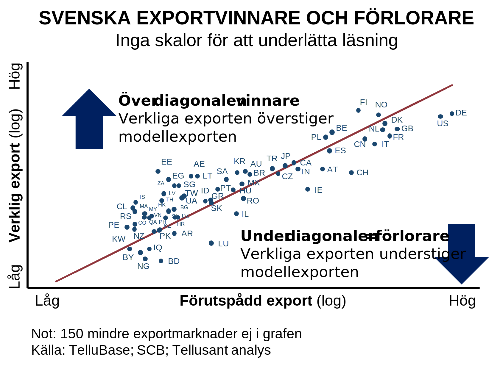
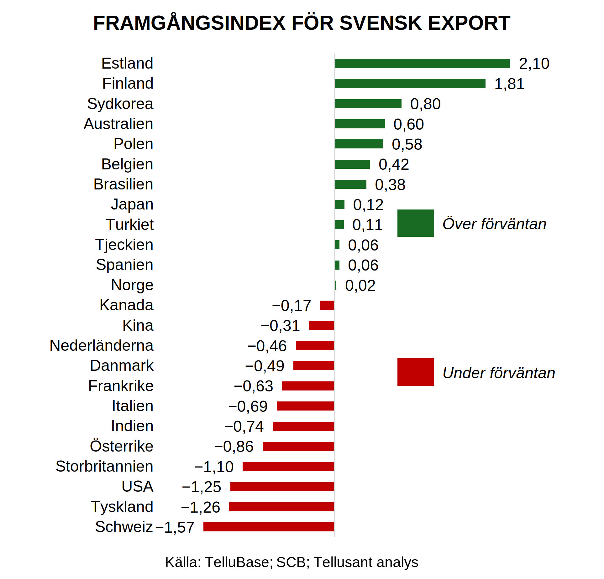
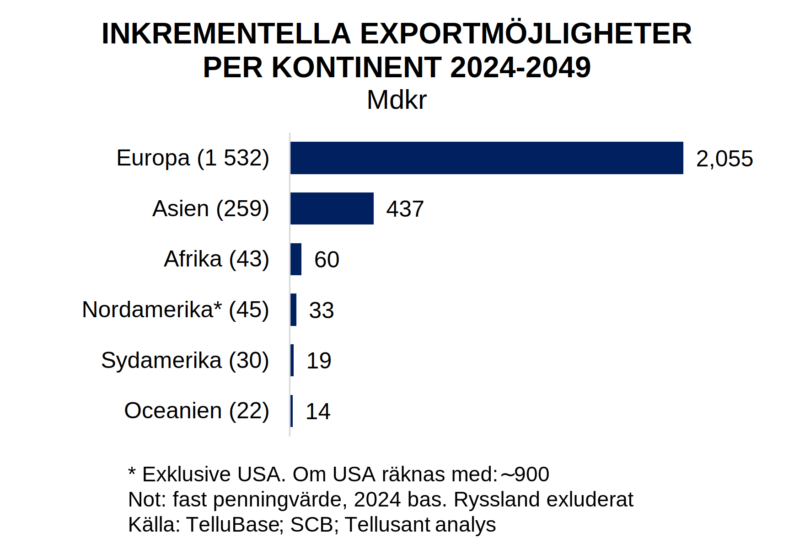

# Sveriges exportmöjligheter i ett besvärligt handelsklimat
*Dr Staffan Canbäck. Tellusant*

---

**OM FÖRFATTAREN**  

> Dr Staffan Canbäck är svensk strategikonsult och företagsledare bosatt i Boston, Massachusetts sedan 1993. Han är arbetande styrelseordförande för Tellusant, Inc. Han var dessförinnan VD för Canback Consulting, en global strategikonsult firma i Boston, som han sålde till The Economist Group 2015. Innan dess var han partner hos McKinsey & Company och Monitor Company.  

> Canbäck erhöll en doktorshatt från Henley Business School 2002 baserat på forskning kring skalnackdelar inom storföretag. Han har dessutom en MBA examen från Harvard Business School och en civilingenjörsexamen (elektro) från KTH. Canbäck är Fulbright Scholar, Wallenbergstipendiat, och vann första pris i EDAMBA:s tävling om Europas bästa  doktorsavandling inom företagsekonomi 2003.  
    

---
**V**ärldens handelsmönster håller på att stöpas om. Att Förenta Staterna ökat tarifferna för att minska importen är tydligt. Men Europeiska Unionen har också ökat tarifferna mot Kina under flera år. Kina kommer svara på bägge. Sekundära effekter uppstår för alla.  

Hur ska ett exportberoende land som Sverige agera för att bibehålla och öka sin export? Lösningen måste utgå från det faktum att **vår export inte varit speciellt framgångsrik** det sista kvartsseklet.  

Denna artikel belyser möjligheterna för framtiden baserat på en statistisk exportmodell som tar hänsyn till geografiskt avstånd, språkliga skillnader, kulturell distans, handelshinder och storleken på mottagarlandets import.  

## Svenska exportens utveckling
Den svenska exportutvecklingen har varit under förväntan de sista 25 åren. På intet sätt dålig, men svag. Graf 1 visar utvecklingen.  

**Graf 1**  
 

Gentemot den inre marknaden (EU plus Norge, Island, Liechtenstein och Schweiz).¹ har vår export vuxit snabbare än mottagarländernas BNP.  

Inte oväntat eftersom ett syfte med den inre markanden är att stimulera intern handel. Den inre marknaden står nu för två-tredjedelar av svensk export.  

Men EU växer långsamt. En framgång inom ett lågväxande område är endast en partiell framgång.  

Värdsekonomin utanför den inre marknaden växer mer än dubbelt så snabbt mätt i BNP. Här ligger svensk export långt efter. Vår export har vuxit 1,9% om året, men mottagande länder har vuxit 3,4% årligen.  

Det förefaller som om så mycket energi har gått åt att fånga möjligheter inom EU att övrig export delvis åsidosatts.  

### Svensk exportkomplexitet
Det finns dock en viktig ljuspunkt. Svensk export är sofistikerad. Vi rankas som nionde land i världen efter exportkomplexitet.  

**Graf 2**    
 

Svenska exportvaror är högförädlade. Det gäller inte bara läkemedel, fordon och andra uppenbara varor. Många varor som kan ses som basvaror har inom sina segment högt förädlingsvärde (t ex stål).  

## Profil av exportmarknader
Graf 3 visar vart svensk export går. Av de tio största länderna är alla utom USA inom den inre marknaden. En framgång för EU-samarbetet, men visst borde några länder som Kina och Brasilien vara på listan.  

**Graf 3**  
 

Denna bild är välkänd och bidrar inte till en bättre förståelse av framtida exportmöjligheter.  

Graf 4 visar istället den mer intressanta och mer okända vyn över Sveriges andel av olika länders import. Vi kan se detta som vår marknadsandel i olika länder.  

**Graf 4**  
  

Det är slående hur väl vi exporterar till NB8 (Nordic-Baltic 8). Dessa länder utgör de sju första länderna (Sverige är givetvis det åttonde).  

Efter detta följer en överraskning: Egypten. Landet växer snabbt,  har gigantiska infrastrukurprojekt och den bäst diversifierade ekonomin² i världen, så det är kanske inte är så underligt trots allt.  

Längre ner på listan finns fjärran länder med hedervärd svensk andel av importen, t ex Sydafrika, Guyana (världens överlägset snabbast växande ekonomi), Algeriet och Turkiet. Detta pekar på att det finns möjligheter utanför de traditionella marknaderna.  

Hittills har vi sett beskrivande information. Intressant, men den ger få insikter om vad Sveriges möjligheter är. Statistisk analys ger dessa insikter.  

## Statistisk analysmodell
Vilka faktorer är avgörande för exportframgång? Fem faktorer visar sig vara viktiga, sammanfattade i Graf 5. Hur viktiga visas senare i sektionen ***Resultat från modellen***.  

**Graf 5**  
  

Data för dessa faktorer samlades in för 209 länder och territorier. I det följande visas några viktiga aspekter av dessa data.  

### Språklig distans

Språklig distans är en viktig faktor. Det är svårt att förhandla om svenska ligger långt från mottagande lands språk. Att arbeta på engelska hjälper, men språket behärskas inte fullt ut i de flesta länder, inklusive Sverige. Dessutom ska kontrakt oftast skrivas på mottagarlandets språk. Detta komplicerar handel ytterligare.  

Inom lingvistik har språklig distans kvantifierats. Graf 6 visar distansen från svenska (index 0) för några viktiga handelsspråk. Alla länders språkliga distans samlades in. Engelska, franska, spanska eller portugisiska valdes som handelsspråk för länder med lång tradition med dessa språk.  

**Graf 6**  
  

Att de skandinaviska språken ligger nära svenska är föga överraskande. Att tyska ligger nära är kanske inte uppenbart (tips: exportörer, lär er hyfsad tyska, inklusive att läsa språket).  

Engelska, ett germanskt språk, ligger rimligt nära. Men de romanska språken har ett stort avstånd. Få svenskar talar franska eller spanska väl trots att länder med dessa språk är stora importländer.  

Att ostasiatiska språk är distanta är uppenbart. Finska ligger också på denna distans (men svenska och engelska fungerar väl i Finland).  

### Kulturell distans
Kulturell distans är ett komplicerat ämne. Det visar sig att nästan 90% av variationen i global kommersiell kultur kan förklaras av tre dimensioner, men inte färre.³ Dessa är:  

**Struktur**: kulturer kan vara hierariskt orienterade eller flata.  

**Planering**: vissa kulturer arbetar med genomtänkta planer medan andra är mer improviserande.  

**Stabilitet**: vissa kulturer premierar pålitlighet och andra flexibilitet (och innovation).  

**Graf 7**  
  

Notera att det inte finns något värdeomdöme i dessa dimensioner. Det är t ex varken bättre eller sämre att arbeta i en hierarisk gentemot flat kultur.  

Svenskar är starkt orienterade till flata strukturer. De flesta länder finner detta underligt. Betyder det att svensk export lyckas bättre när vi har liknande synsätt?  

Sverige har inte en stark planeringskultur utan fungerar väl med improvisation. Jämfär detta med Tysklands mer metodiska planering. Gör vi bättre ifrån oss om importlandet liknar Sverige?  

Svenskar är mer genomsnittliga i stabilitetsdimensionen. Vi premierar pålitlighet men har också drag av flexibilitet. Hur påverkar denna profil våra exportmöjligheter?  

### Andra faktorer
**Geografisk distans** kräver ingen graf. Det är uppenbart om länder är nära eller fjärran. Frågan är istället: påverkar avstånd vår export?

**Handelshinder** bör också ha en inverkan. Vi delade in världen i den inre marknaden (låga handelshinder) gentemot övriga länder.

**Importmarknadens storlek** spelar uppenbarligen en stor roll. Det är lätt att vara framgångsrik i ett land som Estland och svårt i USA, allt annat lika.

Basmodellen visar att alla dessa faktorer är statistiskt signifikanta förutom handelshinder.

För exportörer rekommenderar vi att språklig distans, attityd till struktur, geografisk distans, och importlandets potential beaktas. Fyra dimensioner är hanterbart för ett företag.

## Resultat från modellen
Vi börjar med Graf 8 direkt ur det statistiska analysprogrammet (Stata). Den kräver förklaringar.

**Graf 8**  
  

Resultaten kommer från en linjär regression. R-kvadrat (godhet i passform) är 0,84. R-kvadrat över 0,8 är ett utmärkt resultat.

Endast cirka 60 viktiga exportländer visas. 150 mindre länder ligger omkring diagonalen till vänster om de länder som syns. Ju längre till höger, desto större export.

Vad är diagonalen? Det är linjen där modellen och verkligheten är desamma.

Om ett land ligger över diagonalen betyder det att Sverige lyckats över förväntan, under innebär under förväntan.

### Några observationer

Estland (EE) ligger högst över diagonalen. Det betyder att det är det land Sverige är mest framgångsrikt i efter att hänsyn tagits till språk, kultur och geografi. Men landet ligger till vänster, d vs marknaden är liten.

Andra starka framgångsländer är t ex Förenade Arabemiraten (AE), Egypten (EG), Chile (CL) och Korea.

Däremot går det trögt i exempelvis USA (US), Tyskland (DE) och Schweiz (CH). Att många länder i den inre marknaden ligger långt under diagonalen är bekymrande. Att gå med i eurosamarbetet kan inte vara en nackdel.

Detta ger ett intryck av de relativa resultaten. Hälften av de 209 länderna ligger över diagonalen 0ch kan ses som framgångar, Hälften ligger under, med mer att önska.

Graf 9 sätter siffor på de relativa exportframgångarna.

**Graf 9**  
  

Men hur stora är exportmöjligheterna i kronor? Den sista sektionen visar detta.

## Sveriges möjligheter och prioriteter
Anta att målet för Sveriges export äver de nästa 25 åren är att återställa positionen vi hade 1999. Vi sätter därför målet att exporten ska växa 3,5% om året, upp från 2,2%. Världsekonomin förväntas växa 2,3% p.a.

Hur uppnår vi detta? Detta finns två faktorer att beakta. Å ena sidan är det är bättre att exportera till tillväxtländer. Å andra sidan gäller det att öka exporten till länder där vi är svaga, men modellen säger att vi borde vara starka.

Gå tillbaka till Graf 8. Ett sätt att finna potentialen är att säga:

För länder över diagonalen, svenska framgångsmarknader, sträver vi efter att behålla marknadandelarna och växer vår export i takt med dessa länders ekonomiska uvckling.

För länder under diagonalen, där svensk export inte nått sin potential, siktar vi på att nå upp tll diagonalen. Det vill säga, vi tar marknadsandel.och växer i takt med mottagarlandets ekonomi och import. Undantaget är USA som kommer vara en svår exportmarkand under många år framöver (protektionismen har en historik långt före Trump).

Graf 10 sammanfattar denna analys baserad på den statistiska modellen. Hänsyn har tagits till språklig, kulturell och geografisk distans.

**Graf 10**  
  

Tyskland är den största möjligheten (USA, om export blir enklare igen, skulle ligga i nivå med Tyskland). Indien och Kina har stor potential, trots våra skillnader.

Frankrike, Schweiz och Italien är idag inte framgångsrika exportmarknader, men har stor potential.

Ett bredare perspektiv syns i graf 11. Vilka är möjligheterna per världsdel? Europa, trots den låga förväntade tillväxten (främst driven av demografisk motvind), står för den största nettopotentialen.

Asien har god potential bortom Kina och Indien. Att Afrika kommer därefter förklaras av den höga ekonomiska tillväxten (näst högst i världen de senaste 25 åren och högst i världen de kommande 25.

**Graf 11**  
  

En ökad exporttillväxt från 2,2% 1998–2024, till 3,5% 2024–2049 är en rimlig ambition. Detta kräver stora reformer och en gedigen kraftsamling.

Ökad export av denna magnitud kräver också att Sverige går bättre. Tillväxten har varit bra efter EU mått, men lämnar en hel del att önska i ett världsperspektiv.

## Slutsatser
Sveriges exportansträngningar har varit framgångsrika, men kanske inte i den utsträckning man gärna tror.

Det finns utmärkta möjligheter att vidare utveckla exporten trots de handelshinder som läggs nu.

Ambitionsnivån måste höjas. Sverige bör nästan dubbla tillväxttakten i sin export. Det sista kvartsseklet har vår export vuxit 2,2% per år men värdsekonomin har vuxit 3% årligen. Vi tappar marknad hittils.

Med ett mål på förslagvis 3,5% exporttillväxt per år kommer vi återta vår postion om ett kvartssekel.

- Vi måste nå större framgång **utanför NB8**. Det finns många ljuspunkter, men sann framgång bygger på en större roll i stora länder som Tyskland, Kina, Indien och Frankrike (USA kan bli en prioritet senare).

- Gå **från krona till euro**. Att ha en viktig valuta hjälper när ett litet land som Sverige exporterar. Det minskar osäkerheten i att handla med ett okänt land, minskar friktionen i handels- och betalningsflöden, och reducerar växelkursvolatiliteten.

- Det krävs en större **ödmjuket för språk och kultur**. Allt för mycket går i dag på engelska. Jämför med t ex Mexiko och Colombia: Där sätter företag personalen i engelskundervisning i en massiv omfattning. De förstår att spanska är viktigt, men engelska öppnar större dörrar. Vi har det motsatta problemet.

- Att **förstå värdet av hierarkiska kulturer** är dessutom viktigt. Allt för ofta hörs "this is how we do it in Sweden". Ingen bryr sig. Möt stora länder på deras villkor (och tala aldrig om Sverige på middagar—ointressant för alla utom svensken).

Staten kan bidra på marginalen:  

- Fortsatt fokus på språkutbildning i skolan 

- Uppfångning av invandrares språkkunskaper 

- Stöd för Erasmussamarbetet

- Kom ihåg att Sveriges viktigaste exportstöd kommer från kungafamiljen. Detta är i sig värt mångmiljardbelopp. Nobelpriset är också viktigt (fler Nobelinspirerade handelsevenemang) 

- Mer kultur och konst: svenskar upplevs ofta som okultiverade, lite bonniga och tråkiga  

Däremot är statliga bidrag och industristrategier av noll betydelse.  

Till syvende och sist är export en företagsekonomisk fråga, inte en samhällsfråga. Förhoppningsvis kan denna generella analys hjälpa företag att tänka igenom sina möjligheter och prioriteter.  

Sveriges storhetstid inom export är sedan länge svunnen. Kvar finns bara tron på framgångar. Det är dags för företag, ledare och politiker att återfinna exportgnistan.  

---
**OM TELLUSANT**

>[Tellusant, Inc.](https://tellusant.com) är världsledande inom automatiserade lösningar för strategisk planering: *Enterprise Strategic Planning Solutions*. Vi bygger på årtionden av erfarenhet från världens största företag och har arbetat på marken i 92 länder.  

>Vi har nyligen aktiverat oss i Sverige under [Staffan Canbäcks](https://www.linkedin.com/in/scanback/) och [Kennet Rådnes](https://www.linkedin.com/in/kennetradne/) ledning.  

---
¹ Tidigare kallat den gemensamma marknaden. Schweiz är i många avseenden en del av den inre marknaden, men inte fullt ut.  

² Mätt med ett Herfindahl-Hirschman index (HHI) som här kvantifierar koncentrations- / diversifieringsgraden inom länder.  

³ Data kommer från Tellusants [TelluBase](https://tellubase.com) databas som bygger på många källor som har behandlats statistiskt. Våra index skiljer sig från, men har en liknande inriktning, som Hofstedes berömda kulturdimensioner.

Artikeln finns även på [LinkedIn](https://www.linkedin.com/pulse/sveriges-exportm%C3%B6jligheter-i-ett-besv%C3%A4rligt-dr-staffan-canback-e5lwe). 

Staffans efternamn är Canbäck på svenska och Canback på engelska.
