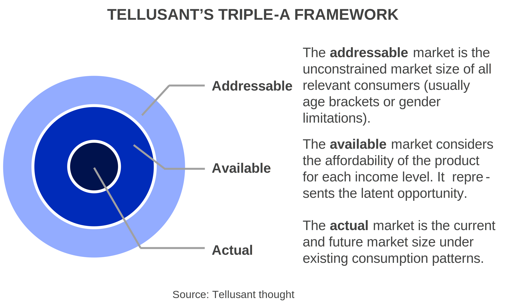
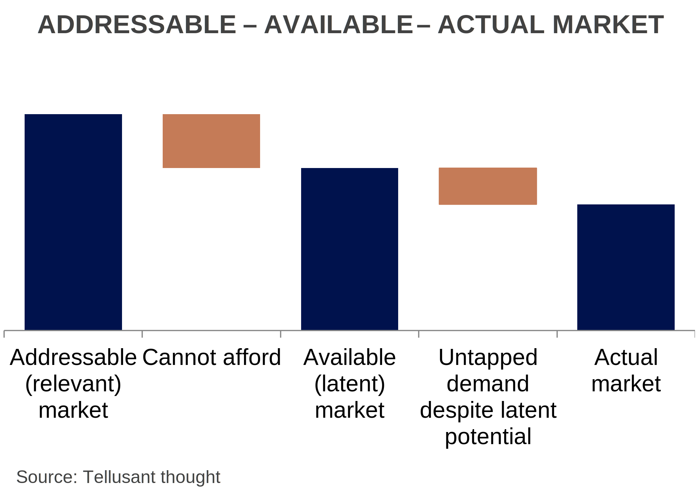
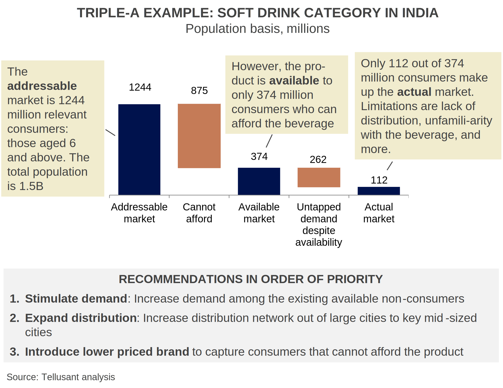

# The Triple-A Method for Market Sizing

  

Quantifying market opportunities requires clear definitions. The **Addressable – Available – Actual** market sizing method provides this. It is a logical way to understand not only current market size, but also the latent market opportunities.

## The Triple-A Logic

  

The graph above illustrates the concept.  

- The **addressable market** is the unconstrained market size if all relevant consumers had access to the product and were buying it. Relevant consumers are, e.g., parents of children age 0-4 for diapers; adults over the legal drinking age for alcoholic products, people living under wintry conditions for snow tires.  
- The **available market** takes is the part of this market where people can afford the product. To understand this, it is necessary to know how many people have a certaion income, and their age distribution. Companies do not have this information, but it can easily be retieved from telluBase.  
- The **actual market** is what people truly consume. This is what companies typically look at without knowing what the latent potentisl is. We recommend understanding the *Addressable-Available-Actual* metrics before making plans for the actual market. Perhaps the actual market can be expanded significantly if certain actions are taken to unlock it?  

With the **Triple-A method**, it is possible to pinpoint where the growth opportunities lie. The graph below shows a schematic waterfall for the logic.  

  

## Case Example
Here is an example from soft drinks in India. The product is currently only distributed in big cities.  

- The **addressable market** is 1,244 million people (those age 6 and up).  
- 374 million of those are within the socioeconomic levels that can afford to consume the soft drink. This is the **available market** of relevant consumers.  
- However, the **actual market** is 112 million consumers.  

Why is the actual market market so much smaller than the available market?

First, there is little distribution coverage since distribution only exists in the largest cities and in affluent areas. Second, there is unfamiliarity with the brand. 
Third, pack sizes are too large for many consumers who favor a reasonable transaction price.  

  

## Implementation 
Triple-A analysis is conceptually simple. But as with all new things at large companies, it will be met by hesitation.

Our [PACE *Pricing Aligned with Consumer Economics*](https://tellusant.com/repo/video/tellusant-pace-introduction.mp4) cloud-based solution is a starting point. It is an enterprise-strength product that goes beyond this article. 

[PACE website](https://pace.telluplan.com/)

It takes a dynamic view by showing the opportunities both currently and up to 10 years out.

It works with price and volumes rather than the population-based example shown here. That is, the user can see what the latent volume demand is at different price points.

It works fully at the city and subdivision levels to pinpoint the opportunities. This is in part achieved by leveraging our [TelluBase data](https://tellubase.com).

Broad-based adoption is not so much about the technical solution, but the requirement for people to change:

- Understanding: "Can I explain how Triple-A works"
- Trust calibration “When can I rely on it?”
- Accountability norms: "Can I defend the work without external help?"
- Workflow: "How do I integrate the solution into planning?"
- Political dynamics "Is this reducing my power?”

We therefore provide training and support to make the transition to a Triple-A logic productive.

