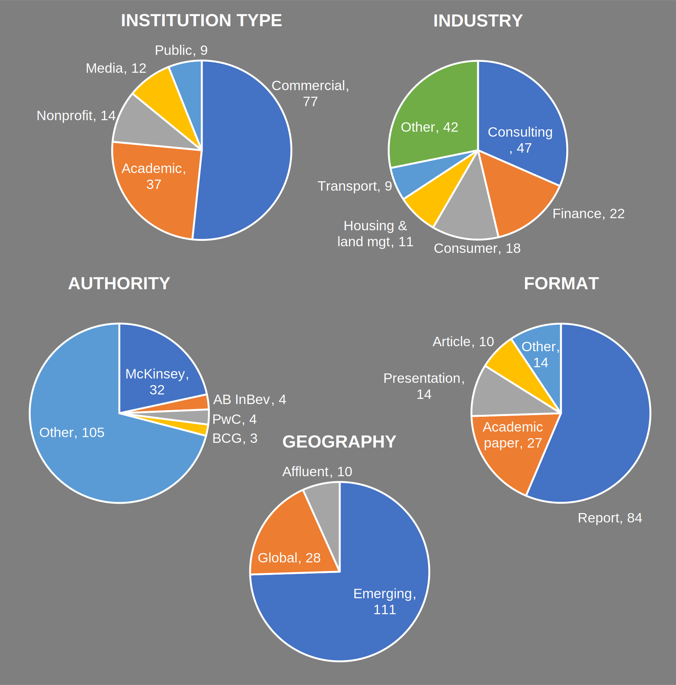

# Citations
See how external authorities (academic journals, newspapers, TV, governments, NGOs, companies) have cited me publicly over the years.

These are the first 150 of around 400 citations (to be built out during 2026).

---
Alphabetically listed by authority.  
#### [AB InBev (2014): *Creation of the Largest African Coca-Cola bottler*](https://www.ab-inbev.com/content/dam/universaltemplate/ab-inbev/investors/sabmiller/presentation/merger-to-create-coca-cola-beverages-africa/coca-cola-beverages-africa-investor-presentation-november-2014.pdf)
#### [AB InBev (2015): *Quarterly divisional seminar series—Africa*](assets/pdf/ab-inbev-sabmiller-africa-2015.pdf)
#### [AB InBev (2013): *Quarterly divisional seminar series—Asia-Pacific*](assets/pdf/ab-inbev-sabmiller-asia-pacific-2013.pdf)
#### [AB InBev (2014): *Quarterly divisional seminar series—South Africa*](https://www.ab-inbev.com/content/dam/universaltemplate/ab-inbev/investors/sabmiller/presentation/divisional-seminars/quarterly-divisional-seminar-south-africa-2014.pdf)
#### [Accenture (2013): *Consumer Goods in Africa and Nigeria*](http://www.slideshare.net/accenture/consumer-goods-in-africa-and-nigeria)
#### [Ahmadu Bello University (2014): *The imperative of sand dune stabilization in semi arid zone*](https://physicalsciences.abu.edu.ng/department/geography/public/journal/2014/files/12.pdf)
#### [AIG (2013): *AIG in Africa*](assets/pdf/aig_africa.pdf)  
#### [Airbnb (2017): *Women hosts and Airbnb: Building a global community*](https://www.airbnbcitizen.com/wp-content/uploads/2017/03/Women-Hosts-and-Airbnb_Building-a-Global-Community.pdf)
#### [Ambev (2022): *Investor Day*](https://api.mziq.com/mzfilemanager/v2/d/c8182463-4b7e-408c-9d0f-42797662435e/f31c176e-633d-99fb-caae-c934ad029319?origin=1)
#### [Amfiteatru Economic (2014): *Income Distribution Determinants and Inequality – International Comparison*](http://www.amfiteatrueconomic.ro/temp/Article_1328.pdf)
#### [Applied Business and Economics, Journal of (2024): *Scaling Up Performance: The Impact of Economies of Scale in the Sportswear Industry*](https://articlegateway.com/index.php/JABE/article/view/7148/6743)
#### [Asian Development Bank (2010): *The Rise of Asia's Middle Class*](assets/pdf/adb-key-indicators-special-chapter.pdf)
#### [Atkins (2012): *Future proofing cities*](assets/pdf/atkins-future-proofing-cities.pdf)
#### [AUHF-IUHF (2019): *Realising affordability in global housing markets*](https://fsdafrica.org/wp-content/uploads/2025/05/Joint_AUHF_IUHF_Conference_Brochure.pdf)
#### [Badan Koordinasi Penanaman Modal (BKPM) (2019): *Indonesia investment updates*](assets/pdf/bkpm-indonesia-investment-update.pdf)
#### [Ballentine Partners (2014): *Spring 2014 Think Forum - Africa: A Market Whose Time Has Come?*](assets/pdf/ballentine_think_forum.pdf)  
#### [Bangladesh Journal of Agricultural Economics (2020): *Food security and poverty status of cassava processors*](https://bjae.bau.edu.bd/index.php/home/article/view/44/18)
#### [BBC News (2012): *Nigeria—A Nation Divided*](http://www.bbc.com/news/world-africa-16510922)
#### [BCG (2015): *Africa Blazes a Trail in Mobile Money*](https://web-assets.bcg.com/img-src/Africa_Blazes_a_Trail_in_Mobile_Money_Feb_2015_tcm9-73648.pdf)
#### [BCG (2014): *Winning in Africa*](assets/pdf/bcg-winning-in-africa.pdf)
#### [BeautyWorld (2017): *Attractive Africa: Five growth drivers in Africa’s beauty and personal care*](https://www.beautyworldme.com/resources/files/reports/BWME2017_E_book_Attractive_Africa.pdf)
#### [Bioscience Research, Open Journal of (2020): *Prevalence of bacterial pathogens associated with wound infections from diabetic out-patients at Plateau Specialist Hospital, Jos, Nigeria*](https://www.openjournalsnigeria.org.ng/journals/index.php/ojbr/article/view/143)
#### [Bogotá, Secretaría General de la Alcaldía Mayor de (2025): *Entorno Economico*](https://secretariageneral.gov.co/sites/default/files/2025-09/4._entorno_economico.pdf)
#### [Bucharest University (2014): *Constructing official poverty lines for countries in transition*](https://www.econstor.eu/bitstream/10419/168830/1/aej-v16-i35-p0368.pdf)
#### [CARD International Journal of Medical Science and Applied Biosciences (2017): *Survey and control of tomato (Solanum lycopersicum L.) wilt caused by Fusarium oxysporum Schlecht*](https://casirmediapublishing.com/wp-content/uploads/2019/09/Pages-44-61.pdf)
#### [CDP (2013): *Wealtier, healthier cities*](assets/pdf/cdp_cities.pdf)    
#### [Center for Health and Humanitarian Systems (2019): *Optimizing the cost of vaccine deliveries*](https://hhl2019.chhs.gatech.edu/sites/default/files/cfp-file/20190705_HHL%20Presentation%202019_%20vF_0.pdf)
#### [Central European University (2023): Framing the Environment in a Changing Political Landscape](assets/pdf/ceu-framing-environment.pdf)
#### [Centre for Affordable Housing Finance in Africa (2021): *2021 Yearbook*](https://www.auhf.co.za/wp-content/uploads/2022/03/2021_CAHF-yearbook-final-compressed.pdf)
#### [Centre for Affordable Housing Finance Africa (2018): *East Africa 2018 infographic*](assets/pdf/hfa-east-africa-2018-infographic.pdf)
#### [Centre for Affordable Housing Finance in Africa (2016): *Mortgage and Housing Affordability Calculator in Africa*](https://housingfinanceafrica.org/documents/calculating-mortgage-and-housing-affordability-in-africa/)
#### [Chicago, University of (2025): *Path Dependence Through Structural Constraints*](assets/pdf/uchicago-path-dependence.pdf)
#### [China Integrated (2012): *Growing Opportunities in an Exploding Consumer Market*](https://www.ch-ina.com/wp-content/uploads/2012/09/24-9-2012.pdf)
#### [Confederation on Indian Industry / Tata (2018): *Joining hands to unlock Africa’s Potential*](https://afdb-org.jp/wp-content/uploads/2018/08/JABF2014_Ms.Janaki_Mr.Kuppuswamy.pdf)
#### [Constellation Brands (2025): FY25 Financial Results](https://www.sec.gov/Archives/edgar/data/16918/000001691825000017/stzex99-2_022825.pdf)
#### [CSIL Market Research (2020): *The European market for lighting fixtures*](https://www.lighting.csilmilano.com/fixtures/Lighting-market-Europe-30-countries-2020-0001280.html)
#### [Daily Trust (2016): *Nigeria: Enugu Free Trade Zone to Attract N240 Billion Investment*](https://allafrica.com/stories/201611210941.html)
#### [Dewan Energi Nasional, Sekretariat Jenderal (2019): *Penguatan Riset Institut Teknologi*](assets/pdf/dewan-energi-nasional-strengthening-research-at-the-kalimantan-institute-of-technology.pdf)
#### [Diageo (2013): *Entering the African Beer Market: Uncovering the Strategies to Enable Success*](assets/pdf/diageo_africa.pdf)  
#### [Ecobank (2014): *Presentation to 38th General Assembly of FANAF Ouagadougou*](assets/pdf/ecobank-38th-general-assembly-fanaf.pdf)
#### [Economics & Sociology (2017): *Constructing poverty lines in Croatia using Kakwani’s model*](https://typeset.io/pdf/constructing-poverty-lines-in-croatia-using-kakwani-s-model-7po3aycsfh.pdf)
#### [EIBD (2014): *EU-Indonesia Business Dialogue: Pharmaceutical-Cosmetic Sector Meeting*](assets/pdf/eibd_pharma_cosmetics.pdf) 
#### [Environment & Urbanization (2020): *Can people on low incomes access affordable housing loans in urban Africa and Asia?*](https://reall.net/wp-content/uploads/2020/10/Jones-Stead-EU-Low-Income-Housing-Finance.pdf)
#### [E-Trade (2015): *Opening the Wallets of 2.8 Billion People*](http://imgstock.naver.com/upload/research/invest/1421020253517.pdf)
#### [Financial Mail (2016): *Business in Africa: Understanding the market*](https://www.businesslive.co.za/fm/fm-fox/2016-06-30-business-in-africa-understanding-the-market/)
#### [FUDMA Journal of Sciences (2023): *Occurrence of parasites in live Clarias gariepinus*](https://www.researchgate.net/publication/370446298_OCCURRENCE_OF_PARASITES_IN_LIVE_Clarias_gariepinus_SOLD_AT_JIMETA_MODERN_MARKET_YOLA_ADAMAWA_STATE)
#### [Ghent University (2010): *Welke rol speelt olie in de mobilisatie van jongeren in de Niger delta?*](http://lib.ugent.be/fulltxt/RUG01/001/491/060/RUG01-001491060_2011_0001_AC.pdf)
#### [HARD International Institute of Academic Research and Development (2017): *Causal relationship between revenue allocation and economic growth*](https://www.iiardjournals.org/get/IJEBM/VOL.%203%20NO.%201%202017/Causal%20Relationship.pdf)  
#### [Health Sciences and Research, International Journal of (2020): *The prevalence of natural mixed infection of T. congolense and T. vivax in cattle*](https://www.ijhsr.org/IJHSR_Vol.10_Issue.11_Nov2020/8.pdf)
#### [Heineken (2025) 3rd Quarter Results—Dolf van den Brink, CEO](assets/pdf/heineken-cme-2025-evergreen-2030-dolf-van-den-brink.pdf)  
#### [Heineken (2025): 3rd Quarter Results—Bram Westenbrink, CCO](assets/pdf/heineken-cme-2025-growth-bram-westenbrink.pdf)  
#### [Heineken Beverages (2019): *Investment community trade visit*](assets/pdf/heineken-beverages-distell-investment-community-trade-visit.pdf)  
#### [Heineken Beverages (2016): *Results presentation 2016*](assets/pdf/heineken-beverages-distell-results-presentation-2016.pdf)
#### [IGI Global (publisher) (2020): *Multiple scenarios-based impact analysis of predicted land-use change on ecosystem services value*](https://www.igi-global.com/chapter/multiple-scenarios-based-impact-analysis-of-predicted-land-use-change-on-ecosystem-services-value/257935)
#### [Imperial (2014): *Interim results presentation*](assets/pdf/imperial_interim_results_2014.pdf)  
#### [IMS Health (2014): *Africa: A ripe opportunity - Understanding the pharmaceutical market opportunity and developing sustainable business models in Africa*](http://www.fullertreacymoney.com/system/data/files/PDFs/2014/April/29th/IMS_Africa_Opportunity_Whitepaper.pdf)
#### [India Perspectives Magazine (2014): *India Aspires to Build Future Africa*](assets/pdf/ipm_africa.pdf)
#### [Indonesian Embassy in Argentina (2019): *Indonesia - Un mercado de oportunidades*](https://equilibriumglobal.com/wp-content/uploads/2019/05/Presentacion-Indonesia.pdf)
#### [IndoPremier (2014): *Equity research: Unilever Indonesia*](assets/pdf/indopremier-unilever-initiating-coverage.pdf)
#### [INSEAD (2014): *New Market Exploration in Nigeria*](https://www.insead.edu/sites/default/files/assets/dept/centres/gpei/docs/insead-student-new-market-exploration-in-nigeria-oct-2014.pdf)
#### [International Economics, Journal of (2024): *All Aboard: The Effects of Port Development*](https://www.sciencedirect.com/science/article/pii/S0022199624000904)  
Invest Africa (2015): *The Machine Behind the Man: why Nigeria’s optimists should look beyond Buhari*
#### [IOSR Journal of Agriculture and Veterinary Science (2015): *Evaluation of Phytochemicals in Azanzagarckeana (Goron tula) Seed*](https://www.researchgate.net/publication/289673154_Evaluation_of_Phytochemicals_in_Azanza_garckeana_Goron_tula_Seed)
#### [IOSR Journal Of Humanities And Social Science (2019): *Media popular culture and the influence of western celebrities on Nigerian youth culture*](https://www.iosrjournals.org/iosr-jhss/papers/Vol.%2024%20Issue4/Series-10/D2404102027.pdf)
#### [ISEAS (2021): *Urban transition in Hanoi*](https://www.iseas.edu.sg/wp-content/uploads/2020/12/TRS2_21.pdf)
#### [Italia—Gianpaulo Bruno (2012): *Africa sub-sahariana—mercato emergente dalle grandi prospettive*](assets/pdf/italia_bruno_ssa.pdf)
#### [KTH Royal Institute of Tecnology (2017): *Ranking risks and opportunities of African cities*](http://www.diva-portal.se/smash/get/diva2:1118259/FULLTEXT01.pdf)
#### [Lagos State Government (2018): *Affordable housing deal book*](assets/pdf/lagos-state-global-housing-deal-book.pdf)
#### [Landscape and Urban Planning (2020): *Urban socioeconomic inequality and biodiversity often converge, but not always*](https://doi.org/10.1016/j.landurbplan.2020.103799)
#### [LEEM (2014): *Le marché pharmaceutique en Afrique subsaharienne*](assets/pdf/leem-marche-pharmaceutique-en-afrique-subsaharienne.pdf)
#### [Liberty Holdings (2013): *Liberty Holdings: Analyst day*](assets/pdf/liberty_analyst_day_2013.pdf)
#### [Management Today: *The Problem with Size*](https://www.managementtoday.co.uk/problem-size/article/757880)
#### [Massachusetts, University of (2019): *Urban biodiversity Experience and exposure*](https://scholarworks.umass.edu/cgi/viewcontent.cgi?article=1774&context=masters_theses_2)
#### [MasterCard (2013): *African cities growth index 2013*](https://www.researchgate.net/publication/260185819_MasterCard_African_Cities_Growth_Index_2013)
#### [MasterCard (2014): *Mapping the path to future prosperity—Emerging markets inclusive growth index*](assets/pdf/mastercard_prosperity.pdf)
#### [McKinsey (2014): *A blueprint for addressing the global affordable housing challenge*](https://www.mckinsey.com/~/media/mckinsey/featured%20insights/urbanization/tackling%20the%20worlds%20affordable%20housing%20challenge/mgi_affordable_housing_executive%20summary_october%202014.ashx)
#### [McKinsey (2014): *A tale of two Mexicos—Growth and prosperity in a two-speed economy*](https://www.mckinsey.com/featured-insights/americas/a-tale-of-two-mexicos)
#### [McKinsey (2012): *Africa at work—Job creation and inclusive growth*](https://www.mckinsey.com/~/media/McKinsey/Featured%20Insights/Middle%20East%20and%20Africa/Africa%20at%20work/b%20test/MGI_Africa_at_work_August_2012_Full_Report.pdf)
McKinsey (2014): *African aviation—The industry’s last frontier*
#### [McKinsey (2015): *Brighter Africa—The growth potential of the sub-Saharan electricity sector*](https://www.mckinsey.com/~/media/McKinsey/dotcom/client_service/EPNG/PDFs/Brighter_Africa-The_growth_potential_of_the_sub-Saharan_electricity_sector.ashx)
#### [McKinsey (2022): *China’s theme parks face a new era*](https://www.mckinsey.com/industries/travel-logistics-and-infrastructure/our-insights/chinas-theme-parks-face-a-new-era)
#### [McKinsey (2013): *Dominic Barton, global managing director— The new Asian middle class*](assets/pdf/mckinsey-dominic-barton-global-managing-director-new-asian-middle-class.pdf)
#### [McKinsey (2014): *Dominic Barton, global managing director—The next big thing: Africa*](http://africastudygroup.ca/wp-content/uploads/2014/02/the-next-big-thing-africa-vf.pdf)
#### [McKinsey (2014): *India’s economic geography in 2025: States, clusters and cities*](https://www.governancenow.com/files/Indias%20economic%20geography%20in%202025%20States%20clusters%20and%20cities.pdf)
#### [McKinsey (2012): *Industrie 2.0: 5 pistes pour permettre aux industriels français de tirer parti de la mondialisation*](assets/pdf/mckinsey-industrie-2.0.pdf)
#### [McKinsey (2011): *Lighting the way: Perspectives on the global lighting market*](assets/pdf/mckinsey-lighting-the-way-perspectives-on-the-global-lighting-market.pdf)
#### [McKinsey (2017): *Lions (still) on the move: Growth in Africa’s consumer sector*](assets/pdf/mckinsey-lions-still-on-the-move.pdf)
#### [McKinsey (2016): *Lions on the move II: Realizing the potential of Africa's consumers*](assets/pdf/mckinsey-lions-on-the-move-2.pdf)
#### [McKinsey (2010): *Lions on the move—The progress and potential of African economies*](assets/pdf/mckinsey-lions-on-the-move.pdf)
#### [McKinsey (2013): *Myanmar’s moment—Unique opportunities, major challenges*](assets/pdf/mckinsey-myanmar's-moment.pdf)
#### [McKinsey (2014): *Nigeria’s renewal—Delivering inclusive growth in Africa’s largest economy*](http://www.mckinsey.com/global-themes/middle-east-and-africa/nigerias-renewal-delivering-inclusive-growth)
#### [McKinsey (2014): *Offline and falling behind: Barriers to Internet adoption*](assets/pdf/mckinsey-offline_and_falling_behind.pdf)
#### [McKinsey (2013): *On-demand marketing: Engaging consumers with just the right touch*](assets/pdf/mckinsey-on-demand-marketing.pdf)
#### [McKinsey (2014): *Perspective on the Africa route-to-market challenge*](assets/pdf/mckinsey_africa_rtm.pdf)
#### [McKinsey (2018): *Roaring to life: Growth and innovation in African retail banking*](assets/pdf/mckinsey-roaring-to-life.pdf)
#### [McKinsey (2014): *Southeast Asia at the crossroads: Three paths to prosperity (2014)*](assets/pdf/mckinsey-southeast-asia-at-the-crossroads-three-paths-to-prosperity.pdf)
#### [McKinsey (2012): *The archipelago economy—Unleashing Indonesia’s potential*](assets/pdf/mckinsey-the-archipelago-economy-unleashing-indonesia%E2%80%99s-potential.pdf)
#### [McKinsey (2012): *The rise of the African consumer*](https://www.adlevocapital.com/images/rise_of_african_consumer.pdf)
#### [McKinsey (2011): *Understanding Africa’s growth acceleration and business opportunities*](https://fataj.hu/archiv/2011/07/054/Africa_Lions-on-the-Move.pdf)
#### [McKinsey (2013): *Understanding the diversity of Indonesia’s consumers*](https://www.mckinsey.com/featured-insights/asia-pacific/understanding-the-diversity-of-indonesias-consumers#/)
#### [McKinsey (2015): *Understanding Indonesia's consumers*](assets/pdf/mckinsey-understanding-the-indonesian-consumer.pdf)
#### [McKinsey (2013): *Upward mobility—The future of China’s premium car market*](assets/pdf/mckinsey-upward-mobility-the-future-of-china’s-premium-car-market.pdf)
#### [McKinsey (2012): *Urban World: Cities and the rise of the consuming class*](assets/pdf/mckinsey-urban-world-cities-and-the-rise-of-the-consuming-class.pdf)
#### [McKinsey (2011): *Urban World: Mapping the economic power of cities*](https://mondohonline.files.wordpress.com/2011/08/mgi_urban_world_full_report.pdf)
#### [McKinsey (2016): *Urban World: The global consumers to watch*](https://www.mckinsey.com/featured-insights/urbanization/urban-world-the-global-consumers-to-watch)
#### [McKinsey (2015): *Winning in Africa’s consumer market*](https://www.mckinsey.com/industries/consumer-packaged-goods/our-insights/winning-in-africas-consumer-market)
#### [Medical Research, Global Journal of (2019): *Aflatoxin risk in dairy production*](https://globaljournals.org/GJMR_Volume19/3-Aflatoxin-Risk-in-Dairy-Production.pdf)
#### [Mercy Corps (2015): *The economic costs of conflict and the benefits of peace*](https://www.mercycorps.org/sites/default/files/2019-11/Mercy%20Corps%20Nigeria%20Household%20Costs%20of%20Conflict%20Policy%20Brief%20July%202015.pdf)
#### [Michael Okpara University of Agriculture (2013):*The effect of micro enterprise financing on farmers welfare in Abia state, Nigeria*](https://www.ajol.info/index.php/naj/article/view/90559)
#### [MIRA / CI Banco (2016): *Oferta pública restringida de certificados bursátiles*](assets/pdf/mira-cibanco-prospecto_de_colocacion.pdf)
#### [Morgan Stanley (2017): *Inclusive growth opportunities index 2017*](https://www.morganstanley.com/content/dam/msdotcom/ideas/eiu-inclusive-growth-infographic/1799419_EIU_MS_InclusiveGrowth_20170518_Final.pdf)
#### [Munich Advisors Group (2014): *Doing Business in Zambia*](assets/pdf/munich-advisors-group-workshop-doing-business-in-zambia.pdf)
#### [National Geographic (2019): *Atlas of the World*](https://www.natgeomaps.com/bk-atlas-of-the-world-11th-edition)
#### [National Geographic (2013): *The war for Nigeria*](assets/pdf/natgeo_nigeria.pdf)
#### [NedBank (2011): *Contextualizing the mass market banking opportunity*](assets/pdf/nedbank-contextualising-the-mass-market-banking-opportunity.pdf)
#### [NewAfrican (2016): *The rising middle class – and yes it matters* ](https://newafricanmagazine.com/news-analysis/businesseceonomy/11558-2/)
#### [New York State Metropolitan Transit Authority (2020):*Letter to Sen. Charles Schumer*](http://web.mit.edu/jeffrey/harris/NY_Delegation_Letter_041620_final_(1).pdf)
#### [New York Times (2014): *Africans open fuller wallets to the future*](http://www.nytimes.com/2014/07/21/world/africa/economy-improves-as-middle-class-africans-open-wallets-to-the-future.html)
#### [New York Times (1999): *On the Contrary: Telling Them What They'll Pay to Hear*](https://www.nytimes.com/1999/07/04/business/on-the-contrary-telling-them-what-they-ll-pay-to-hear.html)
#### [Newsweek (2020): *Black China: Africa's First Superpower Is Coming Sooner Than You Think*](https://www.newsweek.com/2020/01/31/nigeria-next-superpower-1481949.html)
#### [Nielsen (2010): *The future of retailer brands*](assets/pdf/nielsen_retailer_brands.pdf)  
#### [Nigerian Agricultural Policy Research Journal  (2019): *Assessment of the perceptions of farmers on the performance of Fadama III activities in Niger delta area of Nigeria*](https://ageconsearch.umn.edu/record/314133/?ln=en)
#### [NordicLight / Swedish Chamber of Commerce Brazil (2020): The World Economy in 2020: A Nowcast](https://www.swedcham.com.br/publico/nordic-light/Nordic-Light-Jan2020-Jun2020.pdf)
#### [Nova, Universidade (2023): *Designing a collaborative AutoML tool to help organizations become data-driven*](https://run.unl.pt/bitstream/10362/148721/1/TGI1403.pdf)
#### [NSCB Biodiversity Conference, Proceedings of 6th (2018): *Survey of wood carving activities in selected local government areas*](https://nscbconf2018.files.wordpress.com/2018/05/48_71-nscb-2018b.pdf)
O País (2014): *The African middle class is expanding*
#### [Osaka University (2019): *Study of emission control for passenger car in Indonesia*](https://ir.library.osaka-u.ac.jp/repo/ouka/all/72412/30409_Dissertation.pdf)
#### [Partnership for New York City (2013): *NYC jobs blueprint*](assets/pdf/partnership-for-new-york-city-nyc-jobs-blueprint.pdf)
#### [Pharmaceutical Research, World Journal of (2018): *Antifungal activities of seed extracts of mahogany on Carica papaya*](https://wjpr.s3.ap-south-1.amazonaws.com/article_issue/1531805465.pdf)
#### [Pioneer Foods (2013): *Annual results presentation*](assets/pdf/pioneerfoods_annual_report_2013.pdf)  
#### [Portugal Telecom (2012): *Consolidated annual report*](https://cdn-sites-assets.mziq.com/wp-content/uploads/sites/39/2017/12/PT_RA2012_port.pdf)
#### [Putnam Investments (2022): *Inflation is fueling opportunities in emerging markets*](https://www.putnam.com/newsroom/post/marketOutlooks/1216-inflation-is-fueling-opportunities-in-emerging-markets-2/) (broken)
#### [PwC (2015): *Building better cities*](assets/pdf/pwc-building-better-cities.pdf)
#### [PwC (2014): *Global megatrends: Mexico focus*](https://dokumen.tips/documents/global-megatrends-canback-global-megatrends-mexico-highlights-demographic.html?page=1) (broken)
#### [PwC (2015): *Into Africa: The continent’s cities of opportunity*](https://www.pwc.com/gx/en/issues/strategy/emerging-markets/africa/assets/into-africa-report.pdf) (broken)
#### [PwC (2011): *Leveraging China and India for global competitiveness*](https://www.oreilly.com/library/view/the-quest-for/9780470194409/17_chapter09.html) (broken)
#### [Qualcomm (2014): *2014 New York analyst day*](https://docplayer.net/amp/46902861-2014-new-york-analyst-day.html) (broken)
#### [Reall (2021): *Market shaping indicators*](assets/pdf/reall-market-shaping-indicators.pdf)
#### [Reddal (2024): *Reddal Micro-MBA Seminar*](assets/pdf/reddal-micro-mba-seminar.pdf)
#### [Research and Innovation in Social Science, International Journal of (2024): *Unveiling the Impact of Firm Characteristics on Integrated Reporting Practices*](https://rsisinternational.org/journals/ijriss/Digital-Library/volume-8-issue-9/3266-3276.pdf)
#### [Research in National Development, Journal of (2011): *Prevalence of adolescent pregnancy in Ganye local government area. Adamawa state, Nigeria*](https://www.ajol.info/index.php/jorind/article/view/91712)
#### [Royal Caribbean (2017): *Global cruise market development trend and Asia cruise market*](assets/pdf/royal-caribbean-global-cruise-market-development-trend-and-asia-cruise-market.pdf)
#### [RUAF (2024): *Dhaka City Food System Profile*](https://cgspace.cgiar.org/server/api/core/bitstreams/521230b8-a57c-481d-b5cb-f43c174169f3/content)  
#### [Russian Science Foundation (2017): *Ethnic regional autonomies database (ERAD) Codebook*](http://identityworld.ru/maps_aera/database/ERAD_2.1_Codebook_2017_English.pdf)
#### [Scientific & Technology Research, International Journal of (2013): *The Quality of Mass Transit Service in Abuja, Nigeria: An Analysis Of Customers Opinions*](https://www.researchgate.net/publication/318859389_The_Quality_Of_Mass_Transit_Service_In_Abuja_Nigeria_An_Analysis_Of_Customers_Opinions)
#### [Skift Research (2025): *State of Travel 2025*](https://www.rto9.ca/wp-content/uploads/2025/08/State-of-Travel-2025.pdf)  
#### [Slate Afrique (2015): *Pourquoi les Africains sont soit très riches, soit très pauvres*](http://www.slateafrique.com/625551/afrique-revenu-par-habitant)
#### [Social Science and Medicine (2022): *Quantifying public preferences for healthcare priorities in Taiwan through an integrated citizens jury and discrete choice experiment*](https://www.sciencedirect.com/science/article/pii/S0277953622007109)
#### [Springer (publisher) (2014): *China 2.0: The rising middle class*](https://link.springer.com/chapter/10.1007/978-3-319-07677-5_7)
#### [States of Jersey (2007): *Economic affairs scrutiny panel Jersey Telecom - Privatisation*](https://statesassembly.je/getmedia/38352765-d92a-4bc1-806e-f11ef95e38a2/Report%20-%20Economic%20Affairs%20Panel-Jersey%20Telecom%20Privatisation%20-%2006%20March%202007.aspx?ext=.pdf)
#### [Supply Chain Quarterly (2015): *Winning supply chain strategies for African markets*](assets/pdf/supply-chain-quarterly-winning-supply-chain-strategies-for-african-markets.pdf)
#### [Swiss Political Science Association (2016): *Survival of the fittest: Explaining the success of ethnic autonomy arrangements*](https://onlinelibrary.wiley.com/doi/full/10.1111/spsr.12229)
#### [Switzerland Global Enterprise (2015): *Rising middle class: Global outlook and growth potential*](https://issuu.com/s-ge/docs/151118093151-17f61e7caa9244bebd6f7c9b93dced45) (broken)
#### [TAP-TUMI (2025): *Investor Brief*](https://transformative-mobility.org/wp-content/uploads/2025/06/TAP-TUMI-Investor-Brief_VF.pdf)
#### [T.RowePrice (2012): *Africa & Middle East – The final investment frontier*](assets/pdf/t.roweprice-africa-&-middle-east-the-final-investment-frontier.pdf)
#### [United Nations (2013): *Abuja +12: Shaping the future of health in Africa*](assets/pdf/united-nations-abuja+12-shaping-the-future-of-health-in-africa.pdf)
#### [United Nations (2020): *The South Africa investor map 2020*](https://www.undp.org/sites/g/files/zskgke326/files/migration/za/SDGP-Report-WIP-28_FINAL-FINAL.pdf)
#### [Varazdin Development and Entrepreneurship Agency (2018): *Economic and social development: Book of proceedings*](https://www.esd-conference.com/upload/book_of_proceedings/Book_of_Proceedings_esdMoscow2018_Online.pdf)
#### [Veterinary Science, Journal of (2012): *Fasciolosis in slaughtered cattle from abattoirs in Ondo state, Nigeria*](https://www.researchgate.net/profile/Abdul-Matin-Qasim/publication/242346876_Fasciolosis_in_slaughtered_cattle_from_abattoirs_in_Ondo_State_Nigeria/links/00b7d51cd995669af7000000/Fasciolosis-in-slaughtered-cattle-from-abattoirs-in-Ondo-State-Nigeria.pdf)
#### [Veterinary World (2011): *Bacterial and parasitic zoonoses encountered at slaughter in Maiduguri abattoir, northeastern Nigeria*](https://www.veterinaryworld.org/Vol.4/October%20-%202011/Bacterial%20and%20parasitic%20zoonoses%20encountered%20at%20slaughter%20in%20Maiduguri%20abattoir,%20Northeastern%20Nigeria.pdf)
#### [World Bank / NPHCDA (2024): *Environmental and Social Management Plan for the 14 Participating States of IMPACT Project*](https://ead.gov.ng/wp-content/uploads/2024/06/ESMP-for-rehabilitation-of-PHCs_12_03_2024-.pdf)
#### [World Bank (2010): *Doing business in Nigeria 2010*](assets/pdf/world-bank-doing-business-in-nigeria-2010.pdf)
#### [World Bank (2019): *Guinea urban sector review - Planning, connecting, financing in Conakry*](assets/pdf/world-bank-guinea-urban-sector-review-planning-connecting-financing-in-conakry.pdf)
#### [World Bank (2013): *The shifting urban economic landscape: What does it mean for cities?*](https://documents1.worldbank.org/curated/en/850421468178735793/pdf/842550WP0Dobbs0Box0382136B00PUBLIC0.pdf)
XCom Africa (2013): *Food processing and packaging in Kenya - East Africa*
