# Toward an Integrated Strategy Development Framework
## A New Synthesis Based on the Giants of the Past
*Dr Staffan Canback & Philip Burginyoung, Tellusant*

There are numerous definitions of strategy for corporate planning purposes. Most are poorly thought through and of little value. The goal of this paper is to to take the most important contributions to strategy science since the late 1950s and integrate them into coherent perspective.  

This paper discussess:   
- Strategy history and definitions by keading authorities
-	A new strategy development framework integrating those authorities and adding a dynamic component for emerging trends
-	A new strategy development process incorporating key learnings from industrial psychology and strategic planning  

The “strategy cube” below will gradually be filled in as the strategy concepts are explored.

**Graph 1**  

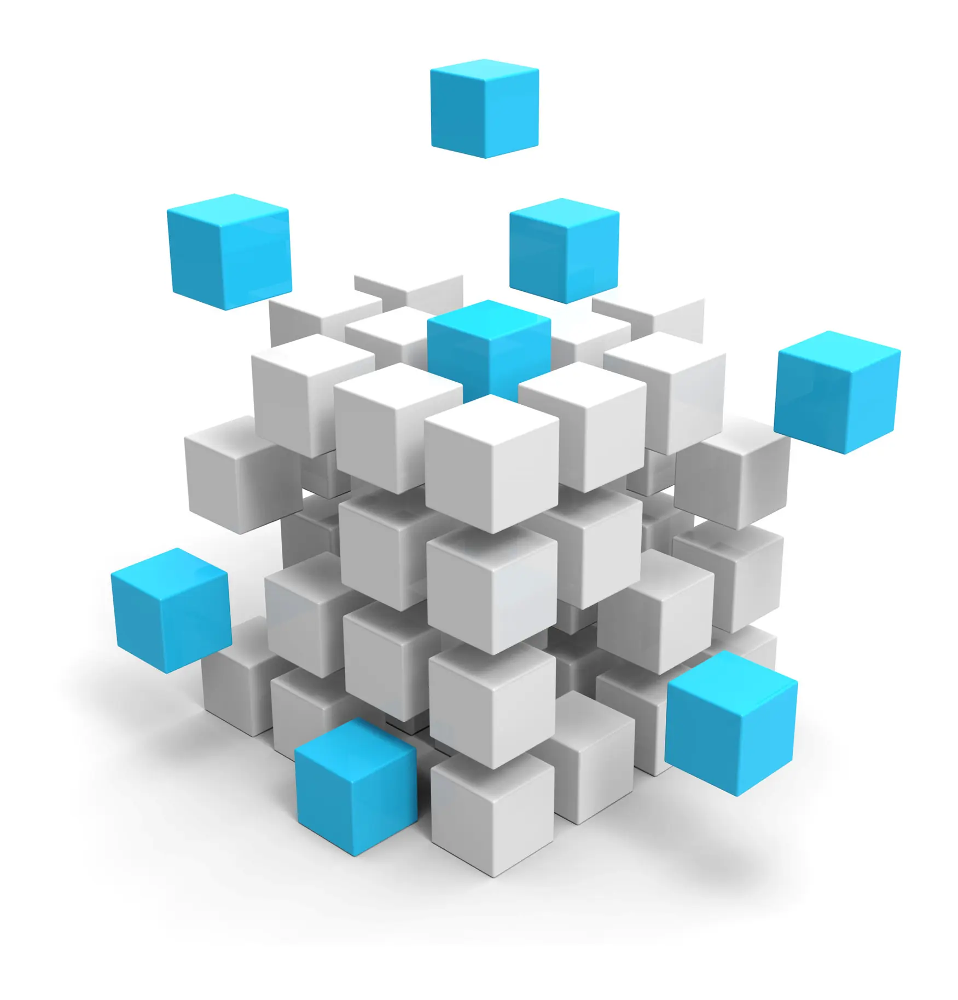

## 1. STRATEGY DEFINITIONS
The starting point is a review of what strategy is and how it has evolved since the late 1950s. Any new framework must take at least some of the various historical strategy concepts into account to be credible.  

### 1.1 Strategy Versus Operations and Tactics

What is strategy? Having a correct definition is crucial to any strategist. The U.S. Marine Corps' definition in manual #1, 'Warfighting' is instructive.¹ It builds on thousands of years of strategy tradition  starting with Sun Tzu.

The Marine Corps definition is here adapted to a firm setting. Corporate activities thus take place at three interrelated levels:  

**Graph 2**  

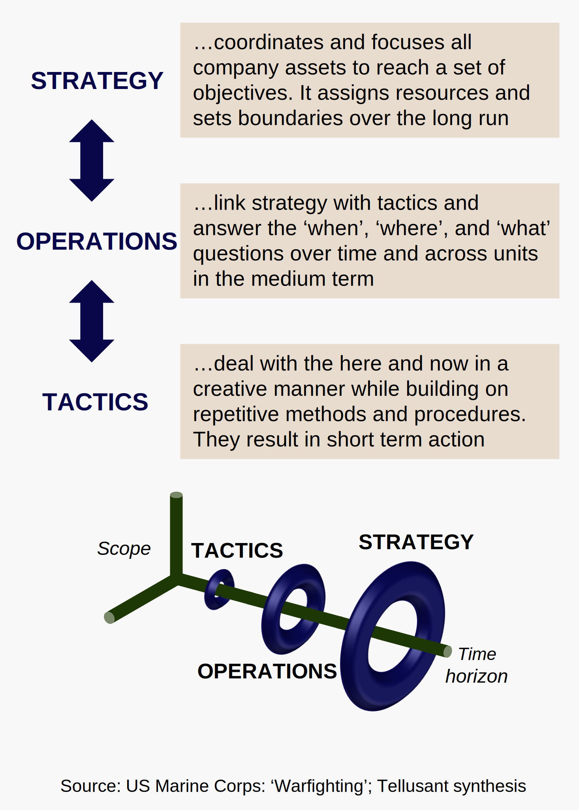

 

-	Strategy has the longest time horizon and the broadest scope. It covers all functions and geographies for the business unit or company at hand.  
-	Operations bridge the strategy into tactics. Operations are conducted in campaigns (for example, brand renovation or entering a new market).  
-	Tactics are the practical implementation of the operational campaigns.  

Sometimes strategy and operations are part of the same plan. This is called a strategic plan, 3-year plan, or similar. It has both strategic and operational elements.  

### 1.2 Differences Between Planning Processes
Many executives are unclear about the differences between strategy development, strategic planning, and financial budgeting. The graph below shows these differences.  

**Graph 3**  

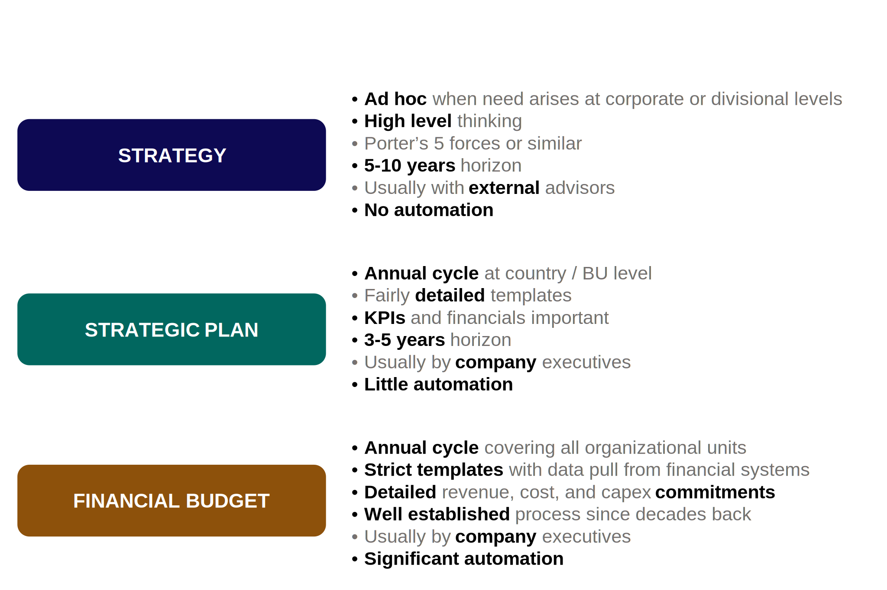

  

A few observations:  

-	Strategy development and strategic planning are often seen as the same thing. They are not. Strategy development is a truly intellectual exercise performed on an ad hoc basis. It seeks high level answers for where the company should be heading.  
-	Strategic planning is somewhere between strategy development and budgeting. It is programmatic (annual, templates) and defines what line managers should achieve over the next few years.  
-	Strategic plans are not extended financial budgets. They focus on the operating realities that in turn feed into budgets.  

### 1.3 Strategy Evolution
How has the definition of strategy evolved over the years?  

There are four strands of thinking, depicted in the graph below, that today form the core of strategy thinking.  

**Graph 4**  

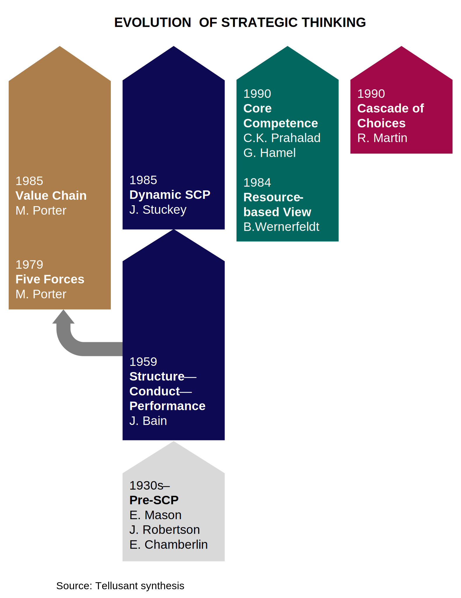

  

Any credible strategy framework must incorporate most elements from the four frameworks. The next chapter reconciles them, starting with an overview of each.  

### 1.4 Overview of Classical Strategy Frameworks
Strategy frameworks were first introduced in the late 1950s and have been enhanced and expanded on till this day. The new framework incorporates the most important contributions into a coherent whole.

#### 1.4.1 Structure—Conduct—Performance (SCP)
Strategy as a distinct discipline arguably started with Prof. Joseph Bain book *Industrial Organization*.²  In it he described the SCP paradigm (that originated in the 1930s). Even today, it is the dominant strategic framework in academia, and thousands of firms have applied it over the years.  

The graph below shows the elements of SCP.  

**Graph 5**  

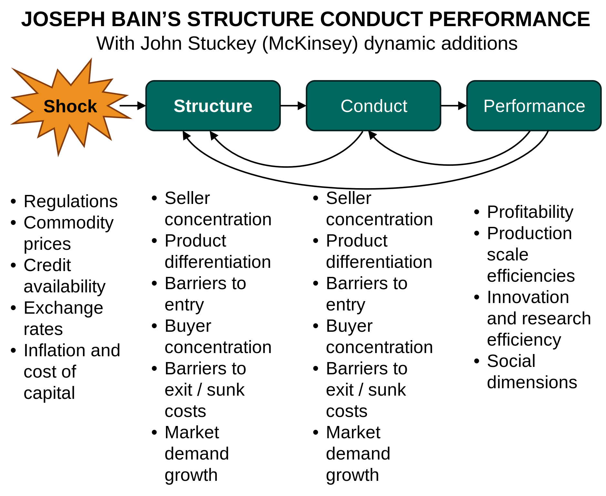

  

McKinsey & Co extended the SCP framework in the 1980s with a dynamic component.³ Industries tend to experience shocks such as a recession, inflation, technology shifts, and more. Such shocks lead to changes in market structures, impacting player conduct in those markets, and resulting in altered performance levels.  

Strategies are revised to adjust to these new conditions, leading to continuous renewal for those that are quick to recognize changes.

#### 1.4.2 Five Forces and Value Chain
Porter's five forces framework⁴ is a direct descendent of SCP. Its main value added is that it explains the concepts of SCP in a more accessible way. Like SCP, it is mainly concerned with the external world although the application of the framework also touches on what companies could do strategically. An example is the pursuit of scale versus the pursuit of differentiation, and how hard it is to do both.  

**Graph 6**  

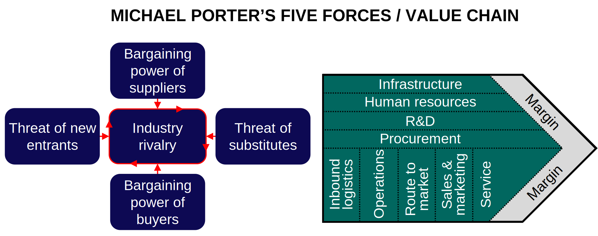

Porter's value chain concept⁵ takes more of an internal view of strategy. Where in the elements of the value chain and their combination lie a company's competitive advantage? This perspective transcends SCP.  

The five forces together with the value chain create a somewhat complete strategic framework. But not fully. This is where the resource-based view adds to strategic thinking.  

#### 1.4.3 Resource-based View (RBV)  
Prof. Wernerfelt took a radically different view of what makes companies distinct. His RBV framework⁶ focuses on the resources a company can marshal rather than what the external environment looks like.  

**Graph 7**  

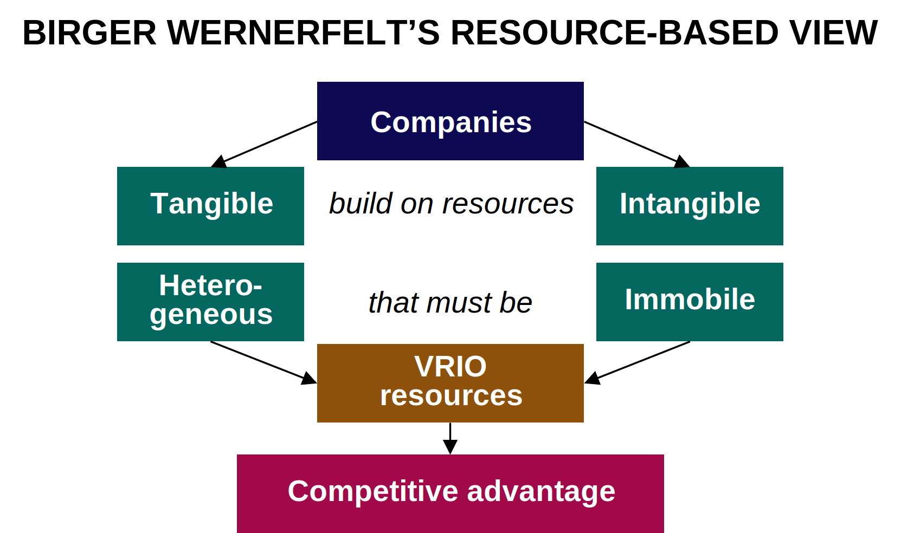

The underlying thesis is that companies succeed when they focus on what they do best, rather than trying to adapt to the environment in a reactive fashion.

Key to the framework are resources that are valuable, rare, inimitable, and organized (VRIO).  Such resources can be tangible like a warehouse in an optimal location where no competitor can find space, or intangible such as industry leadership through intellectual prowess.

It is important that the resources are heterogeneous (such that the mix of resources cannot be replicated), and they are not easily moved to other companies (e.g., patents).

Prof. Prahalad and Hamel further enhanced RBV and made it more accessible to a broader audience with the Core Competence framework. 

#### 1.4.4 Cascade of Choices
Martin developed the Cascade of Choices framework  while at the strategy consulting firm Monitor Company and refined it when Dean of the Rothman School of Management.

Most executives are familiar with the where to play and how to win paradigm but may not know the origin of it.

**Graph 8**  

Cascade of Choices is as much about process as it is about substance. It is a process through which executives in several steps move from aspiration to what is required to succeed.

## 2. TOWARD A NEW STRATEGY DEVELOPMENT SYNTHESIS
In contrast to the classical static frameworks, the new framework presented here is dynamic. Important trends are switched in and out over time. This is then overlaid on the synthesis of the classical frameworks. In a way, the framework makes itself obsolete occasionally and is then refreshed.  

This is arguably a revolutionary idea: a dynamic, ever-changing framework of its time. Apart from being practical, it is also interesting since humans like novelty. This approach will always feel fresh. Thus, the framework is divided into two components:  
1. A static component called EMIO that is anchored in the micro-economic frameworks discussed below.  
2. A dynamic, trends-based, component that captures the issues of the day.

This is discussed in the rest of the chapter.  

## 2.1 EMIO Framework
Based on the classical frameworks a new synthesis is created: the *Environment—Market—Initiatives—Outcomes* (EMIO) framework shown in the graph below.

**Graph 9**  

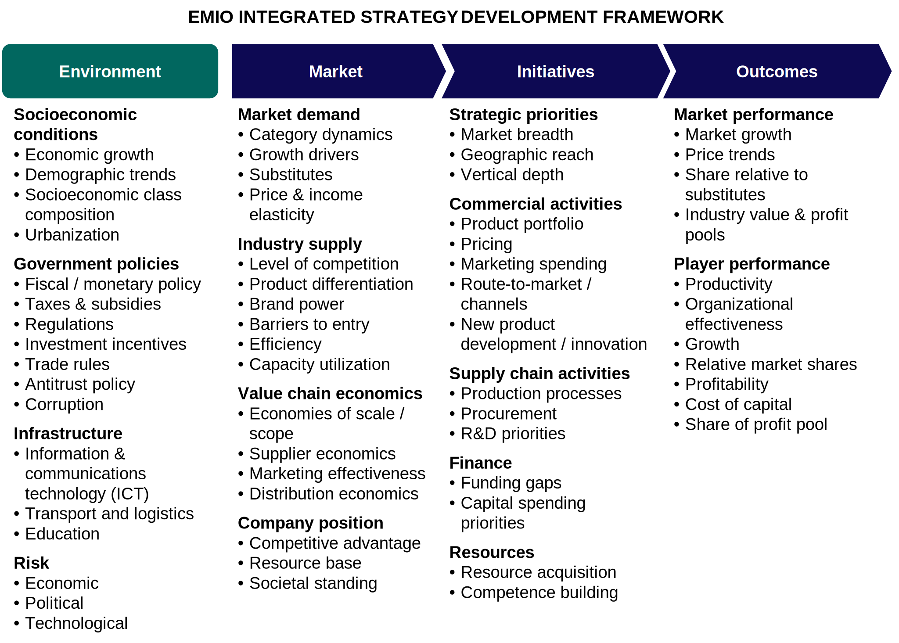

Behind each topic is a method for quantitatively or qualitatively analyzing it. It:  
-	Explicitly covers the external environment and the resource side.  
-	Spells out the required initiatives so that implementation plans (operations and tactics) can be built.  
-	Highlights the outcomes in a multi-faceted way including and beyond financial results.

The graph below shows how the elements of the four classical frameworks are incorporated in EMIO. As intended, the classical frameworks are exhaustively covered in EMIO.  

**Graph 10**  

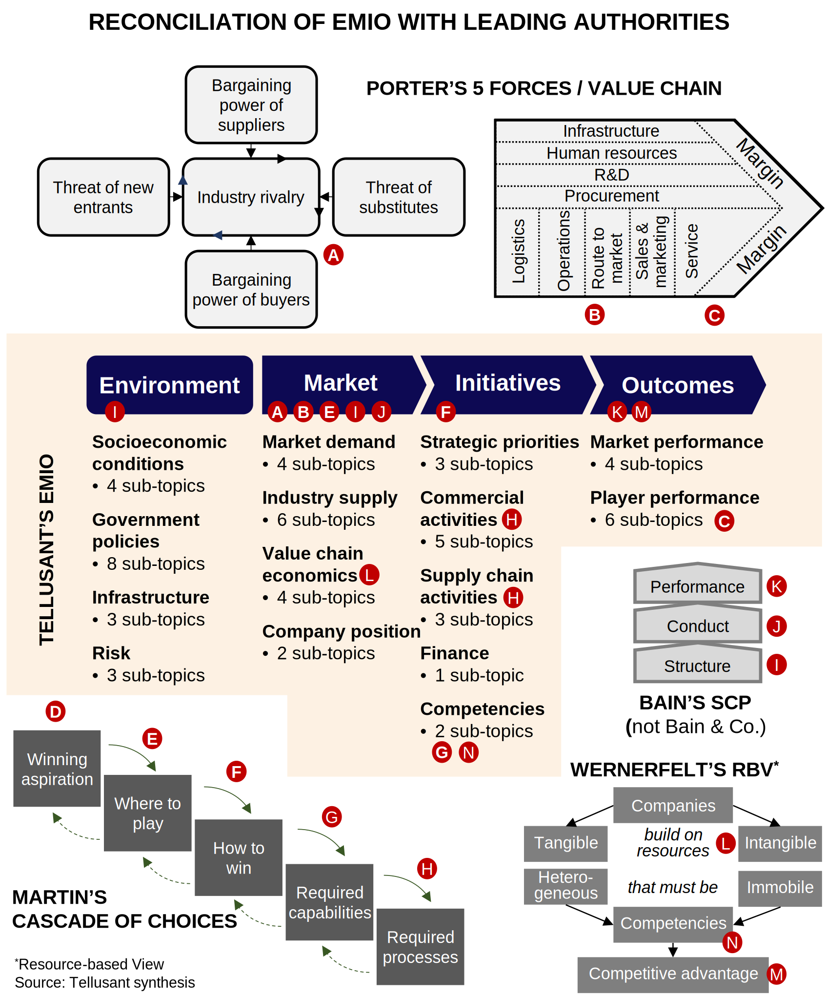

With this, the first part of the cube is populated covering the grey parts in the graph.

**Graph 11**  

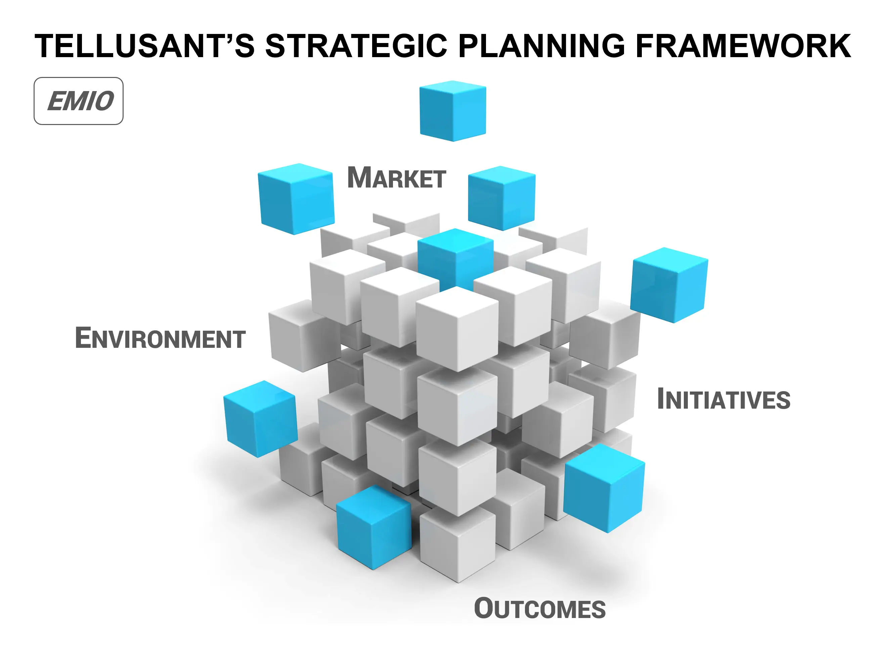

  
## 2.2 Emerging Trends
Turning to emerging trends—the themes of the day, so to speak. These are of importance because companies do not operate in a micro-economic vacuum. There are always major shifts in what topics should be considered. Some of them are short-term and do not belong in a strategy. Others are medium- or long-term and must be considered in a strategic plan.  

This explicit focus on trends is new to strategy frameworks.  

Based on discussions with executives and experts, these are current trends that impact strategic planning. The list will differ by industry and geography, but this list of seven trends serves as a starting point.  

-	*Artificial intelligence*: This theme is likely to be central over the next several decades. Every aspect of a business will be affected by AI (and its sub-field ML).  
  
-	*Climate & Sustainability*: This encompasses environmental (e.g., climate change, green issues), social (diversity, work practices), and economic (e.g., business vitality, equality) sustainability. This is theme for many years to come and climate change is likely the defining theme of the 21st century.

-	*Digital*: In this context, digital are all the new methods for communicating with customers, suppliers, and society at large. It includes e-commerce. This trend may be peaking now with perhaps 10 years remaining of innovative developments.

-	*Aging societies*: According to the UN and others, this will be an important trend for the rest of the century. Product and service offerings are likely to be fundamentally reshaped.

-	*Pandemic*: Covid later pandemics are fundamentally changing societal patterns. Industries are reshaped (e.g., travel, hospitality, education). Distribution changes. Products and services evolve.

-	*Analytics*: The evolving field of analytics will touch on most aspects of a business. Analytics are still at their infancy and can be expected to continue to evolve and grow for decades.

-	*Tariffs*: The recent trade wars initiated by the United States through tariffs, has had a profound impact on firms. One survey showed that 2/3 of tariffs are passed on to customers through price increases.  

The second part of the cube is now populated, as seen below. The question mark in the graph can be any relevant temporary theme.  

**Graph 12**  

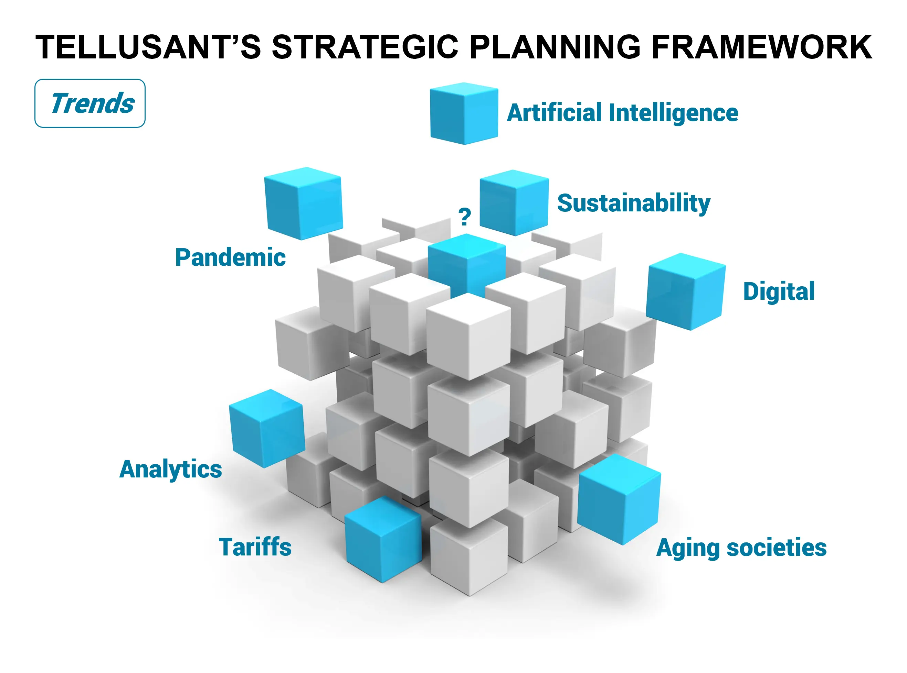

At the start of a strategy development effort, relevant trends like the seven described above should be identified by the executive team.  

## 2.3 Complete Framework
At this point the strategy cube is fully populated covering both the static micro-economic component and the dynamic trends components.

**Graph 13**  

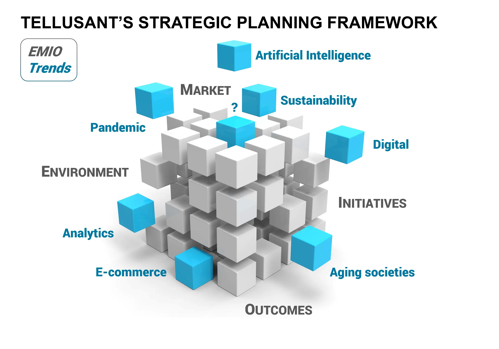

The cube is a visual reminder of what a strategic plan should contain. It is easy to remember and to refer to. As such, it simplifies one aspect of a complex topic. 

•  •  • 

  
The next chapter turns to the practicalities of building a robust process for strategic planning. It starts with observations on why strategic planning is difficult.  

## 3. STRATEGIC PLANNING PROCESS
Here, the strategic planning process is codified. It is derived by reviewing the obstacles to efficient planning and ends with the workflow.

### 3.1 Strategic Planning Performance
Late in 2020, interviews were conducted with senior executives and a survey was carried out to see what the views on strategic planning are. The graph below shows that executives find the strategic plans highly valuable. However, they hold a negative view on how the process to create such plans work.  

**Graph 14**  
tellusant-strategic-planning-survey-results.svg  

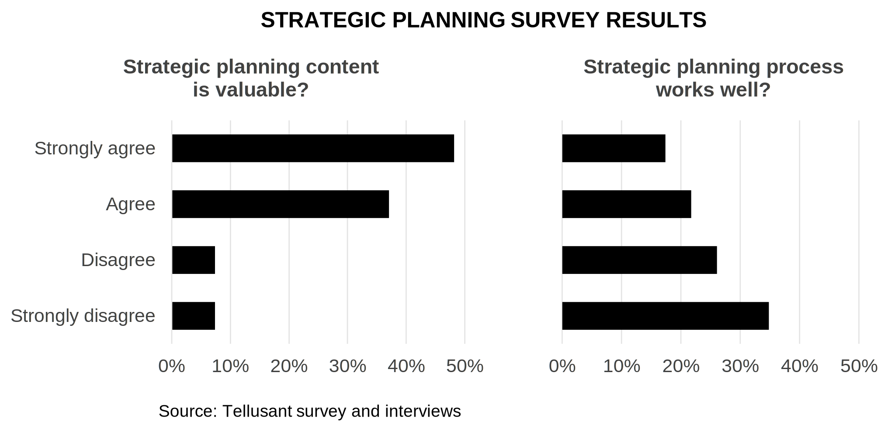

Executives uniformly found the process inefficient, costly (especially consider-ing opportunity costs) and old-fashioned. Verbatim quotes from those interviews make the point.  

-	“Most of executives’ time is spent on checking the analysts’ numbers rather than thinking about the issues.”
-	“I can't trust any data we have; it's ever changing. I can't trust anyone to do a correct analysis. Our planning is a joke! “
-	“Every year new analysts join the planning process. They usually have no clue how to analyze our markets.”
-	“The current process takes 5 months. It is too slow and labor intense.”
-	“Current tools are Excel, PowerPoint, and email.”
-	“Having a platform with standardized and harmonized data would be great. Today each unit does it in a way that makes it look good. There is not one version of the truth.”  

It is evident that the process can and should be improved.

### 3.2 Higher-Order Cognitive Processes  
A key reason why the process is inefficient or even dysfunctional is that strategic planning is difficult. It belongs to a small group of efforts that can truly be described as higher-order cognitive processes.¹⁰   

The graph below shows how various processes rank in a cognitive stack. It also shows when automation efforts approximately started at the different levels.  

**Graph 15**  

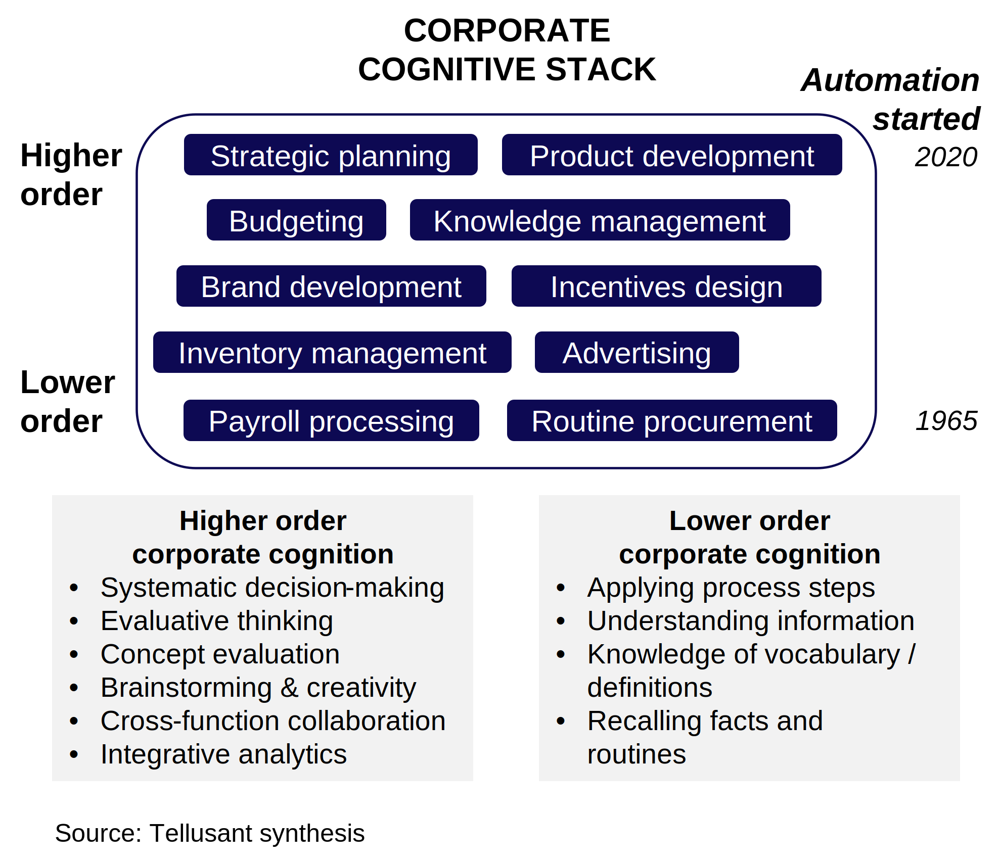

By 2020, the highest-order cognitive processes see little automation and streamlining. This is in part why executives have a negative of how strategic plans are created. The plans are of solid quality and are important, but the effort to create them is massive given the lack of standards and automation.  

### 3.3 Decision-Making Framework
Another important consideration is how decisions are made within organizations. It is not only a matter of going through a linear process. The graph below shows the elements that need to be aligned for the process to work.¹¹

**Graph 16**  

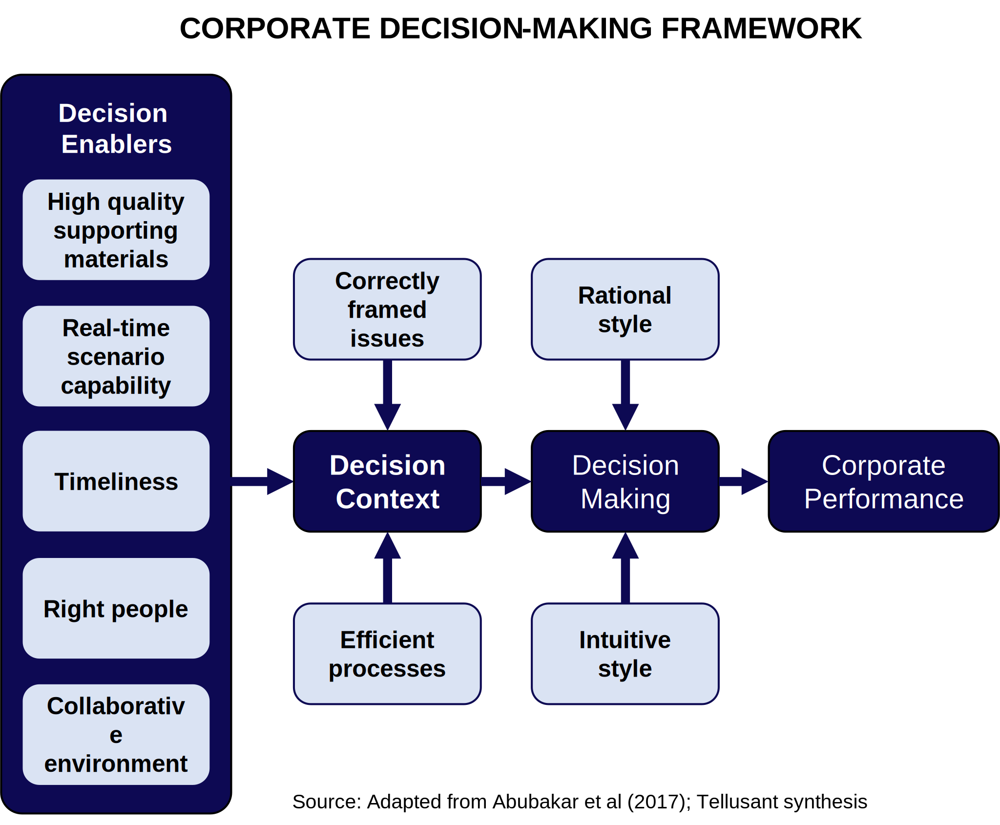

Note that the rational style can take a company only so far. Rationality can be replicated, or in the terms of the RBV framework (discussed in the previous chapter), it is neither heterogeneous nor immobile. The intuitive style is what truly is unique to a company.  

A well-functioning strategic planning process frees up to capacity to be intuitive and creative. By having a streamlined process of a) decision enablers, and b) decision context, decision making is allowed to find the right balance between rational and intuitive styles.

### 3.4 Strategic Planning Workflow
With this considered, a strategic planning workflow is suggested to facilitate the process. It runs over 2-3 months instead of the usual 3-5 months (depending on the size and complexity of the company or business unit). It is predicated on using cloud-based tools rather than the old-fashioned Excel-PowerPoint-Email method.  

**Graph 17**  

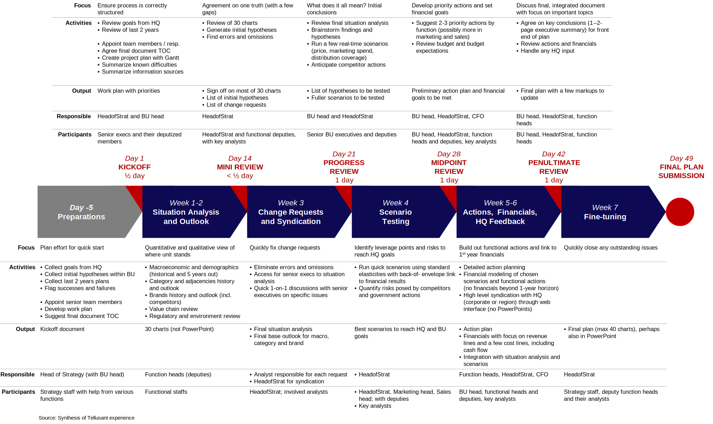

Above is an example of the process (here a two-month effort). The process captures all aspects of the strategy cube with the possibility to delete or add to it. It also captures the elements of the decision-making framework above by considering the decision enablers, the decision context, and the decision-making styles.

This introductory paper cannot cover all aspects of the workflow. It is provided as guidance for the people involved in the strategic planning effort to show that it possible to make strategic more rationale and efficient.

## *CONCLUSION*
This paper is aimed at introducing executives to an integrated approach to strategy development and to demonstrate how the thinking of strategy giants can be used. It is based on a thorough review of the subject matter and on a deep knowledge of the academic underpinnings, as well the practical experiences of the author.  

---
## REFERENCES

1. U.S. Marine Corps (1997): *Marine Corps Doctrinal Publication 1: Warfighting*. Department of the Navy  
2. J. Bain ([1959] 1968): *Industrial Organization, 2 ed*. John Wiley & Sons  
3. J. Stuckey (2008): *Enduring Ideas: The SCP Framework*. McKinsey & Company
4. M. Porter (1980): *Competitive Strategy*. Free Press  
5. M. Porter (1985): *Competitive Advantage*. Free Press  
6. B. Wernerfelt (1984): *A Resource-based View of the Firm*. Strateg. Manag. J.   
7. J. B. Barney (1991): *Firm Resources and Sustained Competitive Advantage*. Strateg. Manag. J.  
8. C.K. Prahalad and Hamel, G. (1990): *The Core Competence of the Corporation*. Harv. Bus. Rev.
9. R. Martin (2017): *Strategic Choices Need to Be Made Simultaneously, Not Sequentially*. Harv. Bus. Rev.
10. C. Argyris and D. Schön (1978): *Organizational Learning: A Theory of Action Perspective*. Addison-Wesley
11. A.M. Abubakar et al. (2018):  *Knowledge Management, Decision-making Style and Organizational Performance*. J. Innov. Knowl.

---
The paper is also available in an older PDF version: [Strategic Planning - The Tellusant Synthesis](Canback-Burginyoung-Strategic-Planning-Tellusant-Synthesis.pdf) 

