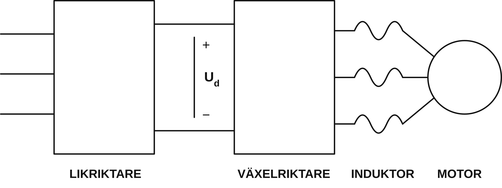
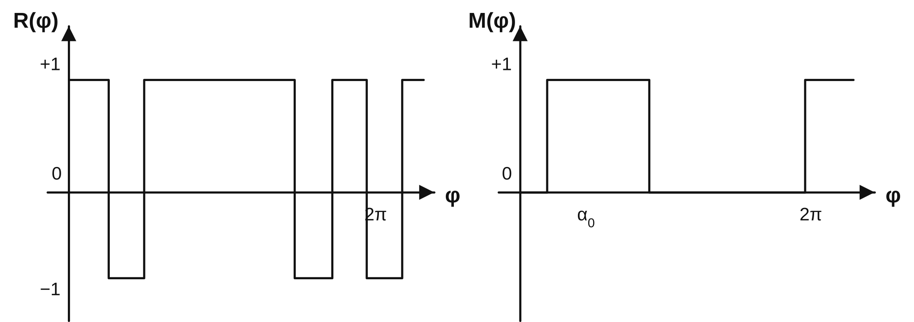
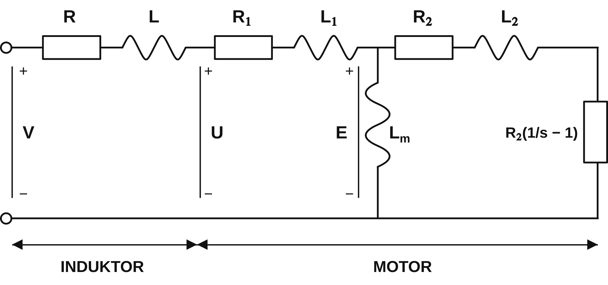
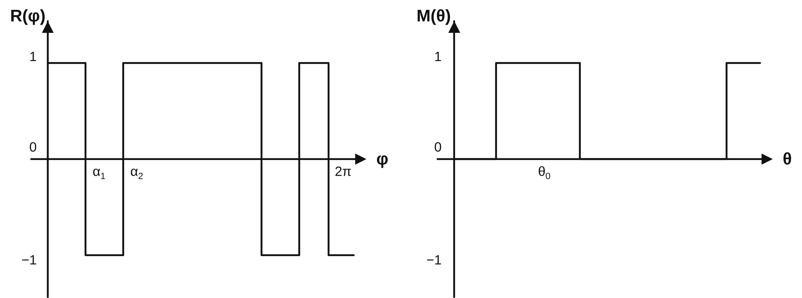
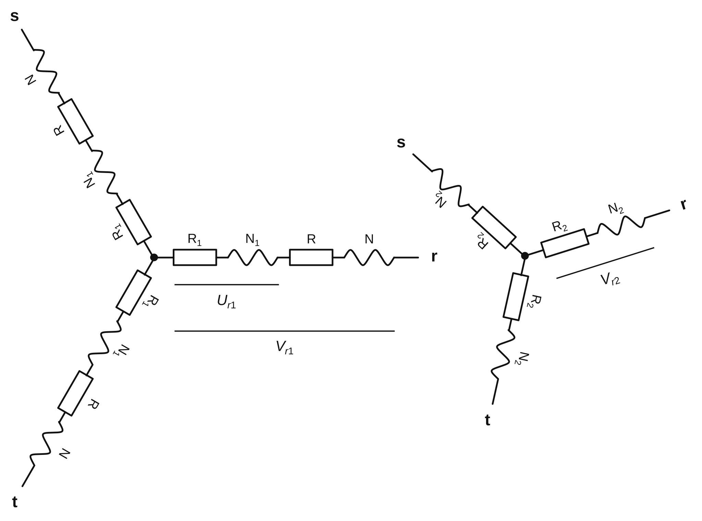
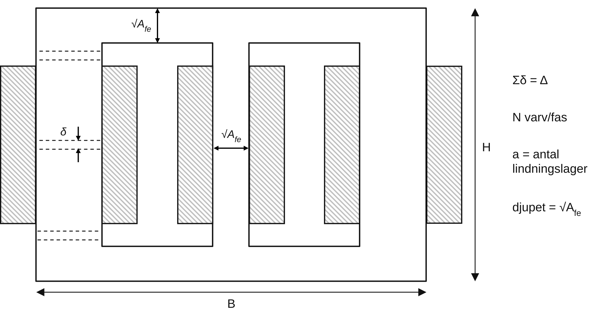
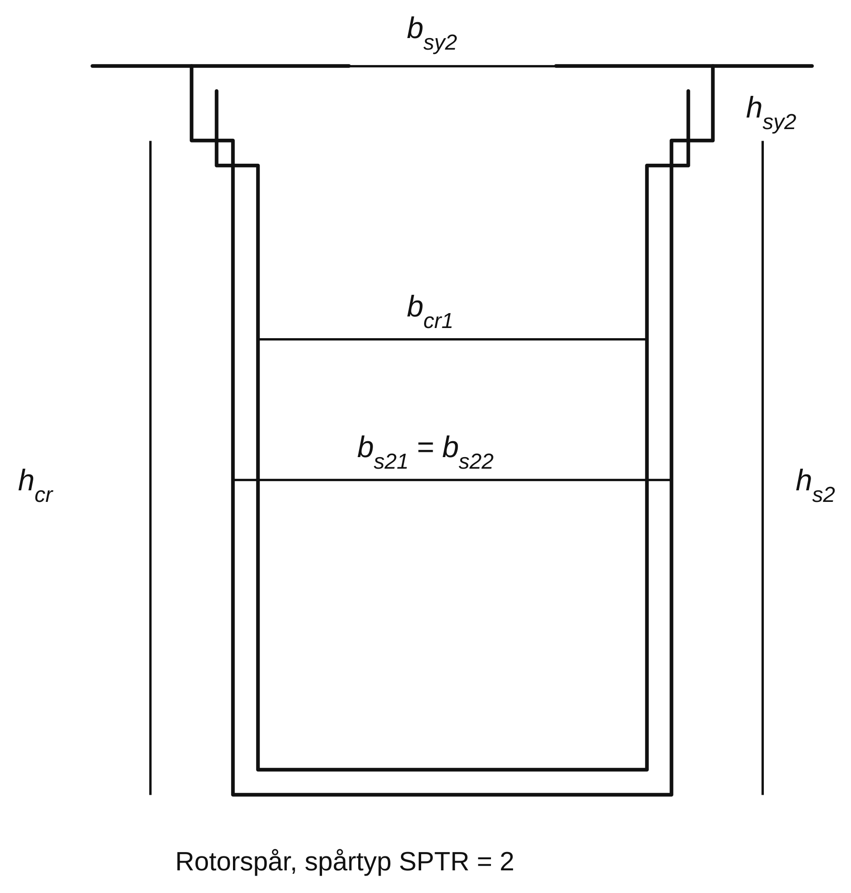

`Ännu inte fullt verifierad mot originalet. Viktiga diagram kommer läggas till.`

---
<!-- Sida 1 -->

# EXAMENSARBETE I ELEKTRISK EFFEKTOMVANDLING  

## Studie av övertonsförluster hos en asynkronmaskin seriekopplad med en induktor.  🇸🇪  

**Utfört av:** Staffan Canbäck

**Handledare:** Tom Porteous

**Inlämnat:** 1979-11-27

**Status:** Godkänt

---
## Sammanfattning

Examensarbetet har utförts vid Högeffektlaboratoriet vid Centrala utvecklingsavdelningen, ASEA, Västerås. Handledare var Tom Porteous.

Avsikten med arbetet var att studera en serieinduktors inverkan på en omriktarmatad asynkronmaskins driftförhållanden, med avseende på nedstämpling och momentpulsationer, samt att om möjligt finna en optimal kombination av motor och induktor.

Beräkningarna har utförts med hjälp av datorprogram som har tillämpats på en ASEA standardmotor, MBK 280 S-6, 75 kW. Till dessa beräkningar har lagts data från laboratorieförsök rörande järnförluster. Resultaten har därefter använts för att bedöma hur stora förlustreduktioner som kan erhållas för olika induktorstorlekar. Vid denna bedömning har även induktorns fysiska dimensioner beaktats.

Examensarbetet visar att när motorutrymmet är begränsat finns det, ur förlustsynpunkt, ingen anledning att införa en serieinduktor i systemet, eftersom summan av motor- och induktorvikten i stort sett är konstant.

När motorutrymmet däremot är obegränsat visar resultaten att en serieinduktor med fördel kan användas upp till en för varje induktor specifik gränsfrekvens, för att reducera nedstämplingen av momentet. När denna gränsfrekvens överskrids bör induktorn kopplas ur. Därmed minimeras nedstämplingen vid höga frekvenser, men momentpulsationerna ökar.

---

<!-- Sida 2 -->

## Innehållsförteckning  

**1. $~$ Inledning**  
$\quad$ 1.1 $~$ Allmänt  
$\quad$ 1.2 $~$ Matning  
$\quad$ 1.3 $~$ Nackdelar med PWM-matning  
$\quad$ 1.4 $~$ Åtgärder  
$\quad$ 1.5 $~$ Metoder  

**2. $~$ Järnförluster**  
$\quad$ 2.1 $~$ Allmänt  
$\quad$ 2.2 $~$ Svårigheter vid analytisk bestämning av järnförluster  
$\quad$ 2.3 $~$ Metod  
$\quad$ 2.4 $~$ Tomgång utan serieinduktor  
$\quad$ 2.5 $~$ Tomgång med serieinduktor  
$\quad$ 2.6 $~$ Analys  

**3. $~$ Motorn under belastning**  
$\quad$ 3.1 $~$ Allmänt  
$\quad$ 3.2 $~$ Belastning utan serieinduktor  
$\quad$ 3.3 $~$ Förlusternas induktansberoende  
$\quad$ 3.4 $~$ Förlusternas frekvensberoende  
$\quad$ 3.5 $~$ Momentpulsationer  
$\quad$ 3.6 $~$ Viktberäkning  

**4. $~$ Diskussion**  
$\quad$ 4.1 $~$ Procedurens möjligheter och begränsningar  
$\quad$ 4.2 $~$ Induktorns storlek vid fritt motorutrymme  
$\quad$ 4.3 $~$ Induktorns storlek vid begränsat motorutrymme  

**5. $~$ Litteraturförteckning**  

**Bilagor**  
B1. $~$ Diagram  
B2. $~$ Matningsspänningens utseende och fourieranalys  
B3. $~$ Beräkningsmodell  
B4. $~$ Programbeskrivning PWMIND  
B5. $~$ Beräkning av induktorstorlek  
B6. $~$ Typdata  
B7. $~$ Variabelförteckning  

---

<!-- Sida 3 -->

## 1. Inledning

### 1.1 Allmänt

Under senare år har en ny typ av motordrift vuxit fram och vållat stort intresse bland motortillverkare. Vid bland annat traktionsdrift har det visat sig att asynkronmaskiner med omriktarmatning på allvar har börjat konkurrera med den tyristorlikriktarmatade likströmsmotorn. Fördelarna är många; så är till exempel asynkronmotorn betydligt mer robust än likströmsmotorn, den kräver avsevärt mindre underhåll och klarar även svåra miljöer bättre. Dessutom kan ofta standardmotorer användas, vilket pressar priser och underlättar service. I takt med att priserna på tyristorer med hjälpelektronik har sjunkit har därför alternativet med omriktare och asynkronmotor blivit allt mer konkurrenskraftigt.
<br>
<p align="center">
<figure>
  
  <figcaption><b>Figur 1.</b> Likriktare, mellanled, växelriktare, induktor och motor</figcaption>
</figure>
</p>
<br>

### 1.2 Matning

För att kunna mata en asynkronmotor med variabel frekvens kan omriktare av spännings- och strömtyp användas. I det här fallet har en omriktare av spänningstyp (voltage source inverter) utnyttjats.

Denna likriktar växelspänningen från nätet till en konstant mellanledsspänning $U_d$ (figur 1). En växelspänning erhålls sedan genom att mellanledsspänningen hackas upp i tyristorbryggan och multipliceras med en modulationsspänning för att få variabel frekvens och amplitud (se bilaga 2).

<!-- Sida 4 -->

Vid låga frekvenser görs upphackningen på ett sådant sätt att övertonsfördelningen ändras och femte och sjunde övertonen undertrycks, vilket har vissa fördelar ur driftsynpunkt (se punkt 3). Referens- och modulationsspänningen kan därför få ett utseende enligt figur 2.
<br>
<p align="center">
<figure>
  
  <figcaption><b>Figur 2.</b> Referens- och modulationsspänningarnas principiella utseende</figcaption>
</figure>
</p>
<br>

Detta ger således en växelspänning av godtycklig frekvens och amplitud. Maximal grundtonsamplitud erhålls då modulationsspänningen är konstant, dvs hela referenssignalen släpps igenom, och begränsas av mellanledsspänningen.

Denna typ av matning kallas PWM-matning (pulse width modulation), eftersom det är bredden på modulationspulserna, inte amplituden hos referenssignalen som avgör grundtonsspänningens storlek.

När omriktarens frekvens varieras från 0 till 50 Hz genomlöper den ett antal växlar (se bilaga 6). Vid förutbestämda frekvenser ändras matningsspänningens utseende så att en optimal matning hela tiden kan erhållas. I referensspänningen läggs hack in för att undertrycka de låga övertonerna vid låga frekvenser och modulationsspänningens frekvens ändras så att den blir en multipel av sex gånger referenssignalens frekvens.

### 1.3 Nackdelar med PWM-matning

Omriktarsteget levererar en i stort sett fyrkantig spänning till motorn. Detta ger upphov till övertoner som i sin tur skapar extraförluster i rotor och stator (järn och koppar) utan att bidra med ett ökat moment. Följden härav blir att motorn får en nedstämpling i förhållande till drift med vanlig sinusmatning.

Ett annat problem är att den rika övertonshalten ger upphov till oönskade momentpulsationer kring belastningsmomentet, vilka särskilt vid låga frekvenser kan vara betydande. Momentpulsationerna kan vid t ex traktionsdrift ge upphov till slirning vid start.

<!-- Sida 5 -->

De kan även skapa negativa moment som via motorn överförs till mekaniska kopplingar i systemet. De mekaniska påfrestningarna blir då stora, vilket betraktas som mycket allvarligt.

Av denna anledning hackas matningsspänningen så att femte och sjunde tonen undertrycks och de största pulsationerna försvinner. Man bör dock observera att endast en omfördelning har gjorts så att högre övertoners amplituder ökar när femte- och sjundetons spänningen minskar. Ytterligare ett problem är att matningsspänningens utseende gör att motorn låter mycket illa.

### 1.4 Åtgärder

Förutom den ovan nämnda omfördelningen av övertoner är en metod att minska övertonshalten i motorn att filtrera matningsspänningen. Härför läggs en serieinduktor in i de tre faserna mellan omriktaren och motorn, vilket kommer att minska övertonsamplituderna relativt grundtonen. Det är detta som studeras i föreliggande rapport.

### 1.5 Metoder

För att undersöka hur stora förlusterna och pulsationerna är, har fourieranalys av matningsspänningen tillämpats (se bilaga 2). Detta ger sedan, tillämpat på den vanliga maskinmodellen (figur 3) och med hänsyn tagen till strömförträngningsfenomen i rotorn, varje tons tillsats av kopparförluster, samt den totala momentpulsationen kring belastningsmomentet.
<br>
<p align="center">
<figure>
  
  <figcaption><b>Figur 3.</b> Ekvivalent schema för induktor och motor</figcaption>
</figure>
</p>
<br>

Dessa teorier är sammanställda i datorprogrammet PWMIND (pulsviddsmodulation med induktor, se bilaga 4). Till ur detta erhållna resultat har lagts de uppskattade järnförlusterna.

Allt detta sammantaget och tillämpat på en ASEA standardmotor (MBK 280 S-6, nr 7125 824) med forcerad kylning, tillsammans med en serieinduktor, har sedan legat till grund för en värdering och bedömning av vilken induktor som av elektriska, mekaniska och fysiska skäl, kan anses vara den, om än ej optimala, så ändå bästa lösningen på problemet. Dessa slutsatser dras för ifrågavarande standardmotor, men kan även tillämpas på andra kombinationer av motor och induktor.

---
<!-- Sida 6 -->

## 2. Järnförluster
<sub>&nbsp;</sub>
### 2.1 Allmänt
<sub>&nbsp;</sub>
Nedstämplingen hos motorn erhålls genom att de totala förlusterna i motorn bestäms. Med totalförluster kommer i fortsättningen summan av koppar- och järnförluster att avses, däremot tas ingen hänsyn till friktions- och tillsatsförluster. Till att börja med bestäms därför järnförlusterna ur tomgångsprov. Dessa läggs sedan till de vid belastning erhållna kopparförlusterna och nedstämplingen räknas fram (se Motorn under belastning).

### 2.2 Svårigheter vid analytisk bestämning av järnförluster

Att beräkna järnförlusterna analytiskt kan vara svårt. Förlusterna delas upp i två delar, hysteresförluster och virvelströmsförluster. Det gäller alltså att:

$$
P_{fe} = P_v + P_h
$$

$$
P_h = k_h f B_{\max}^{\lambda}
\qquad 1 < \lambda < 3
$$

$$
P_v = k_v \sigma d^2 f^2 B^2
$$

(Variabelförteckning i bilaga 7.)

På grund av att de inbördes relationerna mellan $P_v$ och $P_h$ ej är kända, de ingående variablernas frekvens- och spänningsberoende är obekant och att superposition inte går att tillämpa, inses det att järnförlustberäkningar kan erbjuda vissa problem.

### 2.3 Metod

En alternativ metod är att mäta upp de tomgångsförluster som uppstår för olika frekvenser, och från dessa subtrahera de ur maskinmodellen beräknade värdena på kopparförlusterna då maskinen går i tomgång vad beträffar grundton (övertonerna går samtidigt med eftersläpningen ett). De resterande förlusterna postuleras därefter som järnförluster. Denna metod ger åtminstone ett absolut maximum för järnförlusternas storlek.

### 2.4 Tomgång utan serieinduktor

De totala förlusterna (järn + koppar) har mätts upp på en ASEA standardmotor MBK 280 S-6 med forcerad kylning vid både PWM- och sinusmatning. Från totalförlusterna har sedan de ur datorprogrammet PWMIND beräknade kopparförlusterna dragits, vilket ger de resterande järnförlusterna. I bilaga 1.1 har dels de totala förlusterna vid PWM-matning i tomgång, dels de framräknade järnförlusterna vid PWM- och sinusmatning, förts in som funktion av frekvensen. Den streckade linjen för PWM-järnförlusterna får ses som en trend. Vid dessa mätningar och beräkningar har grundtonens flöde varit detsamma vid PWM- och sinusdrift.

<!-- Sida 7 -->

Total- och PWM-järnförlusternas våldsamma språng beror på de växlar som lagts in vid tio frekvenser (se inledning och bilaga 6) för att minska förlusterna. Att kopparförlusterna vid tomgång är så stora som nästan femtio procent av totalförlusten vid PWM-matning beror på extraförluster från övertonerna. Detta gör att man inte kan betrakta tomgångsförluster som järnförluster.

Övertonerna förklarar också varför förlusterna vid låga frekvenser inom en växel kan vara större än vid en hög frekvens; den relativa andelen övertoner (kvoten övertonsamplitud/grundtonsamplitud) är större.

För att kunna relatera dessa järnförluster till någonting har sinusjärnförlusterna tagits fram på motsvarande sätt (totalförlust - kopparförlust). Man finner vid en jämförelse att PWM-järnförlusterna är betydligt större än sinusförlusterna, återigen inverkar övertonerna. Slutsatsen blir i det här fallet att PWM-förlusterna blir en ungefär konstant term, omkring 1 kW, större än vid sinusmatning, och att man därför framförallt vid lägre frekvenser får en mycket stor uppräkning av järnförlusterna (relativt sett).

### 2.5 Tomgång med induktor

Efter att ha studerat sambanden mellan tomgångsförlusterna vid PWM- och sinusmatning införs en serieinduktor i kretsen (enligt figur 3). Eftersom motorimpedansen domineras av reaktansen kommer induktorn inte att fungera som ett första ordningens lågpassfilter utan snarare som en länk i en spänningsdelning. Induktorn kommer att dämpa övertonsamplituden och förbättrar därigenom spänningens utseende vid motorklämmorna avsevärt ($U$). Denna förbättrade kurvform ger minskade övertonsförluster (både koppar och järn) vilket återspeglas i bilaga 1.1-1.3 som alla tre visar total- och järnförluster i tomgång som funktion av frekvensen för olika induktans.

Det visar sig att kopparförlusternas andel i de totala tomgångsförlusterna minskar avsevärt vid ökande induktorstorlek, men är fortfarande så stora som halva totalförlusten vid 0,21 pu (1 mH) och 10 Hz, (per unit-värdena relateras till motorns märkspänning och märkström, basimpedansen blir då $Z_B$ = 1,47 och basinduktansen blir $L_B$ = 4,67 mH enligt bilaga 6, kortslutningsreaktansen är ungefär 0,25 pu). Här har grundtonens spänningsfall över induktorn beaktats och en korrektionsterm införts mellan de olika kurvorna, så att de tre kurvorna är helt jämförbara (gäller även sinusmatningskurvan).

### 2.6 Analys

Att analytiskt ta fram järnförlusterna är alltså svårt, men man kan inskränka sig till att ur kurvan utan serieinduktor (bilaga 1.1) försöka ta fram kurvorna med induktor (bilaga 1.2-1.3). Om man studerar det ekvivalenta schemat för de olika tonerna, så finner man att i tomgång är eftersläpningen ungefär noll för grundtonen.

<!-- Sida 8 -->

Detta medför att rotorresistansen blir mycket stor och den enda grundtonsström som flyter är magnetiseringsströmmen. Om statorresistansen försummas blir grundtonsströmmen på statorsidan:

$$
I_{11} = \frac{V_1-E_1}{X_1+X}
$$

$$
E_1 = X_m I_{11}
$$

$$
I_{11} = \frac{V_1}{X_1+X_m+X}
$$

Däremot är eftersläpningen betydligt större för övertonerna ($s \approx$ 1). Rotorresistansen blir då låg och magnetiseringsreaktansen shuntas i stort sett bort av rotorimpedansen. Övertonsströmmarna på statorsidan blir lika med de på rotorsidan och om resistanserna försummas gäller:

$$
I_{1\ddot{o}} = I_{2\ddot{o}}
= \frac{V_{\ddot{o}}}{X_1+X_2+X}
$$

En jämförelse mellan fallen med och utan serieinduktor ger alltså att grundtonsströmmen reduceras en faktor

$$
\frac{X_1+X_m}{X_1+X_m+X}
$$

medan övertonsströmmen reduceras en faktor

$$
\frac{X_1+X_2}{X_1+X_2+X}.
$$

Eftersom $X_m$ är betydligt större än $X$, $X_1$ och $X_2$ blir grundtonsreduktionen måttlig vilket medför att omriktarklämspänningens och motorklämspänningens grundton är ungefär lika, ($V_1 \approx U_1$). För övertonerna är $X$, $X_1$ och $X_2$ jämförbara. Detta gör (spänningsdelning) att

$$
U_ö \approx
V_ö
\frac{X_1+X_2}{X_1+X_2+X}.
$$

Om övertonernas järnförluster kan anses vara proportionella mot övertonsspänningarnas kvadrat bör alltså nedanstående gälla:
  
$$
P_{feö}(X) =
P_{feö}(X=0)
\frac{(X_1+X_2)^2}{(X_1+X_2+X)^2}.
$$

Tas skillnaden mellan totala järnförlusten och grundtonsjärnförlusten (sinusförlusten) och reduceras med denna faktor och prickas in ovanpå grundtonsjärnförlusten erhålls de prickade värdena i bilaga 1.2-1.3. Dessa överensstämmer som synes väl med de ur totalförlusten (i tomgång) framräknade värdena (kryss). (Dessa idéer påverkas ej av strömförträngningen eftersom denna är lika stor för respektive överton i de tre fallen.)

---

<!-- Sida 9 -->

## 3. Motorn under belastning

### 3.1 Allmänt

Hittills har förlusterna endast studerats under tomgång. För att komma fram till det praktiskt intressanta fallet belastas nu motorn. Eftersläpningen kommer då att öka och en ökad ström och effekt tas ut. Kopparförlusterna ökar och totalförlusterna (koppar och järn) kan, vid PWM-matning, uppgå till ca 10 kW för en motor vars märkeffekt är 75 kW.

De förluster som uppstår utöver förlusterna vid märklast och sinusmatning resulterar i en nedstämpling av motorn. Nedstämplingen medför att man måste ta ut mindre moment ur motorn för att hålla förlusteffekten nere, och större motorer krävs alltså för ett givet belastningsmoment. Om en serieinduktor läggs in i kretsen kan extraförlusterna minskas och nedstämplingsfaktorn förbättras.

Vid belastning blir inte spänningsfallet över induktorn försumbart (eftersom den ökade eftersläpningen ger en shuntning av magnetiseringsreaktansen även för grundtonen). Detta medför att det nu måste göras en avvägning mellan induktorns negativa spänningssänkande egenskaper och dess positiva dämpning av övertonsförlusterna i motorn. Väger man dessa mot varandra skulle man kunna finna en minimal förlust, om det inte vore så att medan förlusterna avtar med kvadraten på spänningen, så sjunker motorspänningen linjärt. En så stor induktans som möjligt blir därför lämplig vid obegränsad tillgång på spänning och utrymme, för att minska nedstämplingen i en given motor.
<br>
<p align="center">
<figure>
  
  <figcaption><b>Figur 4. </b>Ekvivalent schema för induktor och motor under belastning</figcaption>
</figure>
</p>
<br>

<!-- Sida 10 -->

### 3.2 Belastning utan serieinduktor

Till att börja med studeras de allmänna förhållandena när motorn inte matas via en serieinduktor. Med hjälp av datorprogrammet har kopparförlusterna räknats fram för två olika fall. Dels då matningsspänningens ($V$) (här lika med ($U\$) grundton ($V_1$) har låtits vara direkt proportionell mot frekvensen, dels då flödet har hållits konstant. Det senare innebär att spänningen ($E_1$) (se figur 4) måste variera linjärt med frekvensen eftersom

$$
E_1 \sim j\omega\Psi_1 \sim j\omega\Phi_1
$$

Att det första fallet inte ger konstant flöde beror på att vid låga frekvenser blir resistanserna jämförbara med reaktanserna och ($E_1$) blir då inte en enkel ickefasvriden linjär funktion av $V_1$ längre.

I bilaga 1.4, figur 1 syns effekten av detta. Figuren visar de totala förlusterna i motorn vid konstant moment (700 Nm) som funktion av frekvensen. Kurva A representerar det första fallet med omriktarklämspänningens grundton

$$
V_1 = kf.
$$

På motsvarande sätt har sinusfallet beräknats och a-kurvan erhållits. I fallet A blir nedstämplingen (bilaga 1.4, figur 2)

$$
\xi = 1-\frac{M}{M_n}
$$

mycket stor. Eftersom $M\sim I$ och $P_{cu}\sim I^2$ blir

$$
\xi = \sqrt{1-\frac{P_{cu n}}{P_{cu}}}.
$$

Nedstämplingen blir, med utgångspunkt från detta, som störst vid låga frekvenser, vid PWM-matning ($\xi=18%$ vid 11 Hz). Här har beräkningarna grundats på antagandet att den forcerade kylningen gjort att alla förluster effektivt kunnat ledas bort, oberoende av varvtalet. I verkligheten har detta visat sig svårt att utföra, varför en ytterligare korrektionsterm måste införas för att ta hänsyn till denna effekt.

Hålls flödet konstant blir förhållandena annorlunda. Då minskar sinusförlusterna vid låga frekvenser eftersom kopparförlusterna är konstanta ($\Phi=\text{konstant} \Rightarrow I=\text{konstant}$) och järnförlusterna avtar med frekvensen (kurva b). I PWM-fallet fås ett förlustmaximum kring 30 Hz (kurva B) och nedstämplingen blir ca 14 %.

Man kan alltså notera att nedstämplingen kan variera mellan ca 8 och 14 % vid PWM-drift och konstant flöde, och att förlusterna är som störst vid 30 Hz.

### 3.3 Förlusternas induktansberoende

För att studera hur induktorn påverkar förlusterna vid en given frekvens har bilaga 1.5 framtagits. Här har belastningsmomentet varit 700 Nm och frekvensen 30 Hz. I figuren finns dels kopparförlusterna vid belastning, uppdelade i grundtonsförlust ($P_{cu1}$) och övertonsförluster ($P_{cuö}$), dels matningsspänningen $V_1$ som funktion av frekvensen.

<!-- Sida 11 -->

På samma sätt som för järnförlusterna kan man uttrycka

$$
P_{cu\ddot{o}}(X)
=
P_{cu\ddot{o}}(X=0)
\frac{(X_1+X_2)^2}{(X_1+X_2+X)^2}.
$$

Storleksordningen på induktorn blir därför i trakten av kortslutningsreaktansen

$$
X_k=X_1+X_2,
$$

dvs omkring 0,25 pu (se bilaga 6). I diagrammet på bilaga 1.5 finns inritat de med programmet beräknade värdena (kryss) och de ur ovanstående erhållna värdena sammanslagna med grundtonsförlusten (prickar). Återigen är överensstämmelsen god. Det kvadratiska avtagandet gör att övertonsförlusterna har reducerats en faktor fyra då

$$
X=X_1+X_2=X_k,
$$

vilket kan ses som en grov tumregel för hur stor induktorn bör vara. Att notera är också hur snabbt erforderlig matningsspänning stiger med induktansen. Om induktansen blir något större än 4 mH (0,86 pu) krävs en matningsspänning V på 220 V<sub>eff</sub>, vilket motsvarar ett maximalt utnyttjande av mellanledsspänningen på 488 V. För ännu större induktanser kan konstant flöde inte upprätthållas.

### 3.4 Förlusternas frekvensberoende

Induktorns inverkan på förlusterna kan även beräknas som funktion av frekvensen. För en given induktans och ett givet belastningsmoment erhålls de minsta kopparförlusterna om motorflödet hålls konstant, oberoende av frekvensen.

Detta medför i sin tur att matningsspänningen måste höjas för att kompensera för spänningsfallet över induktorn och statorn. Vid låga frekvenser är det möjligt att genomföra eftersom man då ändå inte utnyttjar hela den tillgängliga spänningen (här V<sub>1</sub> = 220 V), men när frekvensen stiger så når man en för varje induktor specifik frekvens då det inte går att ta ut mer spänning ur mellanledet. När denna gräns passeras måste istället kravet på konstant flöde släppas till förmån för kravet på konstant moment, vilket erhålls genom att eftersläpningen ökas.

Effekten av detta kan studeras i bilaga 1.6 och 1.7. Om ingen induktor finns i kretsen, uppstår inte problemet och kurvan ser ut som för L = 0. Samma konvexa utseende skulle också de andra kurvorna få om det inte vore för det ovan nämnda spänningstaket. För till exempel 1 mH (0,22 pu) kurvan ger sig detta tillkänna vid ungefär 44 Hz. Över denna frekvens stiger förlusterna starkt på grund av den ökade strömmen (upp till denna frekvens har konstant flöde medfört i stort sett konstant ström, s $\sim$ 1/f). Ännu mer markant är detta i 2 mH 0,43 pu-fallet. Spänningsfallet blir då så stort över induktorn att det inte går att ta ut 700 Nm vid höga frekvenser. På grund av detta ter det sig lämpligt att vid en gränsfrekvens, som bestäms av att totalförlusterna med och utan induktor blir lika stora, koppla förbi induktorn. För frekvenser större än den specifika gränsfrekvensen följer förlusterna sedan kurvan för L = 0.

<!-- Sida 12 -->

Om man gör på det sättet och beräknar den erforderliga nedstämplingen ur förlusterna, så erhålls bilaga 1.7. Den visar att en stor induktans minskar nedstämplingen vid låga frekvenser, men att svinget i nedstämpling blir stort. En liten induktor ger i stället en jämnare nedstämplingskurva.

### 3.5 Momentpulsationer

Övertonshalten i matningsspänningen ger upphov till momentpulsationer kring medelmomentet, vilka måste beaktas. Framförallt vid låga frekvenser blir dessa betydande varför metoden med femte- och sjundetonsundertryckning (se bilaga 2) används för att omfördela tonerna. Bilaga 1.8, figur 1 och 1.9 visar det totala momentets maximi- och minimivärden vid 700 Nm och 0 Nm ($\approx M_n$ och $\Theta$) som funktion av frekvensen. Momenten har erhållits ur datorprogrammet som även tar hänsyn till elimineringen av låga övertoner. Kurvorna ger endast en överblick över pulsationerna kring medelmomentet och deras frekvensberoende. Om de ritas med fler punkter skulle sprången vid växlarna framgå tydligare.

En urkoppling av till exempel en 1 mH (0,22 pu) induktans vid 47 Hz skulle öka pulsationerna från ca ±150 Nm till ±300 Nm, vilket inte betyder särskilt mycket om momentet är 700 Nm. Däremot innebär det en fördubbling vid låglast.

Kurvorna i bilaga 1.8, figur 1 och 1.9 visar också att pulsationerna är ungefär konstanta och oberoende av belastningsmomentet.

Minskningen i pulsationen som funktion av induktansen syns i bilaga 1.8, figur 2. Pulsationsmomentet är proportionellt mot strömmen vilket borde, i enlighet med tidigare beräkningar, ge

$$
M_p(X)
=
M_p(X=0)
\frac{X_1+X_2}{X_1+X_2+X}.
$$

Detta svarar mot prickarna vilka väl överensstämmer med de ur programmet erhållna kryssen.

### 3.6 Viktberäkning

En viktberäkning kan vara av intresse för att utröna om man kan finna en minimal vikt hos motor + induktor vid märkmoment. Vikten beräknas enligt följande:

För varje specifik induktans beräknas en motorvikt och en induktorvikt. Motorvikten fås ur MBK 280 S-6S data. Vikten som funktion av längden hos de aktiva rotor- och statordelarna bestäms ur data i bilaga 6. Därefter antas att längden hos de aktiva delarna är direkt proportionell mot förlusteffekten. Induktorvikten som funktion av induktansen fås ur bilaga 5 i vilken en luftkyld induktor har optimerats.

<!-- Sida 13 -->

Vikterna har införts i bilaga 1.10. Ur den kan man utläsa att det viktminimum som finns är mycket flackt, den besparing man gör i motorstorlek förloras i induktorvikt. Detta tar dock ej hänsyn till vinsterna i momentpulsationer eller hur mycket utrymme som finns tillgängligt.

---
<!-- Sida 14 -->

## 4. Diskussion

### 4.1 Procedurens möjligheter och begränsningar

Den beräkningsprocedur som här har arbetats fram ger en möjlighet att för en godtycklig motor-induktorkombination bestämma förlusternas fördelning och storlek, spänningsfall och nedstämpling för olika frekvenser och spänningar. Detta ger, tillsammans med uppgifter om motorns och induktorns fysiska dimensioner och tillgängligt utrymme, ett underlag för valet av motor-induktorkombination.

Procedurens noggrannhet begränsas i viss mån av att en fyrkantspänning med raka flanker förutsatts. I verkligheten blir därför övertonshalten mindre och förlusterna minskar något. Minskningen uppvägs i viss mån av att friktionsförluster inte har medräknats.

Beräkningsrutinen har en begränsning i att det inte går att ur en given järnförlust vid sinusmatning räkna fram motsvarande järnförluster vid PWM-matning. Med utgångspunkt från bilaga 1.1 kan man dock dra den allmänna slutsatsen att järnförlusterna vid PWM-matning är ungefär en konstant term större än i sinusfallet för olika frekvenser, och att PWM-järnförlusterna vid 50 Hz är ungefär dubbelt så stora som sinusjärnförlusterna vid samma frekvens.

Hela detta arbete grundar sig på antagandet att den forcerade kylningen möjliggör effektiv kylning vid alla frekvenser. Detta gäller dock inte i verkligheten, utan nedstämplingen kommer att öka ytterligare med en faktor beroende av kylförhållandena vid varje specifikt fall.

### 4.2 Induktorns storlek vid fritt motorutrymme

Skall motorn användas i en sådan miljö att utrymmet för motor och induktor är i stort sett obegränsat visar det sig (bilaga 1.10) att användandet av en serieinduktor inte medför någon nämnvärd besparing. Ur denna synpunkt finns det därför inte någon anledning att använda serieinduktorn, utom för att begränsa momentpulsationerna.

### 4.3 Induktorns storlek vid begränsat motorutrymme

Om dimensionerna för motorutrymmet är givna, som till exempel boggien i ett lok, faller viktargumentet bort. Det gäller då att få ut maximalt moment ur en given motor. I sådana fall bör induktorn väljas så stor att reduktionen i övertoner blir rimlig. Övertonsförlusterna som funktion av induktansen kan approximativt uttryckas:

$$
P_{cuö}(X)
=
P_{cuö}(X=0)
\frac{(X_1+X_2)^2}{(X_1+X_2+X)^2},
$$

$$
P_{feö}(X)
=
P_{feö}(X=0)
\frac{(X_1+X_2)^2}{(X_1+X_2+X)^2},
$$

$$
X_1+X_2 \approx X_k.
$$

<!-- Sida 15 -->

En reduktion av övertonsförlusterna jämfört med förlusterna utan induktor till en fjärdedel kräver alltså en induktor $L=L_k$. Denna ger också en halvering av momentpulsationerna

$$
M_p(X)
=
M_p(X=0)
\frac{X_1+X_2}{X_1+X_2+X}.
$$

Induktorn bör väljas i denna storleksordning, en mindre induktor medför ingen nämnvärd förbättring jämfört med matning utan induktor medan en stor induktor, t ex $L=2 \times L_k$, ger mycket små marginalförbättringar.

En stor induktor får även en låg gränsfrekvens vid vilken flödet ej kan hållas konstant i motorn och motorförlusterna ökar (bilaga 1.6, 1.7). Oberoende av induktorstorleken bör induktorn kopplas ur vid den frekvens då förlusterna med och utan induktor i kretsen är lika stora.

---
## 5 Litteraturförteckning

P. Krause, *Method of multiple reference frames applied to the analysis of symmetrical induction machinery*. IEEE Transactions on Power Apparatus and Systems, vol. PAS-87, no. 1, pp. 218-226.

F. G. G. de Buck, *Design adaption of inverter supplied induction motors*. Electric Power Applications, May 1978, vol. 1, no. 2, pp. 54-60.

E. Alm, *Elektroteknik Band III, Elektromaskinlära*, del 2A, 1927, pp. 356-362.

F. Gustavson, *Kompendium i elektromekanisk energiomvandling*, del 1, 1978, pp. 4.1-4.20.

T. Porteous, *Programbeskrivningar till PWMOT och RESIST*.

---

## Bilagor  

---
*Bilaga 1 består huvudsakligen av diagram och har utelämnats. De finns tillgängliga i originaldokumentet.*

---
### Bilaga 2. Matningsspänningens utseende och Fourieranalys  

<!-- Sida 26 -->  

#### B2.1 Kurvform  
Matningen från omriktaren kan i det enklaste fallet göras som en fyrkantspänning (referensspänningen) som multipliceras med en modulationsspänning, bestående av pulser vars bredd moduleras. En sådan matning ger dock upphov till svåra femte- och sjundetons pulsationer vid framförallt låga frekvenser. För att eliminera dessa hackas referensspänningen upp på ett sådant sätt att dessa låga övertoner förläggs i högre frekvenser.
<br>
<p align="center">
<figure>
  
  <figcaption><b>Figur 5.</b> Kurvformerna</figcaption>
</figure>
</p>
<br>

Dessa båda signaler fourierutvecklas och multipliceras med varandra.

#### B2.2 Fourierutveckling

$R(\varphi)$ är en udda funktion. Fourierutvecklingen innehåller därför endast sinustermer.

Antalet hack kan anses vara jämnt, ty ett udda antal hack kan överföras till ett jämnt antal utan att förhållandena ändras (placera ett hack i $\pi/2$).

$$
\begin{aligned}
R_n
&= \frac{1}{\pi}\int_0^{2\pi} R(\varphi)\sin(n\varphi)\,d\varphi \\
&= \frac{4}{\pi}\int_0^{\pi/2} R(\varphi)\sin(n\varphi)\,d\varphi \\
&= \frac{4}{\pi}\left[
\int_0^{\pi/2}\sin(n\varphi)\,d\varphi
-2\sum_{k=1}^{j}
\int_{\alpha_{2k-1}}^{\alpha_{2k}}\sin(n\varphi)\,d\varphi
\right] \\
&= \{\text{den ohackade signalen minus hacken}\} \\
&= \frac{4}{n\pi}\left[
1+2\sum_{k=1}^{j}
\left(\cos(n\alpha_{2k})-\cos(n\alpha_{2k-1})\right)
\right].
\end{aligned}
$$

<!-- Sida 27 -->

Det vill säga

$$
R_n
=
\frac{4}{n\pi}
\left[
1+2\sum_{k=1}^{2j}(-1)^k\cos(n\alpha_k)
\right].
$$

<!-- Den övre summationsgränsen har tolkats som 2j, vilket överensstämmer med den föregående formen med j hack och två gränsvinklar per hack. -->

$M(\theta)$ är en jämn funktion. Fourierutvecklingen innehåller därför endast cosinustermer.

$$
\begin{aligned}
M_i
&= \frac{1}{\pi}\int_{-\pi}^{\pi}M(\theta)\cos(i\theta)\,d\theta \\
&= \frac{2}{\pi}\int_0^{\pi}M(\theta)\cos(i\theta)\,d\theta \\
&= \frac{2}{\pi}\int_0^{m\pi}\cos(i\theta)\,d\theta \\
&= \frac{2}{i\pi}\sin(i m\pi).
\end{aligned}
$$

$$
M_0=\text{modulationssignalens medelvärde}=m.
$$

Detta ger $M$:s fourierserie, inklusive fasförskjutningen:

$$
M(\theta-\theta_0)
=
m+\sum_{i=1}^{\infty}M_i\cos\left[i(\theta-\theta_0)\right].
$$

Referenssignalens vinkel är

$$
\psi=\omega t.
$$

Modulationssignalens vinkel är

$$
\theta=\int_0^t N\omega\,dt,
$$

där $N$ är antalet modulationspulser i referenssignalens koordinatsystem,

$$
N=6p, \qquad p=1,2,3,\ldots
$$

Om referenssignalen verkar i ett trefassystem utan nollföljd elimineras de frekvenser som är multiplar till tre, vilket lämnar toner av ordningstalet

$$
6q\pm1, \qquad q=1,2,3,\ldots
$$

Multiplikation av de båda signalerna ger:

$$
\begin{aligned}
R(\psi)M(\theta-\theta_0)
&=
\left[
\sum_{n=1,5,7,\ldots}^{\infty}R_n\sin(n\omega t)
\right]
\left[
m+\sum_{i=1}^{\infty}M_i\cos\left[i(N\omega t-\theta_0)\right]
\right] \\
&=
m\sum_{n=1,5,7,\ldots}^{\infty}R_n\sin(n\omega t) \\
&\quad+
\sum_{n=1,5,7,\ldots}^{\infty}
\sum_{i=1}^{\infty}
\frac{R_nM_i}{2}
\Bigl\{
\sin\left[(n+iN)\omega t-i\theta_0\right] \\
&\qquad\qquad\qquad\qquad\qquad
+
\sin\left[(n-iN)\omega t+i\theta_0\right]
\Bigr\}.
\end{aligned}
$$

<!-- I originalets sista sinusterm ser frekvensindexet ut som k. Här används n för konsekvens med summationsindexet i samma uttryck. -->

---
### Bilaga 3. Beräkningsmodellen

<!-- Sida 28 -->

#### B3.1 Förutsättningar

För att kunna studera hur asynkronmaskinen arbetar vid PWM-matning krävs en matematisk modell. Denna grundar sig på:

1. dq-transformation
2. fourieranalys och superposition
3. nollföljden existerar inte

En tvåpolig trefasmaskin kan ritas (med induktor i serie på statorsidan):
<br>
<p align="center">
<figure>
  
  <figcaption><b>Figur 6.</b> Tvåpolig trefasmaskin</figcaption>
</figure>
</p>
<br>

#### B3.2 dq-transformation

Ur figur 1 erhålls uttryck för spänningarna, som efter dq-transformationen

$$
\begin{bmatrix}
\gamma_{d1} \\
\gamma_{q1}
\end{bmatrix}
=
\frac{2}{3}
\begin{bmatrix}
\sin\theta & \sin\left(\theta-\frac{2\pi}{3}\right) & \sin\left(\theta+\frac{2\pi}{3}\right) \\
\cos\theta & \cos\left(\theta-\frac{2\pi}{3}\right) & \cos\left(\theta+\frac{2\pi}{3}\right)
\end{bmatrix}
\begin{bmatrix}
\gamma_{r1} \\
\gamma_{s1} \\
\gamma_{t1}
\end{bmatrix}
$$

ger följande uttryck på statorsidan:

<!-- Sida 29 -->

$$
U_{d1}
=
p\Psi_{d1}
-
\Psi_{q1}p\theta
+
(R+R_1)i_{d1},
$$

$$
U_{q1}
=
p\Psi_{q1}
+
\Psi_{d1}p\theta
+
(R+R_1)i_{q1},
$$

där $\theta$ är vinkeln mellan q-axeln och statorns r-axel.

För rotorn erhålls på motsvarande sätt ($\beta$ = vinkeln mellan q-axeln och rotorns r-axel):

$$
\begin{bmatrix}
\gamma_{d2} \\
\gamma_{q2}
\end{bmatrix}
=
\frac{2}{3}
\begin{bmatrix}
\sin\beta & \sin\left(\beta-\frac{2\pi}{3}\right) & \sin\left(\beta+\frac{2\pi}{3}\right) \\
\cos\beta & \cos\left(\beta-\frac{2\pi}{3}\right) & \cos\left(\beta+\frac{2\pi}{3}\right)
\end{bmatrix}
\begin{bmatrix}
\gamma_{r2} \\
\gamma_{s2} \\
\gamma_{t2}
\end{bmatrix}
$$

och

$$
U_{d2}
=
p\Psi_{d2}
-
\Psi_{q2}p\beta
+
R_2 i_{d2},
$$

$$
U_{q2}
=
p\Psi_{q2}
+
\Psi_{d2}p\beta
+
R_2 i_{q2}.
$$

Uttrycken för de sammanlänkade flödena blir:

$$
\Psi_{d1}
=
(L+L_1+M)i_{d1}
+
\frac{N_2}{N_1}M i_{d2},
$$

$$
\Psi_{q1}
=
(L+L_1+M)i_{q1}
+
\frac{N_2}{N_1}M i_{q2},
$$

$$
\Psi_{d2}
=
\left(L_2+\frac{N_2}{N_1}M\right)i_{d2}
+
M i_{d1},
$$

$$
\Psi_{q2}
=
\left(L_2+\frac{N_2}{N_1}M\right)i_{q2}
+
M i_{q1},
$$

om man använder samma dq-transformation.

För att förenkla räknearbetet kan det vara lämpligt att överföra rotorstorheterna till statorns referensram. Man får då:

<!-- Sida 30 -->

$$
U'_{d2}
=
p\Psi'_{d2}
-
\Psi'_{q2}p\beta
+
R'_2 i'_{d2},
$$

$$
U'_{q2}
=
p\Psi'_{q2}
+
\Psi'_{d2}p\beta
+
R'_2 i'_{q2},
$$

där

$$
\Psi_{d1}
=
(L+L_1)i_{d1}
+
M(i_{d1}+i'_{d2}),
$$

$$
\Psi_{q1}
=
(L+L_1)i_{q1}
+
M(i_{q1}+i'_{q2}),
$$

$$
\Psi'_{d2}
=
L'_2 i'_{d2}
+
M(i_{d1}+i'_{d2}),
$$

$$
\Psi'_{q2}
=
L'_2 i'_{q2}
+
M(i_{q1}+i'_{q2}).
$$

Här har

$$
i'_2=\frac{N_2}{N_1}i_2,
$$

$$
L'_2=\frac{N_1}{N_2}L_2
$$

använts.

Sammanställs detta i en matris erhålls:

$$
\begin{bmatrix}
U_{d1} \\
U_{q1} \\
U'_{d2} \\
U'_{q2}
\end{bmatrix}
=
\begin{bmatrix}
-\omega(L+L_1+M) & R+R_1+(L+L_1+M)p & -\omega M & Mp \\
R+R_1+(L+L_1+M)p & \omega(L+L_1+M) & Mp & \omega M \\
-(\omega-\omega_r)M & Mp & -(\omega-\omega_r)L'_2 & R'_2+L'_2p \\
Mp & (\omega-\omega_r)M & R'_2+L'_2p & (\omega-\omega_r)L'_2
\end{bmatrix}
\begin{bmatrix}
i_{d1} \\
i_{q1} \\
i'_{d2} \\
i'_{q2}
\end{bmatrix},
$$

där $\omega_r$ är rotorns vinkelhastighet.

<!-- Matrisen ovan har återgivits i den kolumnordning som syns i originalet. Den förefaller inte helt överensstämma med ordningen i strömvektorn och de föregående skalära ekvationerna; detta bör kontrolleras i pass 2. -->

Slutligen fås ett uttryck för momentet:

$$
M_v
=
M\left(\frac{a}{2}\right)\left(\frac{P}{2}\right)
\left(i_{q1}i'_{d2}-i_{d1}i'_{q2}\right),
$$

där $a$ är antalet faser och $P$ antalet poler.

<!-- Sida 31 -->

#### B3.3 Fourieranalys

För att föra resonemanget vidare införs nu den kurvform som omriktaren ger. Beteckningen s (till exempel $V_{q1}^{s}$) införs som anger variabler i statorns referenssystem, e betecknar ett synkront roterande referenssystem.

Ur $\gamma$-ekvationerna erhålls:

$$
\begin{aligned}
V_{d1}^{s}
&=
\frac{1}{\sqrt{3}}(-V_{s1}+V_{t1}) \\
&=
\{\text{fourierutveckling}\} \\
&=
\sum_{k=1}^{\infty}
\left(
V_{kd\alpha}\cos(k\omega_e t)
+
V_{kd\gamma}\sin(k\omega_e t)
\right),
\end{aligned}
$$

$$
V_{q1}^{s}
=
V_{t1}
=
\sum_{k=1}^{\infty}
\left(
V_{kq\alpha}\cos(k\omega_e t)
+
V_{kq\gamma}\sin(k\omega_e t)
\right).
$$

Om man uttrycker detta i e-systemet fås:

$$
V_{d1}^{e}
=
V_{q1}^{s}\sin(\omega_e t)
+
V_{d1}^{s}\cos(\omega_e t),
$$

$$
V_{q1}^{e}
=
V_{q1}^{s}\cos(\omega_e t)
-
V_{d1}^{s}\sin(\omega_e t).
$$

Insättning av uttrycken för $V_{d1}^{s}$ och $V_{q1}^{s}$ ger framåt- och bakåtroterande vågor som betecknas $+e$ och $-e$.

$$
\begin{aligned}
V_{kd1}^{+e}
=
\frac{1}{2}\sum_{k=1}^{\infty}
\Bigl[
&-(V_{kq\alpha}-V_{kd\gamma})
\sin((k-1)\omega_e t) \\
&+(V_{kq\gamma}+V_{kd\alpha})
\cos((k-1)\omega_e t)
\Bigr],
\end{aligned}
$$

$$
\begin{aligned}
V_{kq1}^{+e}
=
\frac{1}{2}\sum_{k=1}^{\infty}
\Bigl[
&(V_{kq\alpha}-V_{kd\gamma})
\cos((k-1)\omega_e t) \\
&+(V_{kq\gamma}+V_{kd\alpha})
\sin((k-1)\omega_e t)
\Bigr],
\end{aligned}
$$

$$
\begin{aligned}
V_{kd1}^{-e}
=
\frac{1}{2}\sum_{k=1}^{\infty}
\Bigl[
&(V_{kq\alpha}+V_{kd\gamma})
\sin((k+1)\omega_e t) \\
&-(V_{kq\gamma}-V_{kd\alpha})
\cos((k+1)\omega_e t)
\Bigr],
\end{aligned}
$$

$$
\begin{aligned}
V_{kq1}^{-e}
=
\frac{1}{2}\sum_{k=1}^{\infty}
\Bigl[
&(V_{kq\alpha}+V_{kd\gamma})
\cos((k+1)\omega_e t) \\
&+(V_{kq\gamma}-V_{kd\alpha})
\sin((k+1)\omega_e t)
\Bigr].
\end{aligned}
$$

För att kunna lösa ekvationerna för de olika övertonerna är det lämpligt att för var och en av dessa lägga fast ett referenssystem för att få konstanta parametrar. Därför transformeras de olika tonerna var för sig:

$$
\gamma_{d1}^{+ke}
=
\gamma_{kq1}^{+e}\sin((k-1)\omega_e t)
+
\gamma_{kd1}^{+e}\cos((k-1)\omega_e t),
$$

$$
\gamma_{q1}^{+ke}
=
\gamma_{kq1}^{+e}\cos((k-1)\omega_e t)
-
\gamma_{kd1}^{+e}\sin((k-1)\omega_e t),
$$

<!-- Sida 32 -->

$$
\gamma_{d2}^{+ke}
=
\gamma_{kq2}^{+e}\sin((k-1)\omega_e t)
+
\gamma_{kd2}^{+e}\cos((k-1)\omega_e t),
$$

$$
\gamma_{q2}^{+ke}
=
\gamma_{kq2}^{+e}\cos((k-1)\omega_e t)
-
\gamma_{kd2}^{+e}\sin((k-1)\omega_e t),
$$

och

$$
\gamma_{d1}^{-ke}
=
-\gamma_{kq1}^{-e}\sin((k+1)\omega_e t)
+
\gamma_{kd1}^{-e}\cos((k+1)\omega_e t),
$$

$$
\gamma_{q1}^{-ke}
=
\gamma_{kq1}^{-e}\cos((k+1)\omega_e t)
+
\gamma_{kd1}^{-e}\sin((k+1)\omega_e t),
$$

$$
\gamma_{d2}^{-ke}
=
-\gamma_{kq2}^{-e}\sin((k+1)\omega_e t)
+
\gamma_{kd2}^{-e}\cos((k+1)\omega_e t),
$$

$$
\gamma_{q2}^{-ke}
=
\gamma_{kq2}^{-e}\cos((k+1)\omega_e t)
+
\gamma_{kd2}^{-e}\sin((k+1)\omega_e t).
$$

Med rotorspänningarna lika med noll och en hopplockning av ovanstående ekvationer erhålls:

$$
V_{d1}^{+ke}
=
\frac{1}{2}(V_{kq\alpha}+V_{kd\gamma}),
$$

$$
V_{q1}^{+ke}
=
\frac{1}{2}(V_{kq\gamma}-V_{kd\alpha}),
$$

$$
V_{d1}^{-ke}
=
\frac{1}{2}(V_{kq\alpha}-V_{kd\gamma}),
$$

$$
V_{q1}^{-ke}
=
\frac{1}{2}(V_{kq\alpha}+V_{kd\gamma}).
$$

<!-- I originalet ser den sista termen i uttrycket för V_{q1}^{-ke} ut som V_{kd\gamma}. Detta bör kontrolleras mot den föregående uppdelningen i pass 2. -->

Strömmarna kan nu lösas genom att inversen till

$$
\begin{bmatrix}
V_{d1} \\
V_{q1} \\
0 \\
0
\end{bmatrix}^{\pm ke}
=
\begin{bmatrix}
-n\omega_e(L+L_1+M) & R+R_1+(L+L_1+M)p & -n\omega_eM & Mp \\
R+R_1+(L+L_1+M)p & n\omega_e(L+L_1+M) & Mp & n\omega_eM \\
-(n\omega_e-\omega_r)M & Mp & -(n\omega_e-\omega_r)L'_2 & R'_2+L'_2p \\
Mp & (n\omega_e-\omega_r)M & R'_2+L'_2p & (n\omega_e-\omega_r)L'_2
\end{bmatrix}
\begin{bmatrix}
i_{d1} \\
i_{q1} \\
i'_{d2} \\
i'_{q2}
\end{bmatrix}^{\pm ke}
$$

löses. Dessa ger sedan på sedvanligt sätt förluster och moment ur det vanliga ekvivalenta schemat för de framåt- och bakåtroterande vågorna.

<!-- Även denna matris har återgivits i den ordning som syns i originalet. Variabeln n förekommer här utan en uttrycklig definition på sidan; den verkar beteckna den aktuella vågens ordningstal. -->

---
### Bilaga 4. Programbeskrivning PWMIND

<!--
> **Rekonstruktion, pass 1.** Denna fil omfattar originalets bilaga 4.1–4.5 (PDF-sidorna 33–37). Texten har transkriberats från den skannade kopian. Kretsbilden och ritningen av rotorspåret har utelämnats och ersatts med korta platshållare. Programlistan och körexemplen, som utgör punkterna 9 och 10 i originalets innehållsförteckning, behandlas i separata filer.
-->

<!-- Sida 33 -->

**Innehållsförteckning**

B4.1 $\  $ Allmänt  
B4.2 $\  $ Tillämpningsområde  
B4.3 $\  $ Beräkningsordning  
B4.4 $\  $ Indata  
B4.5 $\  $ Utmatning  
B4.6 $\  $ "Konstant flöde"  
B4.7 $\  $ "s-iteration"  
B4.8 $\  $ Körinstruktioner  
B4.9 $\  $ Programlista  
B4.10 $\ $ Körexempel  

<!-- Sida 34 -->

#### B4.1 Allmänt

Programmet PWMIND är en modifiering av programmet PWMOT, och utför beräkningar av förluster, spänning, ström och moment för en godtycklig kombination av serieinduktor och asynkronmaskin.

<br>
<p align="center">
<figure>
  
  <figcaption><b>Figur 7.</b> Ekvivalent schema för induktor och motor under belastning (även i figur 4)</figcaption>
</figure>
</p>
<br>

#### B4.2 Tillämpningsområde

Korrekta resultat erhålls för alla linjära ekvivalenta scheman, där matningsspänningen har godtycklig form och frekvens. Programmet tar även hänsyn till strömförträngningsfenomen som vid framför allt höga frekvenser blir betydande.

#### B4.3 Beräkningsgång

Först gör programmet en fourieranalys av spänningen. Därefter beräknas strömmarna för varje delton ur maskindata och spänningens amplitud. Ur detta erhålls till sist spänningsfall över induktorn samt förluster, moment och spänningsfall i motorn.

#### B4.4 Indata

Till att börja med begärs indata för spänningen:

| Programvariabel | Storhet | Hänvisning |
|---|---|---|
| $N$ | $J'$ | Bilaga 2 |
| $\mathrm{AIN}(I)$ | $\alpha_i$ | Bilaga 2 |
| $\mathrm{NMAX}$ | Den högsta termen i fourierutvecklingen | |
| $\mathrm{APK}$ | $m$ | Bilaga 2 |
| $\mathrm{MK}$ | $p$ | Bilaga 2 |
| $\mathrm{FFT}$ | $\theta_0$ | Bilaga 2 |

Alternativt kan koefficienterna för vissa deltoner erhållas genom en kontinuerlig fourierutveckling (`IS`, `NRWANT(I)`).

<!-- Sida 35 -->

Om **konstant flöde** önskas, se under denna rubrik.

Sedan följer inmatning av maskinparametrar, vilket endast behöver göras före första beräkningen eller när nya maskindata önskas.

| Programvariabel | Betydelse | Enhet/anmärkning |
|---|---|---|
| `RS` | Statorresistans | $\Omega/\text{fas}$, ekvivalent Y |
| `XLS` | Statorreaktans | Samma |
| `XM` | Magnetiseringsreaktans | Samma |
| `XLR` | Rotorreaktans | Samma |
| `RRO` | Rotorresistans | Samma |
| `P` | Poltal | |
| `FB` | Basfrekvens | Hz |

<br>
<p align="center">
<figure>
  
  <figcaption><b>Figur 8.</b> Måttskiss för rotorspåret</figcaption>
</figure>
</p>
<br>

Beteckningarna vid figuren anger:

- `SPTR`: spårtyp enligt programmet RESIST
- $\rho_2$: ledarresistivitet
- $R_{\mathrm{rat}}$: kvoten mellan spårets medeldiameter och rotorns medeldiameter

Ovanstående visar måtten för rotorspåren, vilka krävs vid beräkningen av strömförträngningen.

Om **s-iteration** önskas, se under denna rubrik.

För att starta beräkningen behövs dessutom:

| Programvariabel | Betydelse | Enhet |
|---|---|---|
| `FM0` | Aktuell frekvens | Hz |
| `SM` | Eftersläpning | |
| `UD/2` | Halva mellanledsspänningen | V |

För serieinduktorn behövs:

| Programvariabel | Betydelse | Enhet |
|---|---|---|
| `R` | Induktorresistans | $\Omega/\text{fas}$ |
| `L` | Induktorinduktans | H/fas |

<!-- Sida 36 -->

#### B4.5 Utmatning

De utmatade värdena förklarar sig själva, men observera att spänningarna är toppvärden.

#### B4.6 "Konstant flöde"

När man använder asynkronmaskinen vid olika frekvenser eftersträvar man alltid konstant flöde $\Phi$, för att minimera förlusterna vid konstant belastningsmoment. Detta flöde $\Phi$ är proportionellt mot $E/f$, varför man för konstant flöde skall hålla $E$ linjärt mot frekvensen (för grundton). Eftersom det uppstår spänningsfall över induktorn och statorimpedanserna måste klämspänningen $V$ hela tiden ökas för att bibehålla konstant flöde. Detta är främst märkbart vid låga frekvenser.

$V$ höjs genom att pulskvoten ökas utöver det normala värdet på

$$
\mathrm{APK}=\frac{\mathrm{FM0}}{\mathrm{FB}}.
$$

På så sätt blir modulationssignalen bredare och grundtonens toppvärde höjs. Detta går dock endast att upprätthålla vid låga frekvenser och små induktanser, eftersom pulskvoten annars blir större än ett, vilket är omöjligt.

Om flödet skall hållas konstant svarar man alltså med en etta på frågan. Detta innebär att programmet går in i en iterativ slinga mellan `0800` och `3060`. Slingan börjar med att beräkna fouriertermerna. Därefter beräknas toppvärdet av flödesspänningen `EQ` (= programmets flödesspänning) för grundton. Skiljer sig denna från den önskade flödesspänningens toppvärde `E1` så görs ett återhopp till `103` och pulskvoten `APK` ändras.

På detta sätt fortsätter iterationen tills `EQ` och `E1` skiljer sig högst 0,4 %. Då görs uthopp och programmet fortsätter som vanligt med den senast använda pulskvoten.

**OBS!** $E$ är toppvärde.

#### B4.7 "s-iteration"

Vid tillräckligt stora frekvenser eller induktanser går flödet inte att hålla konstant. I stället måste man öka eftersläpningen för att erhålla konstant moment.

För att med ett givet moment kunna ta fram tillräcklig eftersläpning har en iterativ slinga lagts in mellan `1920` och `3140`. Om man svarar ja på s-iterationsfrågan kommer denna slinga att genomlöpas för grundton. Vid `3140` matas sedan grundtonsmomentet ($\approx$ totala momentet) ut. Om detta skiljer sig från det önskade momentet går man in igen med ett annat s-värde.

> **Varning.** Eftersom slingorna griper in i varandra bör man se upp. Görs till exempel en konstantflödesiteration är det olämpligt att samtidigt gå in i s-iterationsslingan.

<!--Sida 37 -->

#### B4.8 Körinstruktioner

Programmet är gjort i TIME SHARING och körs därför på terminal. Efter inloggning skrivs:

```text
FORT
RUN CPWMIND;CSUBROUT
```

på vilket terminalen svarar:

```text
LOADER DIAGNOSTICS ......
```

Sedan begär programmet parametrar beskrivna som indata i punkt 4.

Ytterligare information kan fås ur programbeskrivningen till PWMOT.

---
### B4.9 Programlistning PWMIND

<!--
> **Rekonstruktion, pass 1.** Denna fil omfattar originalets bilaga 4.6–4.9
> (PDF-sidorna 38–41), från rad 0100 till rad 2490 i programlistan.
>
> Programtexten är återgiven i fast FORTRAN-format så långt skanningen medger.
> Punktmatrisskriften gör denna del mindre säker än den löpande texten. Några
> svårlästa variabelnamn och fortsättningsrader bör därför kontrolleras mot
> originalet i en senare passering. Svenska texter i `PRINT`-satser har
> återställts med å, ä och ö där de är tydliga.
-->

#### Del 1

<!-- Sida 38 -->

```fortran  
  
0100C     PROGRAM FÖR MASKINBERÄKNING MED PWM REFERENS-
0110C     OCH MODULATIONSPULSER SOM INDATA
0120C     PROGRAMMET BERÄKNAR MOMENTANVÄRDEN PÅ SPÄNNING,
0130C     STRÖMMAR OCH MOMENT. FÖRLUSTER BERÄKNAS
0140C     *******************************************************
0150      DIMENSION RES(50,5),AIN(10),NRWANT(50),KIND(50),IIND(50)
0160      DIMENSION ABM(50,5),U(50,2,2),UDQ(50),UDG(50),UDA(50),
     &              VOD(50)
0170      DIMENSION DELTAU(50,2)
0180      DIMENSION VOD(50,4),HM(20),EE(4),SI(4),BS(20)
0190      DIMENSION AINTID(10)
0200      DIMENSION H(20),BC(20),RHO(20)
0210      DIMENSION A(50,2,4),RROT(50,2),EFF(50,2)
0220      COMMON/LABEL2/RS,LS,M,LR,RR,WE,WR,A(4,4),RI,LI,B(4,4)
0230      COMMON/LABEL1/IND(199)
0240      REAL PI/3.14159/
0250      REAL MOM1
0260      REAL KM,LS,LR,M,LI
0270      REAL PCU1,PCU2,IQST,IDST,IQRT,IDRT,MOMT
0280      CHARACTER TEXT*42
0290    1 CONTINUE
0300      DO 3 I=1,50
0310      NRWANT(I)=0
          KIND(I)=0
          IIND(I)=0
0320      IF(I.LT.11) AIN(I)=0.
0330    3 CONTINUE
0340      DO 5 I=2,198,2
0350      IND(I)=3*I-1
0360    5 IND(I+1)=3*I+1
0370      IND(1)=1
0380      PRINT,"GE ANTAL ARGUMENT (ALFA) SOM INTE=0"
0390      READ,N
0400      NTID=N
0410      PRINT,"GE ARGUMENTEN I GRADER"
0420      READ,(AINTID(I),I=1,N)
0430      DO 10 I=1,N
0440   10 AIN(I)=AINTID(I)*PI/180
0450      DO 7 I=1,N
0460      AINTID(I)=AIN(I)
0470    7 CONTINUE
0480      PRINT,"ÖNSKAS SÄRSKILDA FREKVENSER? 1=JA"
0490      READ,IS
0500      IF(IS.NE.1) GO TO 15
0510      PRINT,"GE ANTALET ÖNSKADE FREKVENSER"
0520      READ,NT
0530      PRINT,"GE FREKVENSERNA SOM F/F0, F0=GRUNDTON"
0540      READ,(NRWANT(I),I=1,NT)
0550      GO TO 40
0560   15 PRINT,"GE HÖGSTA ÖNSKADE FREKVENS F/F0, F0=GRUNDTON"
0570      READ,NMAX
0580      DO 20 I=1,199
0590      IF(IND(I).GT.NMAX) GO TO 30
0600   20 NRWANT(I)=IND(I)
0610   30 NT=I-1
0620   40 CONTINUE
0630      PRINT,"GE PULSKVOT"
0640      READ,APK
0650      PRINT,"GE (ANTALET PULSER PER PERIOD)/6"
0660      READ,MK
0670      MKN=6*MK
0680      PRINT,"GE FASFÖRSKJUTNING I GRADER"
0690      READ,FFI
```

#### Del 2

<!-- Sida 39 -->

```fortran  
  
0700      PRINT,"GE MINSTA AMPLITUD SOM SKALL ADDERAS"
0710      READ,RMMIN
0720      FFI=FFI*PI/180
0730      IE=2
0740      PRINT,"ÖNSKAS KONSTANT FLÖDE? 1=JA"
0750      READ,IE
0760      IF(IE.NE.1) GOTO 107
0770      PRINT,"GE ÖNSKAT E-VÄRDE"
0780      READ,E1
0790  107 CONTINUE
0800  103 CONTINUE
0810C
0820      WRITE(6,104) APK
0830  104 FORMAT(1X,"PULSKVOT=",F10.4)
0840      K1=0
0850      N=NTID
0860      DO 109 I=1,N
0870  109 AIN(I)=AINTID(I)
0880      DO 200 J=1,NT
0890      R1=APK*REFK(N,AIN,NRWANT(J))
0900      R2=NRWANT(J)
0910      R3=0
0920      CALL FIND1(NRWANT(J),MKN,KIND,IIND,M1)
0930      IF(M1.LT.1) GO TO 120
0940      DO 110 J1=1,M1
0950      RM=AMT(APK,IIND(J1))*REFK(N,AIN,KIND(J1))/2.
0960      FI=-IIND(J1)*FFI
0970      IF(ABS(RM).LT.RMMIN) GO TO 110
0980      CALL ADD(RM,R1,FI,R3,FI,RR1,RR3)
0990      R1=RR1
1000      R3=RR3
1010  110 CONTINUE
1020  120 CONTINUE
1030      CALL FIND2(NRWANT(J),MKN,KIND,IIND,M2)
1040      IF(M2.EQ.0) GO TO 150
1050      DO 140 J2=1,M2
1060      K2=IABS(KIND(J2))
1070      I2=IABS(IIND(J2))
1080      RM=AMT(APK,I2)*REFK(N,AIN,K2)/2.
1090      RM=RM*SIGN(1.,KIND(J2))
1100      IF(ABS(RM).LT.RMMIN) GO TO 140
1110      FI=FFI*IIND(J2)
1120      CALL ADD(RM,R1,FI,R3,FI,RR1,RR3)
1130      R1=RR1
1140      R3=RR3
1150  140 CONTINUE
1160  150 K1=K1+1
1170      RES(K1,1)=R1
1180      RES(K1,2)=R2
1190      RES(K1,3)=R3
1200  200 CONTINUE
1210C
1220      IF(IE.EQ.1) GOTO 411
1230      WRITE(6,420)
1240  420 FORMAT(1X,5(1H*),/T10,"RESULTAT AV FOURIERANALYS:",
     &       /5(1H*),/T10,"F/F0",5X,"AMPLITUD",3X,"FASVINKEL",
     &       /70(1H-))
1260      WRITE(6,430)(RES(I,2),RES(I,1),RES(I,3),I=1,K1)
1270  430 FORMAT(1X,T10,F4.0,5X,F7.5,2X,F9.5)
1280  440 CONTINUE
1290  411 CONTINUE
```

#### Del 3

<!-- Sida 40 -->

```fortran  
  
1300      PRINT,"ÖNSKAS NY FOURIER-ANALYS ? 1=JA"
1310      READ,IIVS
1320      IF(IIVS.EQ.1) GO TO 1
1330      PRINT,"NYA MASKINKONSTANTER ? 1=JA"
1340      READ,MASK
1350C
1360      K3=K1
1370      IF(MASK.NE.1) GOTO 405
1380      PRINT,"ÖNSKAS MBK 280 S-6:S MASKINKONSTANTER? 1=JA"
1390      READ,IMBK
1400      IF(IMBK.NE.1) GOTO 404
1410      RS=.048
          XLS=.21
          XM=3.886
          XLR=.16
          RRO=.051
          P=6
          FB=50
1420      SPTR=2
          BS21=3.95
          BS22=3.95
          HS2=29.2
          BSY2=2
          HSY2=1
1430      BSMR=0
          HSMR=0
          BCR1=3.75
          BCMR=0
          HCR=28
          RHO2=.0425
          RRAT=.65
1440  404 CONTINUE
1450      IF(IMBK.EQ.1) GOTO 405
1460      PRINT,"GE INDATA: RS,XLS,XM,XLR,RRO,P,FB"
1470      READ,RS,XLS,XM,XLR,RRO,P,FB
1480      PRINT,"ROTOR-SPTR: BS21,BS22,HS2,BSY2,HSY2,BSMR,HSMR",
1490     &      " BCR1,BCMR,HCR,RHO2,RRAT"
1500      READ,SPTR,BS21,BS22,HS2,BSY2,HSY2,BSMR,HSMR,
1510     &     BCR1,BCMR,HCR,RHO2,RRAT
1520  405 CONTINUE
1530      PRINT,"ÖNSKAS S-ITERATION? 1=JA"
1540      READ,IIVS
1550  390 PRINT,"GE FM0, SM, UD/2"
1560      READ,FM0,SM,UM1
1570      RI=0
          LI=0
1580      PRINT,"SKALL SERIEREAKTOR INGÅ I BERÄKNINGARNA? 1=JA"
1590      READ,KS
1600      IF(KS.NE.1) GOTO 392
1610      PRINT,"GE SERIEREAKTORDATA: R,L"
1620      READ,RI,LI
1630      XL=2*PI*FB*LI
1640  392 CONTINUE
1650  397 CONTINUE
1660  394 CONTINUE
1670      CALL SARE(SPTR,BS21,BS22,HS2,BSY2,HSY2,BSMR,HSMR,
1680     &          BCR1,BCMR,HCR,RHO2,N,BS,H,BC,RHO)
1690      WRITE(6,530)
1700  530 FORMAT(1X,5(1H*))
1710C     UPPLÄGGNING AV RESULTAT FRÅN FOURIER-ANALYS
1720C     3-FAS TILL Q OCH D-AXEL
1730      WRITE(6,545)
1740C
1750      K1=K3
1760      IF(IIVS.EQ.1) K1=1
1770      IF(IE.EQ.1) K1=1
1780      DO 540 I=1,K1
1790      A2=RES(I,1)*SIN(RES(I,3))+UM1
1800      B3=RES(I,1)*COS(RES(I,3))+UM1
1810      ABM(I,1)=RES(I,2)
1820      ABM(I,2)=A2
1830      ABM(I,3)=B3
1840      IN=ABM(I,1)
1850  540 WRITE(6,550) A2,IN,B3,IN
1860C
1870      PRINT,"COPY"
          READ,STRUNT
1880  545 FORMAT(1X,6(1H*),/T10,"SPÄNNING Q-AXEL")
1890  550 FORMAT(1X,T10,F10.3,"*COS(",I2,"*WT) +",
```

#### Del 4

<!-- Sida 41 -->

```fortran  
  
1900     &      I2,"*WT) + ",F10.3,"*SIN(",I2,"*WT) +")
1910  559 CONTINUE
1920      WRITE(6,530)
1930C     WQ & WD
1940      S2=2/SQRT(3)
1950C
1960      K1=K3
1970      IF(IIVS.EQ.1) K1=1
1980      IF(IE.EQ.1) K1=1
1990      DO 560 I=1,K1
2000      ABM(I,4)=S2*ABM(I,3)*SIN(ABM(I,1)*2*PI/3)
2010      ABM(I,5)=-S2*ABM(I,2)*SIN(ABM(I,1)*2*PI/3)
2020      IN=ABM(I,1)
2030  560 CONTINUE
2040C
2050      XS=XLS+XM
2060      XR=XLR+XM
2070      WP=2*PI*FB
2080      WE=2*PI*FM0
2090      LS=XS/WP
2100      M=XM/WP
2110C
2120      EE(3)=0.
2130      EE(4)=EE(3)
2140C
2150      IF(KS.NE.1) GOTO 699
2160      DO 698 K=1,50
2170      DO 698 J=1,2
2180      DO 698 I=1,2
2190      U(K,J,I)=0.0
2200  698 CONTINUE
2210  699 CONTINUE
2220      K1=K3
2230      IF(IE.EQ.1) K1=1
2240      DO 700 K=1,K1
2250      KU=ABM(K,1)
2260      WR=WE*(1-SM)
2270C
2280      VOD(K,1)=0.5*(ABM(K,2)-ABM(K,5))
2290      VOD(K,2)=0.5*(ABM(K,3)+ABM(K,4))
2300      VOD(K,3)=0.5*(ABM(K,2)+ABM(K,5))
2310      VOD(K,4)=0.5*(ABM(K,3)-ABM(K,4))
2320C
2330      DO 700 J=1,3,2
2340      MP=1
2350      IF(J.EQ.3) MP=2
2360      EE(1)=VOD(K,J)
2370      EE(2)=VOD(K,J+1)
2380      KW=ABM(K,1)
2390      IF(J.EQ.3) KW=-ABM(K,1)
2400      F2=ABS(KW*WE-WR)/(2*PI)
2410      CALL RSPIMP(1,F2,N,0,BS,H,BC,RHO,
     &            Z1,Z2,Z3,Z4,Z5,Z6,Z7,Z8)
2420      CALL RSPIMP(1,.1,N,0,BS,H,BC,RHO,
     &            Z3,Z4,Z5,Z6,Z7,Z8,Z9,Z10)
2430      RFACT=RRAT*(Z1/Z3-1.0)+1.0
2440      XFACT=RRAT*(Z2*.1/(Z4*F2)-1.0)+1.0
2450      LR=(XLR*XFACT+XM)/WP
2460      RR=RRO*RFACT
2470      RROT(K,MP)=RR
2480      CALL SETA(KW)
2490      CALL MINF(F2,4,4,0.0001,HM,IER2)
```

<!--
Pass 2: kontrollera särskilt deklarationsrad 0160, argumentordningen
i CALL ADD på raderna 0980 och 1120, FORMAT-raderna 1240–1250 och
1890–1900 samt det första argumentet till MINF på rad 2490.
-->

---

<!--
> **Rekonstruktion, pass 1.** Denna fil omfattar originalets bilaga 4.10–4.14
> (PDF-sidorna 42–46), från rad 2500 till rad 5860 i programlistan.
>
> Programtexten är återgiven i fast FORTRAN-format så långt skanningen medger.
> Punktmatrisskriften och några mycket täta uttryck gör vissa rader osäkra.
> Originalets radnumrering hoppar från 4870 till 5650; inga mellanliggande
> programrader finns på de avbildade sidorna.
-->

#### Del 5

<!-- Sida 42 -->

```fortran  
  
2500      DO 620 I=1,4
2510      SUM=0.0
2520C
2530      DO 630 J2=1,4
2540      SUM=SUM+H(I,J2)*EE(J2)
2550  630 CONTINUE
2560C
2570      SI(I)=SUM
2580      IF(KB.NE.1) GOTO 632
2590      DO 631 J3=1,2
2600      U(K,MP,J3)=B(J3,I)*SI(I)+U(K,MP,J3)
2610  631 CONTINUE
2620  632 CONTINUE
2630  620 CONTINUE
2640C     STRÖMMAR I Q&D-PLANET
2650C
2660      DO 700 I=1,4
2670      AI(K,MP,I)=SI(I)
2680  700 CONTINUE
2690C
2700      IF(KB.NE.1) GOTO 702
2710      K1=K3
2720      IF(INYS.EQ.1) K1=1
2730      IF(IE.EQ.1) K1=1
2740      DO 701 K=1,K1
2750      UDA(K)=U(K,1,1)+U(K,2,1)
2760      UDG(K)=U(K,1,2)+U(K,2,2)
2770      UDA(K)=U(K,1,2)-U(K,2,2)
2780      UDG(K)=U(K,2,1)-U(K,1,1)
2790      DELTAU(K,1)=ABM(K,2)-UDA(K)
2800      DELTAU(K,2)=ABM(K,3)-UDG(K)
2810  701 CONTINUE
2820  702 CONTINUE
2830C
2840C
2850C     EFFEKTFÖRLUSTER I STATOR OCH ROTOR:
2860      PCU1=0
2870      PCU2=0
2880C
2890      K1=K3
2900      IF(INYS.EQ.1) K1=1
2910      IF(IE.EQ.1) K1=1
2920      DO 710 K=1,K1
2930      APCU1=RS*1.5*(AI(K,1,1)**2+AI(K,1,2)**2)
2940      BPCU1=RS*1.5*(AI(K,2,1)**2+AI(K,2,2)**2)
2950      EFF(K,1)=APCU1+BPCU1
2960      IF(IE.NE.1) GOTO 705
2970  742 CONTINUE
2980      DENOM=(RRO/SM)**2+((XLR+XM)*FM0/FB)**2
2990      RH=RRO/SM*(XM*FM0/FB)**2/DENOM
3000      XH=((RRO/SM)**2*XM*FM0/FB+
     &       XLR*XM*(XLR+XM)*(FM0/FB)**3)/DENOM
3010      EQ=RES(1,1)*UM1*SQRT((RH**2+XH**2)/((RI+RS+RH)**2
3020     &  +(XL*FM0/FB+XLS*FM0/FB+XH)**2))
3030      IF(INYS.EQ.1) GOTO 748
3040      APK1=APK
3050      APK=APK*E1/EQ
3060      IF(ABS((EQ-E1)/E1).GT.0.004) GOTO 103
3070  748 CONTINUE
3080      WRITE(6,713)EQ
3090  713 FORMAT(1X,"EQ=",F13.3)
```

#### Del 6

```fortran  
  
3100      CPCU2=1.5*RROT(1,1)*(AI(1,1,3)**2+AI(1,1,4)**2)
3110      DPCU2=1.5*RROT(1,2)*(AI(1,2,3)**2+AI(1,2,4)**2)
3120      MOM1=P*(CPCU2+DPCU2)/SM/4/PI/FM0
3130      WRITE(6,712)MOM1
3140  712 FORMAT(1X,"MOMENTET=",F13.3,"   
          &   ÖNSKAS NY ITERATION? 1=JA")
3150      IF(INYS.EQ.1) GOTO 405
3160      READ,INY
3170      IF(INY.NE.1) GOTO 704
3180      GOTO 390
3190  704 IE=2
          APK=APK1
3200      GOTO 103
3210  705 CONTINUE
3220      IF(INYS.EQ.1) GOTO 742
3230      INYS=2
3240      BPCU2=1.5*RROT(K,2)*(AI(K,2,3)**2+AI(K,2,4)**2)
3250      APCU2=1.5*RROT(K,1)*(AI(K,1,3)**2+AI(K,1,4)**2)
3260      EFF(K,2)=APCU2+BPCU2
3270C
3280      IT=ABM(K,1)
3290      WRITE(6,720)K,IT,EFF(K,1),EFF(K,2),RROT(K,1),RROT(K,2)
3300      PCU1=PCU1+EFF(K,1)
3310      PCU2=PCU2+EFF(K,2)
3320  710 CONTINUE
3330      AIP1=SQRT(PCU1/(3*RS))
3340      PRINT,"COPY"
          READ,STRUNT
3350      WRITE(6,730)PCU1,PCU2,AIP1
3360  720 FORMAT(1X,"K=",I2," F/F0=",I2," PCU1=",F7.1,
3370      &    " PCU2=",F7.1," R2+=",E10.3," R2-=",E10.3//)
3380  730 FORMAT(1X,70(1H-),//,T10,"SUMMA PCU1=",E11.4," W",
3390      &    /T10,"SUMMA PCU2=",E11.4," W",
3400      &    /T10,"I1     =",E11.4," A",/70(1H-))
3410      IF(KB.NE.1) GOTO 737
3420      PRINT,"SPÄNNINGSFALL ÖVER REAKTORN"
3430      PRINT,"    Q-AXELN"
3440      PRINT,"    +COS(NWT)    +SIN(NWT)"
3450      DO 736 K=1,K1
3460      WRITE(6,734)DELTAU(K,1),DELTAU(K,2)
3470  734 FORMAT(1X,2F12.4)
3480  736 CONTINUE
3490  737 CONTINUE
3500C     MOMENTBERÄKNINGAR
3510      AMVM=0
          AMOMA=-1E8
          AMOMI=1E8
3520      T=1/(FM0*MK)
3530      T1=T/50
3540      TI=0
          NTM=0
3550C
3560  735 CONTINUE
3570      IF(TI.GT.T) GOTO 750
3580      IQST=0
          IDST=0
          IQRT=0
          IDRT=0
3590      DO 740 K=1,K1
3600      FI=ABM(K,1)*(WE*TI-PI/6.)
3610C     STATORSTRÖM:
3620      IQST=IQST+(AI(K,1,1)+AI(K,2,1))*COS(FI)
3630      &    +(AI(K,1,2)-AI(K,2,2))*SIN(FI)
3640      IDST=IDST+(AI(K,1,2)+AI(K,2,2))*COS(FI)
3650      &    -(AI(K,1,1)-AI(K,2,1))*SIN(FI)
3660C     ROTORSTRÖM:
3670      IQRT=IQRT+(AI(K,1,3)+AI(K,2,3))*COS(FI)
3680      &    +(AI(K,1,4)-AI(K,2,4))*SIN(FI)
3690      IDRT=IDRT+(AI(K,1,4)+AI(K,2,4))*COS(FI)

```

#### Del 7

```fortran  
  
3700      &  -(AI(K,1,3)-AI(K,2,3))*SIN(FI)
3710  740 CONTINUE
3720C
3730      MOMT=M*0.75*P*(IQST*IDRT-IDST*IQRT)
3740      AMVM=AMVM+MOMT
3750      IF(MOMT.GT.AMOMA)AMOMA=MOMT
3760      IF(MOMT.LT.AMOMI)AMOMI=MOMT
3770      TI=TI+T1
3780      NTM=NTM+1
3790      GO TO 735
3800  750 CONTINUE
3810      AMVM=AMVM/NTM
3820      AMVAR1=AMOMA-AMVM
3830      AMVAR2=AMOMI-AMVM
3840      WRITE(6,760)T,AMVM,AMVAR1,AMVAR2
3850  760 FORMAT(1X,/70(1H-),/T10,"MOMENTET UNDER",E11.4,
          &    " SEK. :",
3860      &    /T10,"MEDELVÄRDE:",E11.4," NM",
3870      &    /T10,"AMPLITUD  :",E11.4," NM",
3880      &    /T10,"AMPLITUD  :",E11.4," NM",/70(1H-))
3890C     ÖGONBLICKS­VÄRDEN: STRÖM, SPÄNNING OCH MOMENT
3900  805 CONTINUE
3910      PRINT,"ÖNSKAS PLOT ELLER TABELL? 1=PLOT 2=TABELL"
3920      READ,LP
3930      PRINT,"GE TEXT TILL TABELL ELLER PLOT"
3940      READ,TEXT
3950      PRINT,"GE TIDSINTERVALL FÖR PLOT ELLER UTSKRIFT"
3960      PRINT,"T1<T<T2 MILLISEC. ; T1>=0"
3970      READ,T1,T
3980      T1=T1/1000
3990      T=T/1000
4000      PRINT,"GE ANTALET STEG I INTERVALLET"
4010      READ,STEG
4020      TD=(T-T1)/STEG
4030      IF(LP.EQ.2)GOTO 808
4040      PRINT,"GE AMPLITUDER FÖR SKALNING !"
4050      PRINT,"SPÄNNING (V),STATORSTRÖM (A), MOMENT (NM)"
4060      READ,UMAX,AIQSMAX,AMOMAX
4070      CALL PLOTS
4080      CALL ERASE
4090      WRITE(6,940)TEXT
4100      CALL FRAME(0.,0.,16.,14.,2)
4110      DX=(T-T1)/10.
4120      CALL AXIS(4.,1.,"TID (SEKUNDER) ",-15,10.,0.,T1,DX)
4130      DY1=2*UMAX/10.
4140      CALL AXIS(1.,1.,"SPÄNNING     (V)",15,10.,90.,
          &   -UMAX,DY1)
4150      DY2=2*AIQSMAX/10.
4160      CALL AXIS(2.,1.,"STATORSTRÖM (A)",15,10.,90.,
          &   -AIQSMAX,DY2)
4170      DY3=2*AMOMAX/10.
4180      CALL AXIS(3.,1.,"MOMENT      (NM)",15,10.,90.,
          &   -AMOMAX,DY3)
4190      CALL PLOT(4.,6.,23)
4200      GO TO 810
4210  808 CONTINUE
4220      WRITE(6,930)TEXT
4230      WRITE(6,910)
4240C
4250  810 CONTINUE
4260      IF(TI.GT.T)GO TO 905
4270      IQST=0
          IDST=0
          IQRT=0
          IDRT=0
          UDST=0
4280C
4290      DO 900 K=1,K1
  
```

#### Del 8

```fortran  
  
4300      FI=ABM(K,1)*(WE*TI-PI/6.)
4310      FI1=ABM(K,1)*WE*TI
4320C     STATORSTRÖM:
4330      IQST=IQST+(AI(K,1,1)+AI(K,2,1))*COS(FI)
4340      &          +(AI(K,1,2)-AI(K,2,2))*SIN(FI)
4350      IDST=IDST+(AI(K,1,2)+AI(K,2,2))*COS(FI)
4360      &          -(AI(K,1,1)-AI(K,2,1))*SIN(FI)
4370C     ROTORSTRÖM:
4380      IQRT=IQRT+(AI(K,1,3)+AI(K,2,3))*COS(FI)
4390      &          +(AI(K,1,4)-AI(K,2,4))*SIN(FI)
4400      IDRT=IDRT+(AI(K,1,4)+AI(K,2,4))*COS(FI)
4410      &          -(AI(K,1,3)-AI(K,2,3))*SIN(FI)
4420      UDST=UDST+ABM(K,4)*COS(FI1)+ABM(K,5)*SIN(FI1)
4430  900 CONTINUE
4440C
4450      UDST=UDST*SQRT(3)
4460      MOMT=M*0.75*P*(IQST*IDRT-IDST*IQRT)
4470C     UTSKRIFT I TABELL
4480      IF(LP.EQ.2)GO TO 902
4490      CALL PLOT(TI/DX,UDST/DY1,3)
4500      CALL PLOT(TI/DX,UDST/DY1,2)
4510      CALL PLOT(TI/DX,IDST/DY2,3)
4520      CALL PLOT(TI/DX,IDST/DY2,2)
4530      CALL PLOT(TI/DX,MOMT/DY3,3)
4540      CALL PLOT(TI/DX,MOMT/DY3,2)
4550      GO TO 904
4560  902 F10=WE*TI
4570      WRITE(6,920)TI*1000,F10,MOMT,UDST,IDST,IDRT
4580  904 TI=TI+TD
4590      GO TO 810
4600  905 CONTINUE
4610      IF(LP.EQ.2)GO TO 908
4620      CALL HDCOPY
4630      DO 906 NNM=1,5
4640  906 CALL BELL
4650      READ,STRUNT
4660      CALL PLOT(0.,0.,23)
4670      CALL ERASE
4680      CALL ENDP
4690  908 CONTINUE
4700      WRITE(6,530)
4710      PRINT,"ÖNSKAS NY UTSKRIFT (PLOT) ? 1=JA"
4720      READ,ISVAR
4730      IF(ISVAR.EQ.1)GO TO 805
4740  910 FORMAT(1X,70(1H-),/T9,T15,"W0*T",T25,"M",T35,"U",
4750      &  T45,"I1",T55,"I2",//"(MS)",T11,"(RAD)",T25,"(NM)",
4760      &  T35,"(V)",T45,"(A)",T55,"(A)",/70(1H-))
4770  920 FORMAT(1X,F8.3,T15,F6.4,T25,F7.2,T35,F7.1,T45,F7.1,
          & T55,F7.1)
4780  930 FORMAT(1X,70(1H-),/T10,A30)
4790  940 FORMAT(1X,T20,A30)
4800 1000 CONTINUE
4810      PRINT,"ÖNSKAS NY MASKINBERÄKNING? 1=JA"
4820      READ,MASKIN
4830      IF(MASKIN.EQ.1)GO TO 440
4840      PRINT,"ÖNSKAS NY KÖRNING? 1=JA"
4850      READ,ISLUT
4860      IF(ISLUT.EQ.1)GO TO 1
4870      STOP
          END
            
```

#### Del 9

```fortran  
  
5650      SUBROUTINE SETA(N)
5660      COMMON/LABEL2/RS,LS,M,LR,RR,WE,WR,A(4,4),RI,LI,B(4,4)
5670      REAL M,LS,LR,LI
5680C
5690      A(1,1)=RS+RI
5700      A(1,2)=N*WE*(LS+LI)
5710      A(1,3)=0.0
5720      A(1,4)=N*WE*M
5730      A(2,1)=-N*WE*(LS+LI)
5740      A(2,2)=RS+RI
5750      A(2,3)=-N*WE*M
5760      A(2,4)=0.0
5770      A(3,1)=0.0
5780      A(3,2)=(N*WE-WR)*M
5790      A(3,3)=RR
5800      A(3,4)=(N*WE-WR)*LR
5810      A(4,1)=-(N*WE-WR)*M
5820      A(4,2)=0.0
5830      A(4,3)=-(N*WE-WR)*LR
5840      A(4,4)=RR
5841      B(1,1)=RS
5842      B(1,2)=N*WE*LS
5843      B(2,1)=-N*WE*LS
5844      B(2,2)=RS
5845      DO 2 J=3,4
5846      DO 2 I=3,4
5847      B(I,J)=A(I,J)
5848    2 CONTINUE
5849      B(1,3)=A(1,3)
5850      B(1,4)=A(1,4)
5851      B(2,3)=A(2,3)
5852      B(2,4)=A(2,4)
5853      B(3,1)=A(3,1)
5854      B(3,2)=A(3,2)
5855      B(4,1)=A(4,1)
5856      B(4,2)=A(4,2)
5857      RETURN
5860      END
  
```

<!--
Pass 2: kontrollera särskilt variabelnamnen UDA/UDG på raderna 2750–2780,
uttrycken för RH, XH och EQ på raderna 2980–3020, tecknen i
momentberäkningarna, FORMAT-raderna 3850–3880 och 4740–4770 samt
REAL-deklarationen på rad 5670.
-->

---
### Bilaga 4.10 Körexempel

<!--
> **Rekonstruktion, pass 1.** Denna fil omfattar originalets bilaga 4.15–4.18
> (PDF-sidorna 47–50). Utskriften har transkriberats och delvis strukturerats
> i tabeller. Programfrågor och användarsvar har i huvudsak behållits i den
> form de förekommer i originalet.
>
> `W` i programutskriften har nedan återgivits som $\omega$ där uttrycken har
> satts i LaTeX. Några av de minsta koefficienterna är svårlästa och bör
> kontrolleras mot originalet i pass 2.
-->

<!-- Sida 47 -->

#### B4.10.1 Indata och inledande iterationer

```text
GE ANTAL ARGUMENT (ALFA) SOM INTE=0
=0

GE ARGUMENTEN I GRADER
=0

ÖNSKAS SÄRSKILDA FREKVENSER? 1=JA
=2

GE HÖGSTA ÖNSKADE FREKVENS F/F0, F0=GRUNDTON
=53

GE PULSKVOT
=.67

GE (ANTALET PULSER PER PERIOD)/6.
=2

GE FASFÖRSKJUTNING I GRADER
=0

GE MINSTA AMPLITUD SOM SKALL ADDERAS
=1E-10

ÖNSKAS KONSTANT FLÖDE? 1=JA
=1

GE ÖNSKAT E-VÄRDE
=170

PULSKVOT=    0.6700

ÖNSKAS NY FOURIER-ANALYS? 1=JA
=2

NYA MASKINKONSTANTER? 1=JA
=1

ÖNSKAS MBK 280 S-6:S MASKINKONSTANTER? 1=JA
=1

ÖNSKAS S-ITERATION? 1=JA
=2

GE FM0, SM, UD/2
=30 .0525 244

SKALL SERIEREAKTOR INGÅ I BERÄKNINGARNA? 1=JA
=1

GE SERIEREAKTORDATA:R,L
=.006 .001
```

Den första beräknade grundtonen i q-axelns spänning skrivs ut som

$$
u_q(t)
=
0.013\cos(\omega t)
-
207.098\sin(\omega t)
+\cdots
$$

Programmet ändrar därefter pulskvoten:

```text
PULSKVOT=    0.6883

ÖNSKAS NY FOURIER-ANALYS? 1=JA
=2

NYA MASKINKONSTANTER? 1=JA
=2

ÖNSKAS S-ITERATION? 1=JA
=2

GE FM0, SM, UD/2
=30 .0525 244

SKALL SERIEREAKTOR INGÅ I BERÄKNINGARNA? 1=JA
=1

GE SERIEREAKTORDATA:R,L
=.006 .001
```

Den nya grundtonen blir

$$
u_q(t)
=
0.014\cos(\omega t)
-
212.834\sin(\omega t)
+\cdots
$$

<!-- Sida 48 -->

#### B4.10.2 Resultat efter konstantflödesiteration

```text
EQ=          170.059
MOMENTET=    703.524     ÖNSKAS NY ITERATION? 1=JA
=2
PULSKVOT=      0.6983
```

#### B4.10.3 Resultat av Fourieranalys

| $f/f_0$ | Amplitud | Fasvinkel |
|---:|---:|---:|
| 1  | 0.87227 | 3.14153 |
| 5  | 0.15005 | 3.14153 |
| 7  | 0.07989 | 3.14153 |
| 11 | 0.23409 | 0 |
| 13 | 0.42800 | 3.14153 |
| 17 | 0.15094 | 3.14153 |
| 19 | 0.13659 | 3.14153 |
| 23 | 0.25953 | 3.14153 |
| 25 | 0.12437 | 0 |
| 29 | 0.01231 | 3.14153 |
| 31 | 0.01661 | 3.14153 |
| 35 | 0.00326 | 0.00002 |
| 37 | 0.05062 | 3.14153 |
| 41 | 0.02451 | 3.14153 |
| 43 | 0.01841 | 3.14153 |
| 47 | 0.04002 | 0.00000 |
| 49 | 0.10166 | 3.14153 |
| 53 | 0.04665 | 3.14153 |

Därefter används samma maskin- och reaktordata:

```text
ÖNSKAS NY FOURIER-ANALYS? 1=JA
=2

NYA MASKINKONSTANTER? 1=JA
=2

ÖNSKAS S-ITERATION? 1=JA
=2

GE FM0, SM, UD/2
=30 .0525 244

SKALL SERIEREAKTOR INGÅ I BERÄKNINGARNA? 1=JA
=1

GE SERIEREAKTORDATA:R,L
=.006 .001
```

#### B4.10.4 Spänning i q-axeln

Programutskriften motsvarar följande Fourierserie:

$$
\begin{aligned}
u_q(t) ={}&
 0.014\cos(\omega t)
-212.834\sin(\omega t) \\
&+0.002\cos(5\omega t)
-36.611\sin(5\omega t) \\
&+0.001\cos(7\omega t)
-19.492\sin(7\omega t) \\
&+0.000\cos(11\omega t)
+57.119\sin(11\omega t) \\
&+0.007\cos(13\omega t)
-104.432\sin(13\omega t) \\
&+0.002\cos(17\omega t)
-36.828\sin(17\omega t) \\
&+0.002\cos(19\omega t)
-33.329\sin(19\omega t) \\
&+0.004\cos(23\omega t)
-63.326\sin(23\omega t) \\
&+0.000\cos(25\omega t)
+30.346\sin(25\omega t) \\
&+0.000\cos(29\omega t)
-3.004\sin(29\omega t) \\
&+0.000\cos(31\omega t)
-4.053\sin(31\omega t) \\
&+0.000\cos(35\omega t)
+0.726\sin(35\omega t) \\
&+0.001\cos(37\omega t)
-12.351\sin(37\omega t) \\
&+0.000\cos(41\omega t)
-5.980\sin(41\omega t) \\
&+0.000\cos(43\omega t)
-4.491\sin(43\omega t) \\
&+0.000\cos(47\omega t)
+9.764\sin(47\omega t) \\
&+0.002\cos(49\omega t)
-24.804\sin(49\omega t) \\
&+0.001\cos(53\omega t)
-11.432\sin(53\omega t).
\end{aligned}
$$

<!-- Sida 49 -->

#### B4.10.5 Kopparförluster och rotorresistanser

| $K$ | $f/f_0$ | $P_{\mathrm{CU1}}$ | $P_{\mathrm{CU2}}$ | $R_2^+$ | $R_2^-$ |
|---:|---:|---:|---:|---:|---:|
| 1  | 1  | 2745.5 | 2320.7 | $0.510\times10^{-1}$ | $0.811\times10^{-1}$ |
| 2  | 5  | 27.5 | 72.8 | $0.114\times10^{0}$ | $0.135\times10^{0}$ |
| 3  | 7  | 4.0 | 10.6 | $0.136\times10^{0}$ | $0.153\times10^{0}$ |
| 4  | 11 | 14.4 | 52.0 | $0.169\times10^{0}$ | $0.183\times10^{0}$ |
| 5  | 13 | 34.4 | 125.1 | $0.184\times10^{0}$ | $0.196\times10^{0}$ |
| 6  | 17 | 2.5 | 11.1 | $0.209\times10^{0}$ | $0.220\times10^{0}$ |
| 7  | 19 | 1.7 | 7.3 | $0.221\times10^{0}$ | $0.232\times10^{0}$ |
| 8  | 23 | 4.1 | 20.7 | $0.243\times10^{0}$ | $0.252\times10^{0}$ |
| 9  | 25 | 0.8 | 4.0 | $0.253\times10^{0}$ | $0.262\times10^{0}$ |
| 10 | 29 | 0.0 | 0.0 | $0.271\times10^{0}$ | $0.280\times10^{0}$ |
| 11 | 31 | 0.0 | 0.1 | $0.280\times10^{0}$ | $0.289\times10^{0}$ |
| 12 | 35 | 0.0 | 0.0 | $0.297\times10^{0}$ | $0.305\times10^{0}$ |
| 13 | 37 | 0.1 | 0.4 | $0.306\times10^{0}$ | $0.313\times10^{0}$ |
| 14 | 41 | 0.0 | 0.1 | $0.321\times10^{0}$ | $0.329\times10^{0}$ |
| 15 | 43 | 0.0 | 0.0 | $0.329\times10^{0}$ | $0.336\times10^{0}$ |
| 16 | 47 | 0.0 | 0.2 | $0.343\times10^{0}$ | $0.350\times10^{0}$ |
| 17 | 49 | 0.1 | 1.0 | $0.351\times10^{0}$ | $0.357\times10^{0}$ |
| 18 | 53 | 0.0 | 0.2 | $0.364\times10^{0}$ | $0.371\times10^{0}$ |

Sammanfattningen i programutskriften är:

$$
\sum P_{\mathrm{CU1}} = 0.2835\times10^4\ \mathrm{W},
$$

$$
\sum P_{\mathrm{CU2}} = 0.2626\times10^4\ \mathrm{W},
$$

och

$$
I_1 = 0.1403\times10^3\ \mathrm{A}.
$$

#### B4.10.6 Spänningsfall över reaktorn

För q-axeln skrivs cosinus- och sinuskoefficienterna ut enligt följande:

| Harmonisk term | $\cos(n\omega t)$ | $\sin(n\omega t)$ |
|---:|---:|---:|
| 1  | -27.1578 | -24.8731 |
| 5  | 1.4653 | -18.3514 |
| 7  | -0.7123 | -9.7876 |
| 11 | -1.4651 | 29.2392 |
| 13 | -2.5807 | -53.4793 |
| 17 | 0.7417 | -19.0144 |
| 19 | -0.6551 | -17.2107 |
| 23 | 1.0782 | -32.9578 |
| 25 | 0.5085 | 15.7472 |
| 29 | 0.0450 | -1.5637 |
| 31 | -0.0598 | -2.1099 |
| 35 | -0.0107 | 0.4157 |
| 37 | -0.1648 | -6.4462 |
| 41 | 0.0742 | -3.1267 |
| 43 | -0.0550 | -2.3483 |
| 47 | -0.1121 | 5.1130 |
| 49 | -0.2825 | -12.9992 |
| 53 | 0.1234 | -5.9942 |

#### B4.10.7 Moment

```text
MOMENTET UNDER 0.1667E-01 SEK. :

MEDELVÄRDE:  0.7034E 03 NM
AMPLITUD  :  0.1465E 03 NM
AMPLITUD  : -0.1188E 03 NM
```

Detta motsvarar ungefär ett medelmoment på $703.4\ \mathrm{Nm}$, med avvikelser
uppåt och nedåt på cirka $146.5\ \mathrm{Nm}$ respektive $-118.8\ \mathrm{Nm}$.

<!-- Sida 50 -->

#### B4.10.8 Tabell över moment, spänning och ström

```text
ÖNSKAS PLOT ELLER TABELL? 1=PLOT 2=TABELL
=2

GE TEXT TILL TABELL ELLER PLOT
=

GE TIDSINTERVALL FÖR PLOT ELLER UTSKRIFT
T1<T<T2 MILLISEC. ; T1>=0
=0 17

GE ANTALET STEG I INTERVALLET
=6
```

| $t$ (ms) | $\omega_0 t$ (rad) | $M$ (Nm) | $U$ (V) | $I_1$ (A) | $I_2$ (A) |
|---:|---:|---:|---:|---:|---:|
| 0.000  | 0.0000 | 741.03 | -512.6 | -41.9 | 92.2 |
| 2.833  | 0.5341 | 761.89 | -533.3 | -160.1 | 176.1 |
| 5.667  | 1.0681 | 726.10 | -84.8 | -208.3 | 185.2 |
| 8.500  | 1.6022 | 807.88 | 0.4 | -204.5 | 149.4 |
| 11.333 | 2.1363 | 709.90 | 499.2 | -157.2 | 64.5 |
| 14.167 | 2.6704 | 836.44 | 435.1 | -19.2 | -49.5 |
| 17.000 | 3.2044 | 694.67 | 459.9 | 50.8 | -97.8 |

```text
ÖNSKAS NY UTSKRIFT (PLOT)? 1=JA
=2

ÖNSKAS NY MASKINBERÄKNING? 1=JA
=2

ÖNSKAS NY KÖRNING? 1=JA
=2
```

<!--
Pass 2:
- Kontrollera pulskvoten 0.6883 på bilaga 4.15 och 0.6983 på bilaga 4.16.
- Kontrollera de minsta cosinuskoefficienterna i q-axelns Fourierserie.
- Kontrollera sinuskoefficienterna för harmonisk 7, 17 och 23.
- Kontrollera rubriken I1/I2 i sista tabellen mot programmets interna
  beteckningar IDST och IDRT.
-->

### Bilaga 5. Beräkning av induktorstorlek

<!--
> **Rekonstruktion, pass 1.** Denna fil omfattar originalets bilaga 5.1-5.5
> (PDF-sidorna 51-55). Text och beräkningar har transkriberats från den
> skannade kopian. De tre avslutande diagrammen har, enligt projektets
> principer, utelämnats och ersatts med korta figurplatshållare.
>
> Originalet använder i flera formler ett cgs-baserat enhetssystem:
> $\hat B$ anges i gauss, $A_{\mathrm{fe}}$ i $\mathrm{cm}^2$ och
> luftgapet $\Delta$ i cm.
-->

> Not: Ibland används cgs-enheter istället för SI-enheter som konventionen ofta är inom elektromagnetisk fysik.

<!-- Original: Bilaga B5.1, PDF-sida 51 -->

#### B5.1 Allmänt

För att närmare studera de fysiska dimensionerna hos en induktor har vikt
och volym beräknats för en luftkyld induktor med varierande induktans.

En trefasinduktor har följande utseende:

<br>
<p align="center">
<figure>
  
  <figcaption><b>Figur 9.</b> Principskiss av en trefasinduktor</figcaption>
</figure>
</p>
<br>

Luftgapen delas upp i flera delgap för att begränsa läckflöden.

#### B5.2 Beräkningsgång

Den i lindningen inducerade spänningen blir

$$
e=\frac{d\Psi}{dt}
\quad\Longrightarrow\quad
\bar E=j\omega\Psi,
\qquad
E=\omega\Psi.
$$

Vidare gäller

$$
\Psi=N\Phi=NB A_{\mathrm{fe}},
$$

och således

$$
E=2\pi B A_{\mathrm{fe}}Nf.
$$

Med $\hat B$ uttryckt i gauss och $A_{\mathrm{fe}}$ i
$\mathrm{cm}^2$ erhålls

$$
E
=
\sqrt{2}\,\pi\,10^{-8}
\hat B A_{\mathrm{fe}}Nf
\qquad
(\mathrm{cgs}).
$$

Dessutom gäller

$$
\oint H\,ds=NI,
$$

vilket för järnvägen och luftgapet skrivs

$$
H_{\Delta}\Delta+H_j\ell=NI.
$$

Med

$$
H_{\Delta}=\frac{B}{\mu_0},
\qquad
H_j=\frac{B}{\mu\mu_0},
$$

fås

$$
\frac{B}{\mu_0}\Delta
+
\frac{B}{\mu\mu_0}\ell
=
NI.
$$

Luftgapsreluktansen antas dominera, varför

$$
I=\frac{1}{\mu_0}\frac{B\Delta}{N}.
$$

För effektivvärdet av strömmen och toppvärdet $\hat B$ blir detta

$$
I
=
\frac{1}{\mu_0}
\frac{\hat B\Delta}{N\sqrt{2}}
10^{-6}
\qquad
(\mathrm{cgs}),
$$

och därmed

$$
\Delta
=
\frac{\mu_0\sqrt{2}\,10^6IN}{\hat B}
=
\frac{0.4\pi\sqrt{2}\,IN}{\hat B}
\qquad
(\mathrm{cgs}).
$$

<!-- Original: Bilaga 5.2, PDF-sida 52 -->

Reaktansen blir

$$
X
=
\frac{E}{I}
=
\frac{\sqrt{2}\,\pi\,10^{-8}\hat B f}{I}
\,N A_{\mathrm{fe}}
\qquad
(\mathrm{cgs}).
$$

Om induktorn beräknas för maskinen MBK 280 S-6 krävs

$$
I=160\ \mathrm{A}.
$$

Sätts detta in tillsammans med värden på maximal ström- och flödestäthet
fås

$$
\hat B=12\,000\ \mathrm{gauss},
\qquad
S_{\max}=1.9\ \mathrm{A/mm^2}.
$$

Därmed erhålls

$$
X
=
1.66\cdot10^{-4}
N A_{\mathrm{fe}}
\qquad
(\mathrm{cgs}),
$$

samt

$$
\Delta
=
2.37\cdot10^{-2}N.
$$

Här är $X$ uttryckt i ohm och $\Delta$ i cm när
$A_{\mathrm{fe}}$ anges i $\mathrm{cm}^2$.

#### B5.3 Kopparvikter

Vid strömtätheten

$$
S=1.9\ \mathrm{A/mm^2}
$$

krävs koppararean

$$
A_{\mathrm{cu}}
=
\frac{160}{1.9}
\approx
84\ \mathrm{mm^2}
=
6\cdot14\ \mathrm{mm^2}.
$$

Ledaren antas därför ha måtten

$$
b=6\ \mathrm{mm},
\qquad
h=14\ \mathrm{mm},
$$

och koppardensiteten sätts till

$$
\rho_{\mathrm{cu}}=7900\ \mathrm{kg/m^3}.
$$

Kopparvikten för de tre faserna blir

$$
m_{\mathrm{cu}}
=
3N A_{\mathrm{cu}}\ell\rho_{\mathrm{cu}},
$$

där lindningslängden per varv approximeras som

$$
\ell
=
4\left(\sqrt{A_{\mathrm{fe}}}+0.3a\right).
$$

Insättning ger

$$
\begin{aligned}
m_{\mathrm{cu}}
&=
3A_{\mathrm{cu}}\rho_{\mathrm{cu}}
\,4\left(\sqrt{A_{\mathrm{fe}}}+0.3a\right)N \\
&=
0.0897
\left(\sqrt{A_{\mathrm{fe}}}+0.3a\right)N,
\end{aligned}
$$

där $A_{\mathrm{fe}}$ anges i $\mathrm{cm}^2$ och massan i kg.

<!--
Kontrollpunkt för pass 2:
Originalet ser ut att ange koefficienten 0.0897. Direkt insättning av
A_cu = 84 mm^2 och rho_cu = 7900 kg/m^3 ger ungefär 0.0796, varför
originalets koefficient kan innehålla ett räkne- eller läsfel.
-->

#### B5.4 Järnvikter

*Benen*

Järnvikten i de tre benen skrivs

$$
m_{\mathrm{feb}}
=
3A_{\mathrm{fe}}H\rho_{\mathrm{fe}},
$$

där

$$
H=\frac{Nh}{a}+0.04.
$$

Med $\rho_{\mathrm{fe}}=7900\ \mathrm{kg/m^3}$ och
$h=14\ \mathrm{mm}$ erhålls

$$
\begin{aligned}
m_{\mathrm{feb}}
&=
3\rho_{\mathrm{fe}}
\left(\frac{Nh}{a}+0.04\right)
A_{\mathrm{fe}} \\
&=
3\cdot7900\cdot10^{-6}
\left(\frac{Nh}{a}+4\right)
A_{\mathrm{fe}} \\
&=
0.0237
\left(1.4\frac{N}{a}+4\right)
A_{\mathrm{fe}}.
\end{aligned}
$$

Här anges $A_{\mathrm{fe}}$ i $\mathrm{cm}^2$ och massan i kg.

*Oken*

Järnvikten i de två oken skrivs

$$
m_{\mathrm{feo}}
=
2A_{\mathrm{fe}}B\rho_{\mathrm{fe}},
$$

där kärnans bredd approximeras som

$$
B
=
3\sqrt{A_{\mathrm{fe}}}
+
4\cdot1.2\,a b
+
2\cdot0.03.
$$

Detta ger

$$
\begin{aligned}
m_{\mathrm{feo}}
&=
2\rho_{\mathrm{fe}}
\left(
3\sqrt{A_{\mathrm{fe}}}
+
4.8ab
+
0.06
\right)
A_{\mathrm{fe}} \\
&=
2\cdot7900\cdot10^{-6}
\left(
3\sqrt{A_{\mathrm{fe}}}
+
2.88a
+
6
\right)
A_{\mathrm{fe}} \\
&=
0.0158
\left(
3\sqrt{A_{\mathrm{fe}}}
+
2.88a
+
6
\right)
A_{\mathrm{fe}}.
\end{aligned}
$$

Även här anges $A_{\mathrm{fe}}$ i $\mathrm{cm}^2$ och massan i kg.

<!-- Original: Bilaga 5.3, PDF-sida 53 -->

#### 5.5 Sammanfattning

De använda uttrycken kan sammanfattas som

$$
X
=
\frac{\sqrt{2}\,\pi\,10^{-8}\hat B f}{I}
\,N A_{\mathrm{fe}}
=
1.66\cdot10^{-4}
N A_{\mathrm{fe}}
\quad [\Omega],
$$

$$
\Delta
=
\frac{\mu_0\sqrt{2}\,10^6 I}{\hat B}N
=
2.37\cdot10^{-2}N
\quad [\mathrm{cm}],
$$

$$
m_{\mathrm{cu}}
=
0.0897
\left(
\sqrt{A_{\mathrm{fe}}}+0.3a
\right)N,
$$

$$
m_{\mathrm{feb}}
=
0.0237
\left(
1.4\frac{N}{a}+4
\right)
A_{\mathrm{fe}},
$$

och

$$
m_{\mathrm{feo}}
=
0.0158
\left(
3\sqrt{A_{\mathrm{fe}}}+2.88a+6
\right)
A_{\mathrm{fe}}.
$$

Görs beräkningar för tre olika induktorer, 0.5, 1.0 och 2.0 mH,
erhålls de tre diagrammen i figur 1-3. I dessa har induktorns vikt
beräknats med benarean och antalet lager i lindningarna som fria variabler.

<!-- Original: Bilaga 5.4-5.5, PDF-sidorna 54-55 -->

<!--
> **Figur 1.** Serieinduktorns vikt som funktion av benarean
> $A_{\mathrm{fe}}$ för $L=0.5\ \mathrm{mH}$ och olika antal
> lindningslager. Originaldiagrammet är utelämnat.

> **Figur 2.** Serieinduktorns vikt som funktion av benarean
> $A_{\mathrm{fe}}$ för $L=1.0\ \mathrm{mH}$ och olika antal
> lindningslager. Originaldiagrammet är utelämnat.

> **Figur 3.** Serieinduktorns vikt som funktion av benarean
> $A_{\mathrm{fe}}$ för $L=2.0\ \mathrm{mH}$ och olika antal
> lindningslager. Originaldiagrammet är utelämnat.
-->

<!--
Pass 2:
- Kontrollera om symbolen för materialtäthet bör vara rho eller delta,
  eftersom originalet handskriver en delta-liknande symbol.
- Kontrollera koefficienten 0.0897 i kopparvikten.
- Kontrollera måttuttrycket för okens bredd B mot originalritningen.
-->

### Bilaga 6. Typdata

<!--
> **Rekonstruktion, pass 1.** Denna fil omfattar originalets bilaga 6.1–6.2
> (PDF-sidorna 56–57). Tabellerna har transkriberats från den skannade kopian.
> Ritningen av rotorspåret har utelämnats och ersatts med en figurplatshållare.
>
> Tabellen för omriktaren innehåller en kolumn utan tryckt rubrik mellan
> $p$ och $J'$. Den har här betecknats $m$, eftersom värdena och notationens
> placering överensstämmer med variablerna i bilaga 2. Samtliga värden i
> kolumnen är noll.
-->

<!-- Original: Bilaga 6.1, PDF-sida 56 -->

#### B6.1 Omriktare

Mellanledsspänningen är

$$
U_d = 488\ \mathrm{V}.
$$

| Växel | Grundfrekvens | $p$ | $m$ | $J'$ | $\alpha$ |
|:---:|:---:|---:|---:|---:|:---|
| A | 0.00–4.51 | 17 | 0 | 3 | 8.7, 24.4, 28.8 |
| B | 3.93–5.89 | 13 | 0 | 2 | 16.2, 22.1 |
| C | 5.47–10.95 | 7 | 0 | 1 | 12 |
| D | 9.60–12.77 | 6 | 0 | 1 | 12 |
| E | 11.52–15.32 | 5 | 0 | 1 | 12 |
| F | 14.02–17.88 | 5 | 0 |  |  |
| G | 17.53–22.35 | 4 | 0 |  |  |
| H | 21.28–25.92 | 3 | 0 |  |  |
| I | 25.54–41.44 | 2 | 0 |  |  |
| K | 39.06–50.00 | 1 | 0 |  |  |
| L | 50.00– | — | 0 |  |  |

#### B6.2 Motor  
<br>  
Motorn är en **MBK 280 S-6 med forcerad kylning**.

*Elektriska data*

| Storhet | Värde |
|---|---:|
| Märkspänning, $U_n$ | $380\ \mathrm{V}$ |
| Märkström, $I_n$ | $150\ \mathrm{A}$ |
| Märkmoment, $M_n$ | $740\ \mathrm{Nm}$ |
| Märkvarvtal, $n_n$ | $970\ \mathrm{rpm}$ |
| Avgiven märkeffekt, $P_{2n}$ | $75\ \mathrm{kW}$ |
| Statorresistans, $R_1$ | $0.048\ \Omega/\mathrm{fas}$ |
| Statorreaktans, $X_1$ | $0.20\ \Omega/\mathrm{fas}$ |
| Magnetiseringsreaktans, $X_m$ | $3.886\ \Omega/\mathrm{fas}$ |
| Rotorreaktans, $X_2$ | $0.16\ \Omega/\mathrm{fas}$ |
| Rotorresistans, $R_2$ | $0.051\ \Omega/\mathrm{fas}$ |

*Mekaniska data*

Stator:

| Storhet | Värde |
|---|---:|
| Statordiameter | $470\ \mathrm{mm}$ |
| Luftgapsdiameter | $315\ \mathrm{mm}$ |
| Plåtlängd | $205\ \mathrm{mm}$ |
| Tandhöjd | $43.5\ \mathrm{mm}$ |
| Spårbredd | $10.1\ \mathrm{mm}$ |
| Tandbredd | $10.3\ \mathrm{mm}$ |
| Lindningsvikt | $14.3\ \mathrm{kg}$ |
| Spårtal | 54 |

Rotor:

| Storhet | Värde |
|---|---:|
| Tandhöjd | $29.5\ \mathrm{mm}$ |
| Spårbredd | $4.25\ \mathrm{mm}$ |
| Tandbredd | $7.8$–$10.5\ \mathrm{mm}$ |
| Lindningsvikt | $11.5\ \mathrm{kg}$ |
| Spårtal | 66 |

Motorns totalvikt är

$$
m_{\mathrm{tot}} = 480\ \mathrm{kg}.
$$

<!-- Original: Bilaga 6.2, PDF-sida 57 -->

#### B6.3 Spårdata

<br>
<p align="center">
<figure>
  
  <figcaption><b>Figur 10.</b> Måttskiss för rotorspåret (även figur 8)</figcaption>
</figure>
</p>
<br>

De handskrivna kommentarerna till figuren anger:

- `SPTR`: spårtyp enligt programmet `RESIST`
- $\rho_2$: ledarresistivitet
- $R_{\mathrm{rat}}$: kvoten mellan spårets medeldiameter och rotorns
  medeldiameter

| Parameter | Värde |
|---|---:|
| `SPTR` | 2 |
| $b_{s21}$ | $3.95\ \mathrm{mm}$ |
| $b_{s22}$ | $3.95\ \mathrm{mm}$ |
| $h_{s2}$ | $29.2\ \mathrm{mm}$ |
| $b_{sy2}$ | $2.0\ \mathrm{mm}$ |
| $h_{sy2}$ | $1.0\ \mathrm{mm}$ |
| $b_{cr1}$ | $3.75\ \mathrm{mm}$ |
| $h_{cr}$ | $28\ \mathrm{mm}$ |
| $\rho_2$ | $0.0425\ \Omega/\mathrm{m}$ |
| $R_{\mathrm{rat}}$ | $0.65$ |

<!--
Pass 2:
- Bekräfta att den rubriklösa kolumnen i omriktartabellen verkligen är m.
- Kontrollera om grundfrekvensintervallen ska förses med enheten Hz.
- Kontrollera indexen b_sy2 och h_sy2 mot spårskissen.
-->

---
### Bilaga 7. Variabelförteckning

<!--
> **Rekonstruktion, pass 1.** Denna fil omfattar originalets bilaga 7.1–7.2
> (PDF-sidorna 58–59). Variablerna har återgivits i LaTeX och ordnats i en
> Markdown-tabell. Originalets svenska beskrivningar har behållits.
>
> Symbolen $\mathrm{ö}$ i ett index betecknar *överton*. Den handskrivna
> definitionen av $Z_2$ har tolkats som parallellkopplingen mellan
> magnetiseringsreaktansen och rotorns ekvivalenta gren.
-->
<!-- Original: Bilaga 7.1, PDF-sida 58 -->

| Symbol | Betydelse |
|---|---|
| $a$ | antal faser |
| $B$ | flödestäthet |
| $B_{\max}$ | maximal flödestäthet |
| $d$ | inträngningsdjup |
| $E$ | flödesspänning |
| $e$ | flödesspänningens momentvärde |
| $f$ | frekvens |
| $I_1$ | statorström |
| $I_2$ | rotorström |
| $I_{11}$ | grundtonsstatorström |
| $I_{1ö}$ | övertonsstatorström |
| $I_{2ö}$ | övertonsrotorström |
| $k_h$ | proportionalitetsfaktor |
| $k_v$ | proportionalitetsfaktor |
| $L$ | induktorns induktans |
| $L_1$ | statorinduktans |
| $L_2$ | rotorinduktans |
| $L_m$ | magnetiseringsinduktans |
| $M$ | moment |
| $m$ | pulskvot |
| $M_n$ | märkmoment |
| $M_p$ | pulsationsmoment |
| $M(\theta)$ | modulationssignal |
| $M_i$ | Fourierkoefficient för $M(\theta)$ |
| $N$ | antal modulationspulser |
| $N_1$ | primärt lindningsvarv |
| $N_2$ | sekundärt lindningsvarv |
| $P_{cu}$ | kopparförluster |
| $P_{cuö}$ | övertonskopparförluster |
| $P_{fe}$ | järnförluster |
| $P_{feö}$ | övertonsjärnförluster |
| $P_h$ | hysteresförluster |
| $P_v$ | virvelströmsförluster |
| $R$ | induktorns resistans |
| $R_1$ | statorresistans |
| $R_2$ | rotorresistans |
| $R(\varphi)$ | referenssignal |
| $R_n$ | Fourierkoefficient för $R(\varphi)$ |
| $s$ | eftersläpning |
| $U$ | motorklämspänning |
| $U_1$ | grundton av $U$ |
| $U_ö$ | övertoner av $U$ |
| $V$ | omriktarklämspänning |
| $V_1$ | grundton av $V$ |
| $V_{ö}$ | övertoner av $V$ |
| $Z_2$ | $jX_m \parallel \left(\dfrac{R_2}{s}+jX_2\right)$ |
| $\alpha_i$ | hackvinklar |
| $\beta$ | vinkel mellan q-axeln och rotorns r-axel |
| $\gamma$ | $U$, $I$ eller $\Psi$ |
| $\theta$ | vinkel mellan q-axeln och statorns r-axel |
| $\theta_0$ | fasförskjutning |
| $\theta_r$ | $\theta-\beta$ |
| $\lambda$ | exponentkonstant vid hysteresförluster |
| $\xi$ | nedstämpling |
| $\sigma$ | konduktivitet |
| $\Phi$ | flöde |
| $\varphi$ | vinkel, $\varphi=\omega t$ |
| $\Psi$ | sammanlänkat flöde |
| $\omega$ | synkron vinkelhastighet |
| $\omega_e$ | elektrisk vinkelhastighet |
| $\omega_r$ | vinkelhastighet hos rotor |

<!--
Pass 2:
- Kontrollera om den första strömgrundtonen i originalet ska skrivas I_11
  eller I_{1,1}.
- Kontrollera originalets typografiska skillnad mellan U_1 och V_1.
- Bekräfta tolkningen
  Z_2 = jX_m || (R_2/s + jX_2)
  mot ekvivalentschemat och beräkningsmodellen.
- Variabeln gamma definieras i originalet endast som "U, I eller Psi";
  en underförstådd betydelse som fasvinkel bör verifieras i den löpande texten.
-->
