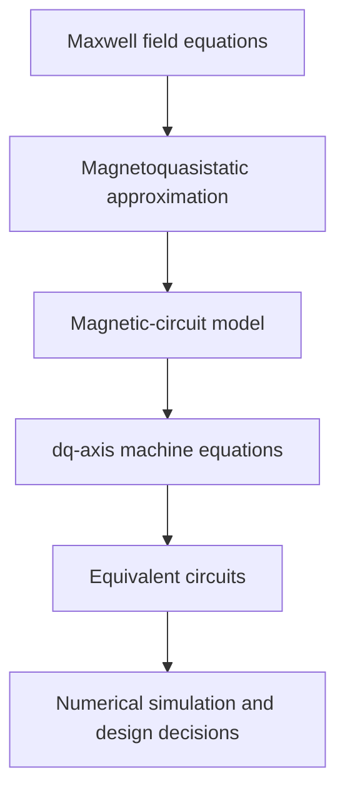

# Maxwell's Equations Beneath the Thesis

Maxwell's equations are the general field equations of classical electromagnetism. They describe how electric charges and currents generate electric and magnetic fields, how changing magnetic fields generate electric fields, and how changing electric fields contribute to magnetic fields. In macroscopic differential form, they can be written as

$$
\nabla \cdot \mathbf{D} = \rho_f
$$

$$
\nabla \cdot \mathbf{B} = 0
$$

$$
\nabla \times \mathbf{E}
=
-\frac{\partial \mathbf{B}}{\partial t}
$$

$$
\nabla \times \mathbf{H}
=
\mathbf{J}_f
+
\frac{\partial \mathbf{D}}{\partial t}
$$

where $\mathbf{E}$ is the electric field, $\mathbf{D}$ the electric displacement field, $\mathbf{B}$ the magnetic flux density, $\mathbf{H}$ the magnetic field strength, $\rho_f$ the free charge density, and $\mathbf{J}_f$ the free current density. In vacuum, the constitutive relations are

$$
\mathbf{D}=\varepsilon_0\mathbf{E},
\qquad
\mathbf{B}=\mu_0\mathbf{H}.
$$

## Maxwell's Equations in the Thesis

Several central formulas in the thesis are direct reductions of Maxwell's equations under the assumptions normally used in electrical-machine analysis. The thesis does not solve the complete three-dimensional electromagnetic field problem. Instead, it converts the general field laws into winding equations, magnetic-circuit relations, rotating-coordinate machine equations, and equivalent circuits.

### Faraday's Law and Induced Voltage

The relation

$$
e=\frac{d\Psi}{dt},
\qquad
\bar E=j\omega\Psi,
\qquad
E=2\pi fNBA_{\mathrm{fe}}
$$

is the winding-level form of Maxwell--Faraday's law,

$$
\nabla \times \mathbf{E}
=
-\frac{\partial \mathbf{B}}{\partial t}.
$$

In integral form,

$$
\oint_C \mathbf{E}\cdot d\mathbf{l}
=
-\frac{d}{dt}
\int_S \mathbf{B}\cdot d\mathbf{A}.
$$

Integrating the electric field around a coil and summing over its $N$ turns gives the induced winding voltage. The conventional minus sign expresses Lenz's law; in machine equations it may be absorbed into the selected voltage, current, and flux reference directions.

### Ampère's Law and the Magnetic Circuit

The thesis also uses

$$
\oint H\,ds=NI.
$$

This is Ampère's circuital law, or more precisely the magnetoquasistatic special case of the Maxwell--Ampère equation,

$$
\nabla \times \mathbf{H}
=
\mathbf{J}_f
+
\frac{\partial \mathbf{D}}{\partial t}.
$$

The thesis reduces the field integral to contributions from the iron path and the air gap:

$$
H_{\Delta}\Delta+H_j\ell=NI.
$$

If the reluctance of the air gap dominates, the relation becomes approximately

$$
I\approx\frac{B\Delta}{\mu_0N}.
$$

The displacement-current term,

$$
\frac{\partial \mathbf{D}}{\partial t},
$$

is neglected because the motor and inductor are treated as low-frequency magnetic devices rather than as electromagnetic-wave systems. This is the usual magnetoquasistatic approximation in electrical-machine analysis.

### The $dq$-Axis Machine Equations

The $dq$-axis equations are a further transformation of the same electromagnetic laws. Expressions such as

$$
U_d
=
Ri_d
+
\frac{d\Psi_d}{dt}
-
\omega\Psi_q,
$$

$$
U_q
=
Ri_q
+
\frac{d\Psi_q}{dt}
+
\omega\Psi_d
$$

combine induced voltage from Faraday's law, resistive voltage drop, and the mathematical effects of observing the machine from a rotating coordinate system.

The cross-coupling terms

$$
-\omega\Psi_q
\qquad\text{and}\qquad
+\omega\Psi_d
$$

arise from the rotation of the reference frame. They are not additional physical laws; they are the coordinate-transformation terms required when the electromagnetic variables are represented on rotating direct and quadrature axes.

### Constitutive Relations and Engineering Approximations

Other formulas in the thesis are closely connected to Maxwell's equations but are not Maxwell equations themselves. These include

$$
\Psi=Li,
$$

$$
B=\mu H,
$$

magnetic-reluctance formulas, and the electrical equivalent circuits.

These are constitutive, geometric, and modeling assumptions that turn the general field equations into a tractable engineering representation. The Fourier analysis describes the nonsinusoidal excitation, while the empirical iron-loss equations estimate the physical consequences of that excitation.

## Summary

The intellectual sequence in the thesis is:

Thus, the formulas identified in the thesis are indeed specific engineering reductions of the general Maxwell equations, especially Maxwell--Faraday's law and the Maxwell--Ampère equation. The thesis replaces a full field solution with a structured hierarchy of approximations suitable for machine design and numerical analysis.

This also resembles the modern Tellusant method: begin with general theory, identify the dominant mechanisms, reduce them to a tractable structural model, calculate the consequences, and use the results to support a practical decision.
