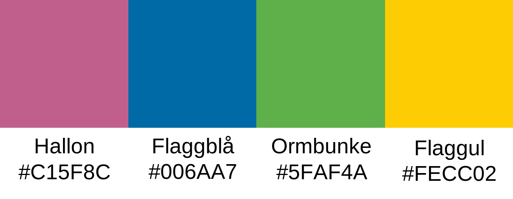
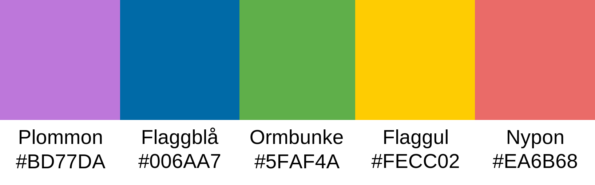
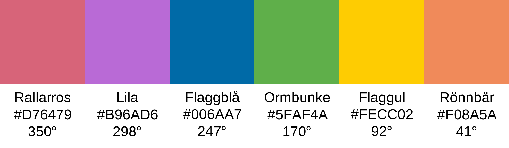
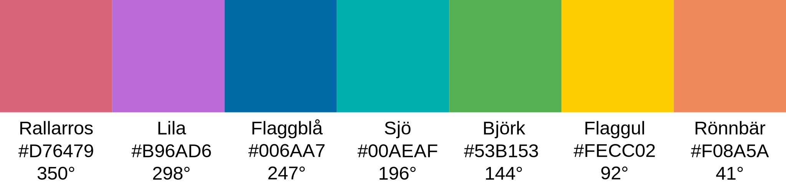
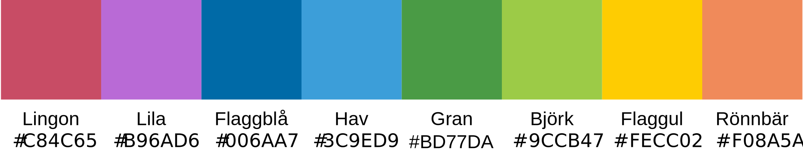

# Svenska färgskalor baserade på flaggblått och flaggult

Sverige har två officiella färger enligt grundlagen. Jag behövde flera. Vad göra? Jag konstruerade bredare färgskalor baserade på flaggblått och flaggult. 

Det visar sig vara komplicerad matematik men ChatGPT löste det briljant på fem minuter (den långa tiden visar att detta är icke-trivialt).

Betrakta denna övning som ren hobbyverksamhet.

I ett tvådimensionellt plan som skär genom en tredimensionell kub i viss vinkel är flaggblå och flaggul 155° separerade. Jag skapade "ormbunke" vid 155°/2 = 77.5° och "hallon" vid 77.5°+180° = 257.5° på detta plan. Efter denna geometriska ansats gjorde jag en perceptuell finjustering men med bevarade vinklar.

Detta var lyckat så jag expanderade till fler färger.

Till sist, en skala för världskartor när jag delar världen i åtta regioner. Normalt är åtta färger för mycket. Hjärnan klarar inte av att hantera dem, men kartor skapar struktur bortom färgerna. Att använda många färger kallades Mickey Mouse på McKinsey och vi menade inget snällt med det.

Färgskalorna visas baserat på vinkelseparation. Detta används för sekventiella (t ex bra till dålig; 0 till 100%) och divergerande (t ex temperatur från +30 till -10) skalor. 

För kvalitativa rangordingar som länders färger på kartor ordnas färgerna efter kontrast. Mer om detta finns hos [ColorBrewer](https://colorbrewer2.org/), en fantastisk vetenskaplig resurs för färgval.
