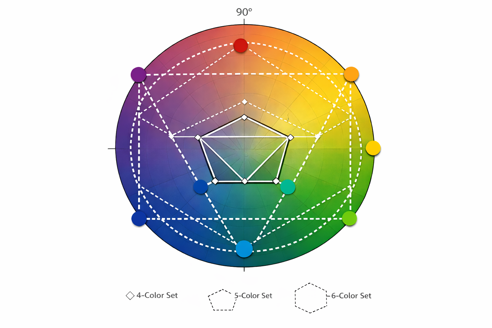

# Svenska färgskalor baserade på flaggblått och flaggult

Sverige har två officiella färger enligt grundlagen. Jag behövde flera. Vad göra? Jag konstruerade bredare färgskalor baserade på flaggblått och flaggult. 

Det visar sig vara komplicerad matematik men ChatGPT löste det briljant på fem minuter (den långa tiden visar att detta är komplicerat).

Betrakta denna övning som ren hobbyverksamhet.

I ett tvådimensionellt plan som skär genom en tredimensionell kub i viss vinkel är flaggblå och flaggul 155° separerade. Jag skapade "ormbunke" vid 155°/2 = 77.5° och "hallon" vid 77.5°+180° = 257.5° på samma plan. Efter denna geometriska ansats gjorde jag en perceptuell finjustering men med bevarade vinklar.

Detta var lyckat så jag expanderade till fler färger.

Sju och nio färger är lätt att plocka ut ur ovan skalor. Åtta kräver ChatGPT.

Slutligen, den geometriska representationen. Om man tittar noga så ser man att ChatGPT har gjort fel. Jag behåller detta inkorrekta färghjul som en påminnelse om att AI kan göra fel. Rätt koncept, fel implementering.

Trots att hjulet är fel så gäller detta: 4-färgs paletten är en rektangel, inte en kvadrat. Detta för att flaggblå och flaggul är 155° separerade, inte 180°. Av samma skäl är pentagonen och hexagonen tillplattade.
