# Sweden’s Export Opportunities in a Difficult Trade Climate

*Dr. Staffan Canback, Tellusant*

Auto-translated. [The original Swedish report is found here](https://canback.net/docs/articles-posts/sweden-exports.md)

---

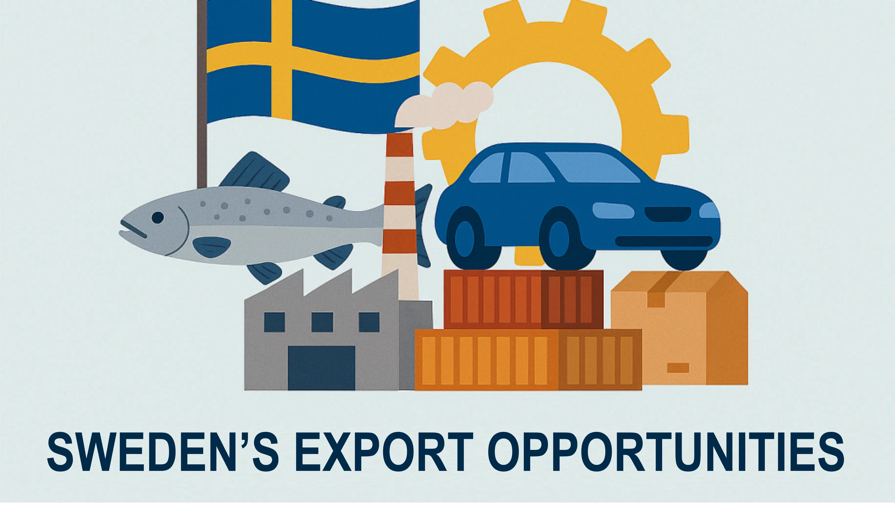

## About the Author

> Dr. Staffan Canback is a Swedish strategy consultant and business executive who has lived in Boston, Massachusetts, since 1993. He is Executive Chairman of Tellusant, Inc. Before that, he was CEO of Canback Consulting, a global strategy consulting firm in Boston, which he sold to The Economist Group in 2015. Earlier in his career, he was a partner at McKinsey & Company and Monitor Company.  
>
> Canback earned his doctorate from Henley Business School in 2002 based on research into diseconomies of scale in large corporations. He also holds an MBA from Harvard Business School and an MSc in Electrical Engineering from KTH Royal Institute of Technology. Canback is a Fulbright Scholar and Wallenberg Scholar, and in 2003 won first prize in EDAMBA’s competition for Europe’s best doctoral dissertation in business administration.  

---

Global trade patterns are being reshaped. The United States has clearly raised tariffs to reduce imports. But the European Union has also increased tariffs on China for several years. China will respond to both. Secondary effects will arise for everyone.   

How should an export-dependent country such as Sweden act to maintain and increase its exports? The solution must start from the fact that our exports have not been particularly successful over the past quarter century.  

This article examines future opportunities based on a statistical export model that takes into account geographic distance, linguistic differences, cultural distance, trade barriers, and the size of the recipient country’s import market.  

## Development of Swedish Exports

Swedish export performance has fallen short of expectations over the past 25 years. By no means bad, but weak. Figure 1 shows the development.  

<figure>
<figcaption><b>Figure 1</b></figcaption>
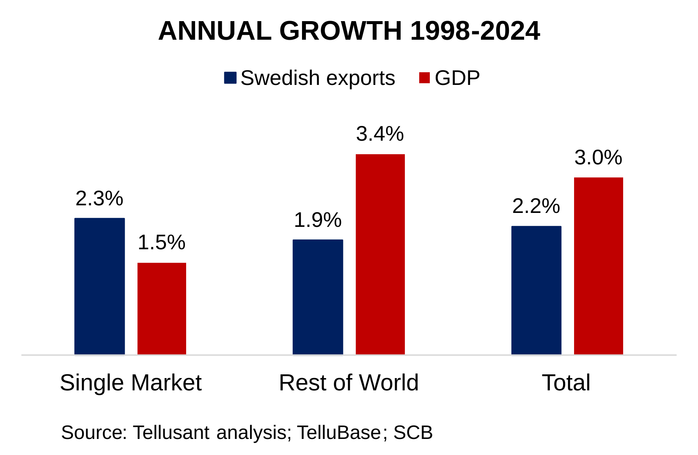 
</figure>

Relative to the Single Market (the EU plus Norway, Iceland, Liechtenstein, and Switzerland),¹ our exports have grown faster than the GDP of the recipient countries.  

This is not surprising, since one purpose of the Single Market is to stimulate internal trade. The Single Market now accounts for two-thirds of Swedish exports.  

But the EU is growing slowly. Success in a low-growth region is only a partial success.  

The world economy outside the Single Market is growing more than twice as fast in GDP terms. Here, Swedish exports lag far behind. Our exports have grown by 1.9% per year, while the recipient countries have grown by 3.4% annually.  

It appears that so much energy has gone into capturing opportunities within the EU that exports to the rest of the world have partly been neglected.  

### Swedish Export Complexity  

There is, however, one important bright spot. Swedish exports are sophisticated. We rank ninth in the world in export complexity.  

<figure>
<figcaption><b>Figure 2</b></figcaption>
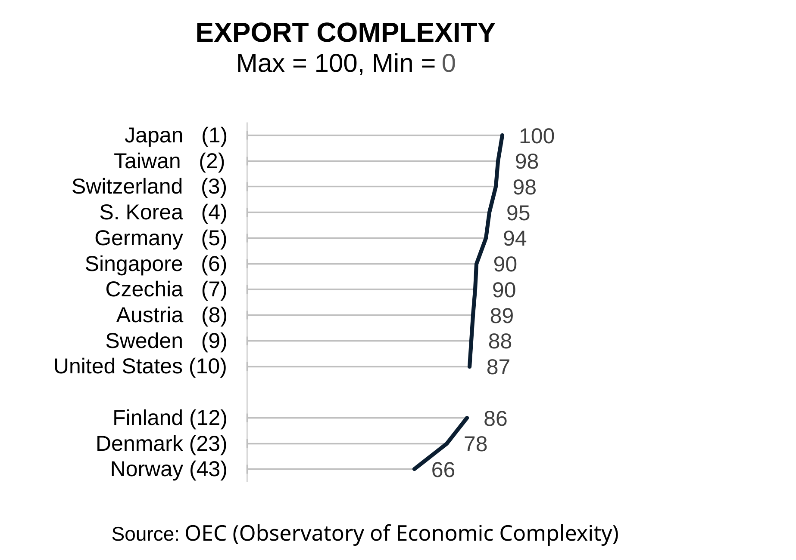 
</figure>

  
Swedish exports are highly value-added. This applies not only to pharmaceuticals, vehicles, and other obvious products. Many goods that might be regarded as commodities also have high value added within their segments—for example, steel.  

## Profile of Export Markets

Figure 3 shows where Swedish exports go. Of the ten largest destination countries, all except the United States are within the Single Market. This is a success for EU cooperation, but surely countries such as China and Brazil ought to appear on the list.  

<figure>
<figcaption><b>Figure 3</b></figcaption>
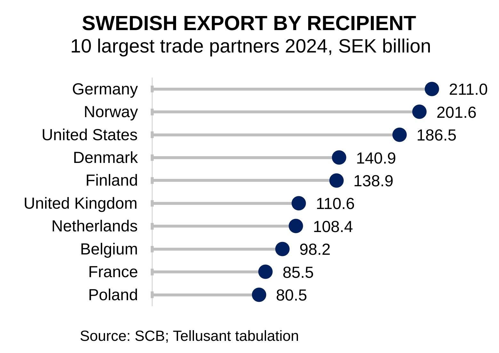 
</figure>

  
This picture is well known and does not contribute much to a better understanding of future export opportunities.  

Figure 4 instead shows the more interesting and less familiar view of Sweden’s share of different countries’ imports. We can think of this as our market share in each country.  

<figure>
<figcaption><b>Figure 4</b></figcaption>
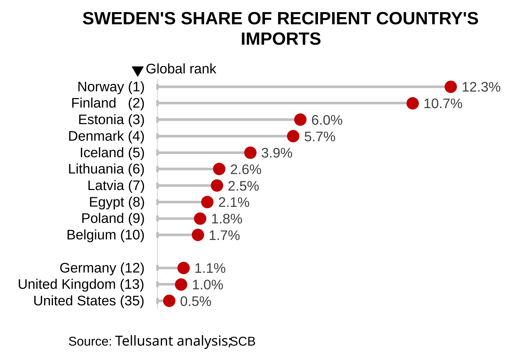  
</figure>

 
  
It is striking how well we export to the NB8 (Nordic-Baltic Eight). These countries occupy the first seven positions (Sweden is, of course, the eighth).  

Then comes a surprise: Egypt. The country is growing rapidly, has enormous infrastructure projects, and has the most diversified economy² in the world, so perhaps this is not so surprising after all.  

Farther down the list are distant countries where Sweden has a respectable share of imports—for example, South Africa, Guyana (by far the world’s fastest-growing economy), Algeria, and Turkey. This suggests that opportunities exist outside the traditional markets.  

So far, we have looked at descriptive information. Interesting, but it provides few insights into Sweden’s actual opportunities. Statistical analysis provides those insights.  

## Statistical Analysis Model  

Which factors determine export success? Five factors turn out to be important, summarized in Figure 5. Their relative importance is shown later in the section *Results from the Model*.  

<figure>
<figcaption><b>Figure 5</b></figcaption>
 
</figure>

  
Data for these factors were collected for 209 countries and territories. Some important aspects of these data are discussed below.  

### Linguistic Distance  

Linguistic distance is an important factor. Negotiating is difficult when Swedish is far removed from the language of the recipient country. Working in English helps, but English is not fully mastered in most countries, including Sweden. In addition, contracts generally need to be written in the recipient country’s language. This further complicates trade.  

Linguistic distance has been quantified within linguistics. Figure 6 shows the distance from Swedish (index 0) for several important business languages. Linguistic distance was collected for all countries. English, French, Spanish, or Portuguese was selected as the business language for countries with a long tradition of using these languages.  

<figure>
<figcaption><b>Figure 6</b></figcaption>
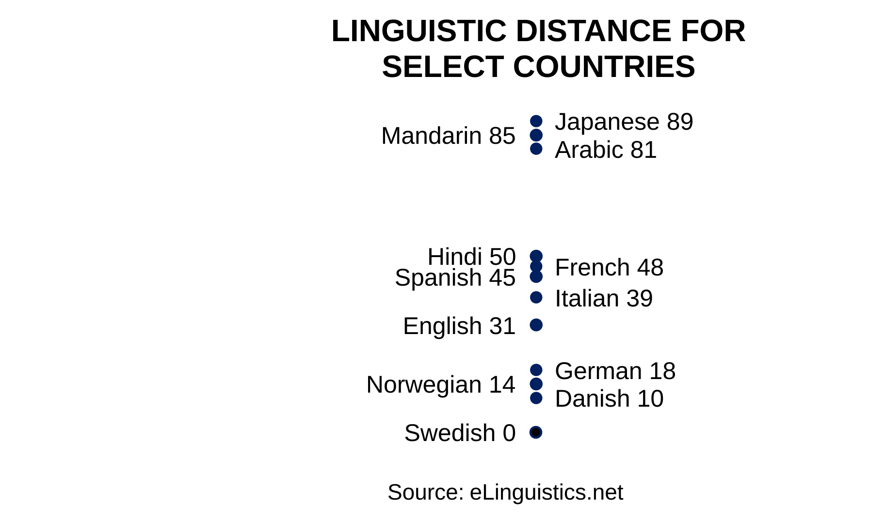 
</figure>

  
That the Scandinavian languages are close to Swedish is hardly surprising. That German is also close may be less obvious (a tip for exporters: learn reasonably good German, including how to read it).  

English, a Germanic language, is reasonably close. But the Romance languages are much more distant. Few Swedes speak French or Spanish well, even though countries using these languages are major import markets.  

That East Asian languages are distant is obvious. Finnish is also at this distance (although Swedish and English work well in Finland).  

### Cultural Distance

Cultural distance is a complicated subject. It turns out that almost 90% of the variation in global commercial culture can be explained by three dimensions, but not fewer.³ These are:  

- **Structure:** cultures may be hierarchically oriented or flat.
- **Planning:** some cultures work with carefully thought-out plans, while others are more improvisational.
- **Stability:** some cultures value reliability, while others value flexibility (and innovation).

<figure>
<figcaption><b>Figure 7</b></figcaption>
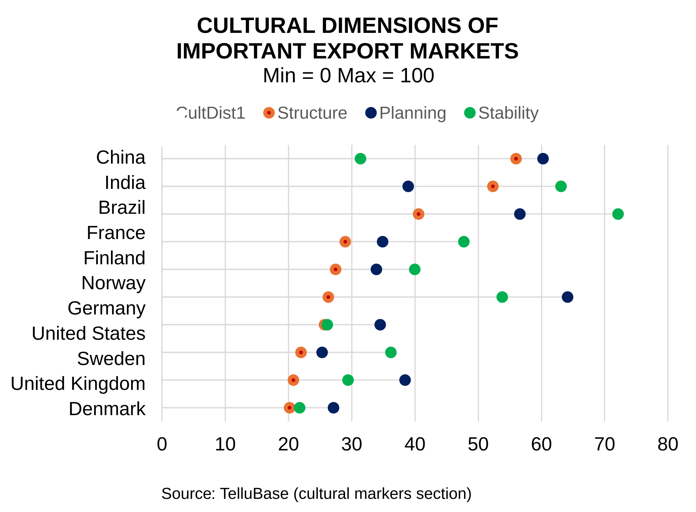  
</figure>

  
Note that there is no value judgment in these dimensions. For example, it is neither better nor worse to work in a hierarchical culture than in a flat one.  

Swedes are strongly oriented toward flat structures. Most countries find this unusual. Does this mean Swedish exports perform better when we encounter similar attitudes?  

Sweden does not have a strong planning culture and functions well with improvisation. Compare this with Germany’s more methodical approach to planning. Do we perform better when the importing country resembles Sweden?  

Swedes are closer to the average on the stability dimension. We value reliability but also have elements of flexibility. How does this profile affect our export opportunities?  

### Other Factors

Geographic distance requires no figure. It is obvious whether countries are nearby or far away. The question instead is: does distance affect our exports?  

Trade barriers should also have an effect. We divided the world into the Single Market (low trade barriers) versus all other countries.  

The size of the import market obviously plays a major role. It is easy to be successful in a country such as Estonia and difficult in the United States, all else being equal.  

The base model shows that all these factors are statistically significant except trade barriers.  

For exporters, we recommend taking linguistic distance, attitudes toward structure, geographic distance, and the importing country’s market potential into account. Four dimensions are manageable for a company.  

## Results from the Model  

We begin with Figure 8, taken directly from the statistical analysis program Stata. It requires some explanation.  

<figure>
<figcaption><b>Figure 8</b></figcaption>
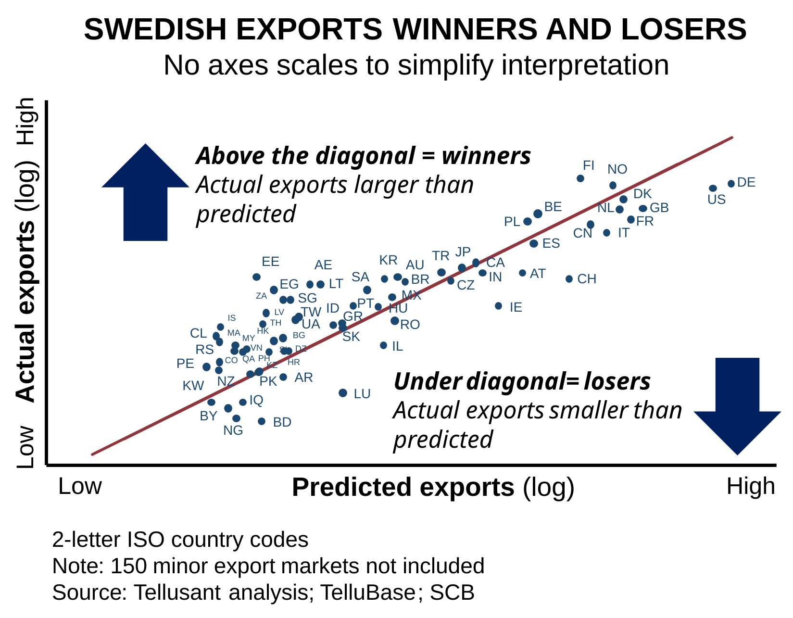  
</figure>

  
The results come from a linear regression. R-squared (goodness of fit) is 0.84. An R-squared above 0.8 is an excellent result.  

Only about 60 important export countries are shown. Another 150 smaller countries lie around the diagonal to the left of the countries visible in the figure. The farther to the right, the larger the exports.  

What is the diagonal? It is the line where the model and reality are the same.  

If a country lies above the diagonal, Sweden has performed better than expected; below it means worse than expected.  

### Some Observations

Estonia (EE) lies farthest above the diagonal. This means it is the country where Sweden is most successful after taking language, culture, and geography into account. But the country lies far to the left; in other words, the market is small.  

Other strong success markets include the United Arab Emirates (AE), Egypt (EG), Chile (CL), and Korea.  

By contrast, Sweden performs weakly in countries such as the United States (US), Germany (DE), and Switzerland (CH). The fact that many countries within the Single Market lie well below the diagonal is concerning. Joining the euro cannot be a disadvantage.  

This gives an impression of the relative results. Half of the 209 countries lie above the diagonal and can be viewed as successes. Half lie below it, with more left to be desired.  
 
Figure 9 puts numbers on the relative export successes.  

<figure>
<figcaption><b>Figure 9</b></figcaption>
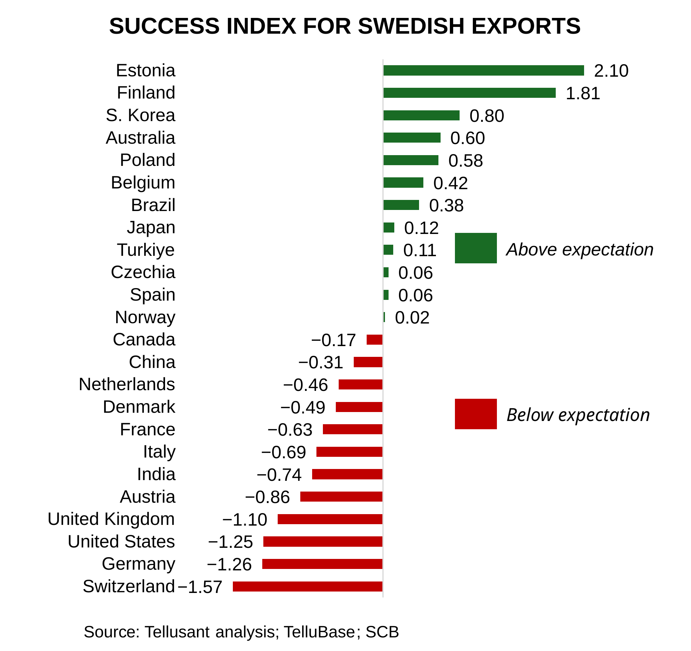 
</figure>

  
But how large are the export opportunities in Swedish kronor? The final section shows this.  

## Sweden’s Opportunities and Priorities  

Assume that the goal for Swedish exports over the next 25 years is to restore the position we had in 1999. We therefore set a target for exports to grow by 3.5% per year, up from 2.2%. The world economy is expected to grow by 2.3% per year.  

How do we achieve this? There are two factors to consider. On the one hand, it is better to export to growth markets. On the other, we need to increase exports to countries where we are weak but where the model says we ought to be strong.  

Return to Figure 8. One way to identify the potential is as follows:  

For countries above the diagonal—Swedish success markets—we aim to maintain market share and grow our exports in line with those countries’ economic development.  

For countries below the diagonal—where Swedish exports have not reached their potential—we aim to reach the diagonal. In other words, we gain market share while also growing in line with the recipient country’s economy and imports. The exception is the United States, which will remain a difficult export market for many years (protectionism has a history that predates Trump by a long way).  

Figure 10 summarizes this analysis based on the statistical model. Linguistic, cultural, and geographic distance have all been taken into account.  

<figure>
<figcaption><b>Figure 10</b></figcaption>
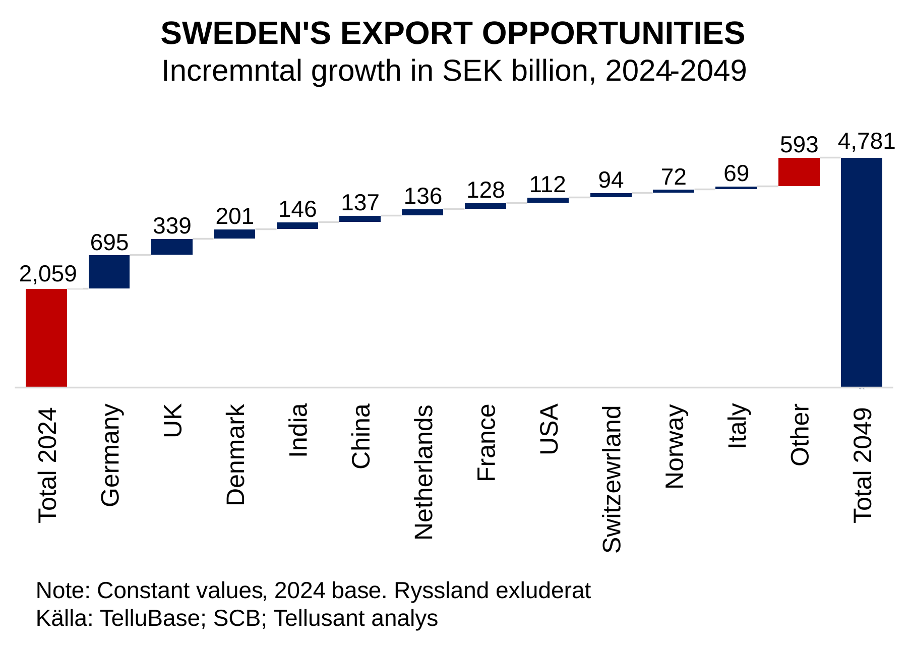
</figure>

  
Germany is the largest opportunity (the United States, if exporting becomes easier again, would be on roughly the same level as Germany). India and China have substantial potential despite our differences.  

France, Switzerland, and Italy are not currently successful export markets for Sweden, but they have substantial potential.  

A broader perspective is shown in Figure 11. Where are the opportunities by continent? Europe, despite its low expected growth (mainly driven by demographic headwinds), represents the largest net potential.  

Asia has strong potential beyond China and India. Africa comes next because of its high economic growth (the second highest in the world over the past 25 years and expected to be the highest in the world over the next 25).  

<figure>
<figcaption><b>Figure 11</b></figcaption>
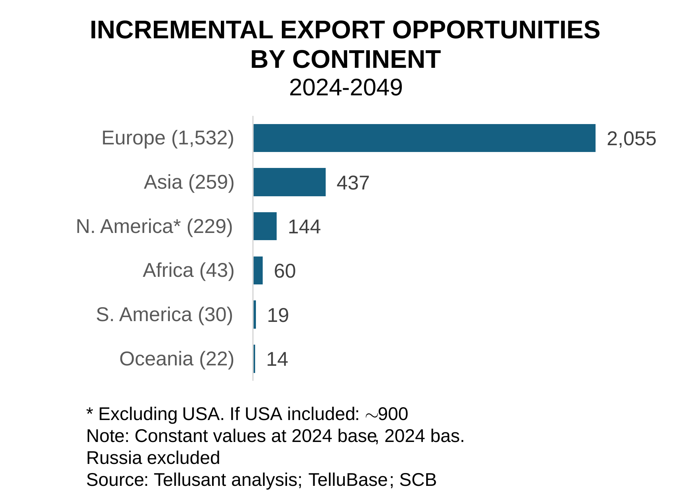  
</figure>

  
Increasing export growth from 2.2% in 1998–2024 to 3.5% in 2024–2049 is a reasonable ambition. This will require major reforms and a substantial concerted effort.  

Export growth of this magnitude also requires Sweden itself to perform better. Growth has been good by EU standards, but leaves much to be desired from a global perspective.  

## Conclusions

Sweden’s export efforts have been successful, but perhaps not to the extent we would like to believe.  

There are excellent opportunities to further develop exports despite the trade barriers now being erected.  

The level of ambition must be raised. Sweden should almost double the growth rate of its exports. Over the past quarter century, our exports have grown by 2.2% per year, while the world economy has grown by 3% annually. So far, we have been losing market share.  

With a target of, say, 3.5% annual export growth, we can regain our position over the course of a quarter century.  

- We must achieve greater success outside the NB8. There are many bright spots, but genuine success depends on playing a larger role in major countries such as Germany, China, India, and France (the United States may become a priority later).  
- Move from the krona to the euro. Using an important currency helps when a small country such as Sweden exports. It reduces uncertainty in trading with an unfamiliar country, reduces friction in trade and payment flows, and lowers exchange-rate volatility.  
- Greater humility toward language and culture is required. Far too much is conducted in English today. Compare, for example, Mexico and Colombia: companies there put employees into English-language training on a massive scale. They understand that Spanish is important, but that English opens larger doors. We have the opposite problem.  
- Understanding the value of hierarchical cultures is also important. Far too often one hears, “this is how we do it in Sweden.” Nobody cares. Meet large countries on their terms (and never talk about Sweden at dinner—it is interesting to no one except the Swede).  

The government can contribute at the margin:  

- Continue focusing on language education in schools.  
- Make better use of immigrants’ language skills.  
- Support the Erasmus program.  
- Remember that Sweden’s most important export support comes from the royal family. This alone is worth billions of kronor. The Nobel Prize is also important (more Nobel-inspired trade events).  
- More culture and art: Swedes are often perceived as uncultured, somewhat provincial, and dull.  

By contrast, government subsidies and industrial strategies are of zero importance.  

Ultimately, exports are a matter of business economics, not a societal issue. Hopefully, this general analysis can help companies think through their opportunities and priorities.  

Sweden’s glory days as an export nation are long gone. What remains is mainly the belief in past success. It is time for companies, leaders, and politicians to rediscover Sweden’s export spirit.  

---

## ABOUT TELLUSANT

> [Tellusant, Inc.](https://tellusant.com) is a world leader in applied decision analytics (ADA) for strategy development and commercial planning. We build on decades of experience with the world’s largest companies and have worked on the ground in 92 countries.  
>
> We have recently become active in Sweden under the leadership of [Staffan Canback](https://www.linkedin.com/in/scanback/) and [Kennet Rådne](https://www.linkedin.com/in/kennetradne/).  

---

¹ Previously called the Common Market. Switzerland is in many respects part of the Single Market, but not fully.  

² Measured using a Herfindahl-Hirschman Index (HHI), here quantifying the degree of concentration/diversification within countries.  

³ Data come from Tellusant’s [TelluBase](https://tellubase.com/) database, which draws on many sources that have been statistically processed. Our indices differ from, but have a similar orientation to, Hofstede’s well-known cultural dimensions.  

> Staffan’s surname is Canbäck in Swedish and Canback in English.  
