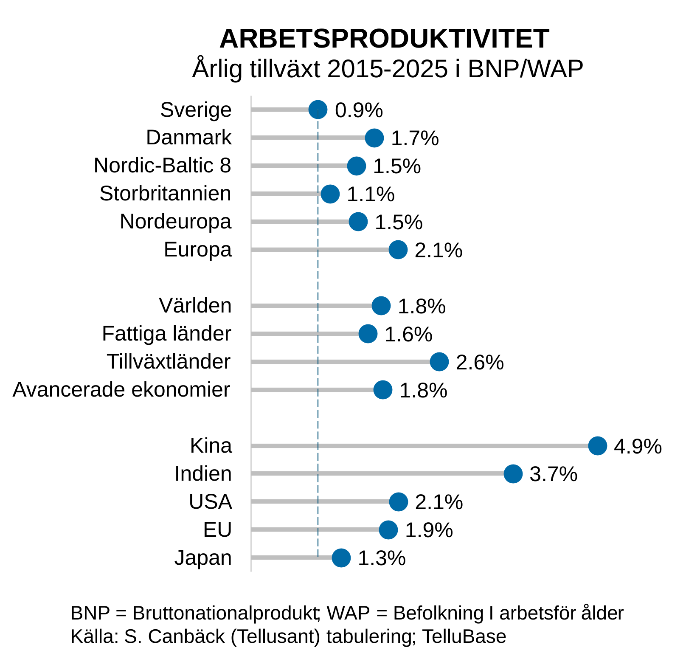
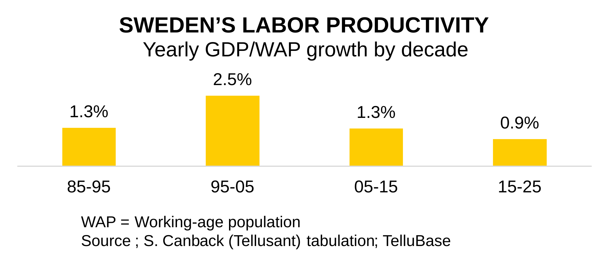
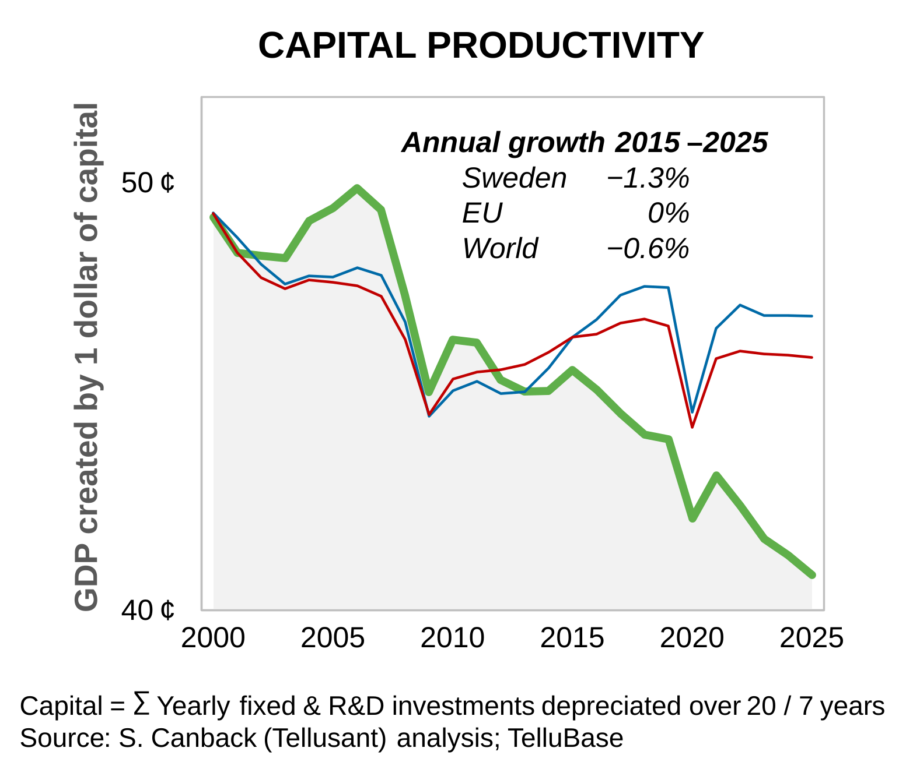
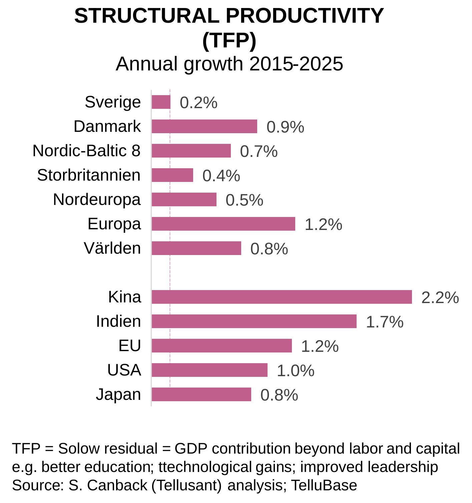

# Lousy as It Gets: Sweden’s Economic Growth, 2015–2025

*By Dr. Staffan Canback, Tellusant* | *2026-02-28*

**Sweden’s growth is often discussed in dramatic terms.
But what do the most fundamental economic measures tell us about developments over the past few decades?**

Sweden has experienced dismal economic growth over the past ten years. Here, I present the trend using the simplest meaningful measures possible.¹

A country’s productivity can be divided into three components:
- Labor
- Capital
- Structure

[`I have documented the underlying equations here.`](https://docs.tellusant.com/work-notes/cobb-douglas-decomposition)

The most important component is **structural productivity**, discussed in the third section.

I do _**not**_ include total GDP growth because it is not a measure of economic growth. GDP growth is a combination of demographic (population) growth and economic growth.

This is purely a diagnosis, and I make no recommendations. Three questions for the reader to consider:

1. Why has the performance been so poor?
2. What should our objective be?
3. What measures are needed to achieve it?

I have my own answers but will not share them here.

> As in all my publications, the graphs are primary and the text secondary. This is the opposite of the usual approach, in which the text is supported by graphs.

## 1. Labor productivity
In advanced economies, around 60 percent of GDP originates from labor, compared with 50 percent in developing economies.

I measure labor productivity as GDP divided by the working-age population (WAP).² Why use WAP rather than the number of people actually working?

A country has a certain number of working-age people. They may work for pay, study, serve in the military, be unemployed, work in the home, work many or few hours, be unable to work, or do something else.

The mix of these categories is a choice made by countries. Successful countries find a good mix; others find a poor one. My measure assumes that all countries make this choice.

In Sweden’s case, for example, short working hours are a choice. In South Korea, military service lasts three years, which reduces productivity. In the EU, we often see high unemployment. These priorities have reasons and consequences that citizens broadly support.

Below is labor productivity for a selection of economies.²

<figure>
<figcaption><b>Figure 1</b></figcaption>

</figure>

Note that Sweden ranks below the United Kingdom and far below the EU, which is often seen as troubled (the EU has demographic problems, not economic ones).

### Sensitivity analysis

The tabulation covers 2015–2025. But the starting and ending years may have been unusual and unrepresentative. This is a common problem when data are presented.

The chart below shows Swedish growth using other starting and ending years. The 2015–2025 result is only marginally below the median. This small difference means that 2015–2025 should be regarded as representative.

<figure>
<figcaption><b>Figure 2</b></figcaption>

</figure>

### Swedish labor productivity by decade

How does 2015–2025 compare with previous decades? It is clearly the worst period, as the graph below shows.

<figure>
<figcaption><b>Figur 3</b></figcaption>

</figure>

## 2. Capital productivity

Around 40 percent of Sweden’s GDP comes from capital (and 60 percent from labor). This is a measure that few people other than economists follow. The graph below shows that Sweden’s capital productivity—GDP generated per dollar of capital—has declined over the past decade. More than in the EU, and more than in the world as a whole.

Here, capital consists of fixed capital (buildings, machinery, roads, etc.) and research and development capital combined. Fixed capital is depreciated over 20 years and R&D capital over seven years. This is a conventional approach.

I express it as the number of cents of GDP generated by one dollar of capital stock. This is because capital generates GDP, not the reverse.

<figure>
<figcaption><b>Figure 4</b></figcaption>

</figure>

## 3. Structural productivity

The most important economic driver is structural productivity (often called Total Factor Productivity (TFP) or the Solow residual).

Structural productivity is what remains after labor and capital have been used to explain GDP growth. It includes better management, technological development, efficiency improvements through new working practices, inventions, and more.³

In a sense, it is a measure of our ignorance because we do not know exactly what it contains. Yet it is also profoundly important because it explains why societies improve, even though we do not understand the precise mechanisms. _This is the measure we should all be watching._

Two examples illustrate the concept:

- A country’s GDP grows by 2 percent. Labor and capital also grow by 2 percent each. Growth in structural productivity is therefore zero. Nothing happens beyond increases in labor and capital. This is called scaling.

- Japan’s GDP grows by 0.7 percent. Labor declines by 0.7 percent and capital grows by 0.4 percent (both below GDP growth). Structural productivity therefore grows by 0.8 percent. This is called improvement.

The graph shows Sweden’s structural-productivity growth compared with other economies over the past decade. As can be seen, the country’s performance is also weak by this—the most important—measure. We are not becoming a better society, merely a somewhat larger one.

<figure>
<figcaption><b>Figure 5</b></figcaption>

</figure>

## Conclusion
There is no bright spot in the figures. The country has been mismanaged. This is not merely a political issue; it is also an issue for businesses and citizens. Everyone has contributed to the misery.

I offer no answers as to why our performance has been so weak, but I see several possible factors: the refugee wave, Brexit, the pandemic, the war in Ukraine, US tariffs, [weak export performance](sweden-exports-en.md), and failed green initiatives. None of these can be regarded as boosting GDP. But there are surely deeper reasons that are difficult to analyze.

On a more personal note, I notice a lack of optimism and vitality when I visit twice a year. The country feels sluggish and dull. It lacks verve. But this is opinion, not fact.

> This is an excerpt from Tellusant’s global study of corporate and national productivity, based on fundamental economic theory.

---
¹ I use four data series, which are combined into relevant measures:
- Constant gross domestic product (GDP) according to the “[Purchasing Power Parity](https://www.worldbank.org/en/programs/icp)” method, dynamically adjusted⁴ so that its relationship with constant GDP measured at fixed market exchange rates varies over time.
- Working-age population (WAP) rather than total population. It is the working-age population that can generate GDP.
- Capital stock calculated from annual fixed and R&D investment, depreciated over 20 and seven years, respectively, and capitalized. Straight-line depreciation, not PIM.
- The labor–capital mix in each economy according to the [Penn World Table](https://www.rug.nl/ggdc/productivity/pwt/?lang=en).

² *Based on IMF research and publications, GDP per working-age population is frequently used as a more precise measure of economic performance than GDP per capita.* ⎼🇬🇵🇹. This is the measure I have used in my publications for years.

³ [More about structural productivity = TFP = the Solow residual is available here](https://en.wikipedia.org/wiki/Solow_residual).

⁴ The dynamic adjustment has a small positive effect on Sweden, but a larger negative effect on fast-growing countries such as China. The United States is neutral.

---
See [Swedish color scales based on the flag’s blue and yellow](sweden-colors.md) to understand how the colors were selected.
[More about Sweden and the NB8](../sverige/index.md)
