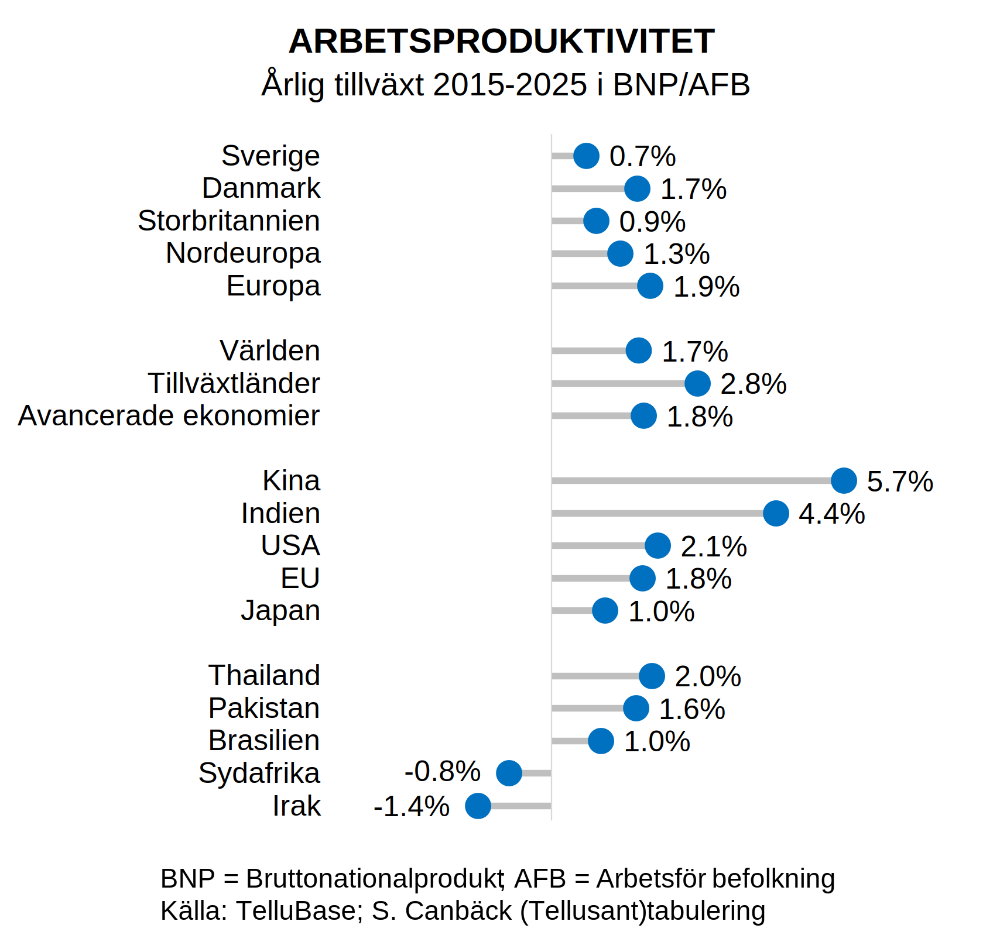
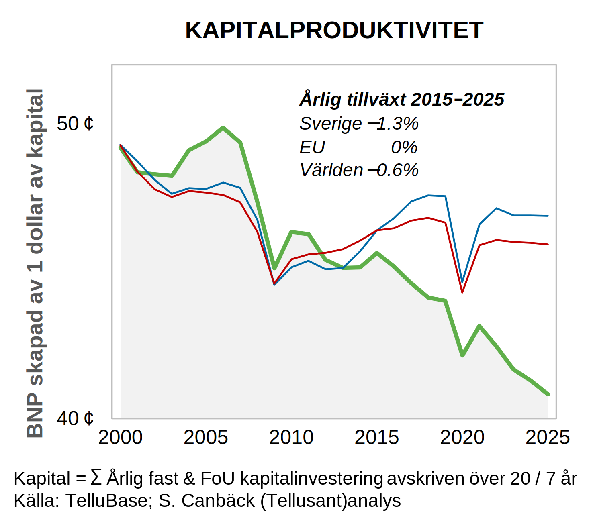

# Uselt så det förslår: Sveriges ekonomiska tillväxt 2015-2025
Sverige har haft en usel ekonomisk tillväxt de senaste tio åren. Här visar jag utvecklingen med enklast möjliga meningsfulla mått.  

Detta är en ren diagnos och jag skriver inget om potentiella åtgärder.

Jag använder fyra dataserier som kombineras till relevanta mått:  
- BNP enligt "Purchasing Power Parity" metoden (i dollar), dynamiskt justerad så att relationen till BNP enligt växelkurs varierar över tiden.¹   
- Arbetsför befolking (AFB) istället fär total befolkning. Det är den arbestföra befolkningen som kan genera BNP.  
- Kapitalstock beräknad från årliga fasta kapitalinvesteringar, avskrivna över 20 år och kapitaliserade.
- Arbete-kapital mixen i varje ekonomi som ingår i analyserna.

Jag inkluderar _**inte**_ total BNP tillväxt eftersom detta inte är ett mått på ekonomisk tillväxt. BNP tillväxt är en kombination av demografisk (befolknings) tillväxt och ekonomisk tillväxt. Mycket om debatten kring EU:s ekonomiska förfall är i verkligehetn en fråga om befolkningsminskning, inte ekonomiska problem. (Dessutom: Storbritannien lämnade EU vilket ofta inte justeras för så att siffrorna ska se mer skrämmande ut).

## Arbetsproduktivitet
I avancerade länder härstammar omkring 60 procent av BNP från arbete, gentemot 50 procent i andra länder (med stor variation).

Jag mäter arbetsproduktivitet som BNP delat med arbetsför befolkning (AFB). Varför AFB och inte de som faktiskt arbetar? Ett land har en viss mängd arbetsföra. Dessa kan arbeta för lön, studera, vara militärer, vara arbetslösa, arbeta i hemmet, arbeta många eller få timmar, vara oförmögna att arbeta, och annat. 

Mixen av dessa kategorier är ett val för länder. Framgångsrika länder finner en god mix, andra en dålig. Mitt mått stipulerar att alla länder gör detta val. I Sveriges fall är t ex kort arbetstid ett val. I Sydkorea är värnplikten treårig vilet minskar prouktiviteten. I EU:s fall ser vi ofta hög arbetslöshet. Dessa prioriteringar har skäl och konsekvenser som medborgarna i stort stöttar.

Notera att Sverige ligger under Storbritannien och långt under EU. Vad kan ha bidraget till detta. Jag har inga svar men ser några möjliga faktorer: flyktingvågen, Brexit, pandemin, Ukrainakriget, amerikanska tariffer. Ingen av dessa kan ses som BNP-höjande. Men det finns säkert djupare skäl som är svårtydda.

### Känslighetsanalys

Tabuleringen täcker 2015-2025. Men start- och slutåren kanske var speciella och inte representativa. Detta är ett vanligt problem när data presenteras.  

Nedan syns tillxäxten fär andra start- och slutår. 2015-2025 ligger obetydligt under medianen (0.94% mot 1.01%). Den lilla skillanden gör att 2015-2025 ska ses som representativt.  

### Svensk arbetsproduktivitet per decennium

Hur skiljer sig 2015-2025 mot tidigare decennier? Det är den klart sämsta perioden vilket nedan graf visar.  

## Kapitalproduktivitet

## Total faktorproduktivitet (TFP)

TFP, ofta kallad Solow residual, är vad som återstår efter att arbete och kapital har använts för att förklara BNP tillväcxt. Den innehåller teknologisk utveckling, effektivitetsförbättringar, uppfinningar, m.m.³ 

Den är ett mått på vår okunnighet, men också djupt betydelsefull eftersom den förklarar varför samhällen blir bättre.

Grafen visar Sveriges TFP tillväxt i jämförelse med andra ekonomier. Som synes är landets utveckling också svag med denna måttstock.

## Slutsats  
Det finns ingen ljusglimt i sifforna. Landet är vanskött. Detta är inte bara en politisk fråga, utan även en företagsfråga och en medborgarfråga. Alla har bidragit till eländet.  

Mer personligt så märker jag en brist på optimism och spänst när jag besöker två gånger om året. Landet är segt och tråkigt. Det saknas schvung. Men detta är en åsikt och inte fakta.

---
¹ Den dynamiska justeringen har liten (positiv) inverkan på Sverige, men har större (negativ) inverkan på snabbväxande länder som Kina. USA är neutralt.  

² *Based on IMF research and publications, GDP per working-age population is frequently used as a more precise measure of economic performance than GDP per capita.* ⎼🇦&ZeroWidthSpace;🇮. Detta är det mått jag använt i mina publikationer i åratal.  

³ Mer om TFP / Solow residual finns [här](https://en.wikipedia.org/wiki/Solow_residual). En djupare, men svårförståelig analys, av TFP finns i [Penn Tables](https://www.rug.nl/ggdc/productivity/pwt/?lang=en).

---
Sverige har två officiella färger enligt grundlagen. Jag behövde fyra. Vad göra? Jag konstruerade två nya färger baserat på flaggblått och flaggult. Det visar sig vara komplicerad matematik men ChatGPT löste det briljant på fem minuter.

I ett tvådimensionellt plan som skär genom en kub i viss vinkel är flaggblå och flaggul 155° separerade. Jag skapade "lövgrön" vid 155°/2 = 77.5° och "hallonröd" vid 77.5°+180° = 257.5° på samma plan. I perceptuell skala (inte geometrisk).

