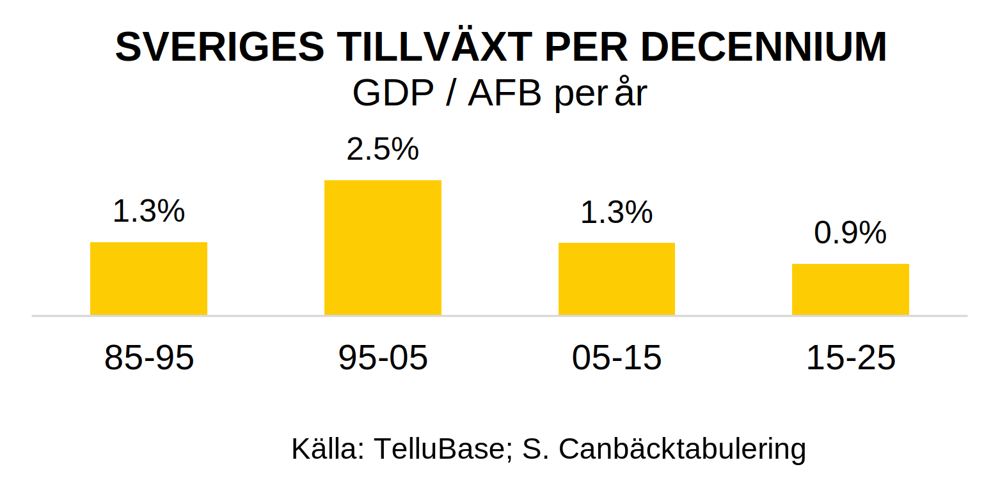

# Sveriges tillväxt 2015-2025
Sverige har haft en usel ekonomisk tillväxt de senaste tio åren. Här visar jag enklast möjliga meningsfulla mått på utvecklingen.

Jag använder två dataserier:

- BNP enligt *Purchasing Power Parity" i dollar metoden, dynamiskt justerad så att relationen till BNP enligt växelkurs varierar över tiden.¹  
- Arbetsför befolking (AFB) istället fär total befolkning. Det är den arbestföra befolkningen som generar BNP.

Dessa divideras för att skapa ett jämförtbart mått — BNP/AFB — för alla länder och alla tidsperioder. Årlig tillväxt i BNP/AFB beräknas sedan som vanligt.

## Tillväxt jämfört andra länder

## Känslighetsanalys

## Svensk ekonomisk utveckling per decennium

---
¹ Den dynamiska har liten (men positiv) inverkan på Sverige, men har större (negativ) inverkan på snabbväxande länder som Kina. USA är neutralt.
²
³

