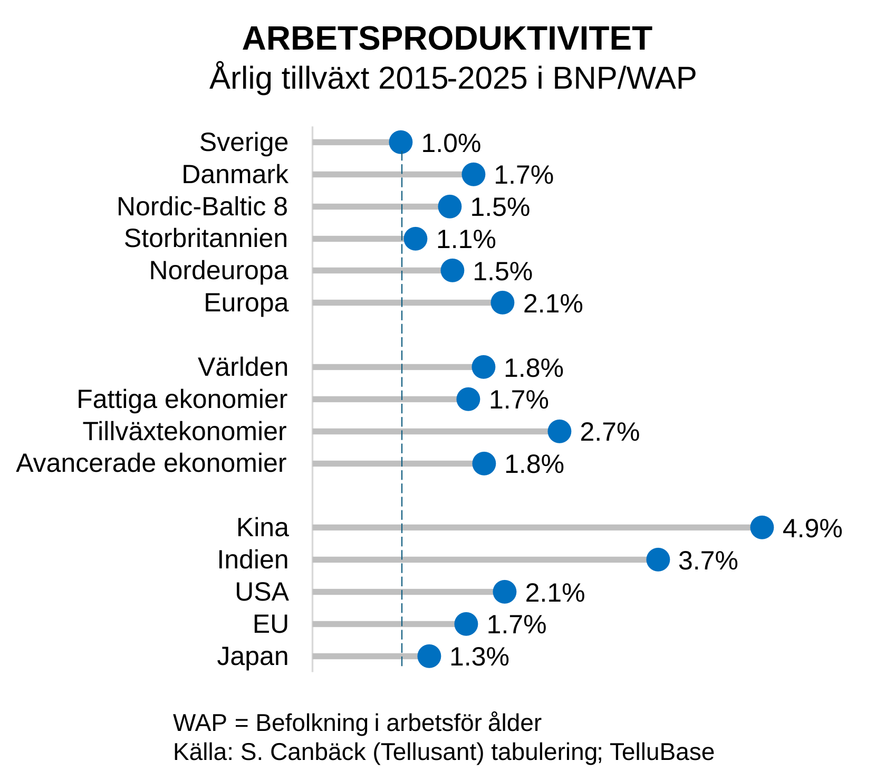
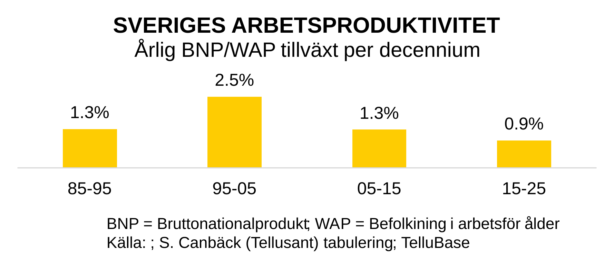
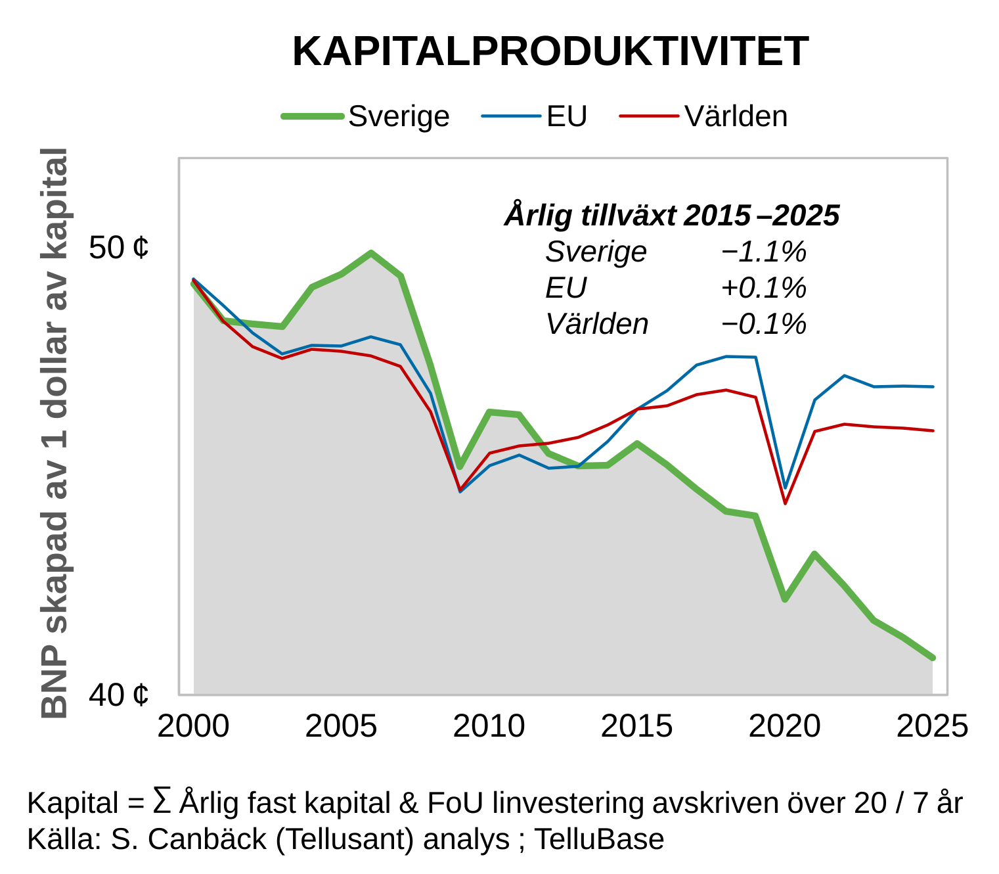
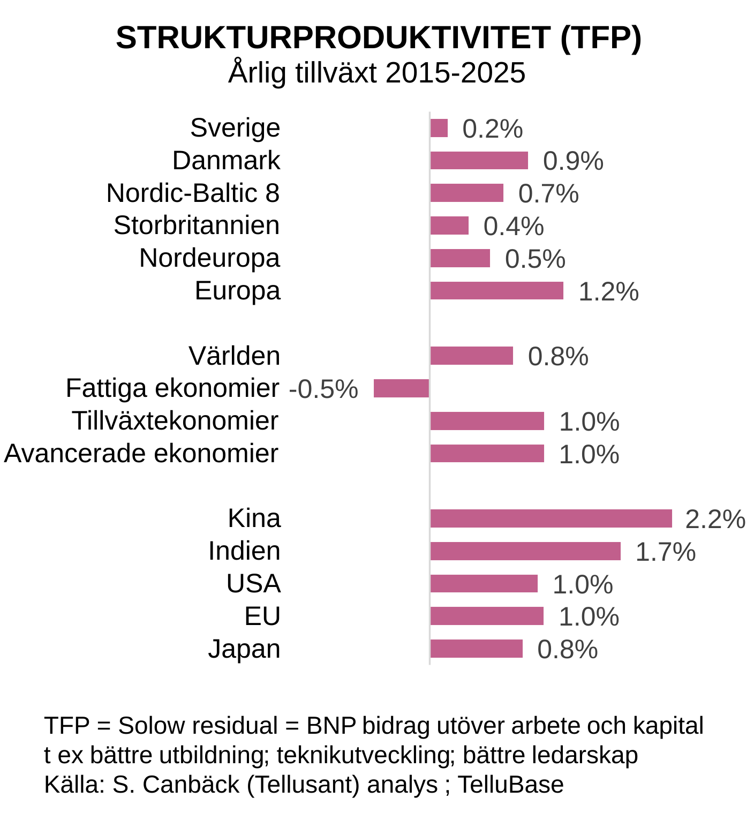

# Uselt så det förslår: Sveriges ekonomiska tillväxt 2015–2025

*av Dr. Staffan Canbäck, Tellusant* | *2026-02-28*

**Sveriges tillväxt diskuteras ofta i dramatiska termer.
Men vad säger de mest grundläggande ekonomiska måtten om utvecklingen de senaste decennierna?**

Sverige har haft en usel ekonomisk tillväxt de senaste tio åren. Här visar jag utvecklingen med de enklast möjliga meningsfulla måtten.¹ 

Ett lands produktivitet kan delas in i tre produktivitetsdelar:  
- Arbete  
- Kapital  
- Struktur

[Ekvationerna bakom beräkningarna har jag dokumenterat här.](https://docs.tellusant.com/work-notes/cobb-douglas-decomposition)  

Den viktigaste delen är **strukturproduktivitet** i det tredje kapitlet.  

Jag inkluderar _**inte**_ total BNP tillväxt eftersom detta inte är ett mått på ekonomisk tillväxt. BNP tillväxt är en kombination av demografisk (befolknings) tillväxt och ekonomisk tillväxt. 

Detta är en ren diagnos och jag skriver inget om åtgärder. Tre frågor som läsaren kan begrunda:  

1. Varför har utvecklingen varit så dålig?  
2. Vad borde vi ha som mål?  
3. Vilka åtgärder krävs för att nå dit?  

Jag har mina egna svar men delar dem inte nu.  

> Liksom i alla mina publikationer så är graferna primära och texten sekundär. Det är tvärtemot de flesta, som skriver text stöttad av grafer.  

## 1. Arbetsproduktivitet
I avancerade länder härstammar omkring 60 procent av BNP från arbete, gentemot 50 procent i tillväxtländer.  

Jag mäter arbetsproduktivitet som BNP dividerat med arbetsför befolkning i arbetsför ålder (WAP).² Varför WAP och inte de som faktiskt arbetar?  

Ett land har en viss mängd arbetsföra. Dessa kan arbeta för lön, studera, vara militärer, vara arbetslösa, arbeta i hemmet, arbeta många eller få timmar, vara oförmögna att arbeta, och annat.  

Mixen av dessa kategorier är ett val för länder. Framgångsrika länder finner en god mix, andra en dålig. Mitt mått stipulerar att alla länder gör detta val.  

I Sveriges fall är t ex kort arbetstid ett val. I Sydkorea är värnplikten treårig vilket minskar produktiviteten. I EU ser vi ofta hög arbetslöshet. Dessa prioriteringar har skäl och konsekvenser som medborgarna i stort stöttar.  

Nedan är arbetsproduktiviteten för några utvalda ekonomier.²  

<figure>
<figcaption><b>Figur 1</b></figcaption>

</figure>

Notera att Sverige ligger under Storbritannien och långt under EU, som ofta ses som problem (EU har demografiska problem, inte ekonomiska).  

### Känslighetsanalys  

Tabuleringen täcker 2015-2025. Men start- och slutåren kanske var speciella och ickerepresentativa. Detta är ett vanligt problem när data presenteras.  

Nedan syns svensk tillväxt för andra start- och slutår. 2015-2025 ligger obetydligt under medianen. Den lilla skillnaden gör att 2015-2025 ska ses som representativt.  

<figure>
<figcaption><b>Figur 2</b></figcaption>

</figure>

### Svensk arbetsproduktivitet per decennium   

Hur skiljer sig 2015-2025 mot tidigare decennier? Det är den klart sämsta perioden vilket nedan graf visar.  

<figure>
<figcaption><b>Figur 3</b></figcaption>

</figure>

## 2. Kapitalproduktivitet   

Omkring fyrtio procent av Sveriges BNP kommer från kapital (60% från arbete). Detta är ett mått som få förutom ekonomer följer. Grafen nedan visar att Sveriges kapitalproduktivitet (BNP genererad per dollar kapital), fallit under det senaste decenniet. Mer än i EU, mer än i världen.  

Kapital är här fast kapital (byggnader, maskiner, vägar etc.) och forsknings- och utvecklingskapital, tillsammans. Det fasta kapitalet skrivs av över 20 år. FoU kapitalet över 7 år. Detta är en konventionell syn.  

Jag uttrycker det som hur många cent av BNP som skapas av en dollar av kapitalstock. Detta eftersom kapital skapar BNP, inte tvärtom.  

<figure>
<figcaption><b>Figur 4</b></figcaption>

</figure>

## 3. Strukturproduktivitet   

Den viktigaste ekonomiska drivkraften är strukturproduktivitet (ofta kallad Total Factor Productivity (TFP) eller Solow residual).  

Strukturproduktivitet är vad som återstår efter att arbete och kapital har använts för att förklara BNP tillväxt. Den innehåller bättre ledarskap, teknisk utveckling, effektivitetsförbättringar genom nya arbetsrutiner, uppfinningar, m.m.³  

Den är på sätt och vis ett mått på vår okunnighet eftersom vi inte vet exakt vad som ingår, men också djupt betydelsefull eftersom den förklarar varför samhällen blir bättre (utan att vi förstår de exakta mekanismerna). _Detta är måttet vi alla ska hålla ögonen på_.  

Två exempel för att förklara konceptet:  

- Ett lands BNP växer med 2 procent. Arbete och kapital växer också med 2 procent vardera. Då blir tillväxten i strukturproduktivitet noll. Ingenting händer utöver arbete och kapital. Detta kallas skalning.  

- Japans BNP växer med 0.7%. Arbete minskar med 0.7% och kapital växer med 0.4% (bägge under BNP tillväxten). Strukturproduktiviteten växer därför med 0.8%. Detta kallas förbättring.  

Grafen visar Sveriges tillväxt i strukturproduktivitet jämfört med andra ekonomier över det senaste decenniet. Som synes är landets utveckling också svag med denna, den viktigaste, måttstocken. Vi blir inte bättre som samhälle, bara något större.  

<figure>
<figcaption><b>Figur 5</b></figcaption>

</figure>

## *Slutsatser*   
Det finns ingen ljusglimt i siffrorna. Landet är vanskött. Detta är inte bara en politisk fråga utan även en företags- och medborgarfråga. Alla har bidragit till eländet.  

Jag ger inga svar på varför vi har så svag utveckling men ser några möjliga faktorer: flyktingvågen, brexit, pandemin, Ukrainakriget, amerikanska tariffer, [svag exportutveckling](../articles-posts/sweden-exports.md), misslyckade gröna satsningar. Ingen av dessa kan ses som BNP-höjande. Men det finns säkert djupare skäl som är viktigare och dessutom svåranalyserade.  

Mer personligt så märker jag en brist på optimism och spänst när jag besöker två gånger om året. Landet är segt och tråkigt. Det saknas schvung. Men detta är en åsikt och inte fakta.  

> Detta är ett utdrag ur Tellusants globala studie av företags och länders produktivitet baserad på fundamental ekonomisk teori.  

---
¹ Jag använder fyra dataserier som kombineras till relevanta mått:   
- Konstant Bruttonationalproduct (BNP) enligt "[Purchasing Power Parity](https://www.worldbank.org/en/programs/icp)" metoden, dynamiskt justerad⁴ så att relationen till konstant BNP i marknadens fasta dollarkurs varierar över tiden.    
- Befolkning i arbetsför ålder (WAP efter *working-age population*) istället för total befolkning. Det är den arbetsföra befolkningen som kan genera BNP. 15-65 år efter OECD:s definition.
- Kapitalstock beräknad från årliga fasta och FoU investeringar, avskrivna över tjugo respektive sju år och kapitaliserade. Rak avskrivning, inte PIM.  
- Arbete gentemot kapital mixen i varje ekonomi enligt [Penn Tables](https://www.rug.nl/ggdc/productivity/pwt/?lang=en).  

² *Based on IMF research and publications, GDP per working-age population is frequently used as a more precise measure of economic performance than GDP per capita.* Detta är det mått jag använt i mina publikationer i åratal.  

³  Mer om [strukturell produktivitet = TFP = Solow residual finns här](https://en.wikipedia.org/wiki/Solow_residual).  

⁴ Den dynamiska justeringen har en liten (positiv) inverkan på Sverige, men har större (negativ) inverkan på snabbväxande länder som Kina. USA är neutralt.  

---
Se [Svenska färgskalor baserade på flaggblått och flaggult](sweden-colors.md) för att förstå hur färgerna valdes.  
[Mer om Sverige och NB8](../sverige/index.md)  
