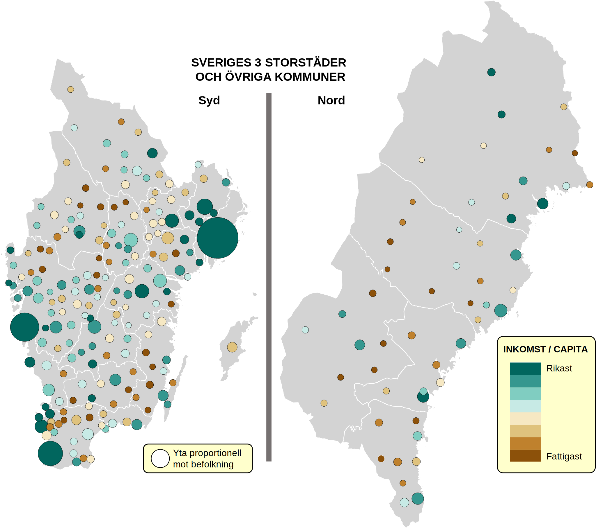
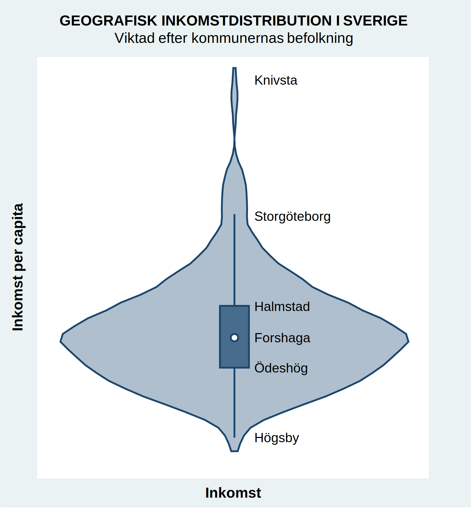

# Sveriges geografiska inkomstskillnader
Hur ser svenska geografiska inkomstskillnader ut? Här visar jag de svenska storstäderna och kommunerna.

Jag använder SCB:s storstadsdefinitioner. Storstockholm täcker 26 kommuner, Storgöteborg 13, Stormalmö 12.

Att storstäderna är rika är ingen överraskning. Men se på Norrbotten: förvånansvärt rikt. Kiruna är den femte rikaste kommunen, Gällivare den sjätte. Gruvor är viktiga.

Några andra:  
- Knivsta nr 1  
- Storstockholm nr 2  
- Storgöteborg nr 8  
- Stormalmö nr 18  
Filipstad, Ljusnarsberg och Högsby ligger i botten  

Inkomstskillnaden mellan rikast och fattigast är en faktor 1,5. Normalt för ett litet och rikt land.

Notera att det finns rika stadsdelar i alla städer. De råkar vara egna kommuner i våra storstäder. Det är därför bäst att slå ihop storstadskommunerna i de större storenheterna.

Till sist, violingrafen nedan visar inkomstfördelningen efter inkomst per capita. Bredden motsvarar hur mång som bor i de kommuner som har denna inkomst per capita. Detta är baserad på en [*kernel density estimation*](https://en.wikipedia.org/wiki/Kernel_density_estimation). Grafen ger en snabb överblick och undviker onödiga detaljer.

Källa: S.Canback analys; SCB

---
[Mer om Sverige och NB8](../sverige/index.md)
