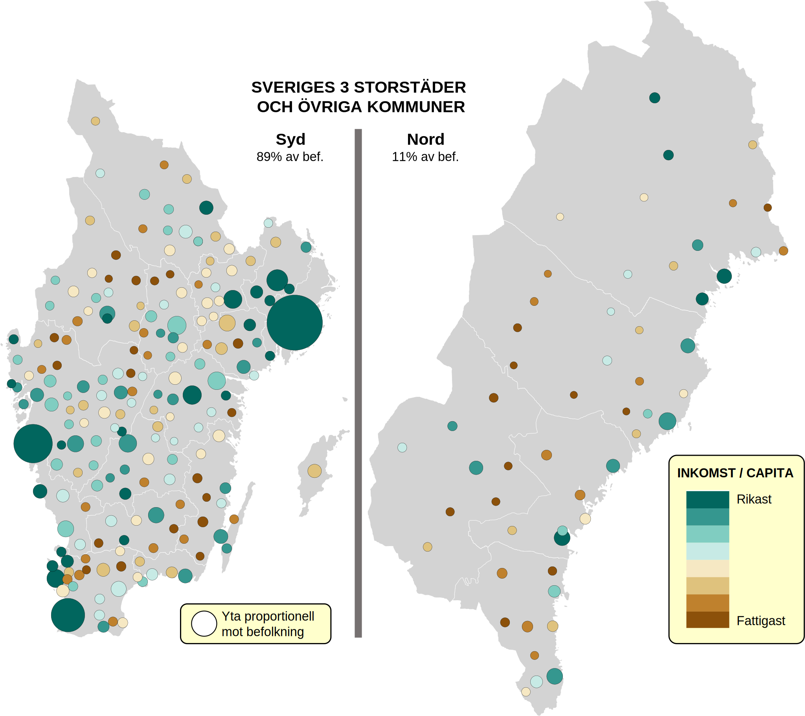
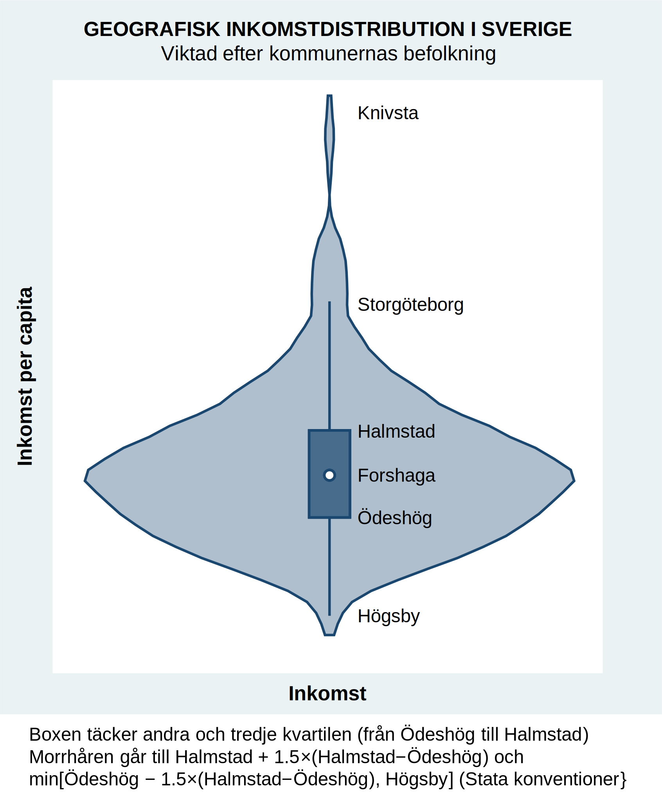

# Sveriges geografiska inkomstskillnader

*Dr Staffan Canbäck, Tellusant*

Hur ser de svenska geografiska inkomstskillnaderna ut? Här visar jag de svenska storstäderna och kommunerna.

Jag använder SCB:s storstadsdefinitioner. Storstockholm täcker 26 kommuner, Storgöteborg 13, Stormalmö 12.

Insikterna kommer från att studera kartan, inte texten.

Att storstäderna är rika är ingen överraskning. Men se på Norrbotten: förvånansvärt rikt. Kiruna är den femte rikaste kommunen, Gällivare den sjätte. Gruvor är viktiga.

Några andra:  
- Knivsta nr 1  
- Storstockholm nr 2  
- Storgöteborg nr 8  
- Stormalmö nr 18

Filipstad, Ljusnarsberg och Högsby ligger i botten  

Notera att det finns rika stadsdelar i alla städer. De råkar vara egna kommuner i våra storstäder. Det är därför bäst att slå ihop storstadskommunerna i storenheter.

Ett annat s]tt att se p[ samma data syns nedan. Violingrafen visar inkomstfördelningen efter inkomst per capita. Bredden motsvarar hur många som bor i de kommuner som har denna inkomst per capita. Detta är baserad på en [*kernel density estimation*](https://en.wikipedia.org/wiki/Kernel_density_estimation). Grafen ger en snabb överblick och undviker onödiga detaljer.

Jag hade tänkt inkludera en graf med en Lorenzkurva. Den visar jämlikheten i ett land och utgör grunden för att beräkna Gini-koefficienten.

Sverige är dock så jämlikt från ett spatialt perspektiv att grafen blev meningslös. Spatial Gini är exceptionellt låga 0.06. 0 är perfekt jämlikhet, 1 är när en person tjänar alla pengar.

Sveriges totala Gini är omkring 0.35. Detta visar att ojåmlikhet i Sverige är stor inom kommuner, men inte mellan kommuner. De flesta länder har både spatial och intern ojåmlikhet.

Notera att hög jämlikhet eller ojämlikhet är varken bra eller dåligt. Det är ett sammhälles värderingar som ger orden laddning. Svenskar ser ofta jämlikhet som eftersträvansvärt. Där jag bor är ojämlikhet positivt.

Källa: S.Canbäck analys; SCB

---
[Mer om Sverige och NB8](../sverige/index.md)
