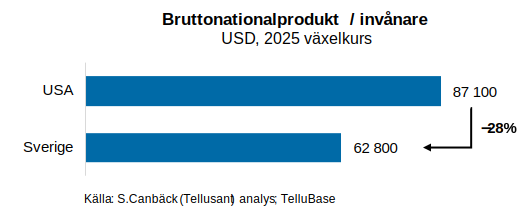
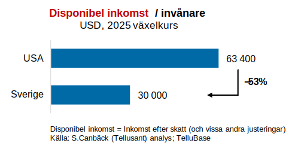
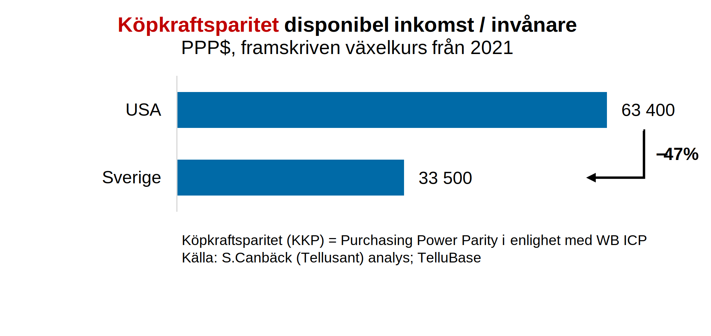
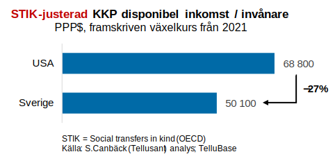
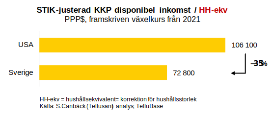

# En komplex fråga: Den svenska levnadsstandarden jämförd med den amerikanska

_Dr Staffan Canbäck, Tellusant_

Man ser ofta ytliga jämförelser av den materiella levnadsstandarden i olika länder. Här går jag på djupet.

> Jag och mitt företag Tellusant, Inc. har aktiverat oss i Sverige och Nordic-Baltic 8. Vi samarbetar med Kennet Rådne i Stockholm.
>
> Jag gör därför några inlägg på svenska om landet och regionen. Jag har inte skrivit på svenska på många år så det är en nyttig övning (38 år i USA).

***UPPDATERAS TILL BASÅR 2025 UNDER 2026***

Den senaste tiden har det publicerats mycket på YouTube och andra sociala medier om hur mycket lägre inkomsterna är i EU jämfört med USA.  

Jag har därför analyserat de svenska hushållens inkomstnivå i detalj. Mitt jämförelseår är 2023 (det senaste året med rimligt stabila data). Nedan följer stegen i analysen.  

- BNP per capita är 31% lägre i Sverige. Men BNP har är inte inkomst och definitivt inte hushållsinkomst.  

- Sveriges disponibla hushållsinkomst (DI) är 49% lägre vid en första anblick. Den 18-procentiga skillnaden mot BNP reflekterar det högre skattetrycket, men också andra faktorer.  

- Men det är viktigt att göra en AIC justering.¹ Denna innebär att staten (inkl regioner, kommuner) spenderar pengar för medborgarna som inte ingår i disponibel inkomst. T ex skolor och sjukvård. Denna *government spending on behalf of consumers* (som Världsbanken uttrycker det) är 19% av BNP i Sverige gentemot 6% i USA.  Efter denna justering är Sveriges hushållsinkomst 38% lägre än USA:s.  

- Men varför använda 2024 års växelkurs? Växelkurser går upp och ner men den lokala levnadsstandarden rör sig (i stort) inte. Det är därför bättre att använda en stabil kurs. Dessutom måste hänsyn tas till skillnader i kostnadsnivåer.  Dessa två faktorer kräver att "purchasing power parity" (PPP) används. Detta är speciellt viktigt eftersom 2023 hade en onormalt svag krona, tidigare och senare år är mer normala.  Med detta (efter en synnerligen komplicerad uträkning) hamnar Sverige 22% under USA.  

- Slutligen, varför per invånare? Per invånar-måttet penaliserar länder med stora hushåll. Men ett per hushåll mått penaliserar länder med små hushåll. Ekonomer använder istållet hushållsekvivalenter (HH-ekv) som är det geometriska medelvärdet mellan individer och hushåll.²  Detta reducerar den svenska inkomstnivån med 5 procentenheter till 27% under USA.  

 
Min slutsats är att de svenska hushållens inkomstnivå ligger 20–30% under de amerikanska.  

Om vi använt den naiva metoden i punkt 1, så ligger Sverige sist eller näst sist jämfört med de 50 amerikanska delstaterna, och klart sist med punkt 2 metoden.  
  
Detta är orimligt. Jag har besökt alls de kontinentala 48 delstaterna med en sociologisk blick. Det är omöjligt att Sverige är fattigare än t ex West Virginia.  

Med mina justeringar ovan hamnar Sverige runt 40:e plats, jämförbar med Georgia eller Michigan (som bägge dessutom råkar ha 10-11 miljoner invånare). Detta verkar rimligt baserat på min erfarenhet.  

---
Källa för samtliga grafer: S.Canbäck (Tellusant) analys; [TelluBase](https://tellubase.com)  
¹ Actual Individual Consumption  
² Se t ex Rainwater, L. (1970): *What Money Buys: Inequality and the Social Meanings of Income*  

---
[Mer om Sverige](../sverige/index.md)  
