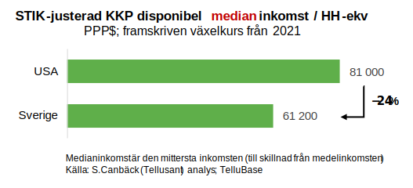

# En komplex fråga: Den svenska levnadsstandarden jämförd med den amerikanska

_Dr Staffan Canbäck, Tellusant_

Man ser ofta ytliga jämförelser av den materiella levnadsstandarden i olika länder. Här går jag på djupet.

Den senaste tiden har det publicerats mycket på YouTube och andra sociala medier om hur mycket lägre inkomsterna är i EU och Sverige jämfört med USA.  

Jag har därför analyserat de svenska hushållens inkomstnivå i detalj. Mitt jämförelseår är 2025. Nedan följer stegen i analysen.  

## Sverige jämfört med USA

1. BNP per capita är 28% lägre i Sverige. Men BNP är inte inkomst och definitivt inte hushållsinkomst så siffran säger ingenting.

2. Ett bättre mått är Sveriges disponibla hushållsinkomst (DI) som är 53% lägre vid en första anblick. Den 25-procentiga skillnaden mot BNP reflekterar det högre skattetrycket och hög export, men också andra faktorer. Men detta mått håller inte hellet måttet (så att säga). 

3. Men varför använda 2025 års marknadsväxelkurs? Växelkurser går upp och ner men den lokala levnadsstandarden rör sig (i stort) inte. Det är därför bättre att använda en stabil kurs. Dessutom måste hänsyn tas till skillnader i kostnadsnivåer.  Dessa två faktorer kräver att "purchasing power parity" (PPP) används. Med detta (efter en synnerligen komplicerad uträkning) hamnar Sverige 47% under USA.  

4. Det är viktigt att göra en STIK justering.¹ Denna innebär att staten (inkl regioner, kommuner) spenderar pengar för medborgarna som inte ingår i disponibel inkomst. T ex skolor och sjukvård. Denna *government spending on behalf of consumers* (som Världsbanken uttrycker det) är 22% av BNP i Sverige gentemot 6% i USA.  Efter denna justering är Sveriges hushållsinkomst 27% lägre än USA:s.  

5. Är inkomst per invånare det bästa måttet? Stora hushåll med t ex många barn har skalekonomier. Per invånar-måttet säger implicit att alla medlemmar har samma inkomst. Men ett per hushåll mått säger att det gör detsamma hur många som bor i hushållet. Ekonomer använder istållet hushållsekvivalenter (HH-ekv) som är det geometriska medelvärdet mellan individer och hushåll.²  Detta sätter den svenska inkomstnivån till 35% under USA.  

 

6. Slutligen, varför jömföra genomsnittsinkomsten? Ett bättre mått är medianinkomsten some bättre reflekterar huer folk is stort har det. Med medianinkomst är Sveriges materiella levnadsstandard 24% under den amerikanska.

 

Min slutsats är att de svenska hushållens inkomstnivå ligger 25–30% under de amerikanska.  

## Jämförelse med amerikanska delstater

Går det ett att jämföra ett litet land som Sverige med ett stort land som USA? Jag anser att det är en falsk jämförelse. Lät oss istället jämföra med de amerikanska delstaterna.

Om vi använt den naiva metoden i punkt 1, så ligger Sverige sist.
  
Detta är orimligt. Jag har besökt alla kontinentala 48 delstaterna med en sociologisk blick. Det är omöjligt att Sverige är fattigare än t ex Mississippi.  

Med mina justeringar ovan hamnar Sverige fortfarande nära botten vilket syns i fiolgrafen nedan. Detta verkar rimligt baserat på min erfarenhet men vi undviker sista platsen. 

## Slutsats

Sveriges **materiella** levnardsstandard är omkring 20-30% lägre än den amerikanska. Det fanns en tid då den var högre. Resultatet är robust. Till exempel spelar ändringar i växelkursen ingen roll i analysen.  

Att Europa generellt släpar efter är välkänt. Men det beror inte på sämre ekonomi utan på den demografiska utvecklingen. Sverige skiljer sig mot detta genom att det haft en gynsam demografi.

Det finns ingen anledning att nå den amerikanska materiella levnadsstandarden. Sverige offrar materiellt för att uppnå högre livskvalitet bortom krassa pengar. Dessutom ligger landet för dåligt till geografiskt för att kunna svinga sig upp mycket.

Men visst borde gapet minskas. Schweiz är både rikt och har hög livskvalitet. Bayern lika så. Bägge är ungeför lika stora som Sverige.

Personligen sitter jag i USA och ser med förtvivlan på den svenska främlingsfientligheten. Den har bredit ut sig under det sensaste decenniet och jag kallar den en blåbrun utveckling. Det är kanske en naturlig följd av massinvandringen och den följande brottsvågen, men det finns gränser i politiken. Som Bertrand Russell sa: "Kindly feelings 

---
Källa för samtliga grafer: S.Canbäck (Tellusant) analys; [TelluBase](https://tellubase.com)  
¹ Adjusted Disposable Income (OECD:s benämning) 
² Se t ex Rainwater, L. (1970): *What Money Buys: Inequality and the Social Meanings of Income* och OECD 

---
[Mer om Sverige](../sverige/index.md)  
