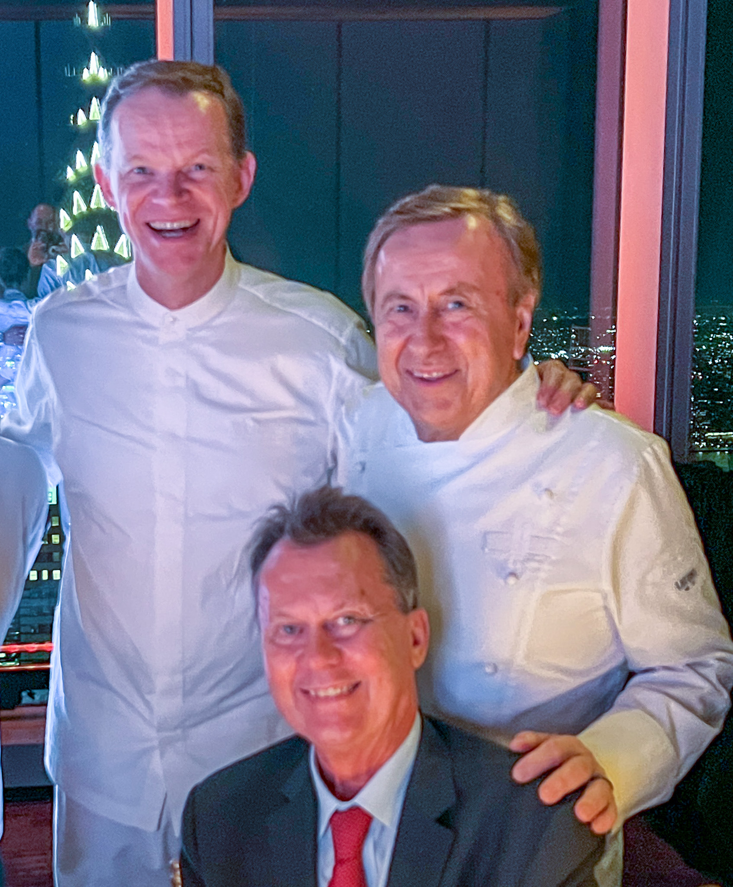

# Mandarin Oriental Presents: Chef Ekkebus and Chef Boulud  
*By Dr. Staffan Canback*  | *2026-10-01*

My wife and I had the pleasure to attend the invitational **Mandarin Oriental** event at the American Express **Centurion New York** last Thursday night.

The occasion was Michelin-starred chefs Richard Ekkebus and Daniel Boulud's celebration of the chain's dual Hong Kong and Thai heritage. 

A few years ago I gave a speech in Hong Kong and stayed at The Landmark, and I have been to the Mandarin Oriental in Bangkok several times, so it was a fitting occasion to join.

To be at the Centurion New York on the 55th floor of Vanderbilt One added to the appeal. It was my first visit to this particular Centurion location.

The six-course dinner featured the best of Asian food crossed with French haute cuisine. The craftsmanship behind the presentations was stellar, the choices of wine impeccable, and the company the table thoroughly entertaining.

Did I have any favorite? Not the right question. I found each dish perfect in a unique way. What I want to highlight is rather the combination of sensory appeal with the flavors. This overlaid with the visual impact of perfectly presented plates.

 

<figcaption><b>Myself with Chef Richard Ekkebus and Chef Daniel Boulud</b></figcaption>

  
3. The first course: Aka Uni with Cauliflower  
4. The opulent setting fitting for such a gastronomical event  
5. White alba truffels being masterly prepared by our chefs for the third course  
6. The printed menu guiding our journey  
7. The Chrysler building seen from the 55th floor where Centurion New York is located  

This was a most memorable event. The idea to expand American Express's Centurion beyond airport lounges is brilliant. Over the years, I have enjoyed Centurions around the world, such as the ones in Buenos Aires, Mexico City and Stockholm. This location adds to those experiences.

Finally, a thank you to event director Brad Senffner for giving my wife Charlotte and I a guided tour of Centurion New York, and for the impeccable execution of the event. And to the hardworking staff in the kitchen, at the bar, and at the table.
